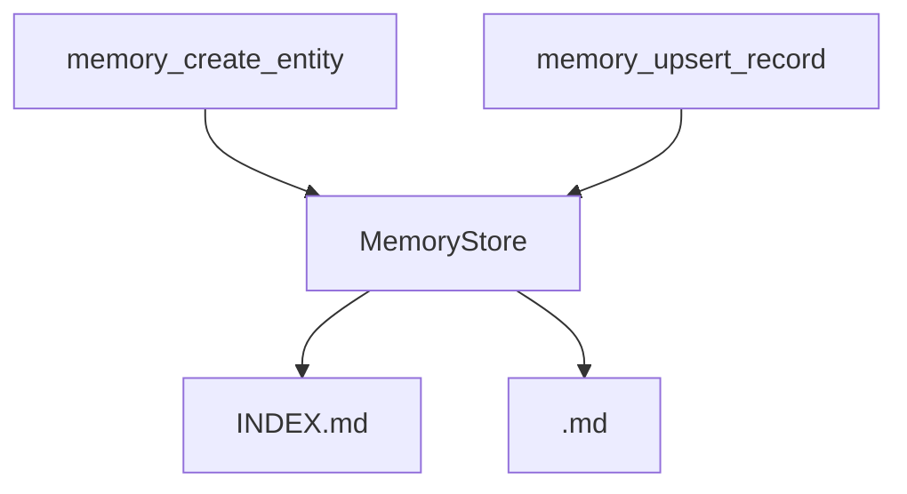

# Memory plugin

The memory plugin manages structured entities stored as Markdown files. Each entity is a lowercase English word (a-z only, no underscores). An `INDEX.md` file lists all entity types.

- Stored under `<workspace>/memory/` by default.
- `INDEX.md` enumerates entity types.
- `<entity>.md` contains `##` sections, one per record.

