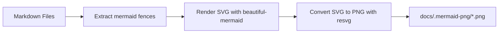

# Mermaid PNG Rendering

Daycare includes a docs renderer that converts Mermaid code fences in markdown files into PNG assets.

## Command

```sh
yarn docs:mermaid
```

Optional flags:

- `--docs <dir>`: source markdown directory (default: `docs/`)
- `--out <dir>`: output PNG directory (default: `docs/.mermaid-png`)
- `--theme <name>`: Mermaid theme from `beautiful-mermaid` (default: `github-light`)
- `--width <px>`: output width in pixels (default: `1600`)

## Rendering Flow


