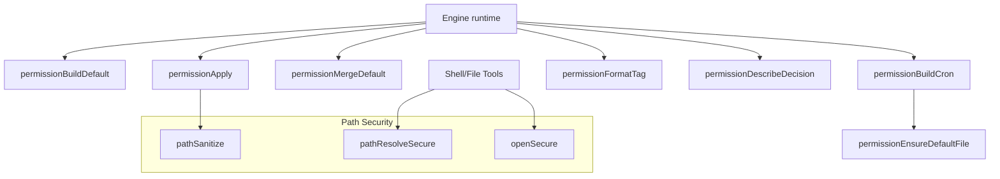
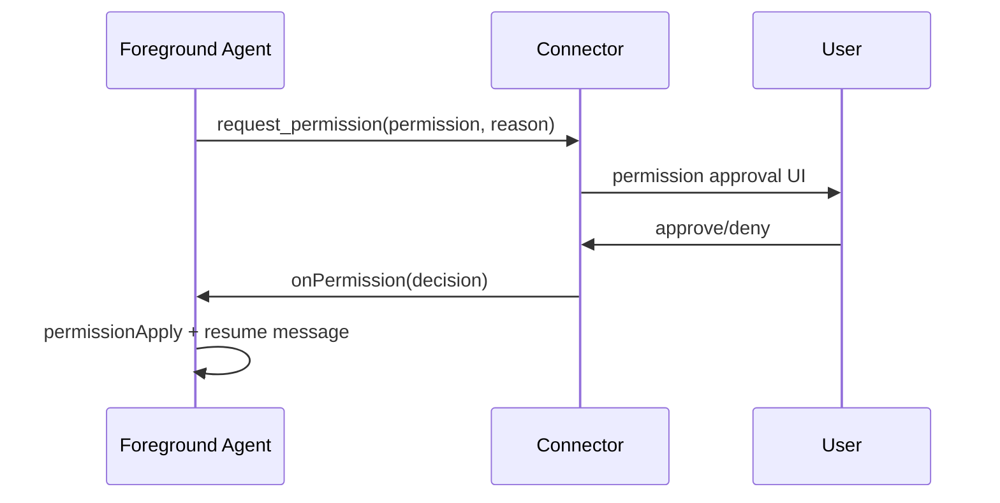
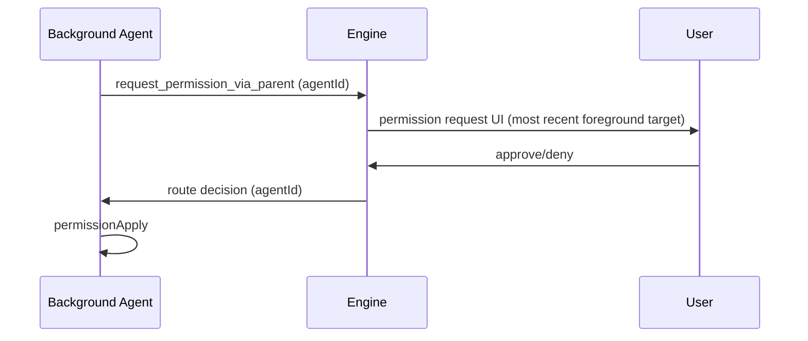
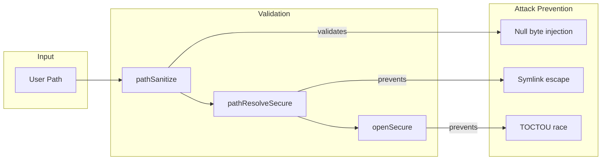

# Permissions

This document summarizes the permission helper functions extracted from the engine runtime.



## Helper roles

- `permissionBuildDefault`: create the initial agent permissions from workspace + config paths.
- `permissionBuildCron`: build cron-specific permissions that inherit defaults.
- `permissionEnsureDefaultFile`: merge default read/write directories into an agent.
- `permissionMergeDefault`: combine existing agent permissions with defaults.
- `permissionApply`: apply an approved permission decision to an agent.
- `permissionFormatTag`: format the `@web`/`@read`/`@write` tag used in logs.
- `permissionDescribeDecision`: human-readable label for permission decisions.

## Foreground permission requests

Foreground agents request permissions directly from users via `request_permission`. The tool returns
immediately, and the permission decision is delivered later to resume the agent.



Tool payload shape:

```json
{
  "permission": "@web",
  "reason": "Need to verify the latest docs."
}
```

## Background agent permission requests

Background agents cannot request permissions directly from users. They use
`request_permission_via_parent` to proxy requests through the most recent
foreground agent.



Tool availability by agent type:

| Tool | Foreground | Background |
|------|------------|------------|
| `request_permission` | ✓ | ✗ |
| `request_permission_via_parent` | ✗ | ✓ |

## Path security utilities

The permissions system includes security hardening against path-based attacks:

### pathSanitize

Validates paths for dangerous characters and patterns. Rejects:

- **Null bytes** (`\x00`): Can truncate strings in C libraries
- **Control characters**: ASCII 0-31 (except tab/newline)
- **Excessive length**: Paths over 4096 characters

```typescript
import { pathSanitize } from "./pathSanitize.js";

pathSanitize("/valid/path");          // OK
pathSanitize("/path\x00/malicious");  // throws "Path contains null byte."
```

### pathResolveSecure

Securely resolves a path with symlink following and containment verification. Prevents symlink escape attacks by:

1. Resolving all symlinks via `fs.realpath()`
2. Checking containment against real paths

```typescript
import { pathResolveSecure } from "./pathResolveSecure.js";

const allowedDirs = ["/workspace"];
const { realPath, allowedBase } = await pathResolveSecure(allowedDirs, "/workspace/file.txt");
```

### openSecure

Opens a file handle with symlink protection to prevent TOCTOU (time-of-check to time-of-use) attacks:

```typescript
import { openSecure } from "./pathResolveSecure.js";

const handle = await openSecure("/workspace/file.txt", "r");
// File is guaranteed to be a regular file, not a symlink
```

## Security model



### Threats mitigated

| Threat | Mitigation | Location |
|--------|------------|----------|
| Symlink escape | `fs.realpath()` before containment check | `pathResolveSecure` |
| TOCTOU race | Atomic open with `lstat` + file handle | `openSecure`, handlers |
| Null byte injection | Path validation | `pathSanitize` |
| Control character injection | Path validation | `pathSanitize` |
| Path length DoS | 4096 char limit | `pathSanitize` |
| Empty workingDir bypass | Nullish coalescing | `permissionMergeDefault` |
