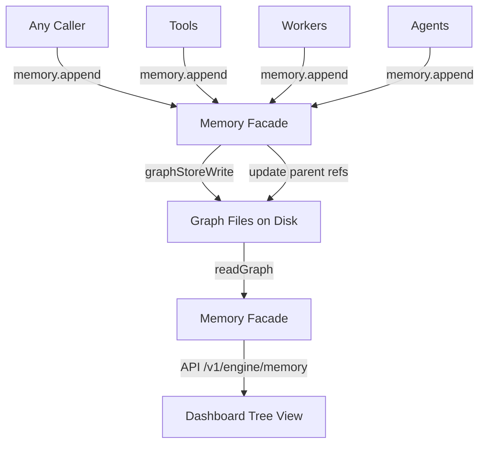

# Graph Memory Infrastructure

## Overview
Build a graph-structured memory system where interconnected markdown files form a knowledge graph. Each file is a node — the root (`__root__.md`) is a structured summary, other nodes (`<cuid2>.md`) hold observations and sub-topics. Files reference each other via frontmatter breadcrumbs and inline `[[cuid2]]` wiki-style links. Every non-root node must be referenced by at least one other node.

This plan scaffolds:
1. **Memory facade class** — available everywhere (tools, workers, engine)
2. **Graph file CRUD** — read/write/link/append markdown nodes on disk
3. **Dashboard visualization** — tree-style view where "folder" nodes are also graph nodes (not purely filesystem)

## Context (from discovery)
- **Existing memory system**: `MemoryWorker` polls invalidated sessions, `inferObservations()` extracts facts via LLM, but observations are not persisted yet
- **User profiles**: `UserHome` resolves `~/.daycare/users/<userId>/home/` — memory will live at `~/.daycare/users/<userId>/home/memory/`
- **Storage**: SQLite via `Storage` facade with 14 repositories
- **Dashboard**: Next.js app at `packages/daycare-dashboard`, Fastify engine API on Unix socket, SSE for live updates
- **Dependencies available**: `gray-matter` (frontmatter), `@paralleldrive/cuid2` (IDs), `marked` (markdown parsing)
- **Files involved**:
  - `packages/daycare/sources/engine/memory/` — existing memory module
  - `packages/daycare/sources/engine/users/userHome.ts` — add `memory` path
  - `packages/daycare/sources/engine/ipc/server.ts` — add API routes
  - `packages/daycare/sources/engine/engine.ts` — wire Memory facade
  - `packages/daycare-dashboard/app/memory/` — new dashboard page

## Development Approach
- **Testing approach**: Regular (code first, then tests)
- Complete each task fully before moving to the next
- Make small, focused changes
- **CRITICAL: every task MUST include new/updated tests** for code changes in that task
- **CRITICAL: all tests must pass before starting next task**
- **CRITICAL: update this plan file when scope changes during implementation**
- Run tests after each change
- Maintain backward compatibility

## Testing Strategy
- **Unit tests**: required for every task — co-located `*.spec.ts` files
- **Integration**: verify Memory facade wiring in engine via existing patterns

## Progress Tracking
- Mark completed items with `[x]` immediately when done
- Add newly discovered tasks with ➕ prefix
- Document issues/blockers with ⚠️ prefix
- Update plan if implementation deviates from original scope
- ➕ Added `serverMemoryRoutesRegister.ts` to isolate memory API route registration for inject-based route tests
- ⚠️ Manual dashboard runtime walkthrough is pending (UI implemented + lint/typecheck passing)

## What Goes Where
- **Implementation Steps** (`[ ]` checkboxes): tasks achievable within this codebase
- **Post-Completion** (no checkboxes): items requiring external action

## Implementation Steps

### Task 1: Add `memory` path to UserHome
- [x] Add `readonly memory: string` field to `UserHome` class in `engine/users/userHome.ts`, resolving to `path.join(this.home, "memory")`
- [x] Write test in `userHome.spec.ts` verifying the `memory` path resolves correctly
- [x] Run tests — must pass before next task

### Task 2: Graph node types and frontmatter schema
- [x] Create `engine/memory/graph/graphTypes.ts` with types:
  - `GraphNodeFrontmatter`: `{ title: string; description: string; path: string[]; createdAt: number; updatedAt: number }`
  - `GraphNode`: `{ id: string; frontmatter: GraphNodeFrontmatter; content: string; refs: string[] }` (refs = outbound `[[cuid2]]` links parsed from body)
  - `GraphTree`: `{ root: GraphNode; children: Map<string, GraphNode[]> }` (tree projection keyed by parent id)
- [x] No tests needed (pure types)
- [x] Run lint/typecheck — must pass before next task

### Task 3: Graph node file parsing — `graphNodeParse`
- [x] Create `engine/memory/graph/graphNodeParse.ts`
- [x] Implement `graphNodeParse(id: string, raw: string): GraphNode` — uses `gray-matter` to extract frontmatter + body, regex to extract `[[cuid2]]` refs from body
- [x] Handle missing/malformed frontmatter gracefully (defaults for missing fields)
- [x] Write tests for valid node parsing (frontmatter + refs extracted)
- [x] Write tests for edge cases (no frontmatter, no refs, empty body)
- [x] Run tests — must pass before next task

### Task 4: Graph node file serialization — `graphNodeSerialize`
- [x] Create `engine/memory/graph/graphNodeSerialize.ts`
- [x] Implement `graphNodeSerialize(node: GraphNode): string` — uses `gray-matter` stringify to produce frontmatter + body
- [x] Write tests for round-trip: serialize then parse produces equivalent node
- [x] Write tests for content with inline `[[ref]]` links preserved
- [x] Run tests — must pass before next task

### Task 5: Graph filesystem operations — `graphStore`
- [x] Create `engine/memory/graph/graphStoreRead.ts` with `graphStoreRead(memoryDir: string): Promise<GraphNode[]>` — reads all `.md` files from the directory, parses each
- [x] Create `engine/memory/graph/graphStoreWrite.ts` with `graphStoreWrite(memoryDir: string, node: GraphNode): Promise<void>` — serializes and writes a single node file (`__root__.md` for root, `<id>.md` for others)
- [x] Create `engine/memory/graph/graphStoreEnsureRoot.ts` with `graphStoreEnsureRoot(memoryDir: string): Promise<GraphNode>` — creates `__root__.md` with empty summary if missing, returns root node
- [x] Write tests for read (mock filesystem with tmp dirs)
- [x] Write tests for write (writes correct filename, content)
- [x] Write tests for ensureRoot (creates when missing, returns existing)
- [x] Run tests — must pass before next task

### Task 6: Graph tree projection — `graphTreeBuild`
- [x] Create `engine/memory/graph/graphTreeBuild.ts` with `graphTreeBuild(nodes: GraphNode[]): GraphTree` — builds parent→children map using frontmatter `path` breadcrumbs and `[[ref]]` links
- [x] Root node has empty path; other nodes' last path segment determines their logical parent
- [x] "Folder" nodes (nodes that exist in other nodes' paths but may not have direct content) are real graph nodes
- [x] Write tests for tree building with nested paths
- [x] Write tests for nodes with cross-references (not just parent-child)
- [x] Write tests for orphan detection (nodes not referenced by anyone except root)
- [x] Run tests — must pass before next task

### Task 7: Memory facade class — `Memory`
- [x] Create `engine/memory/memory.ts` with `Memory` class (facade pattern per conventions)
- [x] Constructor takes `{ usersDir: string }`
- [x] Method `resolveMemoryDir(userId: string): string` — returns `UserHome(usersDir, userId).memory`
- [x] Method `async readGraph(userId: string): Promise<GraphTree>` — ensures root, reads all nodes, builds tree
- [x] Method `async readNode(userId: string, nodeId: string): Promise<GraphNode | null>` — reads single node
- [x] Method `async writeNode(userId: string, node: GraphNode): Promise<void>` — writes node to disk
- [x] Method `async append(userId: string, nodeId: string, content: string): Promise<void>` — reads the target node, appends content to its body, updates `updatedAt`, writes back to disk. Generic — anything can be appended (observations, notes, facts, links, etc.)
- [x] Write tests for `readGraph` (tmp dir filesystem)
- [x] Write tests for `append` (appends to existing node body, preserves frontmatter, updates timestamp)
- [x] Run tests — must pass before next task

### Task 8: Wire Memory facade into Engine
- [x] Add `readonly memory: Memory` field to `Engine` class in `engine.ts`
- [x] Instantiate `Memory` in constructor with `usersDir`
- [x] Update `ToolExecutionContext` type to include `memory: Memory` (so tools can access it)
- [x] Wire `memory` into tool execution context where `ToolExecutionContext` is constructed
- [x] Run tests — must pass before next task

### Task 9: Engine API routes for memory
- [x] Add `GET /v1/engine/memory/:userId/graph` route in `ipc/server.ts` — returns full graph tree as JSON
- [x] Add `GET /v1/engine/memory/:userId/node/:nodeId` route — returns single node as JSON
- [x] Serialize `GraphTree` to a JSON-friendly structure (Map→object, node refs included)
- [x] Write tests for API route responses (mock Memory facade)
- [x] Run tests — must pass before next task

### Task 10: Dashboard — memory tree page
- [x] Create `packages/daycare-dashboard/app/memory/page.tsx` as client component
- [x] Add `fetchMemoryGraph(userId)` and `fetchMemoryNode(userId, nodeId)` to `lib/engine-client.ts`
- [x] Build tree visualization component showing hierarchical node structure
  - Root at top, children nested below
  - Each node shows: title, description, path breadcrumbs, ref count
  - "Folder" nodes (intermediate path segments) rendered as expandable sections
  - Leaf nodes show observation content preview
- [x] Click on a node opens detail panel showing full content + outbound refs
- [x] Cross-reference links (`[[cuid2]]`) rendered as clickable links that navigate within the tree
- [x] Add navigation link in dashboard sidebar/header
- [ ] Manual testing — verify tree renders with sample data
- [x] Run lint — must pass before next task

### Task 11: Verify acceptance criteria
- [x] Verify: `UserHome.memory` resolves correctly
- [x] Verify: graph nodes parse/serialize round-trip correctly
- [x] Verify: `Memory.readGraph()` returns a valid tree with root
- [x] Verify: `Memory.append()` appends content to existing node
- [x] Verify: API routes return graph data
- [ ] Verify: dashboard tree page renders the graph
- [x] Run full test suite (unit tests)
- [x] Run linter — all issues must be fixed
- [x] Run typecheck

### Task 12: [Final] Update documentation
- [x] Create `doc/concepts/graph-memory.md` with mermaid diagrams showing:
  - Graph node structure (frontmatter + body + refs)
  - Data flow: any caller → `Memory.append()` → graph files on disk
  - Tree projection algorithm
- [x] Update memory plugin README if applicable (N/A — no memory plugin README in this repo)

## Technical Details

### Graph Node File Format
```markdown
---
title: "User prefers dark mode"
description: "UI preference observed during onboarding"
path: ["preferences", "ui"]
createdAt: 1708531200000
updatedAt: 1708531200000
---
User mentioned they always use dark mode across all applications.

See also: [[abc123def456]] for theme configuration details.
```

### File Naming
```
~/.daycare/users/<userId>/home/memory/
├── __root__.md          # Root summary node (always exists)
├── k8a9b2c3d4e5f6g7.md # Observation/topic node (cuid2)
├── m1n2o3p4q5r6s7t8.md # Another node
└── ...
```

### Root Node Structure
```markdown
---
title: "Memory Summary"
description: "Structured summary of all memories"
path: []
createdAt: 1708531200000
updatedAt: 1708531200000
---
# Memory Summary

## Preferences
- [[k8a9b2c3d4e5f6g7]] Dark mode preference

## Projects
- [[m1n2o3p4q5r6s7t8]] Working on daycare agent
```

### Memory Facade API
```typescript
class Memory {
    resolveMemoryDir(userId: string): string;
    async readGraph(userId: string): Promise<GraphTree>;
    async readNode(userId: string, nodeId: string): Promise<GraphNode | null>;
    async writeNode(userId: string, node: GraphNode): Promise<void>;
    async append(userId: string, nodeId: string, content: string): Promise<void>;
}
```

`append` is the generic write path — any caller (tools, workers, agents) can append content to any existing node. It:
1. Reads the target node from disk
2. Appends content to the node's body
3. Updates `updatedAt` timestamp in frontmatter
4. Writes the updated node back to disk

### Tree Projection Algorithm
```
1. Read all .md files from memory dir → GraphNode[]
2. For each node, determine parent:
   - Root (path=[]) → tree root
   - Node with path=["a","b"] → parent is node whose title matches "b"
     OR the closest ancestor found in the path
3. Build Map<parentId, GraphNode[]> for children
4. "Folder" nodes: if path segment "preferences" exists in multiple nodes'
   paths but no node has that title, it becomes a virtual folder node
   displayed in the tree
5. Cross-refs ([[cuid2]]) are separate from the tree hierarchy —
   they appear as lateral links in visualization
```

### Data Flow


### JSON API Response Shape
```typescript
// GET /v1/engine/memory/:userId/graph
{
    root: {
        id: "__root__",
        frontmatter: { title, description, path, createdAt, updatedAt },
        content: "...",
        refs: ["abc123", "def456"]
    },
    children: {
        "__root__": [{ id: "abc123", ... }, { id: "def456", ... }],
        "abc123": [{ id: "ghi789", ... }]
    }
}
```

## Post-Completion
*Items requiring manual intervention or external systems*

**Next phases (not in scope):**
- Memory agent that uses `Memory.append()` to organize observations extracted by MemoryWorker into the graph with proper parent selection
- LLM-powered summary updates on the root node
- Memory retrieval tool for agents (query relevant memories for context injection)
- Embedding/vector search over graph nodes for semantic retrieval
- Graph compaction (merging similar observations, pruning stale nodes)

**Manual verification:**
- Create sample memory files and verify dashboard tree renders correctly
- Test with multiple users to verify isolation
- Verify graph files survive engine restarts
