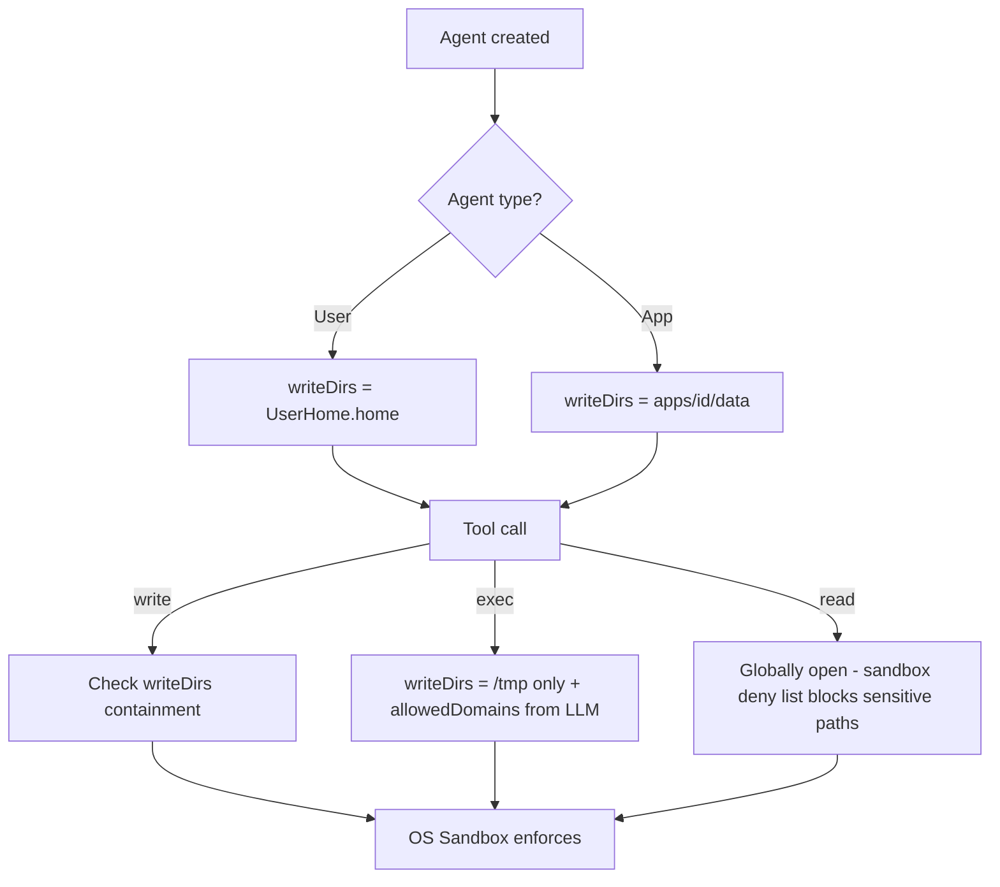

# Strip Permissions System

## Overview
Remove the entire dynamic permission system (request/grant/expand flow, permission tags, PermissionAccess union, PermissionRequestRegistry, gate permissions) and replace it with a fixed, non-expandable security model:

- **User agents**: `UserHome.home` is the single writable root. No per-subfolder granularity.
- **App agents**: keep app isolation (only own `apps/<id>/data` writable), but remove expansion flow.
- **Network**: always allowed. LLM must still provide `allowedDomains` (no wildcard, explicit list).
- **Events (engine socket)**: never allowed. Remove entirely.
- **Workspace (`@workspace`)**: removed entirely.
- **Permission expansion**: removed entirely. No `request_permission`, no `grant_permission`, no `PermissionRequestRegistry`.

This is a clean-room simplification that deletes ~30 permission files, strips permission types from connectors, and relies on the OS sandbox as the sole enforcement layer.

## Context (from discovery)

### Files to DELETE entirely (~34 files + their tests):
```
engine/permissions/permissionAccessAllows.ts (+spec)
engine/permissions/permissionAccessApply.ts (+spec)
engine/permissions/permissionAccessParse.ts (+spec)
engine/permissions/permissionApply.ts (+spec)
engine/permissions/permissionClone.ts (+spec)
engine/permissions/permissionDescribeDecision.ts (+spec)
engine/permissions/permissionEnsureDefaultFile.ts (+spec)
engine/permissions/permissionFormatTag.ts (+spec)
engine/permissions/permissionMergeDefault.ts (+spec)
engine/permissions/permissionTagsApply.ts (+spec)
engine/permissions/permissionTagsNormalize.ts (+spec)
engine/permissions/permissionTagsValidate.ts (+spec)
engine/permissions/permissionWorkspaceGranted.ts (+spec)
engine/permissions/permissionWorkspacePathResolve.ts (+spec)
engine/modules/tools/permissions.ts (request_permission + grant_permission tools)
engine/modules/tools/permissionRequestRegistry.ts
engine/scheduling/gatePermissionsCheck.ts
engine/scheduling/gatePermissionRequest.ts
engine/apps/appPermissionStateGrant.ts
engine/apps/appPermissionStateRead.ts
engine/apps/appPermissionStateWrite.ts
engine/apps/appPermissionStatePathBuild.ts
```

### Files to KEEP (still needed):
```
engine/permissions/pathResolveSecure.ts (+spec) — symlink-safe path resolution
engine/permissions/pathSanitize.ts (+spec) — path validation
engine/permissions/permissionBuildUser.ts (+spec) — simplified to just UserHome.home
sandbox/runtime.ts — OS sandbox runner
sandbox/sandboxAllowedDomainsResolve.ts (+spec) — domain resolution
sandbox/sandboxAllowedDomainsValidate.ts (+spec) — domain validation (simplified: no network boolean check)
sandbox/sandboxPackageManagers.ts — package manager domain presets
sandbox/sandboxFilesystemPolicyBuild.ts (+spec) — filesystem policy (simplified)
sandbox/sandboxCanRead.ts (+spec) — read validation (simplified)
sandbox/sandboxCanWrite.ts (+spec) — write validation (simplified)
sandbox/sandboxAppsAccessCheck.ts — app isolation
sandbox/sandboxAppsDenyPathsBuild.ts — app deny list
sandbox/sandboxHomeRedefine.ts (+spec) — HOME remapping
```

### Files to MODIFY (consumers):
```
engine/permissions.ts — simplify SessionPermissions type
engine/modules/connectors/types.ts — remove all Permission* types from Connector interface
engine/modules/tools/types.ts — remove permissionRequestRegistry from ToolExecutionContext
engine/agents/agentSystem.ts — remove grantPermission, grantAppPermission, permissionsForTarget
engine/agents/agent.ts — remove permissionTags application from inbox processing
engine/agents/ops/agentTypes.ts — AgentState.permissions simplified
engine/agents/ops/agentLoopRun.ts — remove permissionRequestRegistry from tool context
engine/engine.ts — remove PermissionRequestRegistry, remove permission tool registration, remove connector permission wiring
engine/apps/appPermissionBuild.ts — simplify (no persisted grants layer)
engine/apps/appExecute.ts — remove permission expansion integration
engine/cron/crons.ts — remove permissionRequestRegistry, remove gate permission requests
engine/heartbeat/heartbeats.ts — same as crons
engine/scheduling/cronScheduler.ts — remove gate permission checks
engine/scheduling/heartbeatScheduler.ts — remove gate permission checks
engine/scheduling/execGateCheck.ts — remove permission validation (keep sandbox execution)
engine/modules/connectorRegistry.ts — remove attachPermission wiring
plugins/shell/tool.ts — simplify resolveExecPermissions (no permission tag validation)
plugins/telegram/connector.ts — remove permission handler/request methods
plugins/whatsapp/connector.ts — remove permission handler/request methods
types.ts — remove Permission* re-exports, update SessionPermissions export
```

## Development Approach
- **Testing approach**: Regular (code first, then tests)
- Complete each task fully before moving to the next
- Make small, focused changes
- **CRITICAL: every task MUST include new/updated tests** for code changes in that task
- **CRITICAL: all tests must pass before starting next task**
- **CRITICAL: update this plan file when scope changes during implementation**
- Run tests after each change
- This is a deletion-heavy plan — many tasks involve removing code and verifying nothing breaks

## Testing Strategy
- **Unit tests**: update surviving tests, delete tests for deleted files
- **Integration**: `yarn typecheck` must pass after each task (catches dangling imports)
- **Full suite**: `yarn test` must pass after each task

## Progress Tracking
- Mark completed items with `[x]` immediately when done
- Add newly discovered tasks with ➕ prefix
- Document issues/blockers with ⚠️ prefix
- ✅ Validation status: `yarn lint`, `yarn typecheck`, and `yarn test` pass.

## Implementation Steps

### Task 1: Simplify `SessionPermissions` type
- [x] In `engine/permissions.ts`: remove `workspaceDir`, `network`, `events` fields from `SessionPermissions`. Keep `workingDir` and `writeDirs`. Remove `readDirs` (reads are globally open, sandbox deny list handles sensitive paths). Final shape: `{ workingDir: string; writeDirs: string[] }`
- [x] Simplify `normalizePermissions()` to only handle the two remaining fields
- [x] Keep `resolveWorkspacePath()` as-is (still needed for relative path resolution)
- [x] Update `types.ts` re-exports: remove all `Permission*` type re-exports (`PermissionAccess`, `PermissionDecision`, `PermissionEntry`, `PermissionHandler`, `PermissionKind`, `PermissionRequest`, `PermissionRequestScope`)
- [x] Run `yarn typecheck` — expect many errors (this is the foundation, subsequent tasks fix consumers)

### Task 2: Simplify `permissionBuildUser` and delete permission utility files
- [x] Simplify `permissionBuildUser.ts`: return `{ workingDir: userHome.desktop, writeDirs: [userHome.home] }` — single writable root
- [x] Update `permissionBuildUser.spec.ts` to match new shape
- [x] Delete all permission utility files and their specs (see "Files to DELETE" list above — the 14 `permission*.ts` pairs in `engine/permissions/`)
- [x] Keep `pathResolveSecure.ts` (+spec) and `pathSanitize.ts` (+spec) — move them to `sandbox/` folder since they're path security utilities
- [x] Run tests for surviving files

### Task 3: Remove permission types from connector interface
- [x] In `engine/modules/connectors/types.ts`: delete `PermissionKind`, `PermissionRequestScope`, `PermissionAccess`, `PermissionEntry`, `PermissionRequest`, `PermissionDecision`, `PermissionHandler` types
- [x] Remove `onPermission` and `requestPermission` from `Connector` interface
- [x] Remove `permissionTags` from `MessageContext`
- [x] Delete `engine/modules/tools/permissions.ts` (the `request_permission` + `grant_permission` tool builders)
- [x] Delete `engine/modules/tools/permissionRequestRegistry.ts`
- [x] Remove `permissionRequestRegistry` from `ToolExecutionContext` in `engine/modules/tools/types.ts`
- [x] Run `yarn typecheck` to identify remaining consumers

### Task 4: Strip permissions from engine core
- [x] In `engine/engine.ts`: remove `PermissionRequestRegistry` creation, remove `buildPermissionRequestTool`/`buildPermissionGrantTool` registration, remove connector `onPermission` wiring
- [x] In `engine/modules/connectorRegistry.ts`: remove `attachPermission` function and its call site
- [x] In `engine/agents/agentSystem.ts`: remove `grantPermission()`, `grantAppPermission()`, `permissionsForTarget()`, remove imports of `permissionAccessApply`, `permissionClone`, `permissionFormatTag`
- [x] In `engine/agents/agentSystem.ts`: remove `updateAgentPermissions()` if no longer needed, or simplify
- [x] Run `yarn typecheck`

### Task 5: Strip permissions from agent lifecycle
- [x] In `engine/agents/agent.ts`: remove `permissionTags` application from `processInboxEntry()` — no more runtime permission expansion
- [x] In `engine/agents/ops/agentLoopRun.ts`: remove `permissionRequestRegistry` from tool context construction
- [x] In `engine/agents/ops/agentTypes.ts`: verify `AgentState.permissions` uses the simplified `SessionPermissions`
- [x] Run `yarn typecheck`

### Task 6: Strip permissions from scheduling (crons/heartbeats)
- [x] Delete `engine/scheduling/gatePermissionsCheck.ts`
- [x] Delete `engine/scheduling/gatePermissionRequest.ts`
- [x] In `engine/cron/crons.ts`: remove `permissionRequestRegistry` from options, remove gate permission request flow
- [x] In `engine/heartbeat/heartbeats.ts`: same removal
- [x] In `engine/scheduling/cronScheduler.ts`: remove `gatePermissionsCheck` calls
- [x] In `engine/scheduling/heartbeatScheduler.ts`: remove `gatePermissionsCheck` calls
- [x] In `engine/scheduling/execGateCheck.ts`: remove permission tag validation, keep sandbox exec functionality
- [x] Run `yarn typecheck` and `yarn test`

### Task 7: Simplify app permission system
- [x] Delete `engine/apps/appPermissionStateGrant.ts`
- [x] Delete `engine/apps/appPermissionStateRead.ts`
- [x] Delete `engine/apps/appPermissionStateWrite.ts`
- [x] Delete `engine/apps/appPermissionStatePathBuild.ts`
- [x] Simplify `engine/apps/appPermissionBuild.ts`: return fixed `{ workingDir: appDataDir, writeDirs: [appDataDir] }` — no persisted grants layer
- [x] In `engine/apps/appExecute.ts`: remove permission expansion integration, just use fixed app permissions
- [x] Update any app tests
- [x] Run `yarn typecheck` and `yarn test`

### Task 8: Strip permissions from connectors (Telegram, WhatsApp)
- [x] In `plugins/telegram/connector.ts`: remove `permissionHandlers`, `onPermission()`, `requestPermission()` methods
- [x] In `plugins/whatsapp/connector.ts`: same removal
- [x] Verify connector still satisfies simplified `Connector` interface
- [x] Run `yarn typecheck`

### Task 9: Simplify sandbox layer
- [x] In `sandbox/sandboxFilesystemPolicyBuild.ts`: simplify to accept `{ writeDirs: string[]; homeDir?: string }` instead of full `SessionPermissions`
- [x] In `sandbox/sandboxCanWrite.ts`: simplify to check against `writeDirs` only (no `readDirs`, no workspace)
- [x] In `sandbox/sandboxCanRead.ts`: simplify (reads are globally open, keep app isolation check only)
- [x] In `sandbox/sandboxAllowedDomainsValidate.ts`: remove the `network: boolean` check — network is always on. Keep wildcard rejection and non-empty list requirement
- [x] Update all sandbox specs to match simplified signatures
- [x] Run tests

### Task 10: Simplify shell plugin exec permissions
- [x] In `plugins/shell/tool.ts`: simplify `resolveExecPermissions` — no permission tag validation, no `@network`/`@events`/`@write` tag parsing. Exec gets `{ workingDir, writeDirs: ["/tmp"] }` plus whatever `allowedDomains` the LLM provides
- [x] In `plugins/shell/tool.ts`: simplify `buildSandboxConfig` — no events/socket logic
- [x] In `plugins/shell/processTools.ts`: same simplification for `exec_process`
- [x] In `engine/processes/processes.ts`: simplify `buildSandboxConfig` — remove events/socket logic
- [x] Update shell plugin tests
- [x] Run `yarn test`

### Task 11: Clean up storage layer
- [x] Check if `storage/processesRepository.ts` `allowed_domains` column is still needed (yes — for durable processes). Keep it.
- [x] Check if any agent state persistence writes permission tags that no longer exist. Clean up `agentStateWrite`/`agentStateRead` if needed.
- [x] Remove any persisted permission state references (app `state.json` permission tags field)
- [x] Run `yarn typecheck` and `yarn test`

### Task 12: Verify acceptance criteria
- [x] `SessionPermissions` is `{ workingDir: string; writeDirs: string[] }` only
- [x] No `request_permission` or `grant_permission` tools exist
- [x] No `PermissionRequestRegistry` exists
- [x] No `permissionTags` on `MessageContext`
- [x] No `onPermission`/`requestPermission` on `Connector` interface
- [x] No `network`, `events`, `workspaceDir`, `readDirs` fields anywhere
- [x] Network is always allowed — `allowedDomains` still validated (no wildcard, must be explicit)
- [x] Events (engine socket) are never passed to sandbox
- [x] App agents still isolated to their own data dir
- [x] User agents write only to `UserHome.home`
- [x] Run full test suite: `yarn test`
- [x] Run linter: `yarn lint`
- [x] Run typecheck: `yarn typecheck`

### Task 13: [Final] Update documentation
- [x] Update `doc/internals/permissions.md` — rewrite to reflect simplified model
- [x] Delete or update `doc/internals/workspace-permission.md` (workspace removed)
- [x] Delete or update `doc/internals/app-permission-sharing.md` (sharing removed)
- [x] Delete or update `doc/internals/agent-creation-permissions.md` (pre-grant removed)
- [x] Delete or update `doc/internals/permission-request-existing-grants.md` (request flow removed)
- [x] Update plugin internals docs if they reference permission APIs (`doc/internals/plugins.md`)

## Technical Details

### New `SessionPermissions` shape
```typescript
type SessionPermissions = {
    workingDir: string;   // agent's current directory for relative paths
    writeDirs: string[];  // absolute paths the agent may write to
};
```

### User agent permissions
```typescript
// permissionBuildUser returns:
{ workingDir: userHome.desktop, writeDirs: [userHome.home] }
```

### App agent permissions
```typescript
// appPermissionBuild returns:
{ workingDir: appDataDir, writeDirs: [appDataDir] }
```

### Exec sandbox permissions
```typescript
// resolveExecPermissions returns:
{ workingDir: currentPermissions.workingDir, writeDirs: ["/tmp"] }
// + allowedDomains from LLM tool call args (required, validated, no wildcard)
```

### Sandbox config (simplified)
```typescript
function buildSandboxConfig(writeDirs: string[], allowedDomains: string[]) {
    const filesystem = sandboxFilesystemPolicyBuild({ writeDirs });
    return {
        filesystem,
        network: { allowedDomains, deniedDomains: [] },
        enableWeakerNestedSandbox: true
    };
}
```

### What's removed
- `PermissionAccess`, `PermissionEntry`, `PermissionRequest`, `PermissionDecision`, `PermissionHandler`, `PermissionKind`, `PermissionRequestScope` types
- `request_permission` and `grant_permission` tools
- `PermissionRequestRegistry`
- `permissionTags` on `MessageContext`
- `onPermission` and `requestPermission` on `Connector`
- `network`, `events`, `readDirs`, `workspaceDir` from `SessionPermissions`
- Gate permission checks in cron/heartbeat scheduling
- App permission state persistence (`state.json` tags)
- All permission utility functions (parse, apply, clone, merge, validate, format, describe, etc.)

## Post-Completion

**Manual verification:**
- Start the engine and verify a user agent can write to `UserHome.home` subtree
- Verify an app agent is isolated to its own data dir
- Verify `exec` tool still requires `allowedDomains` and sandbox blocks unlisted domains
- Verify engine socket is never accessible from sandbox

**Mermaid: Simplified security flow**

