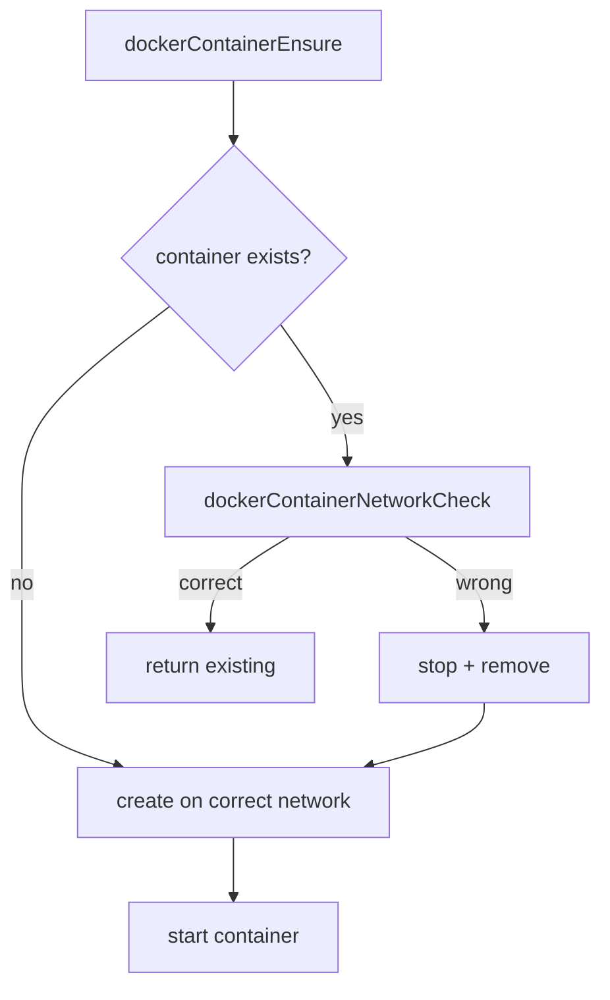

# Docker Network Isolation

## Overview
Add Docker network-level isolation so sandbox containers default to an internet-only network (no host access, no inter-container communication). A top-level `exceptions.allowFullNetworking` setting lists userIds that opt out and get full host-access networking instead.

Two named Docker networks are created eagerly:
- **`daycare-isolated`**: default for all containers. Uses `--internal=false` with `com.docker.network.bridge.enable_icc=false` to allow outbound internet but block inter-container and host communication.
- **`daycare-full`**: standard bridge for opted-out users. Full networking (host + internet + inter-container).

When a container exists on the wrong network (e.g., user added/removed from exceptions), the container is stopped, removed, and recreated on the correct network.

## Context
- Container lifecycle: `dockerContainerEnsure.ts` creates/starts containers via dockerode
- Facade: `DockerContainers` class deduplicates concurrent ensure calls
- Config: `DockerSettings` in `settings.ts`, resolved in `configResolve.ts`
- Container naming: `dockerContainerNameBuild.ts` → `daycare-sandbox-<userId>`
- Singleton: `dockerContainersShared.ts` exports shared `DockerContainers` instance
- Agent integration: `agent.ts` builds `SandboxDockerConfig` from settings + userId

## Development Approach
- **Testing approach**: Regular (code first, then tests)
- Complete each task fully before moving to the next
- Make small, focused changes
- **CRITICAL: every task MUST include new/updated tests**
- **CRITICAL: all tests must pass before starting next task**
- **CRITICAL: update this plan file when scope changes during implementation**

## Testing Strategy
- **Unit tests**: mock dockerode to verify network creation, container-network assignment, and wrong-network detection/recreation
- No e2e tests needed (Docker integration tests already exist separately)

## Progress Tracking
- Mark completed items with `[x]` immediately when done
- Add newly discovered tasks with ➕ prefix
- Document issues/blockers with ⚠️ prefix

## Implementation Steps

### Task 1: Add `exceptions` config type and settings resolution
- [ ] Add `ExceptionsConfig` type to `settings.ts`: `{ allowFullNetworking?: string[] }`
- [ ] Add `ResolvedExceptionsConfig` type: `{ allowFullNetworking: string[] }` (defaults to `[]`)
- [ ] Add `exceptions?: ExceptionsConfig` to `SettingsConfig`
- [ ] Add `exceptions: ResolvedExceptionsConfig` to `ResolvedSettingsConfig`
- [ ] Add `resolveExceptionsDefaults()` in `configResolve.ts` and wire into `resolveSettingsDefaults()`
- [ ] Add `exceptions: ResolvedExceptionsConfig` to `Config` type in `configTypes.ts` and set it in `configResolve()`
- [ ] Write tests for exceptions defaults resolution (empty, populated)
- [ ] Run tests - must pass before next task

### Task 2: Add network name constants and types
- [ ] Create `dockerNetworkNames.ts` with two constants: `DAYCARE_NETWORK_ISOLATED = "daycare-isolated"` and `DAYCARE_NETWORK_FULL = "daycare-full"`
- [ ] Add `networkName` field to `DockerContainerConfig` in `dockerTypes.ts`
- [ ] Write test for `dockerNetworkNames` constants (simple existence check)
- [ ] Run tests - must pass before next task

### Task 3: Create `dockerNetworkEnsure` function
- [ ] Create `dockerNetworkEnsure.ts` that ensures a named Docker network exists with given options
- [ ] Function signature: `dockerNetworkEnsure(docker: Docker, name: string, options: { internal: boolean; enableIcc: boolean }): Promise<void>`
- [ ] Implementation: inspect network by name; if 404, create it with bridge driver and appropriate options; handle 409 race
- [ ] Write tests with mocked dockerode: network exists (no-op), network missing (creates), concurrent create (409 handled)
- [ ] Run tests - must pass before next task

### Task 4: Create `dockerNetworksInit` function
- [ ] Create `dockerNetworksInit.ts` that calls `dockerNetworkEnsure` twice: once for `daycare-isolated` (`internal=false`, `enableIcc=false`) and once for `daycare-full` (defaults)
- [ ] Function signature: `dockerNetworksInit(docker: Docker): Promise<void>`
- [ ] Write tests verifying both networks are created with correct options
- [ ] Run tests - must pass before next task

### Task 5: Create `dockerNetworkForUser` resolver
- [ ] Create `dockerNetworkForUser.ts` that returns the correct network name for a userId
- [ ] Function signature: `dockerNetworkForUser(userId: string, allowFullNetworking: string[]): string`
- [ ] Returns `DAYCARE_NETWORK_FULL` if userId is in the list, otherwise `DAYCARE_NETWORK_ISOLATED`
- [ ] Write tests: user in list → full, user not in list → isolated, empty list → isolated
- [ ] Run tests - must pass before next task

### Task 6: Create `dockerContainerNetworkCheck` for wrong-network detection
- [ ] Create `dockerContainerNetworkCheck.ts` that inspects a container's network and compares to expected
- [ ] Function signature: `dockerContainerNetworkCheck(container: Docker.Container, expectedNetwork: string): Promise<"correct" | "wrong" | "missing">`
- [ ] Implementation: inspect container → check `NetworkSettings.Networks` keys against expected network name
- [ ] Return `"correct"` if expected network present, `"wrong"` if container exists but on different network, `"missing"` if container not found (404)
- [ ] Write tests: container on correct network, container on wrong network, container missing
- [ ] Run tests - must pass before next task

### Task 7: Update `dockerContainerEnsure` to use networks
- [ ] Add `networkName` to `DockerContainerConfig` (already done in Task 2)
- [ ] Update `dockerContainerEnsure` to pass `NetworkingConfig` with the specified network when creating containers
- [ ] When an existing container is found: call `dockerContainerNetworkCheck`; if `"wrong"`, stop + remove container, then fall through to creation path
- [ ] Update existing tests for `dockerContainerEnsure` to include `networkName` in config
- [ ] Write new tests: container on wrong network is stopped+removed+recreated, container on correct network is reused
- [ ] Run tests - must pass before next task

### Task 8: Wire `DockerContainers` facade to initialize networks and resolve user network
- [ ] Add `init(docker: Docker)` call in `DockerContainers.exec` (lazy, once per Docker client) that calls `dockerNetworksInit`
- [ ] Accept `allowFullNetworking: string[]` in `DockerContainers.exec` alongside existing `config` parameter (add to `DockerContainerConfig`)
- [ ] In `containerEnsure`, resolve network via `dockerNetworkForUser` and set `config.networkName`
- [ ] Update tests for `DockerContainers` facade
- [ ] Run tests - must pass before next task

### Task 9: Thread `allowFullNetworking` from settings through to sandbox
- [ ] Add `allowFullNetworking?: string[]` to `SandboxDockerConfig` in `sandboxTypes.ts`
- [ ] In `agent.ts`, pass `config.current.settings.exceptions.allowFullNetworking` into `SandboxDockerConfig`
- [ ] In `sandbox.ts`, pass `allowFullNetworking` through to `dockerRunInSandbox` options
- [ ] In `dockerRunInSandbox.ts`, pass `allowFullNetworking` into `DockerContainerConfig`
- [ ] Update `dockerRunInSandbox.spec.ts` to include `allowFullNetworking` in mock config
- [ ] Run tests - must pass before next task

### Task 10: Verify acceptance criteria
- [ ] Verify: containers default to isolated network
- [ ] Verify: users in `exceptions.allowFullNetworking` get full network
- [ ] Verify: container on wrong network is stopped, removed, and recreated
- [ ] Verify: networks are created eagerly on first Docker client use
- [ ] Run full test suite (`yarn test`)
- [ ] Run linter (`yarn lint`)
- [ ] Run typecheck (`yarn typecheck`)

### Task 11: [Final] Update documentation
- [ ] Update `packages/daycare/sources/sandbox/docker/README.md` with network isolation docs
- [ ] Add mermaid diagram showing network selection flow
- [ ] Document `exceptions.allowFullNetworking` setting

## Technical Details

### Docker Network Configuration

**`daycare-isolated` network:**
```json
{
    "Name": "daycare-isolated",
    "Driver": "bridge",
    "Options": {
        "com.docker.network.bridge.enable_icc": "false"
    }
}
```
This creates a bridge network where containers can reach the internet via NAT but cannot communicate with each other. Combined with Docker's default bridge behavior, containers also cannot reach host services directly.

**`daycare-full` network:**
```json
{
    "Name": "daycare-full",
    "Driver": "bridge"
}
```
Standard bridge with default settings — full networking.

### Container Creation with Network

```typescript
docker.createContainer({
    name: containerName,
    Image: `${config.image}:${config.tag}`,
    WorkingDir: "/home",
    HostConfig: {
        Binds: [`${hostHomeDir}:/home`],
        ...(config.runtime ? { Runtime: config.runtime } : {})
    },
    NetworkingConfig: {
        EndpointsConfig: {
            [config.networkName]: {}
        }
    }
});
```

### Wrong-Network Detection Flow



### Settings Example

```json
{
    "docker": {
        "enabled": true,
        "image": "daycare-sandbox",
        "tag": "latest",
        "runtime": "runsc"
    },
    "exceptions": {
        "allowFullNetworking": ["user-admin-1", "user-dev-2"]
    }
}
```

## Post-Completion

**Manual verification:**
- Test with real Docker daemon: container on `daycare-isolated` cannot ping host or other containers
- Test with real Docker daemon: container on `daycare-full` has normal connectivity
- Verify network recreation works when moving a user between lists
