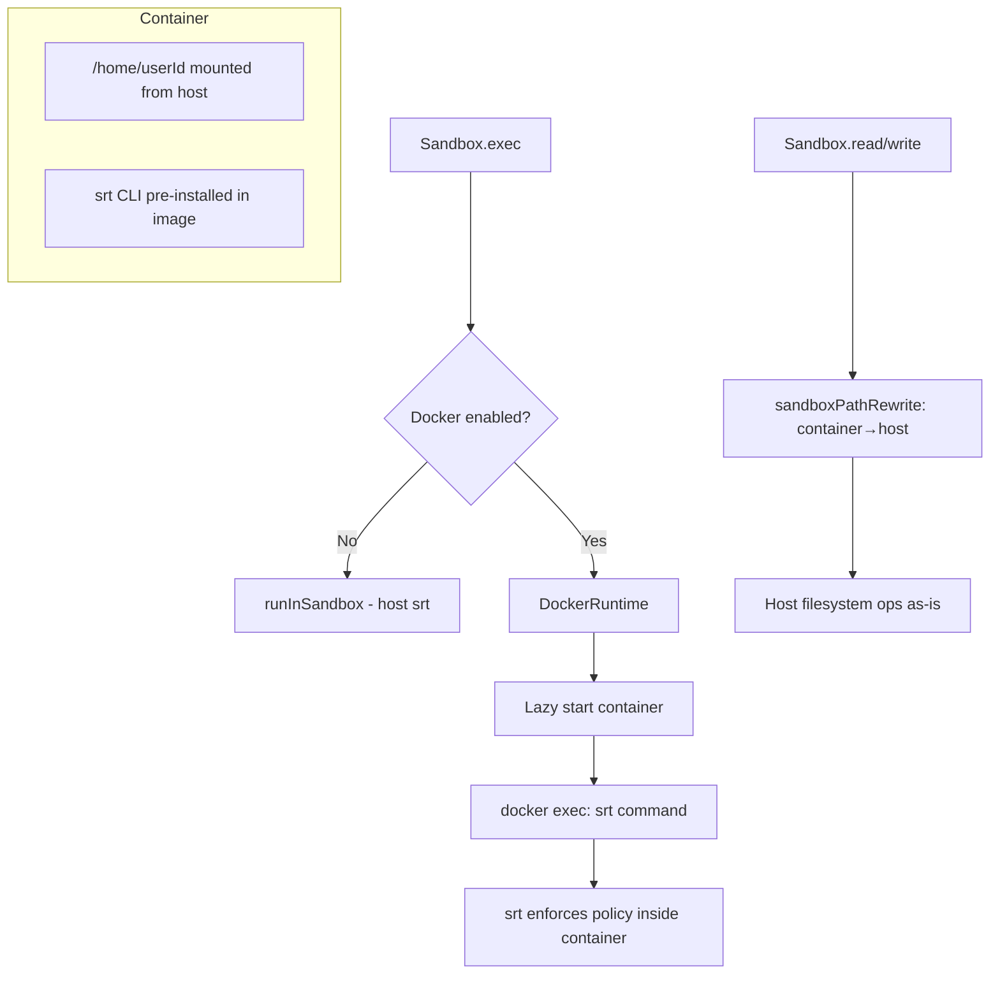

# Docker Sandbox Runtime

## Overview

Add Docker container isolation as an extra security layer around the existing srt (sandbox-runtime) tool execution. When enabled via `settings.json`, exec commands run inside a long-lived Docker container per user. The container has srt pre-installed in the image, and the host home directory is bind-mounted to `/home/<userId>`. Read/write operations stay host-local but perform bidirectional path translation so that container paths (`/home/<userId>/...`) returned by exec are transparently mapped back to host paths.

**Key design decisions:**
- Docker wraps srt — srt still enforces filesystem/network policy inside the container
- One long-lived container per user, started lazily on first exec
- Read/write remain host-local; only exec goes through Docker
- Path rewriting is bidirectional: host↔container for exec input and read/write input
- Config lives in `settings.json` under a `docker` section with `enabled` flag
- Image + tag expected locally (no pull); configurable runtime engine (runc, gVisor, sysbox)

## Context

**Files/components involved:**
- `sources/sandbox/sandbox.ts` — main Sandbox class (read/write/exec)
- `sources/sandbox/runtime.ts` — `runInSandbox()` function that invokes srt CLI
- `sources/sandbox/sandboxTypes.ts` — SandboxConfig, SandboxExecArgs, etc.
- `sources/sandbox/sandboxHomeRedefine.ts` — env var remapping for HOME
- `sources/sandbox/sandboxFilesystemPolicyBuild.ts` — srt filesystem policy
- `sources/settings.ts` — SettingsConfig type
- `sources/config/configSettingsParse.ts` — Zod validation schema
- `sources/config/configTypes.ts` — resolved Config type
- `sources/engine/agents/agent.ts` — creates Sandbox per agent
- `sources/engine/users/userHome.ts` — UserHome class with per-user paths

**Related patterns:**
- `packages/daycare-factory/sources/docker/` — existing dockerode usage (container create, attach, wait)
- Prefix naming convention: `dockerContainerCreate.ts`, `sandboxPathRewrite.ts`
- One public function per file

**Dependencies:**
- `dockerode` (already used in daycare-factory)
- `@anthropic-ai/sandbox-runtime` (already used, will run inside container)

## Path Mapping

```
Host:      /data/users/<userId>/home/desktop/project/file.ts
Container: /home/<userId>/desktop/project/file.ts

Host homeDir:      /data/users/<userId>/home
Container homeDir: /home/<userId>
```

**Bidirectional rewriting:**
- **exec input (host→container):** cwd, HOME env, srt allowWrite paths all rewritten
- **read/write input (container→host):** when LLM references `/home/<userId>/...` paths from exec output, translate back to host paths

## Architecture



## Development Approach
- **Testing approach**: Regular (code first, then tests)
- Complete each task fully before moving to the next
- Make small, focused changes
- **CRITICAL: every task MUST include new/updated tests**
- **CRITICAL: all tests must pass before starting next task**
- **CRITICAL: update this plan file when scope changes during implementation**
- Run tests after each change

## Testing Strategy
- **Unit tests**: required for every task — path rewriting, config parsing, container name building
- **Integration**: Docker container lifecycle tested manually (requires Docker daemon)

## Progress Tracking
- Mark completed items with `[x]` immediately when done
- Add newly discovered tasks with ➕ prefix
- Document issues/blockers with ⚠️ prefix
- ➕ Added explicit docker defaults in config resolution: `enabled=false`, `image=daycare-sandbox`, `tag=latest`
- ⚠️ Real Docker daemon verification remains a manual step (unit tests cover mocked dockerode flow)

## Implementation Steps

### Task 1: Add Docker config to settings

Add `docker` section to `SettingsConfig` type and Zod schema.

```json
{
    "docker": {
        "enabled": true,
        "image": "daycare-sandbox",
        "tag": "latest",
        "socketPath": "/var/run/docker.sock",
        "runtime": "runsc"
    }
}
```

- [x] Add `DockerSettings` type in `sources/settings.ts` with fields: `enabled`, `image`, `tag`, `socketPath?`, `runtime?`
- [x] Add `docker?: DockerSettings` to `SettingsConfig`
- [x] Add `docker` Zod schema in `sources/config/configSettingsParse.ts`
- [x] Add `docker` to resolved `Config` type in `sources/config/configTypes.ts` and resolution in `configResolve.ts`
- [x] Write tests for config parsing with docker section (valid, missing, partial)
- [x] Run tests — must pass before next task

### Task 2: Sandbox path rewriting utilities

Create pure functions for bidirectional path translation between host and container.

- [x] Create `sources/sandbox/sandboxPathHostToContainer.ts` — rewrites host homeDir path to `/home/<userId>` container path
- [x] Create `sources/sandbox/sandboxPathContainerToHost.ts` — rewrites `/home/<userId>` container path back to host homeDir path
- [x] Both functions take `hostHomeDir`, `userId`, and `targetPath` as input; return translated path or original if not within mapping
- [x] Write tests for `sandboxPathHostToContainer` (within home, outside home, edge cases)
- [x] Write tests for `sandboxPathContainerToHost` (within container home, outside, edge cases)
- [x] Run tests — must pass before next task

### Task 3: Docker container lifecycle manager

Create a `DockerContainers` facade that manages long-lived containers per user.

- [x] Create `sources/sandbox/docker/dockerTypes.ts` — types for `DockerContainerConfig` (image, tag, socketPath, runtime, userId, hostHomeDir)
- [x] Create `sources/sandbox/docker/dockerContainerNameBuild.ts` — builds container name from userId (e.g., `daycare-sandbox-<userId>`)
- [x] Create `sources/sandbox/docker/dockerContainerEnsure.ts` — lazily creates and starts a container if not running; returns container reference. Binds `hostHomeDir` → `/home/<userId>`, sets runtime if configured, connects via socketPath
- [x] Create `sources/sandbox/docker/dockerContainerExec.ts` — runs a command inside a running container via `docker exec`, returns stdout/stderr
- [x] Write tests for `dockerContainerNameBuild` (various userIds)
- [x] Write tests for `dockerContainerEnsure` and `dockerContainerExec` using mocked dockerode
- [x] Run tests — must pass before next task

### Task 4: Docker-aware runtime

Create a Docker variant of `runInSandbox` that executes srt inside the container.

- [x] Create `sources/sandbox/docker/dockerRunInSandbox.ts` — writes srt settings JSON to a temp file inside the mounted home, then calls `dockerContainerExec` with `node /path/to/srt/cli.js --settings <containerPath> -c <command>`. Rewrites all paths in the srt config (allowWrite, denyRead, denyWrite, cwd, HOME) from host to container paths
- [x] Rewrite env vars from `sandboxHomeRedefine` to use container home path
- [x] Clean up temp settings file after execution
- [x] Write tests for path rewriting within the srt config
- [x] Write tests for the full `dockerRunInSandbox` flow with mocked container exec
- [x] Run tests — must pass before next task

### Task 5: Integrate Docker runtime into Sandbox class

Wire the Docker runtime into the existing `Sandbox` class so exec uses Docker when enabled.

- [x] Extend `SandboxConfig` with optional `docker` config (image, tag, socketPath, runtime, userId)
- [x] In `Sandbox.exec()`, check if docker config is present and enabled; if so, call `dockerRunInSandbox` instead of `runInSandbox`
- [x] In `Sandbox.read()` and `Sandbox.write()`, add path rewriting step: if docker is configured, attempt to translate container paths (from `readInputPathResolve` and write `args.path`) back to host paths before proceeding with existing logic
- [x] Update `agent.ts` to pass docker config from resolved settings into `SandboxConfig` when constructing the Sandbox
- [x] Write tests for Sandbox.exec dispatching to Docker vs host runtime
- [x] Write tests for Sandbox.read/write path translation with docker config
- [x] Run tests — must pass before next task

### Task 6: Add `dockerode` dependency to daycare package

- [x] Add `dockerode` and `@types/dockerode` to `packages/daycare/package.json`
- [x] Run `yarn install`
- [x] Verify build passes with `yarn typecheck`
- [x] Run tests — must pass before next task

### Task 7: Verify acceptance criteria

- [x] Verify: when `docker.enabled = false` or absent, exec uses host srt (no regression)
- [x] Verify: when `docker.enabled = true`, exec runs srt inside Docker container
- [x] Verify: container is created lazily on first exec and reused for subsequent execs
- [x] Verify: read/write translate container paths back to host paths
- [x] Verify: srt config inside container uses container-native paths
- [x] Run full test suite (unit tests)
- [x] Run linter — all issues must be fixed

### Task 8: Update documentation

- [x] Create `sources/sandbox/docker/README.md` documenting Docker sandbox setup
- [x] Update `doc/internals/sandbox-abstraction.md` with Docker runtime section
- [x] Update `sources/sandbox/README.md` with Docker configuration example

## Technical Details

### Docker Container Setup

```typescript
// Container creation config
{
    name: `daycare-sandbox-${userId}`,
    Image: `${image}:${tag}`,
    Cmd: ["sleep", "infinity"],          // keep alive
    WorkingDir: `/home/${userId}`,
    HostConfig: {
        Binds: [`${hostHomeDir}:/home/${userId}`],
        Runtime: runtime ?? undefined,   // "runsc", "sysbox-runc", etc.
    }
}
```

### Settings JSON Example

```json
{
    "docker": {
        "enabled": true,
        "image": "daycare-sandbox",
        "tag": "latest",
        "socketPath": "/var/run/docker.sock",
        "runtime": "runsc"
    }
}
```

### SRT Config Path Rewriting

Before passing to srt inside the container, all filesystem policy paths are rewritten:

```typescript
// Host srt config
{ allowWrite: ["/data/users/uid/home", "/data/users/uid/home/desktop"] }

// Container srt config (after rewrite)
{ allowWrite: ["/home/uid", "/home/uid/desktop"] }
```

### Container Exec Flow

```
1. Sandbox.exec(command) called
2. Check docker config → enabled
3. DockerContainers.ensure(userId) → lazy-start container
4. Build srt config with container-rewritten paths
5. Write srt settings to <hostHomeDir>/.tmp/srt-<pid>.json
6. docker exec: node <srt-cli> --settings /home/<userId>/.tmp/srt-<pid>.json -c <command>
7. Collect stdout/stderr
8. Clean up settings file
9. Return result
```

## Post-Completion

**Manual verification:**
- Test with actual Docker daemon and a sandbox image that includes srt
- Verify gVisor runtime isolation if using `runsc`
- Test container recovery after Docker daemon restart
- Verify no path leakage between host and container

**Image requirements:**
- Docker image must include Node.js and `@anthropic-ai/sandbox-runtime`
- Image must be available locally (no auto-pull)
- srt CLI path inside container needs to be discoverable or configured
