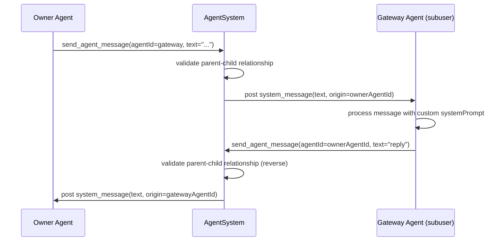
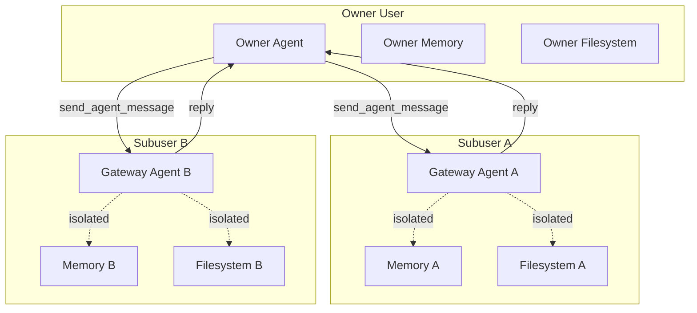

# Isolated Subusers

## Overview
Add a subuser isolation primitive: the owner can create child users that get their own memory, filesystem sandbox, agents, cron, signals, etc. Each subuser has one auto-created **gateway agent** that receives all messages forwarded by the owner's agents. The gateway agent has a configurable system prompt (set via tool). Owner agents communicate with subuser gateway agents through the existing `send_agent_message` tool, extended to allow cross-user messaging within the parent-child boundary. Gateway agents can reply back to whoever messaged them.

**Key properties:**
- Complete isolation: memory, filesystem, sandbox, signals, channels all scoped to the subuser's `userId`
- Gateway agent: auto-created with the subuser, receives messages from owner agents
- Configurable behavior: owner can update gateway agent's system prompt anytime
- One-way initiation: only owner agents can initiate; gateway agents can reply back
- Topology: owner sees subusers section; subuser agents see only their own scope

## Context (from discovery)

### Existing infrastructure that provides isolation for free
- **Memory**: already user-scoped at `<usersDir>/<userId>/memory/graph/`
- **Filesystem**: `UserHome` provides per-user directories (`home/`, `skills/`, `apps/`)
- **Sandbox**: permissions derived from `UserHome`, scoped to user's directories
- **DB entities**: agents, cron, heartbeats, signals, channels, exposes, processes all have `user_id` column

### Files that handle `AgentDescriptor` type (all need new `subuser` case)
- `agentDescriptorTypes.ts` — union definition
- `agentDescriptorCacheKey.ts` — cache key builder (exhaustive switch)
- `agentDescriptorLabel.ts` — human-friendly label
- `agentDescriptorMatchesStrategy.ts` — fetch strategy matching
- `agentDescriptorTargetResolve.ts` — connector target resolution
- `agentDescriptorRoleResolve.ts` — model role mapping
- `agentPromptResolve.ts` — system prompt resolution
- `agentSystem.ts` → `resolveUserIdForDescriptor` — user ID resolution

### Key patterns
- Migrations in `sources/storage/migrations/`, registered in `_migrations.ts`
- Tools built as `*ToolBuild.ts` functions, registered in `engine.ts`
- `send_agent_message` in `background.ts` posts to `agentSystem.post()` with origin

## Development Approach
- **Testing approach**: Regular (code first, then tests)
- Complete each task fully before moving to the next
- Make small, focused changes
- **CRITICAL: every task MUST include new/updated tests**
- **CRITICAL: all tests must pass before starting next task**
- Run tests after each change

## Implementation Steps

### Task 1: Add `parent_user_id` and `name` columns to users table
- [ ] Create migration `20260222_add_user_parent.ts`: `ALTER TABLE users ADD COLUMN parent_user_id TEXT REFERENCES users(id)` and `ALTER TABLE users ADD COLUMN name TEXT`
- [ ] Add index: `CREATE INDEX idx_users_parent ON users(parent_user_id) WHERE parent_user_id IS NOT NULL`
- [ ] Register migration in `_migrations.ts`
- [ ] Update `DatabaseUserRow` in `databaseTypes.ts`: add `parent_user_id TEXT | null` and `name TEXT | null`
- [ ] Update `UserDbRecord` in `databaseTypes.ts`: add `parentUserId: string | null` and `name: string | null`
- [ ] Update `CreateUserInput`: add optional `parentUserId?: string` and `name?: string`
- [ ] Update `UsersRepository`: map new columns in `create()`, `userLoadById()`, `findMany()`, `userClone()`
- [ ] Add `findByParentUserId(parentUserId: string)` method to `UsersRepository`
- [ ] Write migration test in `20260222_add_user_parent.spec.ts`
- [ ] Write test for `findByParentUserId` in existing or new spec
- [ ] Run tests — must pass before task 2

### Task 2: Add `subuser` agent descriptor type
- [ ] Add `{ type: "subuser"; id: string; name: string; systemPrompt: string }` variant to `AgentDescriptor` union in `agentDescriptorTypes.ts`
- [ ] Add cache key case `case "subuser": return \`/subuser/${descriptor.id}\`` in `agentDescriptorCacheKey.ts`
- [ ] Add label case in `agentDescriptorLabel.ts`: return `descriptor.name`
- [ ] Add strategy case in `agentDescriptorMatchesStrategy.ts`: return `false` for all strategies
- [ ] Add target case in `agentDescriptorTargetResolve.ts`: return `null` (no connector target)
- [ ] Add role case in `agentDescriptorRoleResolve.ts`: return `"user"` (uses the user model role)
- [ ] Add prompt case in `agentPromptResolve.ts`: return `{ agentPrompt: descriptor.systemPrompt, replaceSystemPrompt: false }` (same pattern as `permanent`/`app`)
- [ ] Add user resolution in `agentSystem.ts` → `resolveUserIdForDescriptor`: for `subuser`, look up the agent's target userId from the subuser record. The subuser's gateway agent descriptor carries an `id` that matches the subuser's `userId`. Resolution: find user by id, return that userId
- [ ] Update tests: `agentDescriptorCacheKey.spec.ts`, `agentDescriptorLabel.spec.ts`, `agentDescriptorRoleResolve.spec.ts`, `agentPromptResolve.spec.ts`
- [ ] Run tests — must pass before task 3

### Task 3: Create `subuser_create` tool
- [ ] Create `subuserCreateToolBuild.ts` in `sources/engine/modules/tools/`
- [ ] Schema: `{ name: string, systemPrompt: string }`
- [ ] Implementation:
  - Validate caller is owner user (`ctx.userId` matches owner)
  - Create child user via `storage.users.create({ parentUserId: ctx.userId, name })`
  - Ensure subuser's `UserHome` directories via `userHomeEnsure`
  - Create gateway agent with descriptor `{ type: "subuser", id: subuserUserId, name, systemPrompt }`
  - Post to agent system to register the agent
  - Return `{ subuserId, gatewayAgentId, name }`
- [ ] Add `visibleByDefault`: only visible when `ctx.userId` belongs to the owner user
- [ ] Register tool in `engine.ts`
- [ ] Write tests for `subuserCreateToolBuild.spec.ts`
- [ ] Run tests — must pass before task 4

### Task 4: Create `subuser_configure` tool
- [ ] Create `subuserConfigureToolBuild.ts` in `sources/engine/modules/tools/`
- [ ] Schema: `{ subuserId: string, systemPrompt: string }`
- [ ] Implementation:
  - Validate caller is owner user
  - Validate subuser exists and has `parentUserId` matching caller's userId
  - Find the gateway agent (type `subuser` with id matching subuserId)
  - Update the agent's descriptor with new `systemPrompt`
  - Persist the updated descriptor
  - Return confirmation
- [ ] Add `visibleByDefault`: only visible to owner user's agents
- [ ] Register tool in `engine.ts`
- [ ] Write tests for `subuserConfigureToolBuild.spec.ts`
- [ ] Run tests — must pass before task 5

### Task 5: Create `subuser_list` tool
- [ ] Create `subuserListToolBuild.ts` in `sources/engine/modules/tools/`
- [ ] Schema: `{}` (no params)
- [ ] Implementation:
  - Validate caller is owner user
  - Query `storage.users.findByParentUserId(ctx.userId)`
  - For each subuser, find their gateway agent from agent storage
  - Return list of `{ subuserId, name, gatewayAgentId, gatewayLifecycle }`
- [ ] Add `visibleByDefault`: only visible to owner user's agents
- [ ] Register tool in `engine.ts`
- [ ] Write tests for `subuserListToolBuild.spec.ts`
- [ ] Run tests — must pass before task 6

### Task 6: Extend `send_agent_message` for cross-user communication
- [ ] In `background.ts` `buildSendAgentMessageTool()`, add validation:
  - When target agent belongs to a different userId than caller, check parent-child relationship
  - Allow if: caller's user is parent of target's user, OR target's user is parent of caller's user
  - Reject cross-user messaging outside the parent-child boundary
- [ ] To check: load target agent's userId from storage, load both users, verify `parentUserId` relationship
- [ ] Ensure origin is set so gateway agent can reply back
- [ ] Write tests for cross-user messaging validation
- [ ] Run tests — must pass before task 7

### Task 7: Filter topology for subuser isolation
- [ ] In `topologyToolBuild.ts`, filter agent list by `callerUserId` — subuser agents only see agents belonging to their own userId
- [ ] For owner users: add a `## Subusers` section listing each subuser with their gateway agent info
- [ ] Filter cron tasks, heartbeat tasks, signal subscriptions, channels by userId for subuser agents
- [ ] Write tests for topology filtering
- [ ] Run tests — must pass before task 8

### Task 8: Verify acceptance criteria
- [ ] Verify: subuser creation creates isolated user with own memory/filesystem
- [ ] Verify: gateway agent uses configurable system prompt
- [ ] Verify: owner agents can send messages to gateway agent
- [ ] Verify: gateway agent can reply back to origin agent
- [ ] Verify: topology shows subusers for owner, isolated view for subusers
- [ ] Verify: subuser agents cannot see owner's agents or other subusers
- [ ] Run full test suite (unit tests)
- [ ] Run linter — all issues must be fixed

### Task 9: [Final] Update documentation
- [ ] Add `doc/subusers.md` documenting the subuser concept, tools, and communication flow
- [ ] Update `doc/PLUGINS.md` if relevant
- [ ] Add mermaid diagram showing subuser isolation boundaries and message flow

## Technical Details

### New descriptor type
```typescript
| {
    type: "subuser";
    id: string;       // matches the subuser's userId
    name: string;
    systemPrompt: string;
}
```

### User table changes
```sql
ALTER TABLE users ADD COLUMN parent_user_id TEXT REFERENCES users(id);
ALTER TABLE users ADD COLUMN name TEXT;
CREATE INDEX idx_users_parent ON users(parent_user_id) WHERE parent_user_id IS NOT NULL;
```

### Message flow


### Isolation boundary


## Post-Completion

**Manual verification:**
- Create a subuser via tool call, verify isolated filesystem is created
- Send messages from owner agent to gateway, verify gateway processes with custom prompt
- Verify gateway can reply back
- Verify topology shows correct isolation
- Verify memory observations are stored in subuser's memory directory, not owner's
