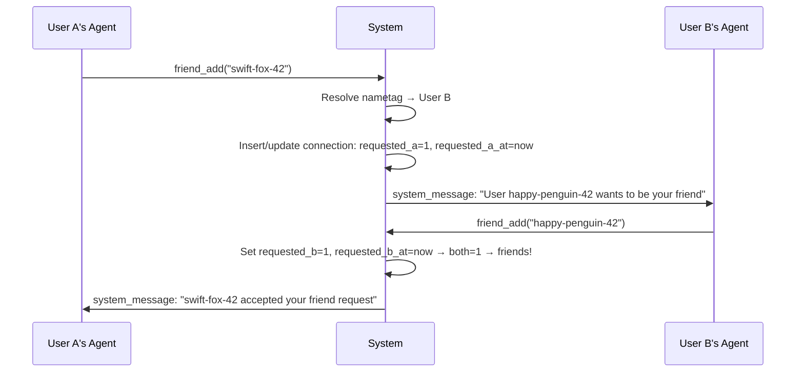

# Nametag & Friends System

## Overview
- Add a global `nametag` (adjective-noun-number format, e.g. `swift-fox-42`) auto-generated for every user on creation
- Implement a connections system with one row per pair (IDs sorted so `user_a_id < user_b_id`), with independent `requested_a`/`requested_b` flags and timestamps per side; friends = both sides requested; timestamps enforce 1-week cooldown after rejection
- Add cross-user messaging capability through `AgentSystem.postToUserAgents()` that bypasses the existing userId guard
- Three tools: `friend_add(nametag)`, `friend_remove(nametag)`, `friend_send(nametag, message)`
- Friend requests are delivered as `system_message` items to the target user's frontend agents

## Context
- **Database**: SQLite via `node:sqlite`, raw SQL, manual migrations in `sources/storage/migrations/`
- **Users**: `UsersRepository` with `users` table; no nametag column yet
- **Cross-user guard**: `AgentSystem.resolveEntry()` enforces `ctx.userId === entry.ctx.userId` — no cross-user messaging exists
- **Tools**: `*ToolBuild()` pattern with TypeBox schemas, registered in `engine.ts` via `this.modules.tools.register("core", ...)`
- **Agent types**: Frontend agents have descriptor `type: "user"` with `connector`, `userId`, `channelId`

## Architecture

### Nametag Generation
```
nametagGenerate() → "adjective-noun-NN"
```
- Word lists (~200 adjectives, ~200 nouns) embedded in the generator file
- Random 2-digit number suffix (10–99)
- Retry on collision (unique constraint in DB)
- Generated in `UsersRepository.create()` for all users

### Connections Table (One Row Per Pair, Sorted IDs)
```
┌──────────────────────────────────────────────────────────────────────────────────┐
│ connections                                                                      │
├───────────────┬───────────────┬─────────────┬─────────────┬────────────┬─────────┤
│ user_a_id(PK) │ user_b_id(PK) │ requested_a │ requested_b │ req_a_at   │ req_b_at│
├───────────────┼───────────────┼─────────────┼─────────────┼────────────┼─────────┤
│ alice         │ bob           │ 1           │ 0           │ 1740000000 │ null    │
│ (sorted: alice < bob)         │ ← alice sent│             │            │         │
│               │               │ 1           │ 1           │ 1740000000 │ 17400…  │
│               │               │ ← friends (both requested) │            │         │
└───────────────┴───────────────┴─────────────┴─────────────┴────────────┴─────────┘
CHECK (user_a_id < user_b_id) — ensures canonical ordering

Friends = requested_a=1 AND requested_b=1
Pending = one side is 1, other is 0
Cooldown = if rejected, timestamp prevents re-request within 1 week
```

### Friend Request Flow


### Cross-User Posting
New method on `AgentSystem`:
```typescript
async postToUserAgents(targetUserId: string, item: AgentInboxItem): Promise<void>
```
- Queries `AgentsRepository` for all agents belonging to `targetUserId` with descriptor `type: "user"`
- Creates `contextForAgent({ userId: targetUserId, agentId })` for each
- Posts using existing `enqueueEntry()` — bypasses guard by using target's own ctx
- Restores sleeping agents from storage if needed

### Tool Behavior

**`friend_add(nametag)`**
1. Resolve nametag → target user; determine which side I am (a or b)
2. Sort (me, target) into (a, b) for canonical lookup
3. Look up connection row:
   - Both sides = 1 → already friends, error
   - My side = 1, other = 0 → already pending, error
   - My side = 0, other = 1 → **confirm**: set my side = 1, my_at = now → friends! Notify target
   - My side = 0, other = 0 (row exists) → check cooldown: if my_at is within 1 week → error "try again later"; else set my side = 1, my_at = now, notify target
   - Row doesn't exist → **request**: insert row with my side = 1, my_at = now, other = 0; notify target

**`friend_remove(nametag)`**
1. Resolve nametag → target user; determine which side I am (a or b)
2. Sort (me, target) into (a, b) for canonical lookup
3. Look up connection row:
   - Both sides = 1 → **unfriend**: set my side = 0, notify target
   - Other side = 1, my side = 0 → **reject**: set other side = 0, **no notification** (timestamp preserved for cooldown)
   - My side = 1, other = 0 → **cancel**: set my side = 0
   - Row doesn't exist OR both = 0 → error "no relationship"

**`friend_send(nametag, message)`**
1. Resolve nametag → target user
2. Sort (me, target) into (a, b), verify connection exists with requested_a=1 AND requested_b=1
3. Post system_message to target's frontend agents with sender's nametag as origin

## Development Approach
- **Testing approach**: Regular (code first, then tests)
- Complete each task fully before moving to the next
- Every task includes tests for new/changed functionality
- All tests must pass before starting next task

## Progress Tracking
- Mark completed items with `[x]` immediately when done
- Add newly discovered tasks with ➕ prefix
- Document issues/blockers with ⚠️ prefix

## Implementation Steps

### Task 1: Migration — add nametag column and connections table
- [ ] Create `sources/storage/migrations/20260222_add_nametag_connections.ts`
  - Add `nametag TEXT` column to `users` table (nullable, unique)
  - Create `connections` table: `(user_a_id TEXT, user_b_id TEXT, requested_a INTEGER DEFAULT 0, requested_b INTEGER DEFAULT 0, requested_a_at INTEGER, requested_b_at INTEGER, PRIMARY KEY (user_a_id, user_b_id), CHECK (user_a_id < user_b_id))`
  - Add index on `user_b_id` for reverse lookups
  - Add unique index on `nametag` (filtered WHERE nametag IS NOT NULL)
- [ ] Register migration in `sources/storage/migrations/_migrations.ts`
- [ ] Update `DatabaseUserRow` in `databaseTypes.ts` to include `nametag: string | null`
- [ ] Update `UserDbRecord` in `databaseTypes.ts` to include `nametag: string | null`
- [ ] Add `DatabaseConnectionRow` type to `databaseTypes.ts`
- [ ] Run tests — must pass before next task

### Task 2: Nametag generator
- [ ] Create `sources/engine/friends/nametagGenerate.ts`
  - Export `nametagGenerate(): string` — returns `"adjective-noun-NN"` format
  - Embedded word lists (~200 adjectives, ~200 nouns)
  - Random 2-digit number suffix (10–99)
- [ ] Write tests in `sources/engine/friends/nametagGenerate.spec.ts`
  - Verify format matches `word-word-number` pattern
  - Verify output randomness (multiple calls produce different results)
- [ ] Run tests — must pass before next task

### Task 3: Wire nametag into user creation
- [ ] Update `UsersRepository.create()` to accept optional `nametag` in `CreateUserInput`
- [ ] Update `UsersRepository.create()` SQL INSERT to include nametag column
- [ ] Update all SELECT queries in `UsersRepository` to include nametag column (mapRow, findByConnectorKey, etc.)
- [ ] Add `UsersRepository.findByNametag(nametag: string): Promise<UserDbRecord | null>` method
- [ ] Update `Storage.resolveUserByConnectorKey()` to generate nametag via `nametagGenerate()` on creation, retrying on collision
- [ ] Write tests for `findByNametag` lookup
- [ ] Run tests — must pass before next task

### Task 4: ConnectionsRepository
- [ ] Create `sources/storage/connectionsRepository.ts` with helper `sortPair(id1, id2) → [a, b]`
  - `upsertRequest(requesterId, targetId)` — sort IDs, insert or update: set requester's side to 1 + timestamp
  - `clearSide(userId, otherId)` — sort IDs, set that user's side to 0 (keep timestamp for cooldown)
  - `find(id1, id2): ConnectionDbRecord | null` — sort IDs, single row lookup
  - `findFriends(userId): ConnectionDbRecord[]` — all rows where (user_a_id=userId OR user_b_id=userId) AND requested_a=1 AND requested_b=1
  - `delete(id1, id2)` — sort IDs, remove row (cleanup when both sides are 0)
- [ ] Register `ConnectionsRepository` in `Storage` facade (`storage.ts`)
- [ ] Write tests in `sources/storage/connectionsRepository.spec.ts`
  - Test upsertRequest, clearSide, find, findFriends, delete, cooldown enforcement
- [ ] Run tests — must pass before next task

### Task 5: Cross-user posting in AgentSystem
- [ ] Add `AgentsRepository.findByUserId(userId: string)` method returning all agents for a user
- [ ] Add `AgentSystem.postToUserAgents(targetUserId: string, item: AgentInboxItem): Promise<void>`
  - Query agents for targetUserId, filter for descriptor `type: "user"`
  - For each agent: create target ctx, resolve entry, enqueue item
  - Restore sleeping agents from storage if needed
- [ ] Write tests for `AgentsRepository.findByUserId()`
- [ ] Run tests — must pass before next task

### Task 6: friend_add tool
- [ ] Create `sources/engine/modules/tools/friendAddToolBuild.ts`
  - Parameter: `nametag: string`
  - Logic: resolve nametag → check state → request or confirm (see Tool Behavior above)
  - On request: upsert connection row (my side=1, my_at=now), post system_message to target via `postToUserAgents`
  - On confirm: set my side=1 → both=1 → friends! Notify requester
  - Enforce 1-week cooldown: if my side was cleared and my_at < 1 week ago → error
  - Visible only to frontend agents (descriptor type "user")
- [ ] Register tool in `engine.ts`
- [ ] Write tests for request and confirm paths
- [ ] Run tests — must pass before next task

### Task 7: friend_remove tool
- [ ] Create `sources/engine/modules/tools/friendRemoveToolBuild.ts`
  - Parameter: `nametag: string`
  - Logic: resolve nametag → unfriend / reject / cancel (see Tool Behavior above)
  - Unfriend: set my side=0 (preserve timestamp), notify target
  - Reject: set other side=0 (preserve timestamp for cooldown), no notification
  - Cancel: set my side=0
  - Visible only to frontend agents (descriptor type "user")
- [ ] Register tool in `engine.ts`
- [ ] Write tests for unfriend, reject, and cancel paths
- [ ] Run tests — must pass before next task

### Task 8: friend_send tool
- [ ] Create `sources/engine/modules/tools/friendSendToolBuild.ts`
  - Parameters: `nametag: string`, `message: string`
  - Logic: resolve nametag → verify friendship → post system_message to target's agents
  - Message origin includes sender's nametag for reply context
  - Visible only to frontend agents (descriptor type "user")
- [ ] Register tool in `engine.ts`
- [ ] Write tests for send success and not-friends error
- [ ] Run tests — must pass before next task

### Task 9: Verify acceptance criteria
- [ ] Verify nametag is auto-generated on user creation
- [ ] Verify friend_add sends request and confirms
- [ ] Verify friend_remove rejects silently and unfriends with notification
- [ ] Verify friend_send delivers to target's frontend agents
- [ ] Run full test suite (`yarn test`)
- [ ] Run linter (`yarn lint`)
- [ ] Run type-check (`yarn typecheck`)

### Task 10: Documentation
- [ ] Create `doc/friends.md` with system overview and mermaid diagrams
- [ ] Update types re-exports in `sources/types.ts` if new shared types were added

## Technical Details

### Database Schema Changes
```sql
-- users table: add column
ALTER TABLE users ADD COLUMN nametag TEXT;
CREATE UNIQUE INDEX idx_users_nametag ON users(nametag) WHERE nametag IS NOT NULL;

-- new table (one row per pair, IDs always sorted so user_a_id < user_b_id)
CREATE TABLE connections (
    user_a_id TEXT NOT NULL REFERENCES users(id),
    user_b_id TEXT NOT NULL REFERENCES users(id),
    requested_a INTEGER NOT NULL DEFAULT 0,
    requested_b INTEGER NOT NULL DEFAULT 0,
    requested_a_at INTEGER,
    requested_b_at INTEGER,
    PRIMARY KEY (user_a_id, user_b_id),
    CHECK (user_a_id < user_b_id)
);
CREATE INDEX idx_connections_user_b ON connections(user_b_id);

-- Friends = requested_a=1 AND requested_b=1
-- Cooldown: after rejection, re-request blocked for 1 week based on timestamp
```

### System Message Formats
```
-- Friend request
<system_message origin="friend:happy-penguin-42">
User happy-penguin-42 wants to be your friend. Use friend_add("happy-penguin-42") to accept.
</system_message>

-- Friend confirmed
<system_message origin="friend:swift-fox-42">
swift-fox-42 accepted your friend request. You are now friends.
</system_message>

-- Friend message
<system_message origin="friend:happy-penguin-42">
Message from happy-penguin-42: Hello!
</system_message>

-- Friend removed
<system_message origin="friend:swift-fox-42">
swift-fox-42 removed you as a friend.
</system_message>
```

### File Map
| File | Purpose |
|------|---------|
| `storage/migrations/20260222_add_nametag_connections.ts` | DB migration |
| `storage/databaseTypes.ts` | Updated row types |
| `storage/usersRepository.ts` | Nametag in create + findByNametag |
| `storage/connectionsRepository.ts` | Connections CRUD |
| `storage/storage.ts` | Register ConnectionsRepository |
| `engine/friends/nametagGenerate.ts` | Adjective-noun-number generator |
| `engine/modules/tools/friendAddToolBuild.ts` | friend_add tool |
| `engine/modules/tools/friendRemoveToolBuild.ts` | friend_remove tool |
| `engine/modules/tools/friendSendToolBuild.ts` | friend_send tool |
| `engine/agents/agentSystem.ts` | postToUserAgents method |
| `engine/engine.ts` | Tool registration |

## Post-Completion
- Manual testing: create two users via different connectors, test full friend request flow
- Verify cross-user messaging works with sleeping agents (agent restored from storage)
- Consider rate limiting on friend_add/friend_send in future iteration
