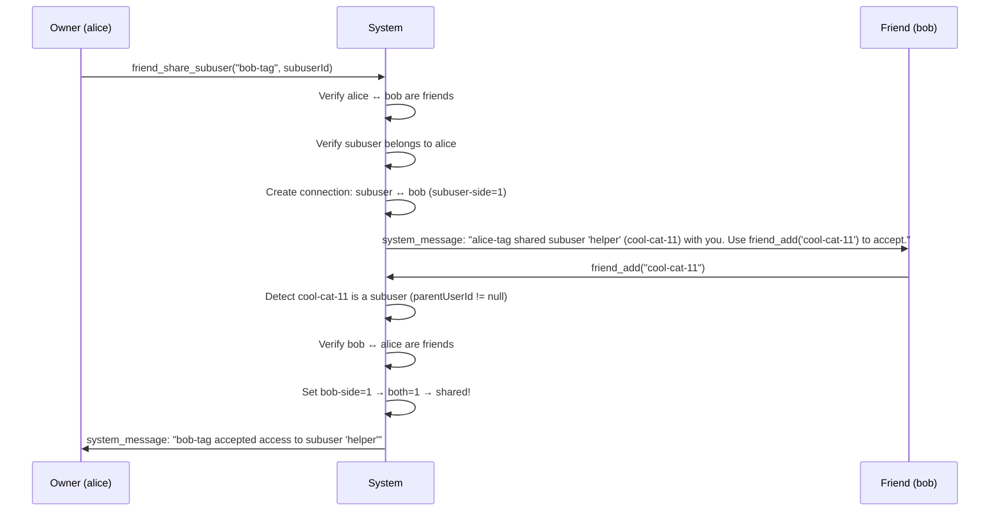
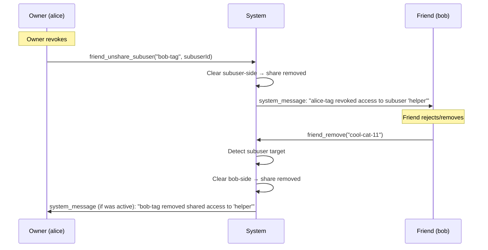

# Subuser Sharing via Friendship

## Overview
- Allow owners to share access to their subusers with friends, using the existing `connections` table
- Owner initiates sharing via `friend_share_subuser(friendUsertag, subuserId)` which creates a connection row between the subuser and the friend (subuser-side=1)
- Friend accepts or rejects using existing `friend_add(subuserUsertag)` / `friend_remove(subuserUsertag)`, which are extended to detect subuser targets
- Once accepted (both sides=1), the friend can see the subuser in topology and send messages to it
- Topology gets a new `## Friends` section showing friends and their shared subusers (active + pending) in a tree structure
- Owner can revoke sharing via `friend_unshare_subuser(friendUsertag, subuserId)`

## Context
- **Connections table**: canonical pair `(user_a_id < user_b_id)` with independent `requested_a`/`requested_b` flags; friends = both sides=1
- **Subusers**: child users with `parentUserId` pointing to owner; each has a gateway agent (`type: "subuser"`); each gets an auto-generated usertag
- **Existing tools**: `friend_add`, `friend_remove`, `friend_send` operate on usertags; visible only to `type: "user"` agents
- **Topology**: already filters by `userId` for subusers; has `## Subusers` section for owners
- **Cross-user posting**: `AgentSystem.postToUserAgents()` delivers `system_message` items to target user's frontend agents

## Architecture

### Data Model — Reuse `connections` Table
No schema changes needed. Subuser-to-friend shares are stored as regular connection rows:

```
connections table:
┌───────────────┬───────────────┬─────────────┬─────────────┐
│ user_a_id     │ user_b_id     │ requested_a │ requested_b │
├───────────────┼───────────────┼─────────────┼─────────────┤
│ alice         │ bob           │ 1           │ 1           │  ← human friendship (both=1)
│ alice-sub     │ bob           │ 1           │ 0           │  ← pending share (owner offered)
│ alice-sub     │ bob           │ 1           │ 1           │  ← active share (friend accepted)
└───────────────┴───────────────┴─────────────┴─────────────┘

alice-sub.parentUserId = alice  (subuser belongs to alice)
alice ↔ bob are friends        (prerequisite for sharing)
```

### Share Request Flow


### Revoke / Reject Flow


### Topology — New `## Friends` Section
```
## Friends (2)
swift-fox-42
  shared: helper (usertag=cool-cat-11) status=active gateway=agent-abc
  shared: assistant (usertag=lazy-dog-55) status=pending

brave-eagle-77
  (no shared subusers)
```

Visibility rules:
- **Owner**: sees friends + subusers they shared with each friend (active/pending)
- **Friend**: sees friends + subusers shared with them by each friend (active/pending)
- **Subuser**: no `## Friends` section (already filtered by userId)

### Tool Modifications

**`friend_add(usertag)` — extend for subuser targets**
1. Resolve usertag → user record
2. If `target.parentUserId != null` → subuser share acceptance path:
   - Verify caller is friends with the subuser's parent (owner)
   - Verify existing connection with subuser-side=1 (owner offered)
   - Set friend-side=1 → shared
   - Notify owner
3. If `target.parentUserId == null` → existing human friendship path (unchanged)

**`friend_remove(usertag)` — extend for subuser targets**
1. Resolve usertag → user record
2. If `target.parentUserId != null` → subuser share removal path:
   - Clear friend-side on the subuser↔friend connection
   - Notify owner if share was active
3. If `target.parentUserId == null` → existing human friendship path (unchanged)
   - Additionally: when unfriending, also clean up all subuser shares between the two users

**New: `friend_share_subuser(friendUsertag, subuserId)`**
- Visible only to non-subuser agents (same as `subuser_create`)
- Validates: caller is owner of subuserId, caller is friends with friend
- Creates connection: subuser ↔ friend (subuser-side=1)
- Sends system_message to friend

**New: `friend_unshare_subuser(friendUsertag, subuserId)`**
- Visible only to non-subuser agents
- Validates: caller is owner of subuserId
- Clears subuser-side on connection (or deletes row)
- Sends system_message to friend

### Messaging — Friend Can Message Shared Subuser
Once a share is active (both sides=1), the friend can use `friend_send(subuserUsertag, message)` to message the subuser's gateway agent. The existing `friend_send` tool is extended to:
1. Detect subuser target
2. Verify the share is active
3. Post to the subuser's gateway agent instead of frontend agents

## Development Approach
- **Testing approach**: Regular (code first, then tests)
- Complete each task fully before moving to the next
- Every task includes tests for new/changed functionality
- All tests must pass before starting next task
- Update this plan file when scope changes during implementation

## Progress Tracking
- Mark completed items with `[x]` immediately when done
- Add newly discovered tasks with ➕ prefix
- Document issues/blockers with ⚠️ prefix

## Implementation Steps

### Task 1: Add `findByParentUserId` helper to ConnectionsRepository
- [x] Add `ConnectionsRepository.findConnectionsForSubusersOf(ownerUserId: string): Promise<ConnectionDbRecord[]>` — returns all connection rows where one side is a subuser of the given owner (join with users table on parentUserId)
- [x] Add `ConnectionsRepository.findConnectionsWithSubusersOf(friendUserId: string, ownerUserId: string): Promise<ConnectionDbRecord[]>` — returns connections between friendUserId and any subuser of ownerUserId
- [x] Write tests for both methods in `connectionsRepository.spec.ts`
- [x] Run tests — must pass before next task

### Task 2: `friend_share_subuser` tool
- [x] Create `sources/engine/modules/tools/friendShareSubuserToolBuild.ts`
  - Parameters: `friendUsertag: string`, `subuserId: string`
  - Validate caller owns the subuser (`subuser.parentUserId === ctx.userId`)
  - Validate caller is friends with the friend (connection with both=1)
  - Validate no existing active share (both=1 already)
  - Create connection: `upsertRequest(subuser.id, friend.id)` (subuser-side=1)
  - Send system_message to friend: "X shared subuser 'name' (usertag) with you. Use friend_add('usertag') to accept."
  - Visible only to non-subuser agents
- [x] Register tool in `engine.ts`
- [x] Write tests: success path, not-friends error, not-owner error, already-shared error
- [x] Run tests — must pass before next task

### Task 3: `friend_unshare_subuser` tool
- [x] Create `sources/engine/modules/tools/friendUnshareSubuserToolBuild.ts`
  - Parameters: `friendUsertag: string`, `subuserId: string`
  - Validate caller owns the subuser
  - Clear subuser-side on the subuser↔friend connection (or delete row if both=0)
  - Send system_message to friend: "X revoked access to subuser 'name'"
  - Visible only to non-subuser agents
- [x] Register tool in `engine.ts`
- [x] Write tests: revoke active share, revoke pending offer, no-share error
- [x] Run tests — must pass before next task

### Task 4: Extend `friend_add` to handle subuser targets
- [x] Modify `friendAddToolBuild.ts` — after resolving usertag, check `target.parentUserId`
  - If subuser: verify caller is friends with parent (owner)
  - Verify existing connection with subuser-side=1 (owner offered the share)
  - Set friend-side=1 → shared
  - Notify owner via `postToUserAgents(parentUserId, ...)`
  - If no pending offer exists → error "No pending share request for this subuser"
- [x] Write tests: accept subuser share, reject when no offer, reject when not friends with owner
- [x] Run tests — must pass before next task

### Task 5: Extend `friend_remove` to handle subuser targets
- [x] Modify `friendRemoveToolBuild.ts` — after resolving usertag, check `target.parentUserId`
  - If subuser and both=1: reject/remove the share, notify owner
  - If subuser and only subuser-side=1: reject pending offer (no notification)
  - If subuser and only friend-side=1: cancel own pending (shouldn't happen in normal flow)
- [x] On human unfriend: also clean up all subuser shares between the two users
  - Query `findConnectionsWithSubusersOf(friendId, myId)` + `findConnectionsWithSubusersOf(myId, friendId)`
  - Delete all found subuser share connections
- [x] Write tests: remove active subuser share, reject pending offer, cascade on unfriend
- [x] Run tests — must pass before next task

### Task 6: Extend `friend_send` to handle subuser targets
- [x] Modify `friendSendToolBuild.ts` — after resolving usertag, check `target.parentUserId`
  - If subuser: verify share is active (connection both=1)
  - Post to subuser's gateway agent (find agent where `descriptor.type === "subuser"` and `descriptor.id === target.id`)
  - Use `agentSystem.post()` with the subuser's context to deliver the message
- [x] Write tests: send to shared subuser, error when share not active
- [x] Run tests — must pass before next task

### Task 7: Extend topology with `## Friends` section
- [x] Modify `topologyToolBuild.ts` — add `## Friends` section for non-subuser callers
  - Query caller's friends via `connections.findFriends(callerUserId)`
  - For each friend, resolve user record (get usertag)
  - For each friend, query shared subusers:
    - Outgoing: subusers of caller shared with the friend
    - Incoming: subusers of the friend shared with caller
  - Show pending shares with `(pending)` marker
  - Show active shares with gateway agent info
  - Format as tree structure under each friend
- [x] Update topology result schema if needed (add `friendCount` field)
- [x] Write tests: topology with friends, with shared subusers, pending markers, subuser caller exclusion
- [x] Run tests — must pass before next task

### Task 8: Verify acceptance criteria
- [x] Verify owner can share subuser with friend via `friend_share_subuser`
- [x] Verify friend can accept via `friend_add(subuserUsertag)`
- [x] Verify friend can reject via `friend_remove(subuserUsertag)`
- [x] Verify owner can revoke via `friend_unshare_subuser`
- [x] Verify unfriending cascades to remove all subuser shares
- [x] Verify friend can message shared subuser via `friend_send`
- [x] Verify topology shows friends and shared subusers with pending markers
- [x] Run full test suite (`yarn test`)
- [x] Run linter (`yarn lint`)
- [x] Run type-check (`yarn typecheck`)

### Task 9: Documentation
- [x] Update `doc/friends.md` with subuser sharing section and mermaid diagrams
- [x] Update types re-exports in `sources/types.ts` if new shared types were added

## Technical Details

### New Tool Schemas
```typescript
// friend_share_subuser
Type.Object({
    friendUsertag: Type.String({ minLength: 1 }),
    subuserId: Type.String({ minLength: 1 })
})

// friend_unshare_subuser
Type.Object({
    friendUsertag: Type.String({ minLength: 1 }),
    subuserId: Type.String({ minLength: 1 })
})
```

### System Message Formats
```
-- Share offer (to friend)
<system_message origin="friend:alice-tag">
alice-tag shared subuser "helper" (cool-cat-11) with you. Use friend_add("cool-cat-11") to accept.
</system_message>

-- Share accepted (to owner)
<system_message origin="friend:bob-tag">
bob-tag accepted access to subuser "helper" (cool-cat-11).
</system_message>

-- Share revoked (to friend)
<system_message origin="friend:alice-tag">
alice-tag revoked your access to subuser "helper" (cool-cat-11).
</system_message>

-- Share removed by friend (to owner)
<system_message origin="friend:bob-tag">
bob-tag removed access to subuser "helper" (cool-cat-11).
</system_message>

-- Friend message to shared subuser
<system_message origin="friend:bob-tag">
Message from bob-tag: Hello helper!
</system_message>
```

### Topology Output Format
```
## Friends (2)
swift-fox-42
  → shared out: helper (usertag=cool-cat-11) gateway=agent-abc status=active
  → shared out: assistant (usertag=lazy-dog-55) gateway=agent-def status=pending
  ← shared in: bob-helper (usertag=smart-owl-22) gateway=agent-ghi status=active

brave-eagle-77
  (no shared subusers)
```

`→ shared out` = caller's subuser shared with the friend
`← shared in` = friend's subuser shared with the caller

### File Map
| File | Change |
|------|--------|
| `storage/connectionsRepository.ts` | Add `findConnectionsForSubusersOf`, `findConnectionsWithSubusersOf` |
| `engine/modules/tools/friendShareSubuserToolBuild.ts` | **New** — owner shares subuser |
| `engine/modules/tools/friendUnshareSubuserToolBuild.ts` | **New** — owner revokes share |
| `engine/modules/tools/friendAddToolBuild.ts` | Extend — detect subuser targets, accept shares |
| `engine/modules/tools/friendRemoveToolBuild.ts` | Extend — detect subuser targets, cascade on unfriend |
| `engine/modules/tools/friendSendToolBuild.ts` | Extend — allow messaging shared subusers |
| `engine/modules/tools/topologyToolBuild.ts` | Extend — add `## Friends` section |
| `engine/engine.ts` | Register new tools |

## Post-Completion
- Manual testing: create two users, establish friendship, share subuser, verify full accept/reject/revoke/message cycle
- Manual testing: verify unfriending cascades to remove all subuser shares
- Consider rate limiting on `friend_share_subuser` in future iteration
- Consider permission scoping (read-only vs full access) as a future enhancement
