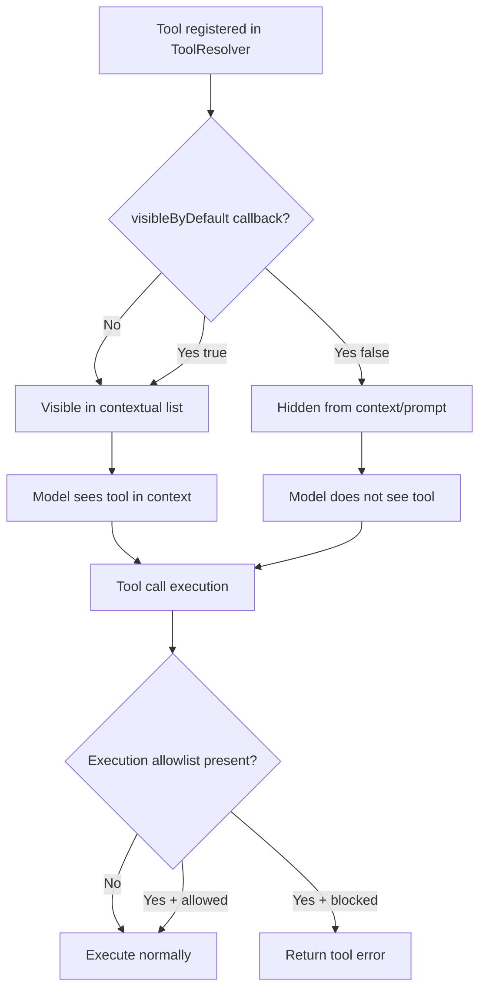
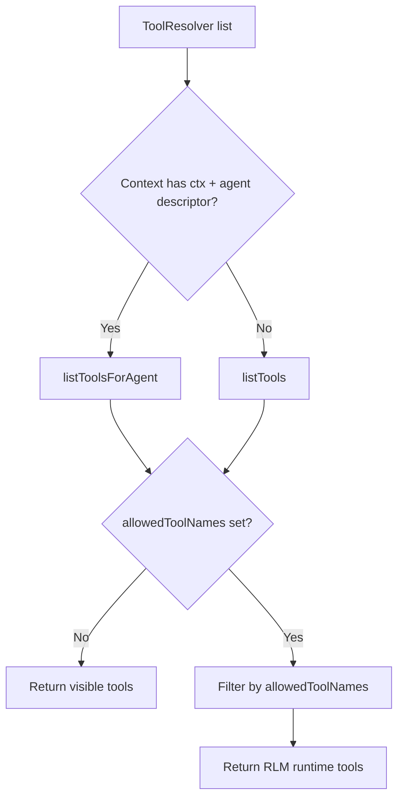

# Tool Filtering And Memory-Agent Whitelist

## Overview
- Introduce descriptor-aware tool visibility so each tool can declare whether it is visible by default for a given agent.
- Keep visibility filtering non-breaking: hidden tools are omitted from prompt/context tool lists, but remain executable unless explicitly blocked.
- Add a strict execution allowlist for `memory-agent` so non-whitelisted tools cannot run.
- Preserve full system prompt replacement behavior for specific agents (notably `memory-agent` and replacement-enabled system agents like `architect`).

## Context (from discovery)
- Tool listing is currently global via `ToolResolver.listTools()` in `packages/daycare/sources/engine/modules/toolResolver.ts`.
- Agent context tools are filtered in `packages/daycare/sources/engine/modules/tools/toolListContextBuild.ts`, but execution still accepts any registered tool name in `ToolResolver.execute()`.
- Prompt replacement is handled in `packages/daycare/sources/engine/agents/ops/agentSystemPrompt.ts` + `packages/daycare/sources/engine/agents/ops/agentPromptResolve.ts`.
- Memory-agent prompt is `packages/daycare/sources/prompts/memory/MEMORY_AGENT.md` and expects only `memory_node_read` / `memory_node_write`.
- No dedicated tests currently assert memory-agent prompt replacement end-to-end.

## Development Approach
- **Testing approach**: Regular (code first, then tests).
- Add small, focused API extensions rather than reworking agent/runtime architecture.
- Keep existing `listTools()` behavior for backwards compatibility; add contextual listing as a new method.
- Enforce execution allowlist only where explicitly required (`memory-agent`), not for general visibility filtering.
- Complete each task with tests and passing checks before moving on.

## Testing Strategy
- Unit tests for resolver visibility filtering and execution allowlist enforcement.
- Agent loop tests for memory-agent runtime enforcement (including attempted disallowed tool call).
- Prompt tests for replacement behavior (`memory-agent`, `architect`) and filtered no-tools prompt content.

## Progress Tracking
- Mark completed items with `[x]` immediately when done.
- Add newly discovered tasks with ➕ prefix.
- Document blockers with ⚠️ prefix.
- Keep this plan updated if implementation scope changes.
- ➕ Current `_systemAgents.ts` in this branch registers only `heartbeat`; architect replacement assertion is conditional.

## Implementation Steps

### Task 1: Add descriptor-aware default visibility metadata to tools
- [x] Add `ToolVisibilityContext` type in `packages/daycare/sources/engine/modules/tools/types.ts` with `{ userId, agentId, descriptor }`.
- [x] Add optional `visibleByDefault` callback to `ToolDefinition` in `packages/daycare/sources/engine/modules/tools/types.ts`.
- [x] Re-export any new shared type(s) via `packages/daycare/sources/types.ts`.
- [x] Ensure type changes remain backward compatible for existing tool builders.
- [x] write tests for type-driven usage via resolver behavior (default visible path).
- [x] run tests - must pass before next task.

### Task 2: Add contextual tool listing in ToolResolver (visibility-only filtering)
- [x] Add `listToolsForAgent(context)` to `packages/daycare/sources/engine/modules/toolResolver.ts` that applies `visibleByDefault` and defaults to visible when absent.
- [x] Keep `listTools()` behavior unchanged for internal callers that need full registry visibility.
- [x] Update `ToolResolverApi` type to expose contextual listing where needed.
- [x] Add tests in `packages/daycare/sources/engine/modules/toolResolver.spec.ts` for: default-visible tool, hidden-by-callback tool, per-descriptor behavior.
- [x] Verify hidden tools are omitted from list output but still executable through `execute()` in this path.
- [x] run tests - must pass before next task.

### Task 3: Wire contextual listing into agent tool context and prompt generation
- [x] Update `packages/daycare/sources/engine/agents/agent.ts` to use contextual listing (`userId`, `agentId`, `descriptor`) when building context tools.
- [x] Update `packages/daycare/sources/engine/agents/ops/agentSystemPromptContext.ts` and call sites to provide agent identity needed for contextual tool listing in prompt sections.
- [x] Update `packages/daycare/sources/engine/agents/ops/agentSystemPromptSectionToolCalling.ts` to use contextual listing for no-tools/RLM function docs.
- [x] Ensure no-tools prompt signatures match the same visible set shown to the agent context.
- [x] Add/extend tests in `packages/daycare/sources/engine/agents/ops/agentSystemPrompt.spec.ts` to verify filtered tool visibility in prompt content.
- [x] run tests - must pass before next task.

### Task 4: Add memory-agent execution whitelist (enforced)
- [x] Introduce a resolver/helper for execution allowlists by descriptor (e.g. `memory-agent` -> explicit names).
- [x] Extend execution context in `packages/daycare/sources/engine/modules/tools/types.ts` to carry optional allowed tool names.
- [x] Enforce allowlist in `packages/daycare/sources/engine/modules/toolResolver.ts::execute()` with a clear tool error when blocked.
- [x] Thread allowlist through all agent execution paths in `packages/daycare/sources/engine/agents/ops/agentLoopRun.ts` and `packages/daycare/sources/engine/agents/agent.ts` (direct tool calls + run_python path).
- [x] Add tests in `packages/daycare/sources/engine/modules/toolResolver.spec.ts` and `packages/daycare/sources/engine/agents/ops/agentLoopRun.spec.ts` proving non-whitelisted tools cannot execute for memory-agent.
- [x] run tests - must pass before next task.

### Task 5: Ensure proper full system prompt replacement for specific agents
- [x] Add regression test in `packages/daycare/sources/engine/agents/ops/agentPromptResolve.spec.ts` for `memory-agent` replacement metadata.
- [x] Add regression test in `packages/daycare/sources/engine/agents/ops/agentSystemPrompt.spec.ts` asserting memory-agent prompt equals bundled `memory/MEMORY_AGENT.md` (full replacement).
- [x] Verify replacement-enabled system agents (e.g. `architect`) still bypass section concatenation unchanged.
- [x] Confirm non-replacement agents still get section-based prompt composition.
- [x] run tests - must pass before next task.

### Task 6: Verify acceptance criteria
- [x] verify tools can declare descriptor-aware default visibility using `(userId, agentId, descriptor)` context.
- [x] verify visibility filtering hides tools from context/prompt but does not block execution for non-memory agents.
- [x] verify memory-agent execution is restricted to whitelist names only.
- [x] verify no-tools/RLM prompt function list matches filtered visibility output.
- [x] verify prompt replacement behavior is correct for memory-agent and replacement-enabled system agents.
- [x] run full test suite (unit tests).
- [x] run typecheck and lint - all issues must be fixed.

### Task 7: [Final] Update documentation
- [x] Add/update docs in `doc/` describing tool visibility policy vs execution policy.
- [x] Document memory-agent tool whitelist and rationale.
- [x] Include a Mermaid flow for: registration -> visibility listing -> execution guard.

## Technical Details

### Proposed visibility and execution policy flow

### Memory-agent allowlist (initial proposal)
- `memory_node_read`
- `memory_node_write`
- Optional when RLM path is active: `run_python`, `skip`

## Post-Completion
*Items requiring manual intervention or external systems - no checkboxes, informational only*

**Manual verification**:
- Validate a live memory-agent run against a transcript and confirm only whitelist tools can execute.
- Validate one non-memory agent can still execute a hidden-by-default tool when explicitly called.

**External system updates**:
- None expected.

## 2026-02-22 RLM Follow-Up
- Fixed a leak where RLM runtime preamble generation could include tools outside `allowedToolNames`.
- `rlmToolsForContextResolve()` now applies execution allowlist filtering after descriptor-aware visibility resolution.
- Added regression coverage in `packages/daycare/sources/engine/modules/rlm/rlmToolsForContextResolve.spec.ts`.

