# Docker Image Version Guard

## Overview
Add automatic detection and cleanup of stale Docker sandbox containers when the runtime image changes. Two triggers cause a container to be considered stale:

1. **Hardcoded version bump** — a `DOCKER_IMAGE_VERSION` constant in code is bumped manually (e.g. `"1"` → `"2"`). This version is stored as a Docker label on the container at creation time and compared on ensure.
2. **Image hash change** — the Docker image ID (sha256 digest) at container creation time is stored as a label and compared against the current image ID from the daemon.

When either trigger fires, the stale container is stopped and removed. It will be recreated lazily on the next exec call with the current image and labels.

Additionally, at server startup, all existing `daycare-sandbox-*` containers are scanned and stale ones are proactively removed.

## Context
- Container lifecycle: `dockerContainerEnsure.ts` creates/starts containers via dockerode
- Facade: `DockerContainers` class deduplicates concurrent ensure calls
- Config: `DockerSettings` in `settings.ts`, resolved in `configResolve.ts`
- Container naming: `dockerContainerNameBuild.ts` → `daycare-sandbox-<userId>`
- Singleton: `dockerContainersShared.ts` exports shared `DockerContainers` instance
- Server startup: `start.ts` → `Engine.start()` — sequential phase initialization
- Container inspect returns `Config.Labels` (map of string→string) and `Image` (sha256 ID)

## Development Approach
- **Testing approach**: Regular (code first, then tests)
- Complete each task fully before moving to the next
- Make small, focused changes
- **CRITICAL: every task MUST include new/updated tests**
- **CRITICAL: all tests must pass before starting next task**
- **CRITICAL: update this plan file when scope changes during implementation**

## Testing Strategy
- **Unit tests**: mock dockerode to verify label stamping, version comparison, image hash comparison, and stale container removal
- No e2e tests needed (Docker integration tests already exist separately)

## Progress Tracking
- Mark completed items with `[x]` immediately when done
- Add newly discovered tasks with ➕ prefix
- Document issues/blockers with ⚠️ prefix

## Implementation Steps

### Task 1: Add `dockerImageVersion.ts` constant and `dockerImageIdResolve.ts` helper
- [x] Create `dockerImageVersion.ts` exporting `DOCKER_IMAGE_VERSION = "1"` — a manually bumped string
- [x] Create `dockerImageIdResolve.ts` exporting `dockerImageIdResolve(docker, imageRef)` that calls `docker.getImage(imageRef).inspect()` and returns the `Id` (sha256 digest) string
- [x] Write tests for `dockerImageIdResolve` (mock dockerode `getImage().inspect()`)
- [x] Run tests — must pass before next task

### Task 2: Stamp labels on container creation in `dockerContainerEnsure.ts`
- [x] Import `DOCKER_IMAGE_VERSION` and `dockerImageIdResolve`
- [x] Before `docker.createContainer()`, resolve the current image ID via `dockerImageIdResolve`
- [x] Add `Labels` to the `createContainer` call with `daycare.image.version` and `daycare.image.id`
- [x] Update `DockerContainerConfig` or function signature if needed to pass the image ID through
- [x] Update existing tests in `dockerContainerEnsure.spec.ts` to account for the new labels and the `dockerImageIdResolve` call
- [x] Run tests — must pass before next task

### Task 3: Add stale detection and container replacement in `dockerContainerEnsure.ts`
- [x] After `existing.inspect()` succeeds, extract `Config.Labels` from the inspect result
- [x] Compare `daycare.image.version` label against `DOCKER_IMAGE_VERSION`
- [x] Compare `daycare.image.id` label against the current image ID (resolve it once per ensure call)
- [x] If either mismatches: log a warning, stop the container, remove it, then fall through to the creation path
- [x] If labels are missing (pre-guard container), treat as stale and recreate
- [x] Write tests: version mismatch triggers removal+recreation, image hash mismatch triggers removal+recreation, matching labels reuses container
- [x] Run tests — must pass before next task

### Task 4: Add startup scan `dockerContainersStaleRemove.ts`
- [x] Create `dockerContainersStaleRemove.ts` exporting `dockerContainersStaleRemove(docker, imageRef)`
- [x] List all containers with name filter `daycare-sandbox-` via `docker.listContainers({ all: true, filters: { name: ["daycare-sandbox-"] } })`
- [x] For each container, check labels `daycare.image.version` and `daycare.image.id` against current values
- [x] Stop and remove stale containers; log each removal
- [x] Skip containers that match (already up to date)
- [x] Write tests: mixed stale/current containers, only stale ones removed
- [x] Run tests — must pass before next task

### Task 5: Wire startup scan into `Engine.start()`
- [x] In `engine.ts` `start()` method, after initial setup but before agent system starts, call `dockerContainersStaleRemove` if docker is enabled
- [x] Resolve the Docker client from config (reuse pattern from `DockerContainers`)
- [x] Pass image ref (`${config.docker.image}:${config.docker.tag}`) to the scan
- [x] Wrap in try/catch — failure should log a warning but not block startup
- [x] Write test or verify manually that the call is made only when docker is enabled
- [x] Run tests — must pass before next task

### Task 6: Verify acceptance criteria
- [x] Verify: new container gets `daycare.image.version` and `daycare.image.id` labels
- [x] Verify: existing container with wrong version is stopped+removed and recreated
- [x] Verify: existing container with wrong image hash is stopped+removed and recreated
- [x] Verify: existing container with correct labels is reused as before
- [x] Verify: startup scan removes all stale `daycare-sandbox-*` containers
- [x] Verify: startup scan is skipped when docker is disabled
- [x] Run full test suite (`yarn test`)
- [x] Run linter (`yarn lint`)

### Task 7: Update documentation
- [x] Update `packages/daycare/sources/sandbox/docker/README.md` with image version guard explanation
- [x] Document `DOCKER_IMAGE_VERSION` bump process

⚠️ `yarn lint` currently reports pre-existing repository issues outside this task (examples: `sandbox.ts`, `sandboxPathHostToContainer.ts`, `dockerRunInSandbox.ts` formatting/import order). Targeted Biome checks for all touched files pass.

## Technical Details

### Labels stored on containers
```
daycare.image.version = "1"       # from DOCKER_IMAGE_VERSION constant
daycare.image.id      = "sha256:abc123..."  # from docker.getImage().inspect().Id
```

### Stale detection flow (per-container ensure)

```mermaid
flowchart TD
    A[container.inspect] --> B{exists?}
    B -- no --> G[create with labels]
    B -- yes --> C{labels present?}
    C -- no --> E[stop + remove]
    C -- yes --> D{version match AND image hash match?}
    D -- yes --> F[reuse container]
    D -- no --> E
    E --> G
```


### Startup scan flow


## Post-Completion

**Manual verification:**
- Build a new image, verify existing containers get replaced on next startup
- Bump `DOCKER_IMAGE_VERSION`, restart engine, verify containers get cleaned up
- Verify no disruption when containers are already up to date
