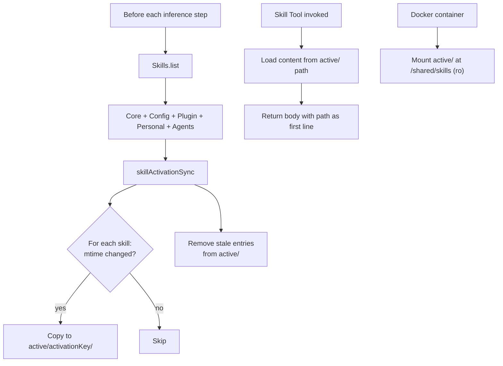
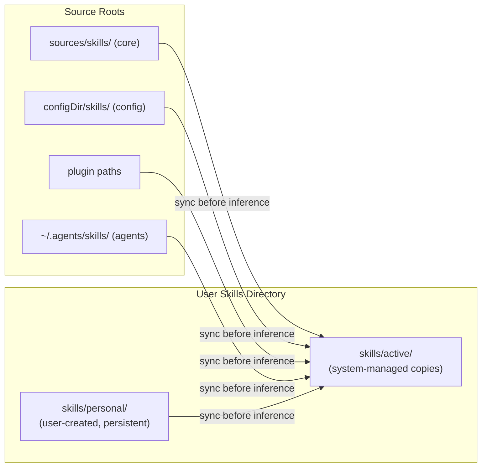

# Skill Activation Copy

## Overview
Implement a skill activation system that syncs all skills into a per-user `skills/active/` directory before each inference step. This makes skills available inside Docker containers via a single bind mount, while keeping user-created skills in a separate `skills/personal/` directory that is never overwritten.

**Problem:** Skills from core, config, plugin, and `~/.agents/skills` sources live on the host in scattered locations. Docker containers only mount `<user>/home` and cannot access these paths. Skills need to be available inside the sandbox at `/shared/skills`.

**Solution:**
1. Split user skills directory into `skills/active/` (system-managed copies) and `skills/personal/` (user-created, persistent)
2. Before each inference step, sync all skills into `skills/active/<activationKey>/` where `activationKey` is derived from `skill.id` (not `name`) to prevent path traversal and cross-source collisions
3. Use mtime comparison to skip copying unchanged skills (only copy when source is newer than target)
4. Remove stale entries from `active/` that no longer correspond to any listed skill
5. Remove the `path` field from `AgentSkill` type (path provided at invocation time as first line of content)
6. Add `~/.agents/skills/` as a new skill source (`"agents"`)
7. Mount `skills/active/` read-only at `/shared/skills` in Docker mode
8. Add `skills/active/` to read-only sandbox permissions

## Context
- **Skills facade:** `sources/engine/skills/skills.ts` — coordinates loading from core/config/user/plugin roots
- **Skill types:** `sources/engine/skills/skillTypes.ts` — `AgentSkill` has `path: string` and `source` union
- **Skill resolution:** `sources/engine/skills/skillResolve.ts` — parses frontmatter via `gray-matter`, builds skill record
- **Skill content loading:** `sources/engine/skills/skillContentLoad.ts` — strips frontmatter, returns body
- **Skill tool:** `sources/engine/modules/tools/skillToolBuild.ts` — invokes skills (embedded or sandbox mode)
- **User home:** `sources/engine/users/userHome.ts` — `skills` points to `<root>/skills`
- **User home ensure:** `sources/engine/users/userHomeEnsure.ts` — creates directory tree
- **Docker container:** `sources/sandbox/docker/dockerContainerEnsure.ts` — single bind mount `<user>/home -> /home`
- **Docker types:** `sources/sandbox/docker/dockerTypes.ts` — `DockerContainerConfig`
- **Permissions:** `sources/engine/permissions/permissionBuildUser.ts` — builds read/write dirs
- **Skill scanning:** `sources/engine/skills/skillListFromRoot.ts` — recursive walk, skips symlinks (uses `isDirectory()`/`isFile()`)
- **Agent loop:** `sources/engine/agents/ops/agentLoopRun.ts:155` — calls `skills.list()` before each inference
- **Skills constructed in:** `sources/engine/agents/agent.ts:421` and `sources/engine/agents/ops/agentSystemPromptSectionSkills.ts:22`
- **OS home path:** `sources/paths.ts` — uses `os.homedir()`

## Development Approach
- **Testing approach**: Regular (code first, then tests)
- Complete each task fully before moving to the next
- Make small, focused changes
- **CRITICAL: every task MUST include new/updated tests** for code changes in that task
- **CRITICAL: all tests must pass before starting next task**
- **CRITICAL: update this plan file when scope changes during implementation**
- Run tests after each change
- Maintain backward compatibility during migration

## Testing Strategy
- **Unit tests**: required for every task
- Test activation key derivation (all id formats, edge cases)
- Test path traversal prevention: skill with `name: "../pwn"` does not escape `activeRoot`
- Test cross-source collision: two skills with same `name` but different sources get distinct `active/` directories
- Test mtime-based skip logic (unchanged source not re-copied, newer source triggers copy)
- Test stale entry cleanup (removed skill's directory is deleted from `active/`)
- Test bulk sync (all skills copied on first run, incremental on subsequent runs)
- Test skill activation copy logic (success, overwrite, missing source)
- Test frontmatter validation for activation eligibility
- Test personal vs active directory separation
- Test `~/.agents/skills` listing
- Test Docker bind mount configuration changes

## Progress Tracking
- Mark completed items with `[x]` immediately when done
- Add newly discovered tasks with ➕ prefix
- Document issues/blockers with ⚠️ prefix
- Update plan if implementation deviates from original scope

## Architecture





## Implementation Steps

### Task 1: Add `agents` skill source and `~/.agents/skills` listing
- [x] Add `"agents"` to `SkillSource` union and `AgentSkill.source` in `skillTypes.ts`
- [x] Update `AgentSkill` re-export in `sources/types.ts` if needed
- [x] Create `skillListAgents.ts` that scans `~/.agents/skills/` using `skillListFromRoot` with `source: "agents"`
- [x] Add `agentsRoot` option to `Skills` constructor (default: `path.join(os.homedir(), ".agents", "skills")`)
- [x] Call `skillListAgents()` in `Skills.list()` alongside other sources
- [x] Update both `new Skills()` call sites (`agent.ts:421`, `agentSystemPromptSectionSkills.ts:22`) to pass `agentsRoot`
- [x] Write tests for `skillListAgents` (directory exists, directory missing, skills found)
- [x] Run tests — must pass before next task

### Task 2: Split user skills into `personal/` and `active/` directories
- [x] Update `UserHome` to expose `skillsPersonal` (`skills/personal`) and `skillsActive` (`skills/active`) paths
- [x] Update `userHomeEnsure.ts` to create both `skills/personal` and `skills/active` subdirectories
- [x] Change `skillListUser` calls to scan from `skills/personal` instead of `skills/` root (user-created skills live in personal)
- [x] Update `Skills` constructor to accept `userPersonalRoot` and `userActiveRoot` instead of `userRoot`
- [x] Update both `new Skills()` call sites to pass the new paths
- [x] Write tests for `userHomeEnsure` changes (both dirs created)
- [x] Write tests for `skillListUser` reading from `personal/` path
- [x] Run tests — must pass before next task

### Task 3: Implement activation key derivation and `skillActivationSync`
- [x] Create `skillActivationKeyBuild.ts` in `sources/engine/skills/` — derives a filesystem-safe activation key from `skill.id`
  - Transform `skill.id` (e.g. `core:scheduling`, `plugin:telegram/helper`, `user:my-skill`) into a safe path segment
  - Replace `:` and `/` with `--` (e.g. `core--scheduling`, `plugin--telegram--helper`)
  - Strip any characters not in `[a-zA-Z0-9._-]` to prevent path traversal
  - Reject empty results after sanitization
- [x] Create `skillActivationSync.ts` in `sources/engine/skills/`
- [x] Function signature: `skillActivationSync(skills: AgentSkill[], activeRoot: string): Promise<void>` — syncs all skills into `active/`
- [x] For each skill: derive `activationKey` via `skillActivationKeyBuild(skill.id)`
- [x] **mtime check**: compare source `SKILL.md` mtime with target `active/<activationKey>/SKILL.md` mtime — skip copy if target is newer or equal
- [x] Copy the entire skill directory (the parent of `SKILL.md`) into `active/<activationKey>/` when source is newer
- [x] Validate frontmatter before copying — only copy skills with valid frontmatter (`name` field must be present and non-empty string)
- [x] Verify the resolved copy target is still under `activeRoot` (defense-in-depth against traversal)
- [x] **Stale cleanup (critical)**: after syncing, read `active/` directory entries and remove any `activationKey` directories that don't correspond to a skill in the current list — this handles plugin unloads, deleted config skills, removed personal skills, etc.
- [x] Write tests for `skillActivationKeyBuild`:
  - `core:scheduling` → `core--scheduling`
  - `plugin:telegram/helper` → `plugin--telegram--helper`
  - `name: "../pwn"` does not escape activeRoot (traversal attempt)
  - Empty or whitespace-only id is rejected
- [x] Write tests for `skillActivationSync`:
  - Copies all skills on first run (empty active dir)
  - Skips unchanged skills (same mtime)
  - Re-copies when source mtime is newer
  - Removes stale entries no longer in skill list
  - Two skills with same `name` but different sources do not collide
- [x] Write tests for error cases (source missing, unreadable — should skip gracefully, not fail sync)
- [x] Run tests — must pass before next task

### Task 4: Integrate activation sync into inference loop and skill tool
- [x] Add `skillActivationSync` call in `Skills` facade (new method `syncToActive(activeRoot)` that calls `list()` then `skillActivationSync()`)
- [x] In `agentLoopRun.ts`, after `skills.list()` (line ~155), call `skills.syncToActive(activeRoot)` to sync all skills before inference
- [x] Pass `userHome.skillsActive` through to the agent loop context
- [x] In `skillToolBuild.ts`, load skill content from `active/<activationKey>/SKILL.md` instead of the source path
- [x] Prepend the active path as the first line of the skill content returned to the LLM (e.g., `Base directory for this skill: /shared/skills/<activationKey>\n\n`)
- [x] In Docker mode, use the container path (`/shared/skills/<activationKey>`) for the prepended path line
- [x] Optionally add a second line `Skill name: <skill.name>` for human/LLM readability
- [x] Update `ToolExecutionContext` type to include `skillsActiveRoot` if needed
- [x] Write tests for sync integration (sync called before inference, content loaded from active)
- [x] Write tests for path line prepending (host vs Docker, activation key in path)
- [x] Run tests — must pass before next task

### Task 5: Remove `path` from `AgentSkill` type
- [x] Remove `path: string` from `AgentSkill` type in `skillTypes.ts`
- [x] Add `sourcePath: string` as internal-only field (not exposed to LLM) for the activation copy to know where to copy from
- [x] Update `skillResolve.ts` to set `sourcePath` instead of `path`
- [x] Update all consumers of `AgentSkill.path`:
  - `skillToolBuild.ts` — use `sourcePath` for copy source, active path for content loading
  - `skillContentLoad.ts` — receives explicit path argument, no change needed
  - Any other references found via grep
- [x] Write tests for `skillResolve` returning `sourcePath`
- [x] Run tests — must pass before next task

### Task 6: Mount `skills/active/` in Docker at `/shared/skills`
- [x] Add `hostSkillsActiveDir` to `DockerContainerConfig` type
- [x] Update `dockerContainerEnsure.ts` to add a second bind mount: `${hostSkillsActiveDir}:/shared/skills:ro`
- [x] Pass `userHome.skillsActive` when creating the Docker container config
- [x] Update `sandboxPathHostToContainer` and `sandboxPathContainerToHost` to handle the `/shared/skills` mapping
- [x] Update `permissionBuildUser.ts` to add `skillsActive` to `readDirs`
- [x] Write tests for Docker bind mount configuration (two mounts present, ro flag)
- [x] Write tests for path translation with `/shared/skills`
- [x] Run tests — must pass before next task

### Task 7: Verify acceptance criteria
- [x] Verify all skill sources (core, config, plugin, agents, personal) are listed without host paths
- [x] Verify all skills are synced to `active/` before each inference step
- [x] Verify mtime check prevents unnecessary copies
- [x] Verify stale entries in `active/` are cleaned up when skills are removed
- [x] Verify Docker container has `/shared/skills` mounted read-only
- [x] Verify path prepended to skill content uses container path in Docker mode
- [x] Verify frontmatter validation prevents copying invalid skills
- [x] Verify personal skills are never overwritten by system copies
- [x] Run full test suite (unit tests)
- [x] Run linter — all issues must be fixed

### Task 8: [Final] Update documentation
- [x] Update `sources/engine/users/README.md` to document new `skills/active/` and `skills/personal/` structure
- [x] Update `sources/engine/skills/` README if present, or add one documenting activation flow
- [x] Update `sources/sandbox/docker/README.md` to document `/shared/skills` mount
- [x] Update `doc/PLUGINS.md` if skill registration documentation needs changes

## Technical Details

### Directory Structure (after change)
```
<configDir>/users/<userId>/
  skills/
    active/                        # System-managed: copies of invoked skills (all sources)
      core--scheduling/            # activationKey derived from skill.id "core:scheduling"
        SKILL.md
      plugin--telegram--helper/    # from skill.id "plugin:telegram/helper"
        SKILL.md
      user--my-skill/              # from skill.id "user:my-skill"
        SKILL.md
    personal/                      # User-created skills (persistent, never overwritten)
      my-skill/
        SKILL.md
```

### Skill Source Paths
| Source | Host Path | Scanned by |
|--------|-----------|------------|
| `core` | `<package>/sources/skills/` | `skillListCore` |
| `config` | `<configDir>/skills/` | `skillListConfig` |
| `plugin` | registered paths | `skillListRegistered` |
| `agents` | `~/.agents/skills/` | `skillListAgents` (new) |
| `user` | `<user>/skills/personal/` | `skillListUser` (updated) |

### Activation Key Derivation
The activation key is derived from `skill.id` (which is already unique per source):
- Replace `:` and `/` with `--`
- Strip any characters not in `[a-zA-Z0-9._-]`
- Examples: `core:scheduling` → `core--scheduling`, `plugin:telegram/helper` → `plugin--telegram--helper`

This prevents:
- **Path traversal**: malicious `name: "../pwn"` cannot escape `active/` because the key comes from `id`, not `name`
- **Cross-source collisions**: two skills named "helper" from different plugins get distinct keys (`plugin--foo--helper` vs `plugin--bar--helper`)

### Activation Sync Flow (before each inference)
1. `skills.list()` gathers all skills from all sources
2. `skillActivationSync(skills, activeRoot)` runs:
   a. For each skill, derive `activationKey` from `skill.id`
   b. Compare source `SKILL.md` mtime with `active/<activationKey>/SKILL.md` mtime
   c. If source is newer (or target missing): copy entire skill directory
   d. If source mtime <= target mtime: skip
   e. **Stale removal**: scan `active/` for directories whose activation key is not in the current skill set, `rm -rf` them (handles plugin unloads, deleted skills, etc.)
3. Skill tool loads content from `active/<activationKey>/SKILL.md`
4. Path prepended as first line: `Base directory for this skill: <path>`
   - Host mode: absolute host path to `active/<activationKey>`
   - Docker mode: `/shared/skills/<activationKey>`

### Frontmatter Validation for Activation
A skill is eligible for activation copy only if:
- The `SKILL.md` file exists and is readable
- Frontmatter parses successfully via `gray-matter`
- `name` field is present and is a non-empty string

### Docker Mount Configuration
```
Binds: [
  "${hostHomeDir}:/home",
  "${hostSkillsActiveDir}:/shared/skills:ro"
]
```

### AgentSkill Type Change
```typescript
// Before
export type AgentSkill = {
    id: string;
    name: string;
    description?: string | null;
    sandbox?: boolean;
    permissions?: string[];
    path: string;                    // removed
    source: "core" | "config" | "plugin" | "user";
    pluginId?: string;
};

// After
export type AgentSkill = {
    id: string;
    name: string;
    description?: string | null;
    sandbox?: boolean;
    permissions?: string[];
    sourcePath: string;              // internal-only: where to copy from
    source: "core" | "config" | "plugin" | "user" | "agents";
    pluginId?: string;
};
```

## Post-Completion
*Items requiring manual intervention or external systems*

**Manual verification:**
- Test with Docker enabled: verify `/shared/skills` is accessible read-only inside container
- Test `~/.agents/skills/` with real skill files on a development machine
- Verify existing user skills in `skills/` are migrated to `skills/personal/` (or document migration steps)

**Migration consideration:**
- Existing users may have skills directly in `<user>/skills/`. A migration step may be needed to move them to `skills/personal/`. This should be handled in `userHomeMigrate.ts`.
