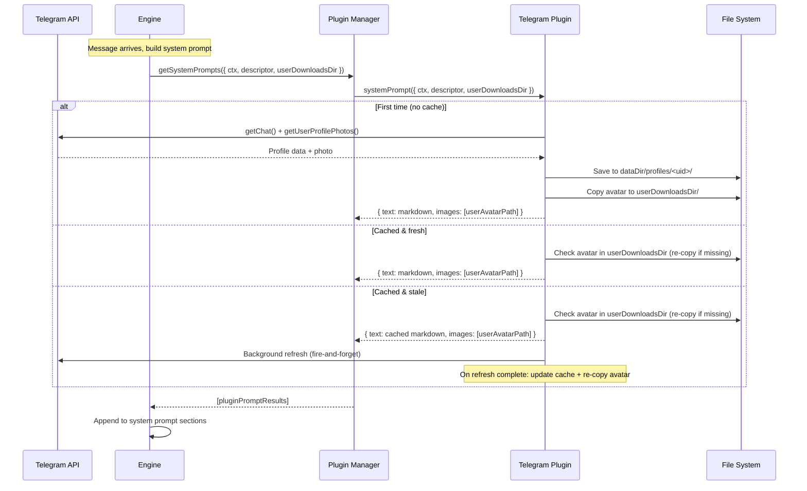

# Connector Profile Sync

## Overview
Fetch user profile information from connectors (starting with Telegram) and inject it into the agent's system prompt. Profile data is cached in the plugin's `dataDir` and refreshed lazily (once per hour). The first fetch for a user blocks prompt building; subsequent refreshes happen in the background.

Profiles include name, username, bio, phone, status, and a downloaded avatar image. The engine receives both markdown text and image paths from the plugin.

Avatar images are cached in the plugin's `dataDir` (master copy) and copied into the user's `downloads/` directory so the agent can reference them at a stable user-visible path. On each prompt build, the plugin checks if the user's copy exists; if missing or stale, it re-copies from the plugin cache. The image path in the result always points to the user's downloads copy.

## Context
- **Connector**: `sources/plugins/telegram/connector.ts` — has `TelegramBot` instance, receives `message.from` with basic user data
- **Plugin**: `sources/plugins/telegram/plugin.ts` — creates connector, has `dataDir` for persistent storage
- **System prompt**: `sources/engine/agents/ops/agentSystemPrompt.ts` — assembles sections, has `AgentSystemPromptContext` with `ctx` and `descriptor`
- **Plugin types**: `sources/engine/plugins/types.ts` — `PluginInstance.systemPrompt` is `(() => Promise<string | null>) | string | null` (no context, not wired in production)
- **Plugin manager**: `sources/engine/plugins/manager.ts` — `getSystemPrompts()` collects plugin prompts but is never called in production code
- **Agent prompt build**: `sources/engine/agents/agent.ts` lines 469-478 — builds system prompt with `descriptor` and `ctx` available
- **User home**: `sources/engine/users/userHome.ts` — `UserHome` has `downloads` path at `usersDir/<userId>/home/downloads/`

## Development Approach
- **Testing approach**: Regular (code first, then tests)
- Complete each task fully before moving to the next
- Make small, focused changes
- **CRITICAL: every task MUST include new/updated tests**
- **CRITICAL: all tests must pass before starting next task**

## Progress Tracking
- Mark completed items with `[x]` immediately when done
- Add newly discovered tasks with ➕ prefix
- Document issues/blockers with ⚠️ prefix

## Implementation Steps

### Task 1: Evolve `PluginInstance.systemPrompt` to accept context

Add a structured context argument and a structured return type so plugins can return per-user prompts with image paths.

**New types in `sources/engine/plugins/types.ts`:**
```typescript
export type PluginSystemPromptContext = {
    ctx: Context;
    descriptor?: AgentDescriptor;
    userDownloadsDir?: string; // absolute path to user's downloads folder
};

export type PluginSystemPromptResult = {
    text: string;
    images?: string[]; // absolute paths to image files
};
```

**Evolve `systemPrompt`:**
```typescript
systemPrompt?: ((context: PluginSystemPromptContext) => Promise<string | PluginSystemPromptResult | null>) | string | null;
```

- [x] Add `PluginSystemPromptContext` and `PluginSystemPromptResult` types to `sources/engine/plugins/types.ts`
- [x] Update `systemPrompt` field type on `PluginInstance` to accept the new context parameter
- [x] Update `getSystemPrompts()` in `sources/engine/plugins/manager.ts` to accept `PluginSystemPromptContext` and return `PluginSystemPromptResult[]` (normalize string returns into `{ text }`)
- [x] Export new types from `sources/types.ts`
- [x] Write tests for `getSystemPrompts` with string, function, and structured returns
- [x] Run tests — must pass before next task

### Task 2: Wire plugin system prompts into the agent prompt builder

`getSystemPrompts()` exists but is never called. Wire it into the system prompt assembly so plugins actually contribute to the prompt.

- [x] In `sources/engine/agents/agent.ts` (around line 469), call `pluginManager.getSystemPrompts({ ctx, descriptor, userDownloadsDir: this.userHome.downloads })` and pass results into `agentSystemPrompt`
- [x] Extend `AgentSystemPromptContext` in `sources/engine/agents/ops/agentSystemPromptContext.ts` to accept plugin prompt results (text sections + image paths)
- [x] Add a new section renderer `agentSystemPromptSectionPlugins.ts` that concatenates plugin prompt texts
- [x] Register the new section in `agentSystemPrompt.ts` alongside existing sections
- [x] Surface image paths on the context so the caller can attach them as multimodal content (store on a field, do not embed in text)
- [x] Write tests for the new section renderer
- [x] Update existing `agentSystemPrompt.spec.ts` tests if needed
- [x] Run tests — must pass before next task

### Task 3: Implement Telegram profile fetching

Create the profile fetch logic using the `TelegramBot` API. Uses `getChat()` for bio/photo metadata and `getUserProfilePhotos()` + `getFile()` for avatar download.

- [x] Create `sources/plugins/telegram/profileFetch.ts` with `profileFetch(bot: TelegramBot, telegramUserId: string, downloadDir: string): Promise<TelegramProfile>`
- [x] `TelegramProfile` type: `{ telegramUserId: string; firstName: string; lastName?: string; username?: string; bio?: string; phone?: string; avatarPath?: string; fetchedAt: number }`
- [x] Use `bot.getChat(telegramUserId)` to get name, username, bio
- [x] Use `bot.getUserProfilePhotos(telegramUserId, { limit: 1 })` to get latest avatar
- [x] If avatar exists, use `bot.downloadFile(fileId, downloadDir)` to save it
- [x] Handle errors gracefully (API failures should not crash message processing)
- [x] Write tests for `profileFetch` (mock bot API calls, success + error cases)
- [x] Run tests — must pass before next task

### Task 4: Implement profile caching

Cache profiles as JSON files in `dataDir/profiles/<telegramUserId>/profile.json` with avatar alongside. Support freshness checking (1hr TTL).

- [x] Create `sources/plugins/telegram/profileCache.ts` with:
  - `profileCacheRead(profileDir: string): Promise<TelegramProfile | null>` — reads cached profile, returns null if missing
  - `profileCacheWrite(profileDir: string, profile: TelegramProfile): Promise<void>` — writes profile JSON
  - `profileCacheFresh(profile: TelegramProfile, ttlMs: number): boolean` — checks if `fetchedAt + ttlMs > Date.now()`
  - `profileCacheDir(dataDir: string, telegramUserId: string): string` — returns `dataDir/profiles/<telegramUserId>`
- [x] Write tests for all cache functions (read/write roundtrip, freshness check, missing cache)
- [x] Run tests — must pass before next task

### Task 5: Implement profile markdown rendering

Render a `TelegramProfile` into a markdown string for the system prompt. Accepts an optional `userAvatarPath` (the copy in the user's downloads) to include in the result's `images` array.

- [x] Create `sources/plugins/telegram/profileRender.ts` with `profileRender(profile: TelegramProfile, userAvatarPath?: string): PluginSystemPromptResult`
- [x] Render markdown with available fields (name, username, bio, phone)
- [x] If `userAvatarPath` is provided, include it in `images` array and reference it in the markdown text (e.g., `Profile photo: <path>`)
- [x] Write tests for rendering (all fields present, optional fields missing, avatar present/absent)
- [x] Run tests — must pass before next task

### Task 6: Implement avatar-to-downloads copy logic

Copy the cached avatar from `dataDir/profiles/<telegramUserId>/avatar.jpg` to the user's downloads directory. On each prompt build, check if the copy exists; if missing, re-copy.

- [x] Create `sources/plugins/telegram/profileAvatarEnsure.ts` with `profileAvatarEnsure(cachedAvatarPath: string, userDownloadsDir: string, telegramUserId: string): Promise<string | null>`
- [x] Stable target filename: `profile-telegram-<telegramUserId>.jpg` in `userDownloadsDir`
- [x] If target exists and source hasn't changed (compare mtime or size) → return target path (no copy)
- [x] If target missing or stale → copy from cached source → return target path
- [x] If source doesn't exist → return null
- [x] Write tests for all cases (copy needed, already exists, source missing)
- [x] Run tests — must pass before next task

### Task 7: Integrate profile sync into the Telegram plugin

Wire everything together in the plugin. On `systemPrompt(context)` call:
1. Check if descriptor is a Telegram user
2. Look up cached profile; if missing, block and fetch
3. If cached but stale, return cached and trigger background refresh
4. Copy avatar to user downloads (if not already there)
5. Return rendered profile markdown with user-downloads avatar path

- [x] In `sources/plugins/telegram/plugin.ts`, add `systemPrompt` callback to the returned `PluginInstance`
- [x] Maintain in-memory `Map<string, TelegramProfile>` for fast lookups (populated from disk cache on first access)
- [x] On `systemPrompt({ ctx, descriptor, userDownloadsDir })`:
  - If `descriptor.type !== "user" || descriptor.connector !== "telegram"` → return null
  - Resolve `telegramUserId` from `descriptor.userId`
  - Check in-memory cache → disk cache → fetch (blocking if first time)
  - If stale, trigger `void profileFetch(...)` in background (fire-and-forget with error logging)
  - Call `profileAvatarEnsure(cachedAvatarPath, userDownloadsDir, telegramUserId)` to ensure user has a copy
  - Return `profileRender(profile, userAvatarPath)`
- [x] Expose bot instance from connector to plugin (or pass bot reference during construction)
- [x] Write tests for the plugin's systemPrompt integration (mock bot, verify blocking vs lazy behavior, verify avatar copy)
- [x] Run tests — must pass before next task

### Task 8: Verify acceptance criteria
- [x] Verify profile markdown appears in system prompt for Telegram users
- [x] Verify first fetch blocks, subsequent fetches are lazy
- [x] Verify cache persists across restarts (read from disk on startup)
- [x] Verify profile images are downloaded to plugin cache and copied to user downloads
- [x] Verify avatar path in result points to user's downloads copy
- [x] Verify avatar is re-copied if missing from downloads
- [x] Verify non-Telegram descriptors get null (no profile)
- [x] Run full test suite (unit tests)
- [x] Run linter — all issues must be fixed

### Task 9: [Final] Update documentation
- [x] Update `sources/plugins/telegram/README.md` with profile sync details
- [x] Update `doc/PLUGINS.md` if `systemPrompt` API changes need documenting

## Technical Details

### Data flow


### Cache structure
```
data/plugins/<instanceId>/
  profiles/
    <telegramUserId>/
      profile.json    # { telegramUserId, firstName, lastName?, username?, bio?, phone?, avatarPath?, fetchedAt }
      avatar.jpg      # downloaded profile photo (master copy)

usersDir/<userId>/home/downloads/
  profile-telegram-<telegramUserId>.jpg   # user-visible copy of the avatar
```

### Profile TTL
- Default: 3,600,000ms (1 hour)
- First fetch: blocking (synchronous with prompt building)
- Subsequent: lazy background refresh when stale

### Avatar copy logic
- Master copy lives in `dataDir/profiles/<telegramUserId>/avatar.jpg`
- User copy at `userDownloadsDir/profile-telegram-<telegramUserId>.jpg`
- On each `systemPrompt` call: check if user copy exists → if not, copy from master
- On background refresh: if avatar changed, overwrite master → re-copy to user downloads
- Image paths in the `PluginSystemPromptResult.images` always point to the user's downloads copy

### Markdown output example
```markdown
## User Profile (Telegram)
- **Name**: John Doe
- **Username**: @johndoe
- **Bio**: Software developer
- **Phone**: +1234567890
- **Profile photo**: /path/to/usersDir/<userId>/home/downloads/profile-telegram-12345678.jpg
```

## Post-Completion

**Future extensions:**
- WhatsApp profile fetching (same pattern, different API)
- Profile data used for user memory initialization
- Admin dashboard showing cached profiles
