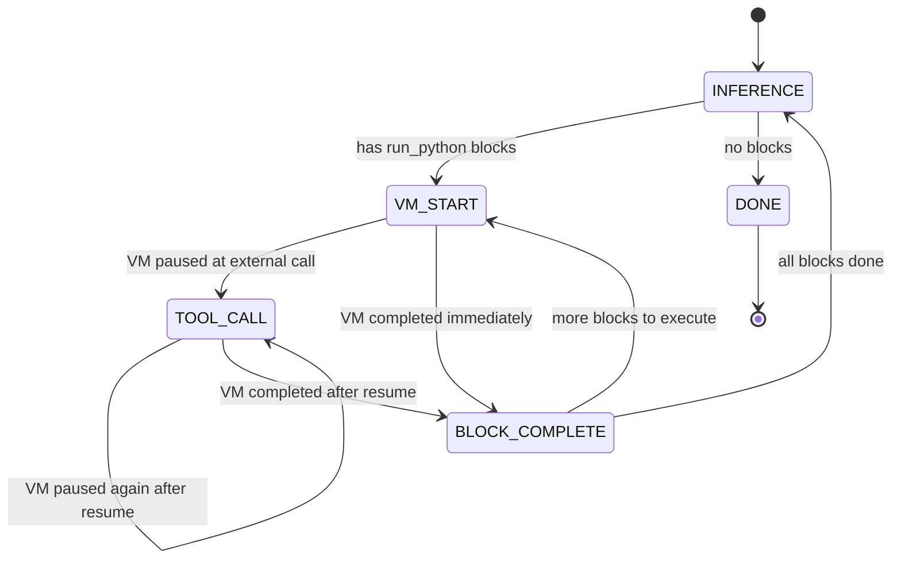

# Flatten Agent Loop to VM Steps

## Overview
Unify the two nested execution loops (outer inference loop in `agentLoopRun.ts` + inner Monty VM loop in `rlmExecute.ts`) into a single flat step-by-step loop where each iteration performs exactly one atomic operation: an inference call, a VM start/resume, or a tool call execution.

**Problem:** Currently the agent loop runs a composite iteration (full inference + all python block executions with all their tool calls inside). This creates two levels of recovery: the outer loop has no step-by-step recovery, and the inner RLM loop has its own snapshot-based recovery. On crash, there are gaps (e.g., crash after inference but before python execution loses the inference result).

**End result:**
- A single flat loop processes one step per iteration
- Every step is tracked in history records, enabling precise restore from any crash point
- On restore: if process crashed after inference but before python execution, re-parse the recorded assistant message and proceed; if crashed mid-VM, restore from snapshot; if crashed mid-tool, resume VM with error (unchanged behavior)
- `rlmExecute` is decomposed into step primitives that the flat loop drives
- The `rlmRestore` function becomes unnecessary — restore is just the flat loop resuming from persisted state

## Context
- **Outer loop:** `engine/agents/ops/agentLoopRun.ts` — composite iterations (inference + all python blocks + all tool calls)
- **Inner loop:** `engine/modules/rlm/rlmExecute.ts` — VM step loop (start → tool call → resume → complete)
- **Restore:** `engine/modules/rlm/rlmRestore.ts` — restores VM from snapshot on crash
- **Pending detection:** `engine/agents/ops/agentHistoryPendingRlmResolve.ts` — finds incomplete RLM executions
- **History context:** `engine/agents/ops/agentHistoryContext.ts` — rebuilds context from history
- **Agent restore:** `agent.ts` `completePendingToolCalls()` (line 1037) — runs RLM restore on startup
- **History types:** `engine/agents/ops/agentTypes.ts` — `AgentHistoryRecord` union
- **RLM checkpointing plan:** `docs/plans/rlm-checkpointing.md` — existing checkpoint records (`rlm_start`, `rlm_tool_call`, `rlm_tool_result`, `rlm_complete`)

## Development Approach
- **Testing approach**: Regular (code first, then tests)
- Complete each task fully before moving to the next
- Make small, focused changes
- **CRITICAL: every task MUST include new/updated tests**
- **CRITICAL: all tests must pass before starting next task**
- **CRITICAL: update this plan file when scope changes during implementation**

## Progress Tracking
- Mark completed items with `[x]` immediately when done
- Add newly discovered tasks with ➕ prefix
- Document issues/blockers with ⚠️ prefix

## Architecture

### Current: Two Nested Loops

```
agentLoopRun (outer loop):
  for iteration in 0..MAX:
    ├── inference call (LLM)
    ├── extract <run_python> blocks
    ├── for each block:
    │     └── rlmExecute (inner loop):
    │           ├── monty.start()
    │           ├── while snapshot:
    │           │     ├── dump snapshot
    │           │     ├── execute tool
    │           │     └── resume VM
    │           └── return result
    ├── push result message
    └── continue / break
```

### Target: Single Flat Step Loop

```
agentLoopStep (flat loop):
  while step !== DONE:
    match step:
      INFERENCE →
        call LLM, record assistant_message
        extract <run_python> blocks
        if blocks → step = VM_START(blocks[0])
        else → step = DONE

      VM_START(code) →
        monty.start(code)
        record rlm_start
        if snapshot → step = TOOL_CALL(snapshot)
        if complete → step = BLOCK_COMPLETE

      TOOL_CALL(snapshot) →
        dump snapshot, record rlm_tool_call
        execute tool
        record rlm_tool_result
        resume VM from snapshot
        if snapshot → step = TOOL_CALL(snapshot)
        if complete → step = BLOCK_COMPLETE

      BLOCK_COMPLETE →
        record rlm_complete
        push <python_result> message
        if more blocks → step = VM_START(next block)
        else → step = INFERENCE (continue outer loop)

      DONE → break
```

### Restore Logic

On startup, scan history to determine where the loop was:

1. **Last record is `assistant_message` with `<run_python>` blocks, no `rlm_start` following:**
   Crash happened after inference, before python execution.
   → Re-parse the assistant message text, extract blocks, start at `VM_START(blocks[0])`.

2. **`rlm_start` exists without `rlm_complete`:**
   Crash happened during VM execution.
   - If `rlm_tool_call` exists (snapshot available): resume VM from snapshot with `RuntimeError("Process was restarted")`
   - If no `rlm_tool_call`: record `rlm_complete` with error "Process was restarted before any tool call"

3. **Everything complete:** No restore needed.

### Step Primitives (from decomposed `rlmExecute`)

```typescript
// Start a new Monty VM execution
rlmStepStart(code, preamble, externalFunctions) → MontySnapshot | MontyComplete

// Execute a single tool call from a paused VM
rlmStepToolCall(snapshot, toolResolver, context) → { toolResult, resumeOptions }

// Resume VM after a tool call
rlmStepResume(snapshotDump, resumeOptions) → MontySnapshot | MontyComplete
```

These are pure step functions — no loops, no history management. The flat loop owns orchestration and history recording.



## Implementation Steps

### Task 1: Define step types and flat loop state

- [x] Create `engine/agents/ops/agentLoopStepTypes.ts` with discriminated union for loop phases:
  - `InferencePhase` — about to call LLM
  - `VmStartPhase` — about to start Monty VM with code block
  - `ToolCallPhase` — VM paused, about to execute tool
  - `BlockCompletePhase` — VM finished, about to push result
  - `DonePhase` — loop complete
- [x] Include all data needed for each phase (code, snapshot, block index, blocks list, tool name, etc.)
- [x] Write tests for type discrimination (compile-time checks via `expectTypeOf` or runtime narrowing)
- [x] Run tests — must pass before next task

### Task 2: Extract step primitives from `rlmExecute`

- [x] Create `engine/modules/rlm/rlmStepStart.ts`:
  - Takes code, preamble, external function names, limits, print callback
  - Creates Monty instance, calls `monty.start()`
  - Returns `{ progress: MontySnapshot | MontyComplete, monty: Monty }` — no loop, no history
- [x] Create `engine/modules/rlm/rlmStepToolCall.ts`:
  - Takes `MontySnapshot`, tool resolver, context, allowed tools map
  - Dumps snapshot, converts args, executes tool, converts result
  - Returns `{ snapshotDump, toolName, toolArgs, toolResult, toolIsError, resumeOptions }`
  - Does NOT resume VM (that's a separate step)
- [x] Create `engine/modules/rlm/rlmStepResume.ts`:
  - Takes `snapshotDump` (Uint8Array) and resume options (returnValue or exception)
  - Loads snapshot, resumes, returns `MontySnapshot | MontyComplete`
  - This is essentially the existing `snapshotResumeWithDurationReset`
- [x] Extract shared helpers from `rlmExecute.ts` that both the old and new code need:
  - `rlmPreambleNormalize` (the existing `preambleRuntimeNormalize`)
  - `rlmPrintCapture` helpers (create, append, flush)
  - `rlmValueFormat` (the existing `valueFormat`)
- [x] Write tests for each step primitive in isolation
- [x] Run tests — must pass before next task

### Task 3: Rewrite `agentLoopRun` as a flat step loop

- [x] Refactor `agentLoopRun.ts` to use a state machine instead of nested loops:
  - Replace the inner `for (block of runPythonCodes)` + `rlmExecute()` with step-by-step processing
  - Each iteration of the outer `for` loop handles exactly one phase transition
  - Phase transitions: `INFERENCE → VM_START → TOOL_CALL → ... → BLOCK_COMPLETE → INFERENCE → ... → DONE`
- [x] Move say-block handling, history recording, token tracking into appropriate phases
- [x] The inference phase handles: LLM call, response parsing, say blocks, assistant_message history
- [x] The VM_START phase handles: `rlmStepStart`, `rlm_start` history record
- [x] The TOOL_CALL phase handles: `rlmStepToolCall`, `rlm_tool_call` + `rlm_tool_result` history records, steering check, `rlmStepResume`
- [x] The BLOCK_COMPLETE phase handles: `rlm_complete` history record, push result message, advance to next block or back to inference
- [x] Preserve all existing behavior: child agent nudging, skip detection, steering interrupts, token stats, NO_MESSAGE, max iterations
- [x] Write tests for the flat loop (mock inference + tool execution, verify phase transitions)
- [x] Run tests — must pass before next task

### Task 4: Update restore logic for the flat loop

- [x] Create `engine/agents/ops/agentLoopPendingPhaseResolve.ts`:
  - Scans history records to determine which phase the loop was in when it crashed
  - Case 1: last `assistant_message` has `<run_python>` blocks but no subsequent `rlm_start` → return `VmStartPhase` with re-extracted blocks
  - Case 2: `rlm_start` without `rlm_complete` + has `rlm_tool_call` snapshot → return `ToolCallPhase` with snapshot
  - Case 3: `rlm_start` without `rlm_complete` + no snapshot → return error info
  - Case 4: everything complete → return null (no restore needed)
- [x] Update `completePendingToolCalls` in `agent.ts` to use the new phase resolver
- [x] For Case 1 (post-inference crash): re-extract `<run_python>` blocks from the recorded assistant message, rebuild context messages from history (including the assistant message), then resume the flat loop starting at `VM_START`
- [x] For Case 2 (mid-VM crash): same as today — restore from snapshot, resume VM with error
- [x] Remove the now-unnecessary `rlmRestore.ts` (its functionality is subsumed by the flat loop + step primitives)
- [x] Remove `agentHistoryPendingRlmResolve.ts` (replaced by `agentLoopPendingPhaseResolve.ts`)
- [x] Write tests for all restore scenarios
- [x] Run tests — must pass before next task

### Task 5: Clean up old code

- [x] Remove the old `rlmExecute` loop body (keep only the step primitives and shared helpers)
- [x] Or: if `rlmExecute` is still used by `handleSystemMessage` for executable prompts, keep it but refactor it to use the step primitives internally
- [x] Verify `handleSystemMessage` and `executablePromptExpand` still work (they call `rlmExecute` directly for cron/heartbeat code execution)
- [x] Remove duplicated helper functions (print capture, value format, snapshot encode) — use shared versions
- [x] Run tests — must pass before next task

### Task 6: Verify acceptance criteria

- [x] Verify: each iteration of the flat loop performs exactly one atomic operation
- [x] Verify: inference result is recoverable from history on restore
- [x] Verify: crash after inference but before python execution → restore re-parses assistant message and proceeds
- [x] Verify: crash during VM tool call → restore from snapshot with RuntimeError
- [x] Verify: crash before any tool call → error recorded
- [x] Verify: all existing behavior preserved (say blocks, child agent nudging, skip, steering, NO_MESSAGE, token stats)
- [x] Verify: `handleSystemMessage` executable prompts still work
- [x] Run full test suite (`yarn test`)
- [x] Run typecheck (`yarn typecheck`)
- [x] Run linter (`yarn lint`)

### Task 7: Update documentation

- [x] Update `doc/internals/engine-agent.md` with flat loop architecture
- [x] Update `doc/internals/rlm-checkpointing.md` with new restore flow
- [x] Add mermaid diagram showing the flat state machine
- [x] Update RLM module `README.md`

## Technical Details

### Phase State Type

```typescript
type AgentLoopPhase =
    | { type: "inference" }
    | { type: "vm_start"; blocks: string[]; blockIndex: number; preamble: string; toolCallId: string }
    | { type: "tool_call"; snapshot: MontySnapshot; snapshotDump: Uint8Array; blocks: string[]; blockIndex: number; preamble: string; toolCallId: string; printOutput: string[]; toolCallCount: number }
    | { type: "block_complete"; blocks: string[]; blockIndex: number; result: RlmExecuteResult; toolCallId: string }
    | { type: "done" };
```

### History Record Reuse

The existing history record types (`rlm_start`, `rlm_tool_call`, `rlm_tool_result`, `rlm_complete`, `assistant_message`) are sufficient. No new record types needed — the flat loop just records the same events in the same order, but now the loop structure makes each step explicit and recoverable.

### Executable Prompts Compatibility

`handleSystemMessage` calls `rlmExecute` directly for cron/heartbeat code. Two options:
1. **Keep `rlmExecute` as a convenience wrapper** that internally uses the step primitives — simple, no change to callers
2. **Refactor callers** to use step primitives directly — more consistent but unnecessary complexity

Recommend option 1: keep `rlmExecute` as a wrapper around the step primitives for non-agent-loop callers.

## Post-Completion

**Manual verification:**
- Start the agent, send a message that triggers multi-tool python execution
- Kill the process mid-execution at various points:
  - After inference, before python starts
  - During a tool call
  - Between tool calls
- Restart and verify recovery at each crash point
- Verify that cron/heartbeat executable prompts still work correctly
