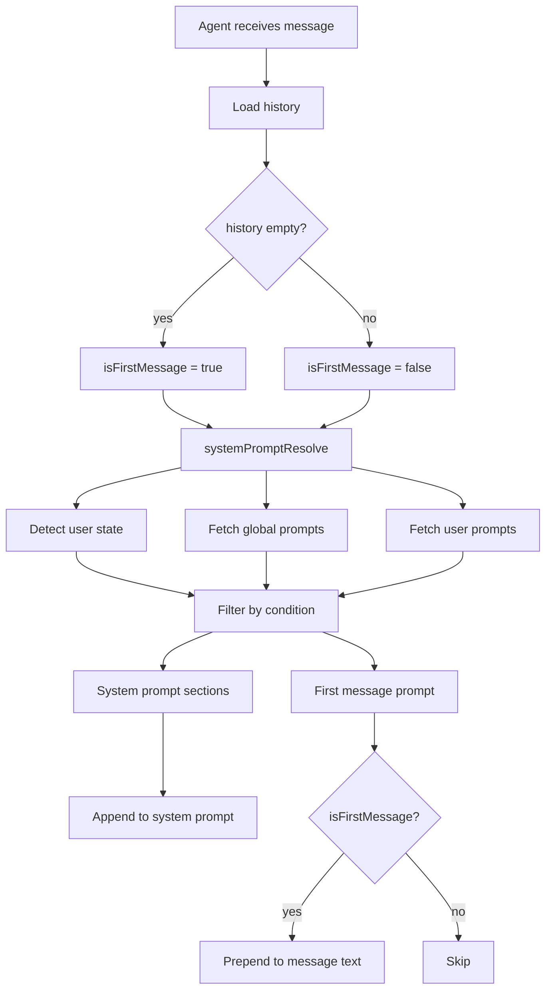

# System Prompts & User State Detection

## Overview
Add the ability to configure system prompts that are dynamically appended based on scope (global vs per-user) and user state (new/returning). Prompts are stored in SQLite, managed via dashboard API, and edited through a new dashboard UI page. Also adds a "first message" prompt that gets prepended to the user's first-ever message text.

**Four prompt types:**
1. **Global system prompt** — appended to system prompt for all users
2. **Per-user system prompt** — appended to system prompt for a specific userId
3. **First message prompt** — prepended to user's first message text (with a flag in history for reconstruction)
4. **User state detection** — classify users as `new_user` or `returning_user`; prompts can be conditionally included based on state

## Context
- System prompt is built in `agentSystemPrompt.ts` by concatenating 10 sections
- Plugin system prompts exist (`PluginManager.getSystemPrompts()`) but are never called in production
- User messages are built in `messageBuildUser.ts` — simple text/files construction
- History records are JSON-serialized via `historyRepository.ts` with spread `...data` on parse
- Dashboard API is Fastify on Unix socket (`server.ts`); dashboard is Next.js (`packages/daycare-dashboard`)
- Settings currently file-based; this feature uses SQLite for prompt storage (as per user request)

## Development Approach
- **Testing approach**: Regular (code first, then tests)
- Complete each task fully before moving to the next
- Make small, focused changes
- **CRITICAL: every task MUST include new/updated tests**
- **CRITICAL: all tests must pass before starting next task**
- Run tests after each change
- Maintain backward compatibility

## Progress Tracking
- Mark completed items with `[x]` immediately when done
- Add newly discovered tasks with ➕ prefix
- Document issues/blockers with ⚠️ prefix

## Implementation Steps

### Task 1: Add `system_prompts` database table and repository
- [x] Create migration `20260224_add_system_prompts.ts` with table:
  ```sql
  CREATE TABLE IF NOT EXISTS system_prompts (
    id TEXT PRIMARY KEY,
    scope TEXT NOT NULL,          -- 'global' | 'user'
    user_id TEXT,                 -- NULL for global, userId for per-user
    kind TEXT NOT NULL,           -- 'system' | 'first_message'
    condition TEXT,               -- NULL (always) | 'new_user' | 'returning_user'
    prompt TEXT NOT NULL,
    enabled INTEGER NOT NULL DEFAULT 1,
    created_at INTEGER NOT NULL,
    updated_at INTEGER NOT NULL
  );
  CREATE INDEX IF NOT EXISTS idx_system_prompts_scope ON system_prompts(scope);
  CREATE INDEX IF NOT EXISTS idx_system_prompts_user_id ON system_prompts(user_id);
  ```
- [x] Register migration in `_migrations.ts`
- [x] Create `sources/storage/systemPromptsRepository.ts` following existing repository pattern (write-through cache, AsyncLock)
  - `findById(id): SystemPromptDbRecord | null`
  - `findMany(): SystemPromptDbRecord[]`
  - `findByScope(scope, userId?): SystemPromptDbRecord[]`
  - `create(record): void`
  - `updateById(id, updates): void`
  - `deleteById(id): void`
- [x] Define `SystemPromptDbRecord` type in `databaseTypes.ts`
- [x] Add `systemPrompts: SystemPromptsRepository` to `Storage` facade
- [x] Write migration spec `20260224_add_system_prompts.spec.ts`
- [x] Write repository spec `systemPromptsRepository.spec.ts`
- [x] Run tests — must pass before task 2

### Task 2: Add user state detection
- [x] Create `sources/engine/agents/ops/userStateDetect.ts`:
  ```typescript
  export type UserState = "new_user" | "returning_user" | "active_user";
  export async function userStateDetect(storage: Storage, userId: string): Promise<UserState>
  ```
  - **new_user**: user `createdAt` is less than 7 days ago AND has no compacted sessions (sessions where `invalidatedAt` is set)
  - **returning_user**: user has at least one session AND the most recent session's last history record `at` is more than 3 days ago
  - **active_user**: everything else (neither new nor returning)
- [x] Write `userStateDetect.spec.ts` with cases:
  - Brand new user (no sessions) → `new_user`
  - User < 7 days old, no compaction → `new_user`
  - User > 7 days old, no compaction → `active_user`
  - User hasn't talked for > 3 days → `returning_user`
  - User talked recently → `active_user`
- [x] Run tests — must pass before task 3

### Task 3: Resolve applicable system prompts for an agent
- [x] Create `sources/engine/agents/ops/systemPromptResolve.ts`:
  ```typescript
  export type ResolvedSystemPrompts = {
      systemPromptSections: string[];     // Prompts to append to system prompt
      firstMessagePrompt: string | null;  // Prompt to prepend to first user message
  };
  export async function systemPromptResolve(
      storage: Storage,
      userId: string,
      isFirstMessage: boolean
  ): Promise<ResolvedSystemPrompts>
  ```
  - Fetches all enabled prompts (global + per-user for this userId)
  - Detects user state via `userStateDetect`
  - Filters by condition (null condition = always apply; `new_user`/`returning_user` = match state)
  - Separates `kind: "system"` (→ systemPromptSections) from `kind: "first_message"` (→ firstMessagePrompt, only if isFirstMessage)
  - Concatenates multiple first_message prompts with newline
- [x] Write `systemPromptResolve.spec.ts`:
  - Global prompt with no condition → always included
  - Per-user prompt → only for matching userId
  - Conditional prompt → only when user state matches
  - First message prompt → only when isFirstMessage is true
  - Disabled prompts → excluded
- [x] Run tests — must pass before task 4

### Task 4: Integrate system prompts into the agent prompt pipeline
- [x] In `agentSystemPrompt.ts`: accept optional `extraSections: string[]` in context, append them after the standard sections
- [x] Update `AgentSystemPromptContext` to add `extraSections?: string[]`
- [x] In `agent.ts` `handleMessage()`:
  - Determine `isFirstMessage` from `history.length === 0`
  - Call `systemPromptResolve(storage, userId, isFirstMessage)`
  - Pass `extraSections` to `agentSystemPrompt()`
  - If `firstMessagePrompt` is non-null, prepend it to the user message text in `entry.message.text`
  - When recording the `user_message` history record, add a `firstMessagePrepended: true` flag so the original text can be reconstructed
- [x] Update `AgentHistoryRecord` `user_message` variant to include optional `firstMessagePrepended?: boolean` and `firstMessagePrompt?: string`
- [x] Update `agentSystemPrompt.spec.ts` to verify extra sections are appended
- [x] Write integration test for first message prepend behavior
- [x] Run tests — must pass before task 5

### Task 5: Add dashboard API endpoints for system prompts CRUD
- [x] Add to `server.ts`:
  - `GET /v1/engine/system-prompts` → list all prompts
  - `GET /v1/engine/system-prompts/:id` → get single prompt
  - `POST /v1/engine/system-prompts` → create prompt (body: scope, userId, kind, condition, prompt, enabled)
  - `PUT /v1/engine/system-prompts/:id` → update prompt
  - `DELETE /v1/engine/system-prompts/:id` → delete prompt
- [x] Add Zod schemas for request validation
- [x] Enrich `GET /v1/engine/users` to include `nametag` in response for user selection in UI
- [x] Write API endpoint tests
- [x] Run tests — must pass before task 6

### Task 6: Add dashboard UI for system prompts
- [x] Add `fetchSystemPrompts`, `createSystemPrompt`, `updateSystemPrompt`, `deleteSystemPrompt` to `engine-client.ts`
- [x] Create `packages/daycare-dashboard/app/prompts/page.tsx`:
  - List all system prompts with scope, kind, condition, enabled status
  - Create/edit form with fields: scope (global/user), userId (dropdown from users list), kind (system/first_message), condition (always/new_user/returning_user), prompt (textarea), enabled (toggle)
  - Delete with confirmation
- [x] Add navigation link to prompts page in dashboard layout
- [x] Run build — must pass before task 7

### Task 7: Verify acceptance criteria
- [x] Verify global system prompt appended for all users
- [x] Verify per-user system prompt appended only for target user
- [x] Verify first message prompt prepended to first message text
- [x] Verify history records flag first message prepend correctly
- [x] Verify user state detection (new_user, returning_user, active_user)
- [x] Verify conditional prompts only apply when user state matches
- [x] Run full test suite (unit tests)
- [x] Run linter — all issues must be fixed

### Task 8: [Final] Update documentation
- [x] Update `doc/` with system prompts documentation
- [x] Add mermaid diagram showing prompt resolution flow

## Technical Details

### Data Model
```
system_prompts table:
  id: TEXT (CUID2)
  scope: 'global' | 'user'
  user_id: TEXT | NULL
  kind: 'system' | 'first_message'
  condition: NULL | 'new_user' | 'returning_user'
  prompt: TEXT
  enabled: INTEGER (0/1)
  created_at: INTEGER (unix ms)
  updated_at: INTEGER (unix ms)
```

### User State Detection Logic
```
new_user:
  - createdAt < 7 days ago
  - AND no sessions with invalidatedAt set (no compaction yet)

returning_user:
  - has sessions
  - AND last activity > 3 days ago

active_user:
  - everything else
```

### Prompt Resolution Flow


### History Record Extension
The `user_message` history record gains two optional fields:
```typescript
{
    type: "user_message";
    at: number;
    text: string;            // Contains the prepended text
    files: FileReference[];
    firstMessagePrepended?: boolean;   // Flag for reconstruction
    firstMessagePrompt?: string;       // The prompt that was prepended
}
```
These fields are stored in the JSON `data` column and automatically picked up by the existing `historyParse()` spread pattern.

## Post-Completion
- Manual testing via dashboard UI: create global prompt, verify it appears in LLM system prompt
- Manual testing: create per-user prompt, verify scope isolation
- Manual testing: send first message to bot, verify first message prompt prepend
- Manual testing: verify user state transitions work correctly over time
