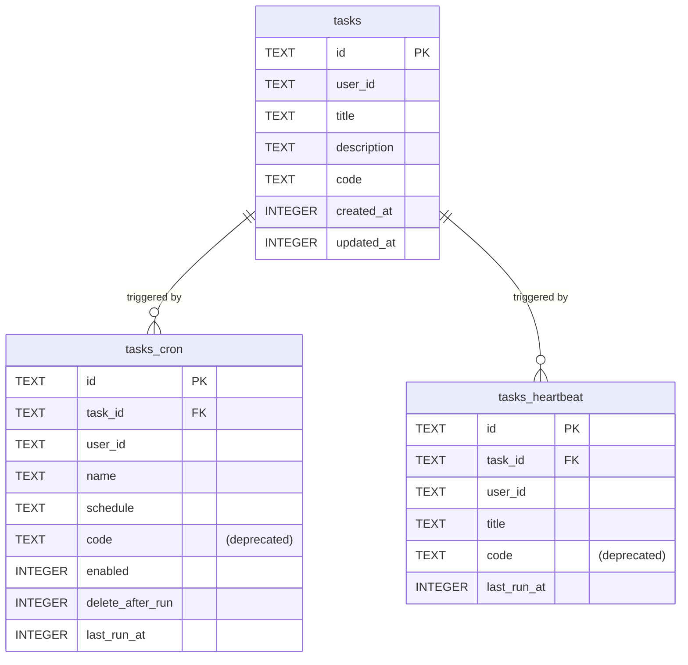
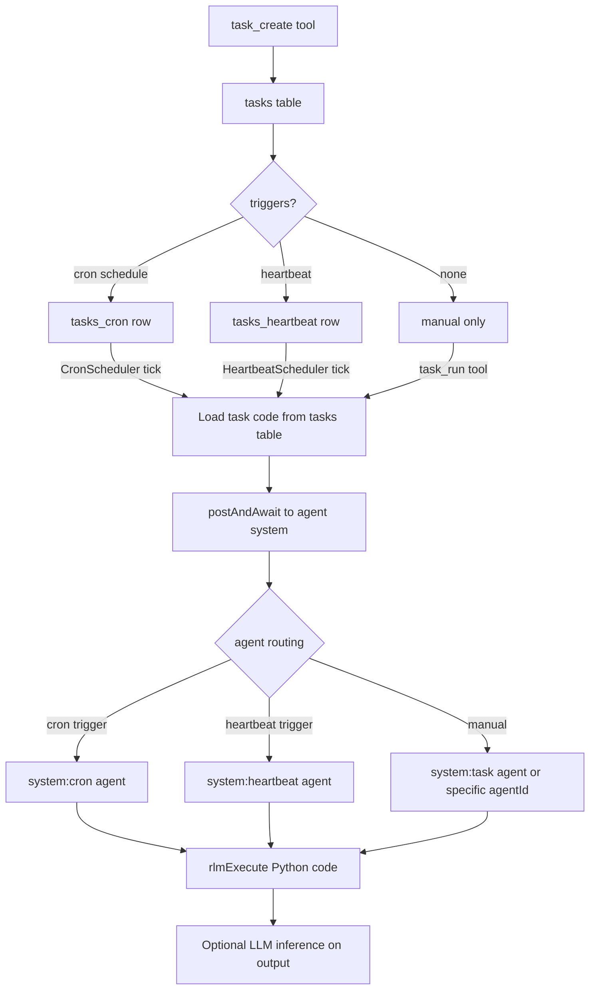

# Unified Tasks

## Overview

Replace the separate heartbeat/cron Python code storage with a unified **Task** abstraction. A Task is a standalone entity: Python code snippet + metadata (title, description). Triggers (cron schedules, heartbeat intervals, manual invocation) are separate and reference tasks.

**What changes:**
- New `tasks` table stores Python code and metadata
- Existing `tasks_cron` and `tasks_heartbeat` tables gain a `task_id` FK, stop storing `code` directly
- `task_id` is required at runtime; triggers without valid `task_id` are rejected
- New tools: `task_create`, `task_read`, `task_update`, `task_delete`, `task_run`, `task_trigger_add`, `task_trigger_remove`
- Old tools (`cron_add`, `cron_read_task`, `cron_delete_task`, `heartbeat_add`, `heartbeat_remove`, `heartbeat_run`) removed

**Agent routing (by trigger type):**
- Cron trigger fires → routes to `system:cron` agent
- Heartbeat trigger fires → routes to `system:heartbeat` agent (batched per user, same as today)
- Manual `task_run` → routes to a task-specific agent (descriptor: `{ type: "system", tag: "task" }` per user, or `{ agentId }` if one is provided)

**Key outcomes:**
- A single task can be triggered by cron AND heartbeat AND manually
- Code lives in one place (tasks table), triggers just reference it
- The same execution flow (Monty/RLM Python → optional LLM inference) is preserved

## Context
- **Cron facade**: `engine/cron/crons.ts` — `Crons` class, `CronScheduler`
- **Heartbeat facade**: `engine/heartbeat/heartbeats.ts` — `Heartbeats` class, `HeartbeatScheduler`
- **DB types**: `storage/databaseTypes.ts` — `CronTaskDbRecord`, `HeartbeatTaskDbRecord`
- **Repositories**: `storage/cronTasksRepository.ts`, `storage/heartbeatTasksRepository.ts`
- **Tool defs**: `engine/modules/tools/task.ts`
- **Engine wiring**: `engine/engine.ts` lines 314–384 — instantiation and tool registration
- **Agent system**: `engine/agents/agentSystem.ts` — `postAndAwait`
- **Python execution**: `engine/modules/rlm/rlmExecute.ts` — Monty interpreter

## Development Approach
- **Testing approach**: Regular (code first, then tests)
- Complete each task fully before moving to the next
- Make small, focused changes
- **CRITICAL: every task MUST include new/updated tests**
- **CRITICAL: all tests must pass before starting next task**
- **CRITICAL: update this plan file when scope changes during implementation**

## Progress Tracking
- Mark completed items with `[x]` immediately when done
- Add newly discovered tasks with ➕ prefix
- Document issues/blockers with ⚠️ prefix
- ➕ Updated scheduling prompt/skill docs to reference unified task tools (removed cron/heartbeat tool names)

## Implementation Steps

### Task 1: Add `tasks` table and `TasksRepository`

- [x] Add `DatabaseTaskRow` and `TaskDbRecord` to `storage/databaseTypes.ts`
  - Columns: `id TEXT PK`, `user_id TEXT NOT NULL`, `title TEXT NOT NULL`, `description TEXT`, `code TEXT NOT NULL`, `created_at INTEGER NOT NULL`, `updated_at INTEGER NOT NULL`
- [x] Create `storage/tasksRepository.ts` following existing repository pattern (write-through cache, `AsyncLock`)
  - Methods: `findById`, `findMany(ctx)`, `findAll`, `create`, `update`, `delete`
- [x] Create migration `storage/migrations/20260224_add_tasks_table.ts`
  - `CREATE TABLE tasks (...)`
  - `ALTER TABLE tasks_cron ADD COLUMN task_id TEXT REFERENCES tasks(id)`
  - `ALTER TABLE tasks_heartbeat ADD COLUMN task_id TEXT REFERENCES tasks(id)`
- [x] Register migration in `storage/migrations/_migrations.ts`
- [x] Wire `TasksRepository` into `Storage` facade
- [x] Write tests for `TasksRepository` CRUD in `storage/tasksRepository.spec.ts`
- [x] Run tests — must pass before next task

### Task 2: Remove unified-task backfill and enforce strict trigger links

- [x] Remove migration `storage/migrations/20260224_backfill_tasks.ts`
- [x] Remove backfill migration registration and tests
- [x] Enforce required `task_id` in repositories/schedulers
- [x] Run tests — must pass before next task

### Task 3: Update `CronScheduler` and `Crons` facade to load code from tasks table

- [x] Update `CronScheduler` to accept `TasksRepository` alongside `CronTasksRepository`
- [x] When executing a task: load code from `tasks` table via required `task_id` (no fallback)
- [x] Update `CronTaskContext` to include the `taskId` (the unified task id, not the cron trigger id)
- [x] Update `Crons` facade `addTask` to: create a task record first, then create the cron trigger linked to it
- [x] Update `Crons` facade `deleteTask` to: delete the cron trigger; if the task has no other triggers (no heartbeat reference), delete the task record too
- [x] Update tests for `CronScheduler` and `Crons` facade
- [x] Run tests — must pass before next task

### Task 4: Update `HeartbeatScheduler` and `Heartbeats` facade to load code from tasks table

- [x] Update `HeartbeatScheduler` to accept `TasksRepository`
- [x] When building batch: load code from linked `tasks` record via `task_id`
- [x] Update `Heartbeats` facade `addTask` to: create a task record first, then create the heartbeat trigger linked to it
- [x] Update `Heartbeats` facade `removeTask` to: delete the heartbeat trigger; if task has no other triggers, delete task record too
- [x] Update tests for `HeartbeatScheduler` and `Heartbeats` facade
- [x] Run tests — must pass before next task

### Task 5: Create unified task tools (`task_create`, `task_read`, `task_update`, `task_delete`, `task_run`)

- [x] Create `engine/modules/tools/task.ts`
- [x] `task_create` tool: creates a task record + optional triggers (cron schedule and/or heartbeat flag) in one call
  - Parameters: `title`, `code`, `description?`, `cronSchedule?`, `heartbeat?` (boolean), `agentId?`
  - Creates task in `tasks` table
  - If `cronSchedule` provided: creates cron trigger in `tasks_cron` linked to the task
  - If `heartbeat` true: creates heartbeat trigger in `tasks_heartbeat` linked to the task
- [x] `task_read` tool: reads a task by id, includes linked triggers
- [x] `task_update` tool: updates an existing task's fields (title, code, description)
  - Parameters: `taskId`, `title?`, `code?`, `description?`
  - Updates only provided fields in the `tasks` table
- [x] `task_delete` tool: deletes a task and all its triggers
- [x] `task_run` tool: manually execute a task immediately
  - Loads the task, posts to agent system with `system:task` descriptor (or provided `agentId`)
  - Same `{ type: "system_message", code, execute: true }` pattern
- [x] Write tests for each tool's execute function
- [x] Run tests — must pass before next task

### Task 6: Create `task_trigger_add` and `task_trigger_remove` tools

- [x] `task_trigger_add` tool: adds a cron or heartbeat trigger to an existing task
  - Parameters: `taskId`, `type` ("cron" | "heartbeat"), `schedule?` (required for cron)
- [x] `task_trigger_remove` tool: removes a trigger from a task
  - Parameters: `taskId`, `type` ("cron" | "heartbeat")
- [x] Write tests for trigger add/remove
- [x] Run tests — must pass before next task

### Task 7: Remove old cron/heartbeat tools, wire new tools in engine

- [x] Remove `buildCronTool`, `buildCronReadTaskTool`, `buildCronDeleteTaskTool` from `engine/modules/tools/cron.ts` (or delete the file if empty)
- [x] Remove `buildHeartbeatAddTool`, `buildHeartbeatRemoveTool` from `engine/modules/tools/heartbeat.ts`
  - Keep `buildHeartbeatRunTool` only if we want to preserve direct heartbeat batch run (or replace with `task_run`)
- [x] Update `engine.ts` tool registration: replace old tool registrations with new task tools
- [x] Update any references to old tools in agent system or elsewhere
- [x] Run tests — must pass before next task

### Task 8: Verify acceptance criteria

- [x] Verify tasks persist in SQLite (create, read, update, delete)
- [x] Verify cron triggers reference tasks and fire correctly
- [x] Verify heartbeat triggers reference tasks and fire correctly (batched)
- [x] Verify manual `task_run` executes a task
- [x] Verify a single task can have both cron and heartbeat triggers
- [x] Verify strict task link enforcement for trigger execution
- [x] Run full test suite (`yarn test`)
- [x] Run linter (`yarn lint`)
- [x] Run typecheck (`yarn typecheck`)

### Task 9: [Final] Update documentation

- [x] Update `engine/cron/README.md` to reflect trigger-only role
- [x] Update `engine/heartbeat/README.md` to reflect trigger-only role
- [x] Add `doc/concepts/tasks.md` documenting the unified task model
- [x] Add `doc/internals/tasks.md` with technical details

## Technical Details

### New Schema

```sql
CREATE TABLE tasks (
    id TEXT PRIMARY KEY,
    user_id TEXT NOT NULL,
    title TEXT NOT NULL,
    description TEXT,
    code TEXT NOT NULL,
    created_at INTEGER NOT NULL,
    updated_at INTEGER NOT NULL
);
```

### Modified `tasks_cron` (add column)

```sql
ALTER TABLE tasks_cron ADD COLUMN task_id TEXT REFERENCES tasks(id);
```

`task_id` is required for runtime execution. Trigger `code` columns are retained only for storage compatibility.

### Modified `tasks_heartbeat` (add column)

```sql
ALTER TABLE tasks_heartbeat ADD COLUMN task_id TEXT REFERENCES tasks(id);
```

`task_id` is required for runtime execution. Trigger `code` columns are retained only for storage compatibility.

### Data Model



### Execution Flow



## Post-Completion

**Manual verification:**
- Create a task with both cron and heartbeat triggers, verify both fire
- Manually run a task via `task_run`, verify it executes
- Verify triggers with missing or invalid `task_id` fail fast with clear errors
- Test deleting a task removes all its triggers
