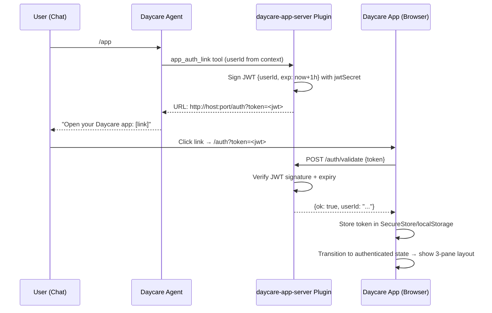

# Daycare App Scaffold

## End Result Summary

When this work is done, the user will have:

1. **A new `packages/daycare-app` Expo project** — full React Native app (iOS/Android/Web) that reuses Happy List's UI component library and Material Design 3 theming system.

2. **A magic link authentication flow** — the bot exposes a `/app` slash command. When a user sends `/app`, the agent generates a short-lived JWT token mapped to their daycare `userId`, and responds with a clickable URL like `https://host:port/auth?token=<jwt>`. The app reads the token from the URL, validates it against the backend, stores it, and transitions to the authenticated state. No onboarding flow — token auth is the only entry point.

3. **A mostly-empty 3-pane app shell** — once authenticated, the user sees:
   - **Top navigation bar**: a segmented control (matching Happy List's `AppHeader` pattern) with tabs like "Agents", "Chat", "Settings" (placeholder, non-functional)
   - **Left pane**: navigation sidebar listing the placeholder items
   - **Middle pane**: main content area (empty placeholder)
   - **Right pane**: contextual sidebar (empty placeholder)
   - Responsive: 3 panes on wide screens (`xl` breakpoint), 2 panes + drawer on `lg`, single pane on mobile

4. **A new `daycare-app-server` plugin** — Fastify HTTP server (like the dashboard plugin pattern) that:
   - Serves the Expo web build as static files
   - Provides auth API endpoints (`POST /auth/token` to validate/exchange tokens, `POST /auth/refresh`)
   - Proxies `/api/*` requests to the engine IPC socket (same pattern as dashboard)

5. **A new agent tool** — `app_auth_link` tool that agents can call to generate a magic link URL for the current user, returning it in a chat-friendly message.

**Verification:**
- `yarn web` in `packages/daycare-app` launches the Expo dev server showing the 3-pane layout
- The plugin starts an HTTP server on its configured port and serves the app
- The `/app` slash command generates a valid token URL
- Clicking the URL auto-authenticates and shows the app shell
- The app works on iOS/Android/Web (web is primary for now)

## Context

**Happy List UI components to copy:**
- `sources/components/Item.tsx` — Material Design 3 list item
- `sources/components/ItemList.tsx` — ScrollView wrapper
- `sources/components/ItemGroup.tsx` — Item grouping container
- `sources/components/Header.tsx` — Custom header with gradient
- `sources/components/Avatar.tsx` + `AvatarBrutalist.tsx` — User avatars
- `sources/components/SegmentedControl.tsx` — Segmented control
- `sources/components/Drawer.tsx` — Drawer component
- `sources/components/alert.tsx` — Custom alert/modal provider
- `sources/components/layout/TreePanelLayout.tsx` — Responsive 3-pane layout
- `sources/components/layout/TreePanelLayoutWide.tsx` — Wide variant
- `sources/components/layout/TreePanelLayoutSemiWide.tsx` — Semi-wide variant
- `sources/components/layout/SinglePanelLayout.tsx` — Centered panel (for auth screen)
- `sources/-tasks/HomeView.tsx` — `AppHeader` component (segmented control navigation)
- `sources/theme.ts` — Unistyles theme configuration
- `sources/themes/bg_2.json` — Material Design 3 color palette
- `sources/themes/types.ts` — Theme type definitions
- `sources/unistyles.ts` — Unistyles setup
- `sources/theme.css` — CSS variables for web
- `sources/utils/responsive.ts` — Responsive helpers and breakpoints

**Daycare patterns to follow:**
- Dashboard plugin pattern (`sources/plugins/dashboard/`) for HTTP server, static serving, API proxy
- UsersRepository for userId lookup
- `contextForUser()` for user-scoped context
- Plugin registration via `definePlugin()` + `plugin.json`
- Zod for settings schema
- No JWT library exists yet — need to add `jose` (ESM-native JWT library)

**Key architectural decisions:**
- Copy UI components (not shared package) to allow independent evolution
- Plugin-based HTTP server (not standalone service) — follows existing dashboard pattern
- JWT tokens for stateless auth — short-lived (1 hour), no refresh tokens initially
- Expo Router for file-based routing in the app
- Same Material Design 3 theme as Happy List (rebrand later)

## Development Approach
- **Testing approach**: Regular (code first, then tests)
- Complete each task fully before moving to the next
- Make small, focused changes
- **CRITICAL: every task MUST include new/updated tests** for code changes in that task
- **CRITICAL: all tests must pass before starting next task**
- **CRITICAL: update this plan file when scope changes during implementation**
- Run tests after each change
- Maintain backward compatibility

## Testing Strategy
- **Unit tests**: required for every task (vitest, `*.spec.ts` files next to source)
- **No e2e tests** initially — manual browser/app verification for UI
- Token generation/validation must have thorough unit tests
- Plugin load/unload lifecycle doesn't need tests (follows proven dashboard pattern)

## Progress Tracking
- Mark completed items with `[x]` immediately when done
- Add newly discovered tasks with + prefix
- Document issues/blockers with ! prefix
- Update plan if implementation deviates from original scope
- + Implemented plugin HTTP routing with `node:http` instead of Fastify to match existing dashboard proxy/streaming patterns.
- + Root auth guard uses route redirect effects instead of `Stack.Protected` to avoid Expo Router version coupling.

## Implementation Steps

### Task 1: Initialize Expo project in packages/daycare-app with latest dependencies
- [x] Create `packages/daycare-app/` directory with Expo SDK 54 template (React Native 0.81+)
- [x] Configure `package.json` with name `daycare-app`, scripts: `start`, `web`, `ios`, `android`, `typecheck`, `test`
- [x] Configure `tsconfig.json` extending `expo/tsconfig.base` with `@/*` path alias pointing to `sources/`
- [x] Configure `app.config.js` with web bundler `metro`, output `single`, scheme `daycare`
- [x] Configure `babel.config.js` with `babel-preset-expo` and `react-native-unistyles/plugin`
- [x] Add dependencies at **latest stable versions** (not pinned to Happy List's versions): `expo`, `react-native`, `react`, `react-dom`, `react-native-web`, `react-native-unistyles`, `expo-router`, `@expo/vector-icons`, `react-native-safe-area-context`, `react-native-screens`, `expo-secure-store`, `zustand`
- [x] Add dev dependencies at latest: `typescript`, `vitest`, `@types/react`
- [x] Create `sources/config.ts` with app configuration (API base URL placeholder)
- [x] Verify `yarn web` starts the Expo dev server without errors
- [x] Run tests — must pass before next task

### Task 2: Copy and adapt UI components from Happy List
- [x] Copy `sources/themes/` directory (bg_2.json color palette, types.ts)
- [x] Copy and adapt `sources/theme.ts` — Unistyles theme config with elevation levels, margins, breakpoints
- [x] Copy `sources/unistyles.ts` — Unistyles setup with light/dark themes and breakpoints (xs/sm/md/lg/xl)
- [x] Copy `sources/theme.css` — CSS variables and base styles for web
- [x] Copy `sources/utils/responsive.ts` — responsive helpers, breakpoint detection
- [x] Copy `sources/components/Item.tsx` — MD3 list item (title, subtitle, icon, chevron)
- [x] Copy `sources/components/ItemList.tsx` — ScrollView wrapper with inset grouped styling
- [x] Copy `sources/components/ItemGroup.tsx` — Item grouping container
- [x] Copy `sources/components/SegmentedControl.tsx` — Segmented control buttons
- [x] Copy `sources/components/alert.tsx` — Custom alert/modal provider
- [x] Copy `sources/components/layout/TreePanelLayout.tsx` — Responsive 3-pane layout entry
- [x] Copy `sources/components/layout/TreePanelLayoutWide.tsx` — 3-panel for xl breakpoint
- [x] Copy `sources/components/layout/TreePanelLayoutSemiWide.tsx` — 2-panel + drawer layout
- [x] Copy `sources/components/layout/SinglePanelLayout.tsx` — Centered panel for auth
- [x] Remove Happy List-specific imports/logic (AppController, sync engine, task-specific hooks)
- [x] Fix all TypeScript import paths to use `@/` prefix within daycare-app
- [x] Fix any breaking changes from upgraded dependencies (newer Unistyles, Expo Router, React Native Web APIs)
- [x] Verify components compile with `yarn typecheck`
- [x] Run tests — must pass before next task

### Task 3: Build the AppHeader with segmented control navigation
- [x] Create `sources/components/AppHeader.tsx` — adapted from Happy List's `HomeView.tsx` AppHeader
- [x] Header shows: left = app logo + "Daycare" text, center = segmented control, right = user avatar/placeholder
- [x] Segmented control has 3 tabs: "Agents" (icon: `device-desktop`), "Chat" (icon: `comment-discussion`), "Settings" (icon: `gear`)
- [x] Tab selection callback: `onModeChange(mode: 'agents' | 'chat' | 'settings')`
- [x] Style matches Happy List: pill-shaped container, `surfaceContainerHighest` background, 40px height, centered horizontally
- [x] Active tab: `surfaceContainer` background + `onSurface` text color; Inactive: `onSurfaceVariant` text
- [x] Safe area insets handling via `react-native-safe-area-context`
- [x] Write test for AppHeader rendering with mode switching callback
- [x] Run tests — must pass before next task

### Task 4: Build the main app layout with 3-pane shell
- [x] Create `sources/app/_layout.tsx` — root layout with providers: SafeAreaProvider, UnistylesProvider, AlertProvider, GestureHandlerRootView
- [x] Create `sources/app/+html.tsx` — web HTML entry with viewport meta, disable body scrolling, background color CSS
- [x] Create `sources/app/(app)/_layout.tsx` — authenticated app layout (Stack navigator)
- [x] Create `sources/app/(app)/index.tsx` — main screen with `AppHeader` + mode-based content switching
- [x] Create `sources/views/AgentsView.tsx` — placeholder left panel (list of placeholder items using `ItemList` + `Item`)
- [x] Create `sources/views/ChatView.tsx` — placeholder middle panel (empty state with "Select an agent" message)
- [x] Create `sources/views/SettingsView.tsx` — placeholder content (a few `Item` entries: "Account", "Appearance", "About")
- [x] Wire `TreePanelLayout` in the main screen: left = navigation items per mode, middle = content placeholder, right = contextual placeholder
- [x] Left pane for "Agents" mode: `ItemList` with 3 placeholder agent items (icon + name)
- [x] Left pane for "Chat" mode: `ItemList` with placeholder conversation list
- [x] Left pane for "Settings" mode: `ItemList` with settings categories
- [x] Middle and right panes show empty placeholder states (centered text: "Select an item")
- [ ] Verify responsive behavior: 3 panes on xl, 2 panes on lg, single pane on mobile
- [x] Run tests — must pass before next task

### Task 5: Add JWT token utilities to daycare engine
- [x] Add `jose` package to `packages/daycare/package.json` (ESM-native JWT library, no native deps)
- [x] Create `sources/util/jwt.ts` with `jwtSign(payload, secret, expiresInSeconds)` — signs a JWT with HS256
- [x] Create `jwtVerify(token, secret)` — verifies and returns payload, throws on invalid/expired
- [x] JWT payload structure: `{ userId: string, iat: number, exp: number }`
- [x] Secret is a 256-bit random string stored in AuthStore under key `app-auth.jwtSecret`
- [x] Auto-generate secret on first use if not present
- [x] Write tests for `jwtSign` — generates valid JWT string
- [x] Write tests for `jwtVerify` — valid token returns payload, expired token throws, tampered token throws
- [x] Run tests — must pass before next task

### Task 6: Create the daycare-app-server plugin
- [x] Create `sources/plugins/daycare-app-server/plugin.json` — id: `daycare-app-server`, entry: `./plugin.js`
- [x] Create `sources/plugins/daycare-app-server/README.md` — plugin documentation
- [x] Create `sources/plugins/daycare-app-server/plugin.ts` with `definePlugin()`:
  - Settings schema (Zod): `host` (default `127.0.0.1`), `port` (default `7332`), `jwtSecret` (auto-generated 256-bit if missing)
  - `load()`: start Fastify HTTP server
  - `unload()`: stop server
- [x] Implement request routing in load():
  - `POST /auth/validate` — accepts `{ token: string }`, verifies JWT, returns `{ ok: true, userId: string }` or `{ ok: false, error: string }`
  - `/api/*` — proxy to engine IPC socket (reuse dashboard proxy pattern: `http.request({ socketPath })` with `pipeline()`)
  - `/*` — static file serving from Expo web build output (check `packages/daycare-app/dist/` then `packages/daycare-app/web-build/`)
- [x] Implement static file serving with path traversal prevention (same pattern as dashboard: null byte check, `path.relative()` guard, `dashboardPathCandidates()` for SPA routing)
- [x] Implement API proxy with streaming support for SSE endpoints
- [x] Write tests for auth/validate endpoint (valid token, expired token, malformed token, missing token)
- [x] Write tests for proxy path resolution
- [x] Run tests — must pass before next task

### Task 7: Add the `/app` slash command and `app_auth_link` tool
- [x] Create `sources/plugins/daycare-app-server/appAuthLinkTool.ts` — tool definition for `app_auth_link`
- [x] Tool generates a JWT token for the current user's `userId` (from tool execution context)
- [x] Token expires in 1 hour (`3600` seconds)
- [x] Tool returns a URL: `http://{host}:{port}/auth?token={jwt}` using plugin settings for host/port
- [x] Register tool in plugin `load()` via `api.registrar.registerTool()`
- [x] Register `/app` slash command in plugin `load()` via `api.registrar.registerCommand()`:
  - Command name: `app`
  - Description: "Get a link to open the Daycare app"
  - Handler: generates magic link token and sends it as a reply message
- [x] Write tests for token URL generation
- [x] Write tests for tool execution (mock context with userId, verify JWT payload)
- [x] Run tests — must pass before next task

### Task 8: Build the auth flow in the Expo app
- [x] Create `sources/modules/auth/authContext.tsx` — auth state management with Zustand:
  - States: `'unauthenticated' | 'authenticated'`
  - Store: `{ state, token, userId, login(token), logout() }`
  - `login(token)`: calls `POST /auth/validate` on the backend, stores token + userId on success
  - Token persisted via `expo-secure-store` (native) or `localStorage` (web)
- [x] Create `sources/modules/auth/authApi.ts` — `authValidateToken(baseUrl, token)` function
- [x] Create `sources/app/(auth)/_layout.tsx` — unauthenticated layout (Stack navigator)
- [x] Create `sources/app/(auth)/index.tsx` — landing page using `SinglePanelLayout`:
  - Shows "Daycare" branding, brief message "Use the /app command in your chat to get access"
  - No input fields, no onboarding — just a waiting state
- [x] Create `sources/app/(auth)/auth.tsx` — magic link handler:
  - Reads `token` from URL query params (`useLocalSearchParams()` from Expo Router)
  - Calls `login(token)` from auth context
  - Shows loading spinner while validating
  - On success: redirects to `(app)` route group
  - On failure: shows error message + "Request a new link" prompt
- [x] Wire auth state into root `_layout.tsx`:
  - `Stack.Protected` guards `(auth)` and `(app)` groups based on auth state
  - Unauthenticated → show `(auth)` routes
  - Authenticated → show `(app)` routes
- [x] Create `sources/modules/auth/authStorage.ts` — token persistence (expo-secure-store for native, localStorage for web)
- [x] On app launch: check stored token, validate against backend, restore session or redirect to auth
- [x] Write tests for `authValidateToken` (mock fetch, success/failure cases)
- [x] Write tests for auth state transitions (unauthenticated → authenticated → logout)
- [x] Run tests — must pass before next task

### Task 9: Verify acceptance criteria
- [x] Verify `packages/daycare-app` builds for web: `yarn web` starts successfully
- [ ] Verify the 3-pane layout renders correctly with top navigation
- [ ] Verify segmented control switches between Agents/Chat/Settings views
- [ ] Verify responsive layout: 3 panes on xl, 2 panes on lg, single pane on mobile
- [ ] Verify auth flow: token in URL → validate → authenticated state
- [ ] Verify plugin starts HTTP server and serves static files
- [ ] Verify `/app` slash command generates a valid token URL
- [ ] Run full test suite (`yarn test` in both packages/daycare and packages/daycare-app)
- [ ] Run linter (`yarn lint`) — all issues must be fixed
- [ ] Run typecheck (`yarn typecheck`) — no type errors

### Task 10: Update documentation
- [x] Create `packages/daycare-app/README.md` — setup, development, and build instructions
- [x] Update `doc/PLUGINS.md` if needed to document `daycare-app-server` plugin
- [x] Create `sources/plugins/daycare-app-server/README.md` — plugin documentation (auth flow, configuration, slash command usage)

## Technical Details

### Auth Token Flow



### JWT Payload

```typescript
{
    userId: string;   // daycare internal user ID
    iat: number;      // issued at (unix seconds)
    exp: number;      // expires at (iat + 3600)
}
```

### Plugin Settings Schema

```typescript
z.object({
    host: z.string().trim().min(1).default("127.0.0.1"),
    port: z.coerce.number().int().min(1).max(65535).default(7332),
    jwtSecret: z.string().min(32)   // auto-generated if missing
})
```

### Expo App Route Structure

```
sources/app/
├── _layout.tsx                    # Root: providers + auth guard
├── +html.tsx                      # Web HTML template
├── (auth)/
│   ├── _layout.tsx                # Stack navigator
│   ├── index.tsx                  # "Use /app to get access" landing
│   └── auth.tsx                   # Magic link handler (reads token from URL)
└── (app)/
    ├── _layout.tsx                # Stack navigator
    └── index.tsx                  # Main: AppHeader + TreePanelLayout + mode switching
```

### Component Directory

```
sources/components/
├── AppHeader.tsx                  # Top nav with segmented control
├── Item.tsx                       # MD3 list item (from Happy List)
├── ItemList.tsx                   # ScrollView wrapper (from Happy List)
├── ItemGroup.tsx                  # Item grouping (from Happy List)
├── SegmentedControl.tsx           # Segmented control (from Happy List)
├── alert.tsx                      # Custom alert provider (from Happy List)
└── layout/
    ├── TreePanelLayout.tsx        # Responsive 3-pane (from Happy List)
    ├── TreePanelLayoutWide.tsx    # Wide variant (from Happy List)
    ├── TreePanelLayoutSemiWide.tsx # Semi-wide variant (from Happy List)
    └── SinglePanelLayout.tsx      # Centered panel (from Happy List)
```

### Responsive Breakpoints

| Breakpoint | Width | Layout |
|------------|-------|--------|
| `xs` | 0px | Single pane, mobile header |
| `sm` | 300px | Single pane |
| `md` | 500px | Single pane |
| `lg` | 800px | 2 panes + drawer |
| `xl` | 1200px | 3 panes side-by-side |

## Post-Completion

**Manual verification:**
- Test on iOS Simulator and Android Emulator to verify native builds
- Test responsive layout by resizing browser window through all breakpoints
- Test magic link flow end-to-end: start engine with plugin → send `/app` command → click link → see app
- Verify token expiry: wait 1 hour (or modify expiry for testing) and confirm re-auth is required

**Future work (not in scope):**
- Real agent data in the panes (connect to engine API)
- Chat UI connected to agent messaging
- Settings that actually work
- Token refresh mechanism
- Push notifications
- Custom Daycare color theme/branding
- Mobile deep linking for magic link auth
