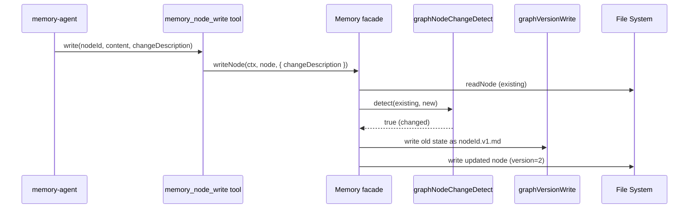

# Memory Graph Node Versioning

## Overview
Add version tracking to memory graph nodes. When a node is updated (content, refs, parents, title, or description change), the system saves the old state as a version file in the same directory. Version files use the naming convention `<nodeId>.v<N>.md` and are full markdown snapshots of the old node with an added `changeDescription` frontmatter field. The current version number lives in the node's frontmatter and auto-increments on each update.

**End result:**
- Every `GraphNode` has a `version: number` in frontmatter (starts at 1 on creation)
- On update, old state is saved as `<nodeId>.v<N>.md` alongside the current node file
- Version files are full markdown snapshots (frontmatter + content) — but only written when something actually changed
- The `memory_node_write` tool accepts a required `changeDescription` parameter when updating
- `Memory.append()` also records versions with a caller-provided description
- `graphStoreRead` filters out version files so they don't appear as regular nodes

## Context
- Memory nodes: markdown files at `~/.daycare/users/<userId>/memory/graph/<nodeId>.md`
- Mutations go through `Memory.writeNode()` and `Memory.append()`
- The `memory_node_write` tool in `memoryNodeWriteToolBuild.ts` is the primary write path
- `graphStoreRead` reads all `.md` files — needs to skip `*.v<N>.md` version files
- No database involved — purely file-based, consistent with existing storage approach

## File layout
```
memory/graph/
  abc123.md           # current node (version=3 in frontmatter)
  abc123.v1.md        # old version 1 snapshot
  abc123.v2.md        # old version 2 snapshot
  def456.md           # another node (version=1, never updated, no version files)
```

## Version file format
Version files are standard node markdown with an extra `changeDescription` frontmatter field:
```yaml
---
title: Some Topic
description: Details about the topic
parents:
  - __root__
refs:
  - other-node
version: 2
changeDescription: "Expanded details section with examples"
createdAt: 1740000000000
updatedAt: 1740000000000
---
The old markdown content body...
```

## Development Approach
- **Testing approach**: Regular (code first, then tests)
- Complete each task fully before moving to the next
- Make small, focused changes
- **CRITICAL: every task MUST include new/updated tests**
- **CRITICAL: all tests must pass before starting next task**
- Run tests after each change

## Progress Tracking
- Mark completed items with `[x]` immediately when done
- Add newly discovered tasks with ➕ prefix
- Document issues/blockers with ⚠️ prefix
- ⚠️ `yarn lint` currently fails on pre-existing formatting issues in unrelated files:
  - `packages/daycare/sources/engine/channels/channels.ts`
  - `packages/daycare/sources/engine/modules/tools/exposeTools.spec.ts`
  - `packages/daycare/sources/engine/modules/tools/signalEventsCsvToolBuild.ts`
  - `packages/daycare/sources/engine/modules/tools/topologyToolBuild.ts`
  - `packages/daycare/sources/plugins/shell/processTools.spec.ts`

## Implementation Steps

### Task 1: Add `version` field to `GraphNodeFrontmatter`
- [x] Add `version: number` to `GraphNodeFrontmatter` in `graphTypes.ts`
- [x] Update `graphNodeParse.ts` to parse `version` from frontmatter (default to 1)
- [x] Update `graphNodeSerialize.ts` to write `version` to frontmatter
- [x] Update `graphNodeParse.spec.ts` with version parsing tests (present, missing, invalid)
- [x] Update `graphNodeSerialize.spec.ts` with version serialization test
- [x] Run tests — must pass before next task

### Task 2: Filter version files in `graphStoreRead`
- [x] Update `graphStoreRead.ts` to skip files matching `*.v<N>.md` pattern (e.g. `abc123.v2.md`)
- [x] Add helper `graphVersionFilePattern` regex or function to `graphTypes.ts` for reuse
- [x] Update `graphStoreRead.spec.ts` — test that version files in the directory are excluded from results
- [x] Run tests — must pass before next task

### Task 3: Add version file write/read helpers
- [x] Create `graphVersionWrite.ts` — writes a version snapshot file (`<nodeId>.v<N>.md`) with `changeDescription` in frontmatter
- [x] Create `graphVersionRead.ts` — reads all version files for a given nodeId from the directory, returns them sorted by version ASC
- [x] Add `GraphNodeVersion` type to `graphTypes.ts`: extends node data with `changeDescription: string`
- [x] Write `graphVersionWrite.spec.ts` — test file naming, frontmatter includes changeDescription
- [x] Write `graphVersionRead.spec.ts` — test reading multiple versions, sorting, ignoring unrelated files
- [x] Run tests — must pass before next task

### Task 4: Add change detection helper `graphNodeChangeDetect`
- [x] Create `graphNodeChangeDetect.ts` in `sources/engine/memory/graph/`
- [x] Function signature: `graphNodeChangeDetect(oldNode: GraphNode, newNode: GraphNode): boolean`
- [x] Returns `true` if content, refs, parents, title, or description differ
- [x] Compare content with string equality, arrays with sorted deep equality
- [x] Write `graphNodeChangeDetect.spec.ts`: no change returns false, content-only change, refs-only change, parents-only change, title/description change, multiple fields changed
- [x] Run tests — must pass before next task

### Task 5: Wire versioning into `Memory` facade
- [x] Add `WriteNodeOptions` type: `{ changeDescription?: string }`
- [x] Modify `Memory.writeNode(ctx, node, options?)`:
  - Read existing node before writing
  - If existing node found and `changeDescription` provided:
    - Run `graphNodeChangeDetect(existing, node)`
    - If changes detected, write version file for old state via `graphVersionWrite`, then bump `node.frontmatter.version`
    - If no changes detected, still write (idempotent) but skip version file
  - If node is new, ensure `version = 1`
- [x] Modify `Memory.append(ctx, nodeId, content, changeDescription?)`:
  - Before appending, capture old node state
  - After building updated node, detect changes and write version file if `changeDescription` provided
- [x] Add `readNodeVersions(ctx, nodeId)` method that delegates to `graphVersionRead`
- [x] Update `memory.spec.ts`:
  - Test writeNode with changeDescription creates version file
  - Test writeNode without changes skips version file
  - Test append with changeDescription creates version file
  - Test new node gets version=1, no version file
  - Test version increments correctly across multiple updates
- [x] Run tests — must pass before next task

### Task 6: Update `memory_node_write` tool to accept `changeDescription`
- [x] Add `changeDescription` to tool schema (optional string)
- [x] Update tool description to mention `changeDescription` is required when updating existing nodes
- [x] Pass `changeDescription` to `memory.writeNode()` call
- [x] Validate: if node exists and `changeDescription` is missing, return error
- [x] Update tool result summary to include version info
- [x] Write tests for: create (no changeDescription needed), update with changeDescription, update without changeDescription (error)
- [x] Run tests — must pass before next task

### Task 7: Verify acceptance criteria
- [x] Verify: new node gets `version: 1` in frontmatter
- [x] Verify: updating a node increments version and saves old state as `<nodeId>.v<N>.md`
- [x] Verify: version files contain full old snapshot with `changeDescription` in frontmatter
- [x] Verify: `graphStoreRead` excludes version files
- [x] Verify: `Memory.append()` with changeDescription records version
- [x] Verify: no-change update skips version file creation
- [x] Run full test suite (`yarn test`)
- [ ] Run linter (`yarn lint`)
- [x] Run typecheck (`yarn typecheck`)

### Task 8: Update documentation
- [x] Update `doc/concepts/graph-memory.md` with versioning section
- [x] Update memory plugin README if it exists

## Technical Details

### Version lifecycle
```
Create node  →  version=1, no version file
Update #1    →  old state saved as <nodeId>.v1.md, node becomes version=2
Update #2    →  old state saved as <nodeId>.v2.md, node becomes version=3
```

### Data flow


## Post-Completion
- Memory-agent prompt may need updating to instruct it to always provide `changeDescription` when updating nodes
- Consider adding a `memory_node_history` read tool in a follow-up to let agents query version history
