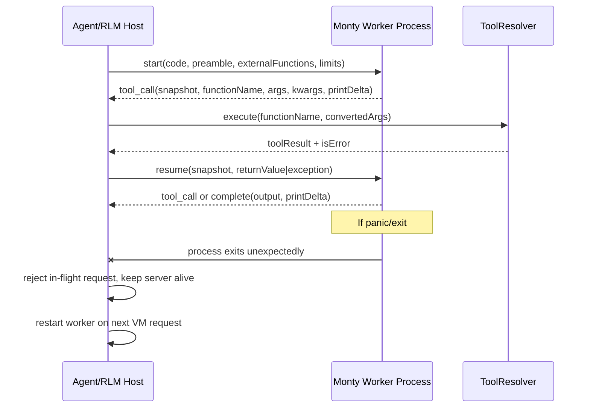

# Isolate Monty VM in Dedicated Worker Process

## Overview
Move Monty VM execution out of the main Daycare process into a dedicated child worker process that executes VM segments and returns serialized state.

When complete, Daycare will have:
- A dedicated Monty worker process that accepts `start` and `resume` requests.
- A stable wire contract where the host sends `code`/`preamble`/`snapshot` + resume input and receives either:
  - `tool_call` (with `snapshotDump`, `functionName`, `args`, `kwargs`, print delta), or
  - `complete` (with final output + print delta).
- Panic/crash isolation: if Monty panics or the worker exits unexpectedly, the server stays alive, in-flight requests fail deterministically, and the worker is restarted for subsequent requests.
- Unchanged run_python behavior in agent loop, history checkpointing, and restore flow.

Acceptance outcomes:
- Main process does not terminate when Monty worker crashes.
- `rlm_start`/`rlm_tool_call`/`rlm_tool_result`/`rlm_complete` history semantics remain intact.
- Crash/restore behavior still supports pending `vm_start` and `tool_call` phases.
- Existing run_python tool behavior (skip, steering, print capture, tool errors, typed failures) remains equivalent.

## Context (from discovery)
- Files/components involved:
  - `packages/daycare/sources/engine/modules/rlm/rlmStepStart.ts`
  - `packages/daycare/sources/engine/modules/rlm/rlmStepResume.ts`
  - `packages/daycare/sources/engine/modules/rlm/rlmStepToolCall.ts`
  - `packages/daycare/sources/engine/modules/rlm/rlmExecute.ts`
  - `packages/daycare/sources/engine/agents/ops/agentLoopRun.ts`
  - `packages/daycare/sources/engine/agents/ops/agentLoopStepTypes.ts`
  - `packages/daycare/sources/engine/agents/ops/agentLoopPendingPhaseResolve.ts`
  - `packages/daycare/sources/engine/agents/ops/agentTypes.ts`
  - `packages/daycare/sources/engine/modules/rlm/rlmSnapshotEncode.ts`
  - `packages/daycare/sources/engine/modules/rlm/rlmErrorTextBuild.ts`
  - `packages/daycare/sources/engine/modules/rlm/README.md`
- Related patterns found:
  - Flat VM step state machine already exists (`vm_start` -> `tool_call` -> `block_complete`).
  - Snapshot checkpointing already persists base64 dumps in history.
  - Existing child-process orchestration patterns exist (`engine/processes`, `recipePythonReplCreate`).
- Dependencies identified:
  - Node child-process IPC (`spawn`/`fork` + message channel).
  - `@pydantic/monty` runtime in worker process.
  - `AsyncLock` for serialized request handling/restart safety.
  - Explicit logger module naming via `getLogger("...")`.

## Development Approach
- **Testing approach**: Regular (code first, then tests).
- Keep VM orchestration in monolith engine modules (not plugin) and isolate only Monty execution in worker process.
- Keep host-side tool dispatch unchanged; worker only runs Monty start/resume segments.
- Preserve durable snapshot format (`base64`) for restore compatibility.
- **CRITICAL: every task includes new/updated tests for changed behavior.**
- **CRITICAL: all tests must pass before moving to the next task.**
- **CRITICAL: update this plan file if scope changes during implementation.**

## Testing Strategy
- Unit tests for worker protocol serialization and response mapping.
- Unit tests for worker facade behavior (request/response correlation, timeout, crash/restart).
- RLM step tests updated to validate worker-backed start/resume flow.
- `agentLoopRun` tests for worker crash handling during `vm_start` and `tool_call` resume.
- `rlmExecute` tests for unchanged behavior (skip, print, tool errors, history callbacks).

## Progress Tracking
- Mark completed items with `[x]` immediately.
- Add newly discovered tasks with `➕` prefix.
- Document blockers with `⚠️` prefix.
- Keep plan synchronized with real implementation progress.

## What Goes Where
- **Implementation Steps** (`[ ]`): all code, tests, and docs changes in this repo.
- **Post-Completion** (no checkboxes): manual crash simulations and runtime validation.

## Implementation Steps

### Task 1: Define worker protocol and VM progress types
- [x] add worker protocol request/response types for `start` and `resume` operations in `engine/modules/rlm/`
- [x] define host-side paused/complete VM progress union using serialized snapshot bytes + call metadata
- [x] add helpers for protocol validation/normalization at process boundary
- [x] write tests for protocol payload validation (success + malformed payloads)
- [x] run targeted tests for protocol files

### Task 2: Implement Monty worker process entrypoint
- [x] add worker entrypoint in `engine/modules/rlm/` that loads Monty and handles IPC requests
- [x] implement `start` handling: construct Monty, run until pause/complete, return serialized state
- [x] implement `resume` handling: load snapshot dump, apply resume options, return next state
- [x] ensure worker captures and returns print deltas for each segment
- [x] write worker-entrypoint tests with deterministic request/response fixtures
- [x] run targeted tests for worker entrypoint

### Task 3: Add host worker facade with crash isolation
- [x] add a plural facade class (`RlmWorkers`) to own worker lifecycle, request routing, and restart logic
- [x] implement in-flight request map keyed by request id with timeout and orderly rejection on worker exit
- [x] implement lazy worker start and automatic restart on unexpected exit/panic
- [x] add explicit shutdown handling for child process termination
- [x] write tests for restart behavior, timeout behavior, and in-flight rejection on crash
- [x] run targeted tests for worker facade

### Task 4: Refactor RLM step primitives to worker-backed state
- [x] refactor `rlmStepStart` to call the worker facade and return paused/complete state union
- [x] refactor `rlmStepResume` to call worker resume and return paused/complete state union
- [x] refactor `rlmStepToolCall` to consume paused-state metadata instead of `MontySnapshot` object
- [x] keep snapshot checkpoint recording behavior (`rlmSnapshotEncode`) unchanged
- [x] write tests for updated step APIs including success, tool error, and abort handling
- [x] run targeted tests for RLM step primitives

### Task 5: Update agent loop VM phases and restore integration
- [x] update `agentLoopStepTypes.ts` to replace `MontySnapshot` phase state with worker paused-state representation
- [x] update `agentLoopRun.ts` `vm_start` and `tool_call` branches to use worker-backed start/resume
- [x] preserve steering, skip, print output accumulation, and history writes without behavioral drift
- [x] keep `agentLoopPendingPhaseResolve.ts` restore behavior compatible with persisted snapshot records
- [x] write/update `agentLoopRun.spec.ts` and pending-phase tests for crash-safe behavior
- [x] run targeted agent loop tests

### Task 6: Keep non-agent RLM callers compatible
- [x] update `rlmExecute.ts` convenience wrapper to run entirely through worker-backed steps
- [x] verify `agent.ts` executable system-message path and `executablePromptExpand.ts` continue to work unchanged
- [x] ensure error text includes worker crash context without leaking internal stack noise
- [x] write/update tests for `rlmExecute.spec.ts` and executable prompt expansion behavior
- [x] run targeted tests for wrapper callers

### Task 7: Panic/crash handling and error contracts
- [x] add typed error mapping for worker crashes/exits and surface stable user-facing messages
- [x] ensure crash mid-request records proper failure completion and allows later retries
- [x] ensure subsequent executions respawn worker and continue successfully
- [x] write tests that simulate worker crash and verify server-side continuity
- [x] run targeted crash-path tests

### Task 8: Verify acceptance criteria
- [x] verify main process survives simulated worker crash during `vm_start`
- [x] verify main process survives simulated worker crash during `tool_call` resume
- [x] verify snapshot restore path remains functional after restart recovery
- [x] run full unit test suite for `packages/daycare` (`yarn test`)
- [x] run typecheck (`yarn typecheck`)
- [x] run lint (`yarn lint`)

### Task 9: Update documentation
- [x] update `packages/daycare/sources/engine/modules/rlm/README.md` with worker-based architecture and crash semantics
- [x] add/update design doc under `doc/` describing worker boundary and restart flow
- [x] include mermaid sequence/state diagrams for host-worker-tool interactions

## Technical Details

### Worker API contract
- Request envelope:
  - `id: string`
  - `type: "start" | "resume"`
  - `payload`: operation-specific payload
- Start payload:
  - `code: string`
  - `preamble: string`
  - `externalFunctions: string[]`
  - `limits: { maxDurationSecs, maxMemory, maxRecursionDepth, maxAllocations }`
- Resume payload:
  - `snapshot: string` (base64)
  - `resumeOptions: { returnValue } | { exception: { type, message } }`

### Returned progress
- `tool_call`:
  - `snapshot: string` (base64)
  - `functionName: string`
  - `args: unknown[]`
  - `kwargs: Record<string, unknown>`
  - `printOutput: string[]` (delta for segment)
- `complete`:
  - `output: unknown`
  - `printOutput: string[]` (delta for segment)

### Failure behavior
- Worker exit/error while request is in-flight:
  - reject request with typed worker crash error
  - mark worker dead and clear pending map
  - next request lazily spawns a fresh worker
- Host process must never crash due to worker failure.

## Post-Completion
Manual verification (informational):
- Run a multi-step `<run_python>` flow with tool calls and confirm identical visible behavior.
- Force worker termination between start and resume and verify:
  - Daycare server stays alive.
  - Pending execution fails with deterministic message.
  - Next run_python request succeeds after worker restart.
- Validate restore by restarting Daycare with pending `rlm_tool_call` history and confirming resumed completion/error path.
