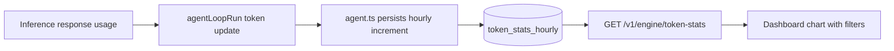

# Hourly Token Stats and Dashboard Chart

## Overview

Implement durable hourly token/cost accounting for model usage and expose it to the dashboard.

When complete, Daycare will:
- increment hourly usage rows keyed by `userId`, `agentId`, `model` (full model string)
- store exclusive token buckets: `input`, `output`, `cacheRead`, `cacheWrite`
- store dollar `cost` separately
- support filtered reads for dashboard visualization
- render a dashboard chart with filters and time ranges

## Context (from discovery)

- Token usage is currently derived in `engine/agents/ops/tokensResolve.ts`.
- Usage updates are assembled in `engine/agents/ops/agentLoopRun.ts` and applied to in-memory per-agent stats in `engine/agents/agent.ts`.
- Storage has repository + migration patterns in `sources/storage/*`.
- Dashboard API is served by `engine/ipc/server.ts` and consumed by `packages/daycare-dashboard/lib/engine-client.ts`.
- Main dashboard view is `packages/daycare-dashboard/components/dashboard.tsx`.

## Development Approach

- Testing approach: regular (code first, then focused tests)
- Keep schema and repository changes minimal and explicit
- Use hourly increments with upsert to avoid hidden side effects
- Keep token buckets exclusive; compute combined totals for charting as:
  - input total = `input + cacheRead`
  - output total = `output + cacheWrite`

## Implementation Steps

### Task 1: Add hourly token stats persistence
- [x] add migration for hourly token stats table + indexes
- [x] add DB row/record types for hourly token stats
- [x] add `TokenStatsRepository` with increment + filtered read methods
- [x] wire repository into `Storage`
- [x] write repository tests
- [x] run tests for storage changes

### Task 2: Record token + cost increments from inference usage
- [x] extend `agentLoopRun` token update payload to include normalized cost
- [x] persist hourly increments in `agent.ts` using `ctx`
- [x] ensure model key uses full string (provider/model)
- [x] write/adjust tests for token update behavior
- [x] run tests for agent changes

### Task 3: Expose token stats over engine API
- [x] add `GET /v1/engine/token-stats` with filters (`from`, `to`, `userId`, `agentId`, `model`)
- [x] return rows with hourly buckets, token buckets, and cost
- [x] add API tests if applicable
- [x] run tests for API/storage integration

### Task 4: Add dashboard chart with filters
- [x] add dashboard client types and fetcher for token stats endpoint
- [x] add chart card with range + user + agent + model filters
- [x] aggregate filtered rows by hour for chart series
- [x] render token and cost trends from real data
- [x] run dashboard typecheck/tests

### Task 5: Verify and document
- [x] verify acceptance criteria end-to-end
- [x] add `/doc/` documentation with mermaid diagram
- [ ] run lint
- [x] run typecheck/build
- [x] run full tests

## Progress Tracking

- ⚠️ `yarn lint` currently fails on unrelated pre-existing Biome formatting issues in other files.

## Technical Details

### Row shape

Each hourly row is uniquely identified by:
- `hourStart` (unix ms, floored to hour)
- `userId`
- `agentId`
- `model`

And stores:
- `input`
- `output`
- `cacheRead`
- `cacheWrite`
- `cost`

### Processing flow

## Post-Completion

- Manual verification: confirm chart responds to range and identity/model filters with expected totals.
- External updates: none expected.
