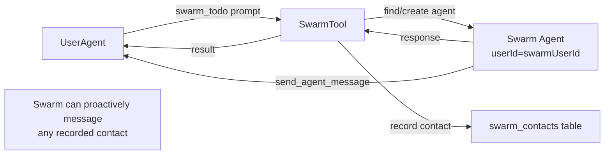

# Swarm-as-User Redesign

## Overview

Redesign the app concept into **swarms** — first-class users with their own filesystem, agents, and full capabilities. The old app system (APP.md, PERMISSIONS.md, review middleware) and subusers are removed entirely.

**Key outcomes:**
- Swarm is a user record with `parentUserId` pointing to its creator
- Each user who contacts a swarm gets a dedicated, persistent agent instance running under the swarm's userId
- Owner's agents see swarms as `swarm_<name>` tools
- No permission filtering or review middleware
- Swarms have full capabilities (skills, permanent agents, cron, etc.)
- Swarms can proactively message agents that have previously contacted them (tracked in DB)
- Memory is opt-in (disabled by default)
- Swarm's `home/` directory is exposed to owner at `/share/swarm/<name>/` in docker
- Subusers are removed from the codebase

## Context

**Files/components involved:**
- `sources/engine/apps/` — entire directory to be rewritten as `sources/engine/swarms/`
- `sources/engine/subusers/` — removed entirely
- `sources/engine/agents/ops/agentDescriptorTypes.ts` — swarm descriptor type, remove subuser descriptor
- `sources/engine/users/userHome.ts` — UserHome path resolution
- `sources/engine/engine.ts` — engine startup, swarm initialization
- `sources/schema.ts` — new `swarm_configs` and `swarm_contacts` tables
- `sources/types.ts` — type re-exports
- `sources/sandbox/` — docker mount for `/share/swarm/<name>/`
- `sources/engine/modules/toolResolver.ts` — tool visibility for swarm agents

**Existing patterns to follow:**
- Permanent agents: tool-based creation, stable identity, persistent
- Friends: contact tracking, communication boundaries

## Development Approach
- **Testing approach**: Regular (code first, then tests)
- Complete each task fully before moving to the next
- Make small, focused changes
- **CRITICAL: every task MUST include new/updated tests**
- **CRITICAL: all tests must pass before starting next task**
- **CRITICAL: update this plan file when scope changes during implementation**
- Run tests after each change

## Testing Strategy
- **Unit tests**: required for every task — pure functions get `*.spec.ts` files
- No e2e tests (backend-only engine code)

## Progress Tracking
- Mark completed items with `[x]` immediately when done
- Add newly discovered tasks with ➕ prefix
- Document issues/blockers with ⚠️ prefix
- Update plan if implementation deviates from original scope

## Architecture

### Swarm Identity Model

A swarm is a user record with a regular nametag (no special prefix):

```
users table:
  id: <swarmUserId>        (CUID2)
  parentUserId: <ownerId>  (creator)
  name: <title>            (display name)
  nametag: <name>           (regular nametag, e.g. "todo", "github-reviewer")
  isOwner: 0

swarm_configs table:        (identifies this user as a swarm)
  user_id: <swarmUserId>   (PK, references users.id)
  owner_user_id: <ownerId> (the creator)
  name: <name>             (matches nametag, used for tool name)
  title: <title>           (display name)
  description: <desc>      (tool description)
  system_prompt: <prompt>  (swarm personality)
  memory: 0|1              (opt-in, default 0)
  created_at: <unix ms>
  updated_at: <unix ms>
```

The `swarm_configs` table is the authoritative source for "is this user a swarm?". Discovery queries this table, not nametag patterns.

### Swarm Descriptor

Minimal — only swarm identity (from `swarm_configs`). Everything else (systemPrompt, name, contact info) is resolved from DB/runtime context.

```typescript
{
    type: "swarm";
    id: string;              // swarm id (from swarm_configs, same as swarm's userId)
}
```

### Swarm Contacts Table

New DB table tracking which agents have contacted a swarm:

```sql
CREATE TABLE swarm_contacts (
    swarm_user_id    TEXT NOT NULL,
    contact_agent_id TEXT NOT NULL,
    swarm_agent_id   TEXT NOT NULL,
    messages_sent     INTEGER NOT NULL DEFAULT 0,
    messages_received INTEGER NOT NULL DEFAULT 0,
    first_contact_at  BIGINT NOT NULL,
    last_contact_at   BIGINT NOT NULL,
    PRIMARY KEY (swarm_user_id, contact_agent_id)
);
```

- `swarm_user_id`: the swarm's userId
- `contact_agent_id`: the external agent that initiated contact
- `swarm_agent_id`: the swarm-side agent created for this contact
- `messages_sent`: count of messages swarm sent to this contact
- `messages_received`: count of messages received from this contact
- `first_contact_at`: unix timestamp of first message
- `last_contact_at`: unix timestamp of most recent message

### Filesystem Layout

```
<usersDir>/<swarmUserId>/
  home/                     ← exposed at /share/swarm/<name>/ in docker
    desktop/
    downloads/
    documents/
    developer/
    knowledge/
      SOUL.md               ← seeded with swarm systemPrompt
    memory/                  ← only used if memory enabled
    tmp/
  skills/
    active/
    personal/
```

### Tool Registration

Owner's agents see `swarm_<name>` tools:

```typescript
{
    tool: {
        name: "swarm_<name>",
        description: "<from swarm description>",
        parameters: {
            prompt: string,
            wait?: boolean
        }
    },
    execute: async (args, context) => {
        // 1. Find or create swarm agent for this (swarm, callerAgent) pair
        // 2. Record contact in swarm_contacts table
        // 3. Post message to swarm agent
        // 4. Return response (sync or async)
    }
}
```

### Communication Flow



### Memory Opt-In

When creating a swarm, `memory: false` by default. If enabled:
- Memory worker processes the swarm's agent sessions
- Memory graph stored in swarm's UserHome `memory/` dir

When disabled:
- Memory worker skips sessions for swarm agents
- No memory-agent spawned

### Swarm Creation Tool

```typescript
create_swarm({
    name: string,         // becomes the swarm's nametag (regular nametag)
    title: string,        // display name
    description: string,  // tool description
    systemPrompt: string, // swarm personality
    memory?: boolean      // default false
})
```

### Docker Mount

In sandbox configuration, the swarm's `home/` directory is bind-mounted:

```
/share/swarm/<name>/ → <usersDir>/<swarmUserId>/home/
```

This gives the owner's sandboxed processes read/write access to the swarm's filesystem.

## Implementation Steps

### Task 1: Remove old app system and subusers

Remove the entire old file-based app system (APP.md, PERMISSIONS.md, review middleware, etc.) and the subuser system.

- [x] Delete all files in `sources/engine/apps/` directory
- [x] Delete all files in `sources/engine/subusers/` directory
- [x] Remove app-related and subuser-related type exports from `sources/types.ts`
- [x] Remove app and subuser initialization from `sources/engine/engine.ts`
- [x] Remove old `app` and `subuser` descriptor variants from `agentDescriptorTypes.ts`
- [x] Remove subuser tools registration (subuser_create, subuser_configure, subuser_list)
- [x] Remove app-related and subuser-related tests
- [x] Clean up any references to subusers in tool visibility callbacks
- [x] Run tests — must pass before next task
- [x] Run linter — fix all issues

### Task 2: Define new swarm types

Create core types for the new swarm-as-user model.

- [x] Create `sources/engine/swarms/swarmTypes.ts` with:
  - `SwarmConfig`: `{ name, title, description, systemPrompt, memory }`
  - `SwarmRecord`: `{ userId, name, title, description, systemPrompt, memory, createdAt, updatedAt }`
  - `SwarmContact`: `{ swarmUserId, contactAgentId, swarmAgentId, messagesSent, messagesReceived, firstContactAt, lastContactAt }`
- [x] Add swarm descriptor in `agentDescriptorTypes.ts`:
  ```typescript
  { type: "swarm"; id: string }
  ```
  - `id`: the swarm's id (same as the swarm's userId from `swarm_configs`)
- [x] Re-export new types from `sources/types.ts`
- [x] Write tests for type shape validation (if any runtime validators needed)
- [x] Run tests — must pass before next task

### Task 3: Add swarm_configs and swarm_contacts database tables and repositories

Create DB tables for swarm identity and contact tracking, plus repositories for CRUD operations.

- [x] Add `swarmConfigsTable` to `sources/schema.ts`:
  - Columns: `user_id` (PK), `owner_user_id`, `name`, `title`, `description`, `system_prompt`, `memory` (integer 0|1), `created_at`, `updated_at`
  - Indexes: on `owner_user_id`
- [x] Add `swarmContactsTable` to `sources/schema.ts`:
  - Columns: `swarm_user_id`, `contact_agent_id`, `swarm_agent_id`, `messages_sent`, `messages_received`, `first_contact_at`, `last_contact_at`
  - Primary key: `(swarm_user_id, contact_agent_id)`
  - Indexes: on `swarm_user_id`, on `swarm_agent_id`
- [x] Create migration in `sources/storage/migrations/` for both new tables
- [x] Create `sources/storage/swarmConfigsRepository.ts`:
  - `create(config)` — insert swarm config record
  - `findByUserId(userId)` — get swarm config by swarm's userId
  - `findByOwner(ownerUserId)` — list all swarms owned by a user
  - `findByName(ownerUserId, name)` — lookup by owner + swarm name
  - `isSwarm(userId)` — check if a userId is a swarm
  - `update(userId, partial)` — update config fields
- [x] Create `sources/storage/swarmContactsRepository.ts`:
  - `findOrCreate(swarmUserId, contactAgentId, swarmAgentId)` — upsert contact record
  - `recordSent(swarmUserId, contactAgentId)` — increment sent count, update lastContactAt
  - `recordReceived(swarmUserId, contactAgentId)` — increment received count, update lastContactAt
  - `listContacts(swarmUserId)` — list all contacts for a swarm
  - `isKnownContact(swarmUserId, contactAgentId)` — check if agent has contacted this swarm
- [x] Write tests for swarmConfigsRepository (create, find, isSwarm, update)
- [x] Write tests for swarmContactsRepository (create, update counts, list, check)
- [x] Run tests — must pass before next task

### Task 4: Build swarm creation logic

Create the function that provisions a swarm as a user.

- [x] Create `sources/engine/swarms/swarmCreate.ts`:
  - Creates user record with `parentUserId = creator`, `nametag = name` (regular nametag), `isOwner = 0`
  - Inserts row into `swarm_configs` table via swarmConfigsRepository
  - Calls `userHomeEnsure()` for the new swarm user
  - Seeds knowledge files with swarm's systemPrompt
  - Returns `SwarmRecord`
- [x] Write tests for swarmCreate (creates user, creates config row, ensures home)
- [x] Run tests — must pass before next task

### Task 5: Build swarm discovery and manager facade

Create the `Swarms` facade class that discovers existing swarms and manages their lifecycle.

- [x] Create `sources/engine/swarms/swarmDiscover.ts`:
  - Query `swarm_configs` table for rows where `owner_user_id = ownerId`
  - Join with users table to get nametag/name
  - Return `SwarmRecord[]`
- [x] Create `sources/engine/swarms/swarmManager.ts` — `Swarms` facade:
  - `discover(ownerId)` — find all swarms for the owner
  - `create(ownerId, config: SwarmConfig)` — create new swarm
  - `get(name)` — lookup by name
  - `list()` — all discovered swarms
  - `registerTools(toolResolver)` — register `swarm_<name>` tools
- [x] Write tests for discovery (finds swarm users, loads configs)
- [x] Write tests for Swarms facade (create, list, get)
- [x] Run tests — must pass before next task

### Task 6: Build swarm tool (swarm_<name>) and agent resolution

Build the tool that exposes swarms to the owner's agents, including per-contact agent creation.

- [x] Create `sources/engine/swarms/swarmToolBuild.ts`:
  - Builds `swarm_<name>` tool definition per swarm
  - Parameters: `{ prompt: string, wait?: boolean }`
  - On execute:
    1. Look up or create swarm agent for (swarmUserId, callerAgentId) pair
    2. Record/update contact in swarm_contacts table
    3. Post message to swarm agent
    4. Return response (sync) or acknowledgment (async)
- [x] Create `sources/engine/swarms/swarmAgentResolve.ts`:
  - Given (swarmUserId, contactAgentId), find existing swarm agent or create new one
  - Agent descriptor: `{ type: "swarm", id: swarmId }`
  - Agent belongs to swarmUserId (runs under swarm's user context)
  - System prompt and contact mapping resolved from `swarm_configs` + `swarm_contacts` tables
  - Permissions: full access to swarm's UserHome
- [x] Write tests for swarmAgentResolve (creates new, reuses existing)
- [x] Write tests for swarmToolBuild (tool shape, parameter validation)
- [x] Run tests — must pass before next task

### Task 7: Build swarm creation tool

Create the `create_swarm` tool for the owner to create swarms.

- [x] Create `sources/engine/swarms/swarmCreateToolBuild.ts`:
  - Tool name: `create_swarm`
  - Parameters: `{ name, title, description, systemPrompt, memory? }`
  - Validates name format (username-style: lowercase, hyphens/underscores)
  - Calls `Swarms.create()` to provision the swarm
  - Re-discovers swarms to register the new tool
  - Returns created swarm details
  - Visible only to owner agents (not swarm agents)
- [x] Write tests for tool shape and validation
- [x] Run tests — must pass before next task

### Task 8: Wire communication boundary enforcement

Ensure swarm agents can only message agents that have contacted them.

- [x] Modify `send_agent_message` tool execution for swarm agents:
  - Before sending, check `swarm_contacts.isKnownContact(swarmUserId, targetAgentId)`
  - If not a known contact, return error: "Can only message agents that have contacted this swarm"
  - If known, allow the send and increment `messages_sent` counter
- [x] Add tool visibility filtering for swarm agents:
  - Swarm agents see standard tools (read, write, exec, skills, etc.)
  - Swarm agents do NOT see: `create_swarm`, friend tools
  - Swarm agents DO see: `send_agent_message` (with boundary enforcement)
- [x] Write tests for boundary enforcement (known contact allowed, unknown blocked)
- [x] Write tests for tool visibility (swarm agents see correct tools)
- [x] Run tests — must pass before next task

### Task 9: Wire memory opt-in for swarms

Make memory conditional per swarm.

- [x] In memory worker, check if the agent's user is a swarm with memory disabled:
  - Look up agent's userId → check `swarm_configs.isSwarm(userId)`
  - If swarm user, load config and check `memory` flag
  - If memory disabled, skip session processing
- [x] Memory flag already stored in `swarm_configs` table (from Task 3/4)
- [x] Write tests for memory skip logic
- [x] Run tests — must pass before next task

### Task 10: Wire docker /share/swarm/<name>/ mount

Expose swarm's `home/` directory in the docker sandbox.

- [x] In sandbox mount configuration, add bind mounts for each swarm:
  - Source: `<usersDir>/<swarmUserId>/home/`
  - Target: `/share/swarm/<swarmName>/`
  - Mode: read-write
- [x] Write tests for mount path resolution
- [x] Run tests — must pass before next task

### Task 11: Wire into engine startup

Connect the new swarm system to engine initialization.

- [x] Initialize `Swarms` manager in engine startup
- [x] Call `swarms.discover()` to find existing swarms
- [x] Register swarm tools with tool resolver
- [x] Register `create_swarm` tool
- [x] Wire swarm_contacts repository
- [x] Run tests — must pass before next task

### Task 12: Update agentDescriptorCacheKey

Ensure the new swarm descriptor type has a matching cache key case.

- [x] Add `"swarm"` case to `agentDescriptorCacheKey()` using `descriptor.id` as the cache key
- [x] Write test for cache key uniqueness
- [x] Run tests — must pass before next task

### Task 13: Verify acceptance criteria

- [x] Verify: swarm created via `create_swarm` tool provisions a user record
- [x] Verify: swarm's UserHome is created with correct directory structure
- [x] Verify: `swarm_<name>` tool appears for owner's agents
- [x] Verify: calling swarm tool creates/reuses per-contact agent
- [x] Verify: swarm_contacts table records contact and updates stats
- [x] Verify: swarm agents can message known contacts via send_agent_message
- [x] Verify: swarm agents cannot message unknown agents
- [x] Verify: memory is skipped for swarms with memory=false
- [x] Verify: docker mount exposes swarm's home/ at /share/swarm/<name>/
- [x] Verify: old app system and subusers are fully removed
- [x] Run full test suite
- [x] Run linter — all issues must be fixed

### Task 14: Update documentation

- [x] Create `doc/concepts/swarms.md` with new concept overview
- [x] Update any references to old app system or subusers in existing docs
- [x] Add mermaid diagrams showing new swarm architecture
- [x] Update `doc/PLUGINS.md` if it references old app pattern

## Technical Details

### Data Flow: User Contacts Swarm

1. Owner's agent calls `swarm_todo({ prompt: "Add a task" })`
2. `swarmToolBuild` handler:
   a. Resolves swarm by name → gets `swarmUserId`
   b. Calls `swarmAgentResolve(swarmUserId, callerAgentId)`
   c. If no existing agent: creates new agent with swarm descriptor, under swarmUserId
   d. If existing: reuses the persistent agent
   e. Records contact in `swarm_contacts` (upsert, increment received count)
   f. Posts message to swarm agent
   g. Returns response

### Data Flow: Swarm Proactively Messages Contact

1. Swarm agent calls `send_agent_message({ agentId: contactAgentId, message: "Reminder" })`
2. Boundary check: `swarmContacts.isKnownContact(swarmUserId, contactAgentId)` → true
3. Message delivered to contact agent
4. `swarm_contacts.messages_sent` incremented

### Swarm Config Storage

Stored in the `swarm_configs` DB table (not filesystem):

```sql
-- swarm_configs row
user_id:        'clx123abc...'
owner_user_id:  'sy45wijd1hmr03ef2wu7busv'
name:           'todo'
title:          'Todo App'
description:    'Manages todo lists'
system_prompt:  'You are a todo list manager...'
memory:         0
created_at:     1709136000000
updated_at:     1709136000000
```

Discovery: `SELECT * FROM swarm_configs WHERE owner_user_id = ?`
Identity check: `SELECT 1 FROM swarm_configs WHERE user_id = ?`

### Agent Descriptor Cache Key

```typescript
case "swarm":
    return `/swarm/${descriptor.id}`;
```

Unique per swarm.

## Post-Completion

**Manual verification:**
- Create a swarm via `create_swarm` tool in a running environment
- Message the swarm from different user agents, verify separate agent instances
- Verify swarm can reply proactively to known contacts
- Verify swarm cannot message unknown agents
- Check docker mount visibility at `/share/swarm/<name>/`
- Enable memory on a swarm and verify memory worker processes its sessions

**Future considerations (out of scope):**
- Swarm marketplace / sharing swarms between users
- Swarm versioning and updates
- Swarm-to-swarm communication
- Rate limiting on swarm contacts
- Swarm deletion / cleanup
