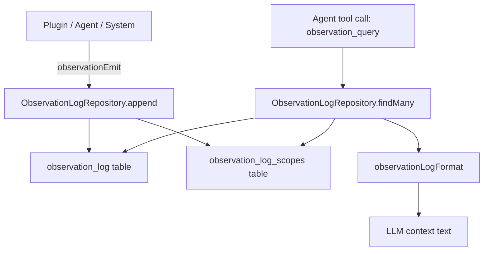

# Observation Log

## Overview
A database-backed, append-only observation log that records structured events scoped per user and arbitrary entity IDs. Serves dual purposes: agents query it during reasoning ("what happened to task X since last check") and humans use it for debugging/audit trails.

Each event has:
- **type**: event classification (e.g. "task.updated", "memory.extracted")
- **source**: colon-delimited origin string (e.g. "agent:abc123", "plugin:telegram", "system:cron")
- **message**: short summary (one line)
- **details**: full description (nullable, multi-line)
- **data**: arbitrary JSON payload (nullable)
- **scope IDs**: set of entity IDs the event relates to (e.g. task ID, agent ID) — queries match ANY scope ID

Query capabilities: by date range, by offset/limit pagination, recent N, by type, by source prefix, by scope IDs. LLM-friendly output modes: json (data field), short (message only), full (message + details + data).

## Context
- **Closest existing pattern**: `signals_events` table + `SignalEventsRepository` — flat append-only log, user-scoped, Drizzle ORM
- **Storage facade**: `Storage` class in `storage/storage.ts` wires all repositories
- **Tool system**: `ToolDefinition` with TypeBox schemas, `ToolResultContract.toLLMText()` for LLM formatting
- **User scoping**: `ctx: Context` pattern with `ctx.userId`
- **DB types live in**: `storage/databaseTypes.ts`, Drizzle schema in `schema.ts`

## Development Approach
- **Testing approach**: Regular (code first, then tests)
- Complete each task fully before moving to the next
- Make small, focused changes
- **CRITICAL: every task MUST include new/updated tests**
- **CRITICAL: all tests must pass before starting next task**
- Run tests after each change
- Maintain backward compatibility

## Implementation Steps

### Task 1: Add observation_log and observation_log_scopes tables
- [ ] Create migration `20260228_observation_log.sql` with two tables:
  - `observation_log`: id (text PK), user_id (text NOT NULL), type (text NOT NULL), source (text NOT NULL), message (text NOT NULL), details (text nullable), data (text nullable), created_at (bigint NOT NULL)
  - `observation_log_scopes`: observation_id (text NOT NULL FK), scope_id (text NOT NULL), PK (observation_id, scope_id)
- [ ] Add indexes: `idx_observation_log_user` (user_id), `idx_observation_log_type` (type), `idx_observation_log_created` (created_at), `idx_observation_log_user_created` (user_id, created_at), `idx_observation_log_scopes_scope` (scope_id)
- [ ] Register migration in `_migrations.ts`
- [ ] Add Drizzle table definitions in `schema.ts` (`observationLogTable`, `observationLogScopesTable`) and add to `schema` export object
- [ ] Add DB record types in `databaseTypes.ts`: `ObservationLogDbRecord`, `ObservationLogScopeDbRecord`
- [ ] Write migration test that verifies tables exist after migration (insert + select round-trip)
- [ ] Run tests — must pass before next task

### Task 2: Create ObservationLogRepository
- [ ] Create `storage/observationLogRepository.ts` with `ObservationLogRepository` class
- [ ] Constructor takes `DaycareDb`
- [ ] `append(record: ObservationLogDbRecord, scopeIds: string[]): Promise<void>` — inserts log row + scope rows in a single transaction
- [ ] `findMany(ctx: Context, options: ObservationLogFindOptions): Promise<ObservationLogDbRecord[]>` — user-scoped, supports filters: type, source (prefix match via LIKE), scopeIds (JOIN + ANY match), afterDate/beforeDate, limit, offset. Returns entries with their scope IDs populated.
- [ ] `findRecent(ctx: Context, options?: ObservationLogRecentOptions): Promise<ObservationLogDbRecord[]>` — most recent N (default 100), with optional type/source/scopeIds filters
- [ ] No in-memory cache (append-only log, not worth caching; queries always hit DB)
- [ ] Write tests for append (single + with scopes), findMany (by type, by scope, by date range, pagination), findRecent
- [ ] Run tests — must pass before next task

### Task 3: Wire repository into Storage facade
- [ ] Add `observationLog: ObservationLogRepository` field to `Storage` class
- [ ] Instantiate in `Storage` constructor
- [ ] Re-export `ObservationLogDbRecord` and query option types from `@/types`
- [ ] Run tests — must pass before next task

### Task 4: Create observationLogFormat LLM formatter
- [ ] Create `engine/observations/observationLogFormat.ts`
- [ ] `observationLogFormat(entries: ObservationLogDbRecord[], mode: "json" | "short" | "full"): string`
  - **json**: returns each entry's `data` field as JSON lines
  - **short**: returns `[timestamp] [type] message` per line
  - **full**: returns `[timestamp] [type] source=<source>\nmessage\ndetails\ndata` per entry, separated by blank lines
- [ ] Handle empty arrays (return "No observations found.")
- [ ] Write tests for each mode, empty input, entries with null details/data
- [ ] Run tests — must pass before next task

### Task 5: Create observation_query tool for agents
- [ ] Create `engine/observations/observationQueryTool.ts`
- [ ] Define TypeBox parameter schema: scopeIds (string[], optional), type (string, optional), source (string, optional), afterDate (number, optional — unix ms), beforeDate (number, optional), limit (number, optional, default 50), mode ("json" | "short" | "full", optional, default "short")
- [ ] Define return schema and `toLLMText` using `observationLogFormat`
- [ ] Implement `execute`: extract `ctx` from tool context, call repository `findMany`/`findRecent`, format result
- [ ] Export as `ToolDefinition`
- [ ] Write tests for tool parameter validation and result formatting
- [ ] Run tests — must pass before next task

### Task 6: Register tool and add engine observation emit helper
- [ ] Create `engine/observations/observationEmit.ts` — thin helper that calls `storage.observationLog.append(...)` with a generated cuid2 ID and `Date.now()` timestamp
- [ ] Register `observation_query` tool in the appropriate place (engine tool registration or as a built-in tool)
- [ ] Write test for observationEmit helper
- [ ] Run tests — must pass before next task

### Task 7: Verify acceptance criteria
- [ ] Verify append-only semantics (no update/delete methods)
- [ ] Verify user scoping via ctx
- [ ] Verify scope ID querying (any match)
- [ ] Verify date range, offset, recent queries
- [ ] Verify LLM formatter modes (json, short, full)
- [ ] Run full test suite (`yarn test`)
- [ ] Run linter (`yarn lint`)
- [ ] Run typecheck (`yarn typecheck`)

### Task 8: Update documentation
- [ ] Create `engine/observations/README.md` documenting the observation log system
- [ ] Add data flow diagram (mermaid)

## Technical Details

### Database Schema

```sql
CREATE TABLE observation_log (
    id          TEXT    PRIMARY KEY,
    user_id     TEXT    NOT NULL,
    type        TEXT    NOT NULL,
    source      TEXT    NOT NULL,
    message     TEXT    NOT NULL,
    details     TEXT,
    data        TEXT,
    created_at  BIGINT  NOT NULL
);

CREATE TABLE observation_log_scopes (
    observation_id  TEXT NOT NULL REFERENCES observation_log(id) ON DELETE CASCADE,
    scope_id        TEXT NOT NULL,
    PRIMARY KEY (observation_id, scope_id)
);
```

### Record Types

```typescript
type ObservationLogDbRecord = {
    id: string;
    userId: string;
    type: string;           // e.g. "task.updated", "memory.extracted"
    source: string;         // e.g. "agent:abc123", "plugin:telegram", "system:cron"
    message: string;        // short one-liner
    details: string | null; // full description
    data: unknown;          // parsed JSON
    scopeIds: string[];     // populated from junction table
    createdAt: number;      // unix ms
};
```

### Source Format
Colon-delimited: `<category>:<identifier>`
- `plugin:<pluginId>` — plugin-originated events
- `system:<subsystem>` — system events (cron, heartbeat, etc.)
- `agent:<agentId>` — agent-originated events
- `memory:<agentId>` — memory system events

### Query Options

```typescript
type ObservationLogFindOptions = {
    type?: string;
    source?: string;       // prefix match (e.g. "agent:" matches all agent sources)
    scopeIds?: string[];   // match events tagged with ANY of these
    afterDate?: number;    // unix ms, inclusive
    beforeDate?: number;   // unix ms, exclusive
    limit?: number;
    offset?: number;
};

type ObservationLogRecentOptions = {
    type?: string;
    source?: string;
    scopeIds?: string[];
    limit?: number;        // default 100, max 1000
};
```

### Data Flow



## Post-Completion
- Wire `observationEmit` into existing subsystems (memory worker, signal handler, task updates) as follow-up work
- Monitor log growth and consider adding TTL/pruning if needed
