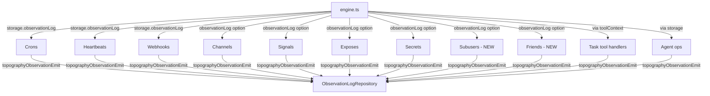

# Topography observation events

## Overview

Define and wire observation events for all topology change points across the system. Every mutation to the agent topography — agents, tasks, cron/webhook triggers, signals, channels, exposes, secrets, subusers, and friends — will emit a structured observation via `observationEmit`. This gives agents a queryable audit trail of what changed in their environment and when.

The observation log infrastructure already exists (repository, emit helper, query tool, formatter). This plan adds:
- A typed event catalog with `type`, `source`, `message`, `details`, and `data` for every topology change
- `ObservationLogRepository` wired into every facade class
- New `Subusers` and `Friends` facade classes to keep emission consistent
- Emit calls at the facade level so all changes are captured regardless of trigger (tool, cron, system, programmatic)

## Context

- Observation log: `sources/engine/observations/observationEmit.ts` — emit helper
- Observation log repo: `sources/storage/observationLogRepository.ts`
- Types: `sources/storage/databaseTypes.ts` (`ObservationLogDbRecord`)
- Facades: `sources/engine/{cron,webhook,channels,signals,expose,secrets}/`
- Agent ops: `sources/engine/agents/ops/`
- Tool handlers: `sources/engine/modules/tools/`
- Engine wiring: `sources/engine/engine.ts`
- Currently **zero** observation events are emitted anywhere

## Event Catalog

All types use colon-separated `domain:action` format. Source follows `<category>:<identifier>` convention.

### Agent events

| Type | Message (short) | Details (long) | Data structure |
|------|----------------|----------------|----------------|
| `agent:created` | `Agent created: <label>` | `Agent <id> created with descriptor type <type>, label "<label>", for user <userId>` | `{ agentId: string; userId: string; descriptorType: string; label: string; parentAgentId?: string }` |
| `agent:updated` | `Agent updated: <label>` | `Agent <id> descriptor updated to type <type>, label "<label>"` | `{ agentId: string; userId: string; descriptorType: string; label: string }` |
| `agent:lifecycle` | `Agent <lifecycle>: <label>` | `Agent <id> lifecycle changed to <lifecycle>` | `{ agentId: string; userId: string; lifecycle: string; label: string }` |

Source: `system:agents`
Scope IDs: `[userId]` (plus `parentAgentId` if present)

### Task events

| Type | Message | Details | Data |
|------|---------|---------|------|
| `task:created` | `Task created: <title>` | `Task <id> created for user <userId>: "<title>"` | `{ taskId: string; userId: string; title: string \| null; description: string \| null }` |
| `task:updated` | `Task updated: <title>` | `Task <id> updated for user <userId>: "<title>"` | `{ taskId: string; userId: string; title: string \| null; description: string \| null; changes: string[] }` |
| `task:deleted` | `Task deleted: <title>` | `Task <id> deleted for user <userId>: "<title>"` | `{ taskId: string; userId: string; title: string \| null }` |

Source: `system:tasks`
Scope IDs: `[userId]`

### Cron trigger events

| Type | Message | Details | Data |
|------|---------|---------|------|
| `cron:added` | `Cron added: <name>` | `Cron trigger <id> added for task <taskId>, schedule "<schedule>" tz <timezone>` | `{ cronId: string; taskId: string; userId: string; name: string; schedule: string; timezone: string }` |
| `cron:deleted` | `Cron deleted: <name>` | `Cron trigger <id> deleted for task <taskId>` | `{ cronId: string; taskId: string; userId: string; name: string }` |
| `cron:enabled` | `Cron enabled: <name>` | `Cron trigger <id> enabled for task <taskId>` | `{ cronId: string; taskId: string; userId: string; name: string }` |
| `cron:disabled` | `Cron disabled: <name>` | `Cron trigger <id> disabled for task <taskId>` | `{ cronId: string; taskId: string; userId: string; name: string }` |

Source: `system:crons`
Scope IDs: `[userId]`

### Webhook trigger events

| Type | Message | Details | Data |
|------|---------|---------|------|
| `webhook:added` | `Webhook added: <name>` | `Webhook trigger <id> added for task <taskId>, path "<path>"` | `{ webhookId: string; taskId: string; userId: string; name: string; path: string }` |
| `webhook:deleted` | `Webhook deleted: <name>` | `Webhook trigger <id> deleted for task <taskId>` | `{ webhookId: string; taskId: string; userId: string; name: string }` |

Source: `system:webhooks`
Scope IDs: `[userId]`

### Signal subscription events

| Type | Message | Details | Data |
|------|---------|---------|------|
| `signal:subscribed` | `Signal subscribed: <pattern>` | `Agent <agentId> subscribed to signal pattern "<pattern>" (silent: <silent>)` | `{ agentId: string; userId: string; pattern: string; silent: boolean }` |
| `signal:unsubscribed` | `Signal unsubscribed: <pattern>` | `Agent <agentId> unsubscribed from signal pattern "<pattern>"` | `{ agentId: string; userId: string; pattern: string }` |

Source: `system:signals`
Scope IDs: `[userId, agentId]`

### Channel events

| Type | Message | Details | Data |
|------|---------|---------|------|
| `channel:created` | `Channel created: <name>` | `Channel "<name>" created with leader <leader>` | `{ channelId: string; userId: string; name: string; leader: string }` |
| `channel:deleted` | `Channel deleted: <name>` | `Channel "<name>" deleted, <memberCount> members removed` | `{ channelId: string; userId: string; name: string; memberCount: number }` |
| `channel:member_joined` | `Channel member joined: <username> → <name>` | `Agent <agentId> joined channel "<name>" as <username>` | `{ channelId: string; userId: string; name: string; agentId: string; username: string }` |
| `channel:member_left` | `Channel member left: <username> → <name>` | `Agent <agentId> left channel "<name>"` | `{ channelId: string; userId: string; name: string; agentId: string; username: string }` |

Source: `system:channels`
Scope IDs: `[userId, channelId]`

### Expose events

| Type | Message | Details | Data |
|------|---------|---------|------|
| `expose:created` | `Expose created: <domain>` | `Expose endpoint <id> created for domain "<domain>" via <provider> (<mode>)` | `{ exposeId: string; userId: string; domain: string; target: string; provider: string; mode: string; authenticated: boolean }` |
| `expose:removed` | `Expose removed: <domain>` | `Expose endpoint <id> removed for domain "<domain>"` | `{ exposeId: string; userId: string; domain: string }` |
| `expose:updated` | `Expose updated: <domain>` | `Expose endpoint <id> updated for domain "<domain>"` | `{ exposeId: string; userId: string; domain: string; target: string; provider: string; mode: string; authenticated: boolean }` |

Source: `system:exposes`
Scope IDs: `[userId]`

### Secret events

| Type | Message | Details | Data |
|------|---------|---------|------|
| `secret:added` | `Secret added: <displayName>` | `Secret "<name>" added with variables: <variableNames>` | `{ userId: string; name: string; displayName: string; variableNames: string[] }` |
| `secret:removed` | `Secret removed: <displayName>` | `Secret "<name>" removed` | `{ userId: string; name: string; displayName: string }` |

Source: `system:secrets`
Scope IDs: `[userId]`

### Subuser events

| Type | Message | Details | Data |
|------|---------|---------|------|
| `subuser:created` | `Subuser created: <name>` | `Subuser <id> created for owner <ownerUserId> with name "<name>"` | `{ subuserId: string; ownerUserId: string; name: string \| null; nametag: string \| null; gatewayAgentId: string \| null }` |
| `subuser:configured` | `Subuser configured: <name>` | `Subuser <id> gateway agent updated` | `{ subuserId: string; ownerUserId: string; name: string \| null; gatewayAgentId: string }` |

Source: `system:subusers`
Scope IDs: `[ownerUserId, subuserId]`

### Friend/connection events

| Type | Message | Details | Data |
|------|---------|---------|------|
| `friend:requested` | `Friend request sent to <nametag>` | `Friend request from <fromUserId> to <toUserId> (<nametag>)` | `{ fromUserId: string; toUserId: string; toNametag: string \| null }` |
| `friend:accepted` | `Friend accepted: <nametag>` | `Friend connection active between <userAId> and <userBId>` | `{ userAId: string; userBId: string; nametag: string \| null }` |
| `friend:removed` | `Friend removed: <nametag>` | `Friend connection removed between <userAId> and <userBId>` | `{ userAId: string; userBId: string; nametag: string \| null }` |
| `friend:subuser_shared` | `Subuser shared: <subuserName> → <friendNametag>` | `Subuser <subuserId> shared from <ownerUserId> to friend <friendUserId>` | `{ subuserId: string; subuserName: string; ownerUserId: string; friendUserId: string; friendNametag: string \| null }` |
| `friend:subuser_unshared` | `Subuser unshared: <subuserName> → <friendNametag>` | `Subuser <subuserId> unshared from friend <friendUserId>` | `{ subuserId: string; subuserName: string; ownerUserId: string; friendUserId: string; friendNametag: string \| null }` |

Source: `system:friends`
Scope IDs: `[fromUserId, toUserId]` (or `[ownerUserId, friendUserId]` for shares)

## Development Approach
- **Testing approach**: Regular (code first, then tests)
- Complete each task fully before moving to the next
- Make small, focused changes
- **CRITICAL: every task MUST include new/updated tests** for code changes in that task
- **CRITICAL: all tests must pass before starting next task**
- **CRITICAL: update this plan file when scope changes during implementation**
- Run tests after each change
- Maintain backward compatibility

## Testing Strategy
- **Unit tests**: required for every task
- Test that observations are emitted with correct type, source, message, details, data, and scope IDs
- Mock or use in-memory PGlite for `ObservationLogRepository`

## Progress Tracking
- Mark completed items with `[x]` immediately when done
- Add newly discovered tasks with ➕ prefix
- Document issues/blockers with ⚠️ prefix

## Implementation Steps

### Task 1: Define topography event type constants and data types
- [x] Create `sources/engine/observations/topographyEvents.ts` with string literal type for all event types (`agent:created`, `agent:updated`, `agent:lifecycle`, `task:created`, etc.)
- [x] Define typed data interfaces for each event category: `AgentCreatedData`, `AgentUpdatedData`, `AgentLifecycleData`, `TaskCreatedData`, `TaskUpdatedData`, `TaskDeletedData`, `CronAddedData`, etc.
- [x] Define source constants: `TOPO_SOURCE_AGENTS`, `TOPO_SOURCE_TASKS`, `TOPO_SOURCE_CRONS`, etc.
- [x] Define a typed emit helper `topographyObservationEmit` that narrows type+data pairs for type safety
- [x] Export types from `@/types`
- [x] Write tests for `topographyObservationEmit` verifying correct record shape for each event type
- [x] Run tests — must pass before next task

### Task 2: Wire agent lifecycle observations
- [x] Add `ObservationLogRepository` to `agentDescriptorWrite` params (or pass via storage in caller)
- [x] Emit `agent:created` in `agentDescriptorWrite` when creating a new descriptor (no existing record)
- [x] Emit `agent:updated` in `agentDescriptorWrite` when updating an existing descriptor
- [x] Find where agent lifecycle transitions happen (alive→dead, restore) and emit `agent:lifecycle`
- [x] Use `agentDescriptorLabel` for human-readable label in messages
- [x] Write tests verifying agent observations are emitted on create, update, lifecycle change
- [x] Run tests — must pass before next task

### Task 3: Wire task observations
- [x] Locate task facade or storage calls for create/update/delete in `sources/engine/modules/tools/task.ts`
- [x] Add `ObservationLogRepository` dependency to task tool builders (or pass via toolContext)
- [x] Emit `task:created` after `storage.tasks.create()`
- [x] Emit `task:updated` after `storage.tasks.update()` with list of changed fields
- [x] Emit `task:deleted` after `storage.tasks.delete()`
- [x] Write tests verifying task observations
- [x] Run tests — must pass before next task

### Task 4: Wire cron trigger observations
- [x] Add `ObservationLogRepository` to `Crons` options (already has `storage`, use `storage.observationLog`)
- [x] Emit `cron:added` in `Crons.addTask()`
- [x] Emit `cron:deleted` in `Crons.deleteTask()`
- [x] Find enable/disable entry points and emit `cron:enabled` / `cron:disabled`
- [x] Write tests verifying cron observations
- [x] Run tests — must pass before next task

### Task 6: Wire webhook trigger observations
- [x] Use `storage.observationLog` in `Webhooks` (already has full `Storage`)
- [x] Emit `webhook:added` in `Webhooks.addTrigger()`
- [x] Emit `webhook:deleted` in `Webhooks.deleteTrigger()`
- [x] Write tests verifying webhook observations
- [x] Run tests — must pass before next task

### Task 7: Wire signal subscription observations
- [x] Add `observationLog: ObservationLogRepository` to `SignalsOptions`
- [x] Emit `signal:subscribed` in `Signals.subscribe()`
- [x] Emit `signal:unsubscribed` in `Signals.unsubscribe()`
- [x] Update `Signals` constructor in `engine.ts` to pass `storage.observationLog`
- [x] Write tests verifying signal observations
- [x] Run tests — must pass before next task

### Task 8: Wire channel observations
- [x] Add `observationLog: ObservationLogRepository` to `ChannelsOptions`
- [x] Emit `channel:created` in `Channels.create()`
- [x] Emit `channel:deleted` in `Channels.delete()` (include member count)
- [x] Emit `channel:member_joined` in `Channels.addMember()`
- [x] Emit `channel:member_left` in `Channels.removeMember()`
- [x] Update `Channels` constructor in `engine.ts` to pass `storage.observationLog`
- [x] Write tests verifying channel observations
- [x] Run tests — must pass before next task

### Task 9: Wire expose observations
- [x] Add `observationLog: ObservationLogRepository` to `ExposesOptions`
- [x] Emit `expose:created` in `Exposes.create()`
- [x] Emit `expose:removed` in `Exposes.remove()`
- [x] Emit `expose:updated` in `Exposes.update()`
- [x] Update `Exposes` constructor in `engine.ts` to pass `storage.observationLog`
- [x] Write tests verifying expose observations
- [x] Run tests — must pass before next task

### Task 10: Wire secret observations
- [x] Add `observationLog: ObservationLogRepository` to `Secrets` constructor (currently only takes `usersDir`)
- [x] Refactor `Secrets` constructor to accept options object with `usersDir` + `observationLog`
- [x] Emit `secret:added` in `Secrets.add()`
- [x] Emit `secret:removed` in `Secrets.remove()`
- [x] Update `Secrets` constructor in `engine.ts` to pass `storage.observationLog`
- [x] Write tests verifying secret observations
- [x] Run tests — must pass before next task

### Task 11: Create Subusers facade and wire observations
- [x] Create `sources/engine/subusers/subusers.ts` with `Subusers` facade class
- [x] Move subuser create logic from `subuserCreateToolBuild.ts` execute into `Subusers.create()`
- [x] Move subuser configure logic from `subuserConfigureToolBuild.ts` execute into `Subusers.configure()`
- [x] Accept `ObservationLogRepository` in options
- [x] Emit `subuser:created` in `Subusers.create()`
- [x] Emit `subuser:configured` in `Subusers.configure()`
- [x] Instantiate in `engine.ts`, update tool builders to use facade
- [x] Write tests verifying subuser observations
- [x] Run tests — must pass before next task

### Task 12: Create Friends facade and wire observations
- [x] Create `sources/engine/friends/friends.ts` with `Friends` facade class
- [x] Move friend request/accept logic from `friendAddToolBuild.ts` into `Friends.add()`
- [x] Move friend remove logic from `friendRemoveToolBuild.ts` into `Friends.remove()`
- [x] Move share logic from `friendShareSubuserToolBuild.ts` into `Friends.shareSubuser()`
- [x] Move unshare logic from `friendUnshareSubuserToolBuild.ts` into `Friends.unshareSubuser()`
- [x] Accept `ObservationLogRepository` in options
- [x] Emit `friend:requested` / `friend:accepted` in `Friends.add()` based on connection state
- [x] Emit `friend:removed` in `Friends.remove()`
- [x] Emit `friend:subuser_shared` in `Friends.shareSubuser()`
- [x] Emit `friend:subuser_unshared` in `Friends.unshareSubuser()`
- [x] Instantiate in `engine.ts`, update tool builders to use facade
- [x] Write tests verifying friend observations
- [x] Run tests — must pass before next task

### Task 13: Verify acceptance criteria
- [x] Verify all 30 event types from the catalog are emitted
- [x] Verify every facade emits with correct type, source, message, details, data, and scope IDs
- [x] Run full test suite (unit tests)
- [x] Run linter — all issues must be fixed
- [x] Run typecheck — must pass

### Task 14: Update documentation
- [x] Update `sources/engine/observations/README.md` with complete event catalog
- [x] Create `sources/engine/subusers/README.md` for new facade
- [x] Create `sources/engine/friends/README.md` for new facade
- [x] Update `doc/internals/` if topology docs reference observation events

## Technical Details

### Event type string format
```
<domain>:<action>
```
Domains: `agent`, `task`, `cron`, `webhook`, `signal`, `channel`, `expose`, `secret`, `subuser`, `friend`

### Source string format
```
system:<domain-plural>
```
Examples: `system:agents`, `system:tasks`, `system:crons`, `system:channels`

### Message format
Short, human-scannable: `<Domain> <action>: <identifying label>`

### Details format
Full context: `<Domain> <id> <action> for <owner context>: <additional info>`

### Scope IDs
Always include `userId`. Add relevant secondary IDs (agentId, channelId, subuserId) for cross-scope queryability.

### Dependency injection pattern
Facades that already have `Storage` use `this.storage.observationLog`. Others get `observationLog` added to their options interface. All wiring happens in `engine.ts`.



## Post-Completion

**Manual verification:**
- Run a local env (`yarn env`) and trigger topology changes via tools
- Query observations via `observation_query` tool to verify events appear
- Verify short/full format renders correctly for new event types

**Follow-up considerations:**
- Consider adding rate limiting if a burst of topology changes creates too many observations
- Consider adding observation pruning/TTL for old topology events
