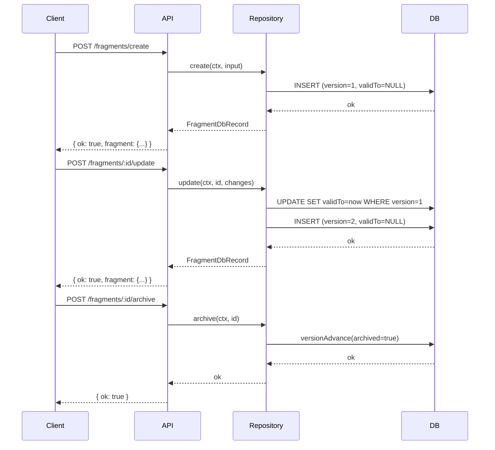

# Fragments System

## Overview
Fragments are self-contained, versioned UI definitions stored as json-render specs in the database. They are universal — any piece of UI that can be embedded anywhere in the app. A fragment's JSON fully describes its visual structure using the existing widget catalog (`@json-render/core` with Material Design 3 tokens).

**Key properties:**
- Each fragment stores a `kitVersion` string (e.g. `"1"`) indicating which version of the widget catalog schema it was built against
- Fragments use event-sourced versioning (same as documents, tasks) with `version`/`validFrom`/`validTo`
- Fragments can be created, updated, or archived (soft-deleted) — never hard-deleted
- Archived fragments are hidden from listings but still renderable if referenced directly
- API and LLM tools can create/update fragments; LLM always does this via a `create-fragment` subagent skill

**This plan covers:** database schema + migration, repository, API endpoints. Skill and export script are follow-up work.

## Context
- Existing widget catalog: `packages/daycare-app/sources/widgets/widgets.ts` — defines all components (Column, Text, Button, etc.) with Zod validation
- Event-sourced versioning: `packages/daycare/sources/storage/versionAdvance.ts` — closes old row, inserts new version atomically
- Repository pattern: `packages/daycare/sources/storage/documentsRepository.ts` (with AsyncLock + write-through cache)
- API pattern: `packages/daycare/sources/api/routes/routes.ts` — central dispatcher to domain handlers
- Schema: `packages/daycare/sources/schema.ts` — Drizzle table definitions
- Migrations: `packages/daycare/sources/storage/migrations/` — timestamped SQL files registered in `_migrations.ts`

## Development Approach
- **Testing approach**: Code first, then tests
- Complete each task fully before moving to the next
- Make small, focused changes
- **CRITICAL: every task MUST include new/updated tests**
- **CRITICAL: all tests must pass before starting next task**
- **CRITICAL: update this plan file when scope changes during implementation**
- Run tests after each change
- Maintain backward compatibility

## Testing Strategy
- **Unit tests**: required for every task
- Repository tests against in-memory PGlite (`:memory:`)
- API handler tests with mocked repository

## Progress Tracking
- Mark completed items with `[x]` immediately when done
- Add newly discovered tasks with ➕ prefix
- Document issues/blockers with ⚠️ prefix

## Implementation Steps

### Task 1: Add fragments table to database schema
- [x] Add `fragmentsTable` to `packages/daycare/sources/schema.ts` with columns:
  - `id` (text, not null) — unique fragment identifier
  - `userId` (text, not null) — owner user
  - `version` (integer, not null, default 1)
  - `validFrom` (bigint, not null) — unix ms
  - `validTo` (bigint, nullable) — null = active
  - `kitVersion` (text, not null) — widget catalog version (e.g. `"1"`)
  - `title` (text, not null) — human-readable name
  - `description` (text, not null, default `""`) — what this fragment does
  - `spec` (jsonb, not null) — the json-render spec
  - `archived` (boolean, not null, default false) — archive flag
  - `createdAt` (bigint, not null) — unix ms
  - `updatedAt` (bigint, not null) — unix ms
  - Primary key: `(userId, id, version)`
  - Indexes: `idx_fragments_user_id`, `idx_fragments_id_valid_to`, `idx_fragments_updated_at`
- [x] Add `fragmentsTable` to the `schema` export object
- [x] Create migration `20260304120000_fragments.sql` with CREATE TABLE + indexes
- [x] Register migration in `_migrations.ts`
- [x] Run typecheck — must pass before next task

### Task 2: Create FragmentsRepository
- [x] Create `packages/daycare/sources/storage/fragmentsRepository.ts` with class `FragmentsRepository`
  - Constructor takes `DaycareDb`
  - Write-through cache: `Map<string, FragmentDbRecord>` keyed by `userId:id`
  - Per-fragment `AsyncLock` and `cacheLock`
- [x] Add `FragmentDbRecord` type to `packages/daycare/sources/storage/databaseTypes.ts`:
  - `id`, `userId`, `version?`, `validFrom?`, `validTo?`, `kitVersion`, `title`, `description`, `spec` (unknown/jsonb), `archived`, `createdAt`, `updatedAt`
- [x] Implement `create(ctx, input)` — inserts version 1 with `validTo: null`
- [x] Implement `update(ctx, id, input)` — uses `versionAdvance` to close current, insert next
- [x] Implement `archive(ctx, id)` — uses `versionAdvance` with `archived: true`
- [x] Implement `findById(ctx, id)` — returns active record (`validTo IS NULL`), cache-aware
- [x] Implement `findAll(ctx)` — returns all active non-archived fragments for user
- [x] Implement `findAnyById(ctx, id)` — returns latest version including archived, for direct reference rendering
- [x] Write tests for `create` (success + duplicate id error)
- [x] Write tests for `update` (success + not found error)
- [x] Write tests for `archive` (success + not found error + still findable via `findAnyById`)
- [x] Write tests for `findById` (active only) and `findAll` (excludes archived)
- [x] Run tests — must pass before next task

### Task 3: Add fragments API routes
- [x] Create `packages/daycare/sources/api/routes/fragments/` directory
- [x] Create `fragmentsRoutes.ts` with `fragmentsRouteHandle` dispatcher:
  - `GET /fragments` — list active non-archived fragments
  - `GET /fragments/:id` — get fragment by id (including archived if referenced directly)
  - `POST /fragments/create` — create fragment
  - `POST /fragments/:id/update` — update fragment
  - `POST /fragments/:id/archive` — archive fragment
- [x] Create `fragmentsList.ts` — handler for `GET /fragments`, returns `{ ok: true, fragments: [...] }`
- [x] Create `fragmentsFindById.ts` — handler for `GET /fragments/:id`, returns `{ ok: true, fragment: {...} }`
- [x] Create `fragmentsCreate.ts` — validates `title`, `kitVersion`, `spec`; returns `{ ok: true, fragment: {...} }`
- [x] Create `fragmentsUpdate.ts` — validates partial fields; returns `{ ok: true, fragment: {...} }`
- [x] Create `fragmentsArchive.ts` — archives by id; returns `{ ok: true }`
- [x] Register in `routes.ts`: add `FragmentsRepository | null` to `ApiRouteContext`, add `pathname.startsWith("/fragments")` dispatch
- [x] Write tests for each handler (success + error cases)
- [x] Run tests — must pass before next task

### Task 4: Wire FragmentsRepository into server startup
- [x] Find where other repositories (DocumentsRepository, KeyValuesRepository) are instantiated and passed to ApiRouteContext
- [x] Instantiate `FragmentsRepository` with the same `db` instance
- [x] Pass it into `ApiRouteContext` as `fragments`
- [x] Run typecheck and tests — must pass before next task

### Task 5: Verify acceptance criteria
- [x] Verify fragments can be created via `POST /fragments/create` with kitVersion, title, spec
- [x] Verify fragments can be updated via `POST /fragments/:id/update` (creates new version)
- [x] Verify fragments can be archived via `POST /fragments/:id/archive`
- [x] Verify archived fragments are excluded from `GET /fragments` list
- [x] Verify archived fragments are still returned by `GET /fragments/:id`
- [x] Verify version history is preserved (old versions have validTo set)
- [x] Run full test suite
- [x] Run linter — all issues must be fixed

### Task 6: Update documentation
- [x] Add `/doc/fragments.md` documenting the fragments system, API endpoints, and data model with mermaid diagram

## Technical Details

### Fragment Data Shape (API response)
```json
{
    "id": "frag_abc123",
    "kitVersion": "1",
    "title": "User Profile Card",
    "description": "Displays user avatar, name, and bio",
    "spec": { "type": "Column", "children": [...] },
    "archived": false,
    "version": 2,
    "createdAt": 1709553600000,
    "updatedAt": 1709640000000
}
```

### API Endpoints
| Method | Path | Description |
|--------|------|-------------|
| `GET` | `/fragments` | List active non-archived fragments |
| `GET` | `/fragments/:id` | Get fragment by ID (includes archived) |
| `POST` | `/fragments/create` | Create new fragment |
| `POST` | `/fragments/:id/update` | Update fragment (new version) |
| `POST` | `/fragments/:id/archive` | Archive fragment |

### Versioning Flow


## Post-Completion
**Follow-up work (separate plans):**
- Export script: app-side script to export widget catalog Zod schema + prompt as JSON
- `create-fragment` skill: SKILL.md with exported prompt content, invoked as subagent for LLM-driven fragment creation
- App-side rendering: load fragments from API and render via `JSONUIProvider`/`Renderer`
