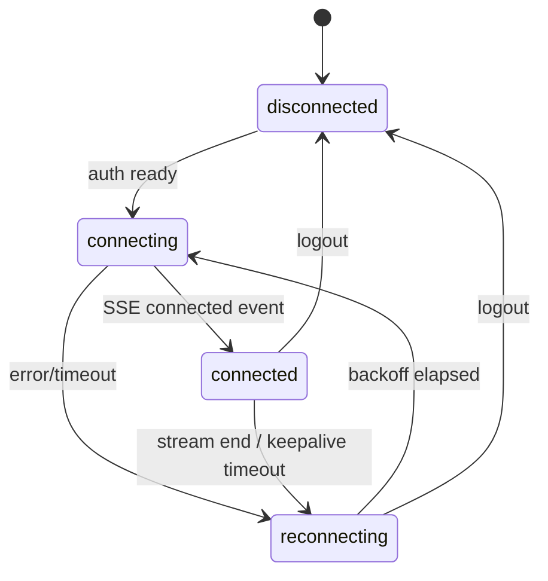

# Reliable App-Server Sync via SSE (Agents)

## Context

The app currently uses polling (3s intervals for chat, manual fetch for agent lists) with no real-time sync. When agents change state (lifecycle, creation, deletion), the app only sees updates on manual refresh. This plan adds reliable SSE-based sync for agents and their states, with infrastructure designed to extend to other entities later.

## Overview

- SSE stream from server to app delivers granular agent change events
- Each event carries the changed `AgentListItem` data with `updatedAt` for conflict resolution
- User-scoped: each SSE connection only receives events for the authenticated user
- Client applies deltas to Zustand store immediately for snappy UI
- On reconnect (after connection loss), full refetch to reconcile any missed events
- Keepalive mechanism to detect dead connections through proxies

## Development Approach
- Complete each task fully before moving to the next
- Make small, focused changes
- Every task includes tests
- All tests must pass before starting next task
- Run linter after changes

## Implementation Steps

### Task 1: Add user scoping and keepalive to SSE stream (server)

**Files:**
- `packages/daycare/sources/engine/ipc/events.ts`
- `packages/daycare/sources/api/routes/events/eventsStream.ts`
- `packages/daycare/sources/api/routes/events/eventsRoutes.ts`
- `packages/daycare/sources/api/app-server/appServer.ts`

- [ ] Add `userId` field to `EngineEvent` type in `events.ts`
- [ ] Update `EventsStreamInput` to include `userId: string`
- [ ] Filter events in `eventsStream`: skip events where `event.userId` exists and doesn't match `input.userId`
- [ ] Add keepalive timer: send `:keepalive\n\n` comment every 30 seconds, clear on close
- [ ] Update `EventsRouteContext` to include `userId` and pass it from `eventsRouteHandle`
- [ ] Update `appServer.ts` to pass `auth.userId` into `eventsRouteHandle` context
- [ ] Write tests for event filtering (user-scoped events pass, others filtered)
- [ ] Write tests for keepalive timer lifecycle
- [ ] Run tests

### Task 2: Emit agent change events from engine (server)

**Files:**
- New: `packages/daycare/sources/engine/agents/ops/agentEventEmit.ts`
- `packages/daycare/sources/engine/engine.ts`
- `packages/daycare/sources/engine/agents/ops/agentStateWrite.ts`
- `packages/daycare/sources/engine/agents/ops/agentWrite.ts`

- [ ] Create `agentEventEmit.ts`: helper that takes event bus, userId, event type (`agent.created` | `agent.updated` | `agent.deleted`), and agent data; emits to event bus with userId scoping
- [ ] For agent lifecycle changes: pass event bus into `agentStateWrite` (or emit from calling site in engine). Emit `agent.updated` with `{ agentId, lifecycle, updatedAt }` when lifecycle changes
- [ ] For agent creation: emit `agent.created` with full `AgentListItem` fields after `agentWrite` creates a new agent. Emit from engine's `agentCreate` callback after successful creation
- [ ] For agent deletion: emit `agent.deleted` with `{ agentId }` from engine's `agentKill` callback after successful kill
- [ ] For agent config updates (name, description changes via `agentWrite` on existing): emit `agent.updated` with changed fields
- [ ] Write tests for `agentEventEmit` (correct event shape, userId included)
- [ ] Run tests

### Task 3: Define sync event types and SSE client (app)

**Files:**
- New: `packages/daycare-app/sources/modules/sync/syncEventTypes.ts`
- New: `packages/daycare-app/sources/modules/sync/sseClientCreate.ts`

- [ ] Create `syncEventTypes.ts`: typed event discriminated union for `agent.created`, `agent.updated`, `agent.deleted` with their payloads
- [ ] Create `sseClientCreate.ts`: portable SSE client using `fetch()` with `ReadableStream`
  - Accepts `baseUrl`, `token`, event callback, status callback
  - Sets `Authorization: Bearer ${token}` header
  - Parses SSE `data:` lines into JSON events
  - On stream end/error: calls status callback with `disconnected`
  - Returns `{ close(): void }` handle
  - Does NOT handle reconnection (that's the sync store's job)
- [ ] Write tests for SSE line parsing logic (extract into pure function `sseLineParse`)
- [ ] Run tests

### Task 4: Create sync store with reconnection (app)

**Files:**
- New: `packages/daycare-app/sources/modules/sync/syncStoreCreate.ts`
- New: `packages/daycare-app/sources/modules/sync/syncContext.ts`

- [ ] Create `syncStoreCreate.ts`: Zustand store managing SSE connection lifecycle
  - State: `status: "disconnected" | "connecting" | "connected" | "reconnecting"`, `lastConnectedAt: number | null`
  - `connect(baseUrl, token)`: opens SSE connection, sets status
  - `disconnect()`: closes connection, clears reconnection timer
  - On SSE `connected` event: set status `connected`, trigger full agent refetch
  - On SSE disconnect: set status `reconnecting`, schedule reconnect with exponential backoff (1s → 2s → 4s → 8s → max 30s)
  - On reconnect success: reset backoff, trigger full agent refetch (catches missed events)
  - On SSE agent events: dispatch to agent store's delta methods
  - Keepalive timeout: if no event/keepalive received within 60s, force reconnect
- [ ] Create `syncContext.ts`: singleton hook `useSyncStore` (same pattern as other stores)
- [ ] Write tests for reconnection backoff logic (extract into pure function)
- [ ] Write tests for keepalive timeout detection logic
- [ ] Run tests

### Task 5: Update agent store with delta merge support (app)

**Files:**
- `packages/daycare-app/sources/modules/agents/agentsStoreCreate.ts`
- `packages/daycare-app/sources/modules/agents/agentsTypes.ts`

- [ ] Add `applyCreated(agent: AgentListItem)` to agent store: prepends agent to list (if not already present by agentId)
- [ ] Add `applyUpdated(partial: { agentId: string } & Partial<AgentListItem>)`: merges fields into existing agent; skips if incoming `updatedAt` <= existing `updatedAt` (stale event)
- [ ] Add `applyDeleted(agentId: string)`: removes agent from list
- [ ] Write tests for `applyCreated` (new agent, duplicate prevention)
- [ ] Write tests for `applyUpdated` (merge fields, stale event rejection via updatedAt)
- [ ] Write tests for `applyDeleted` (removes existing, no-op for missing)
- [ ] Run tests

### Task 6: Wire sync into app lifecycle (app)

**Files:**
- `packages/daycare-app/sources/app/(app)/_layout.tsx` (or appropriate layout)
- New: `packages/daycare-app/sources/modules/sync/SyncProvider.tsx`

- [ ] Create `SyncProvider.tsx`: component that connects/disconnects sync based on auth state
  - On auth `authenticated` with valid `baseUrl`/`token`: call `syncStore.connect(baseUrl, token)`
  - On auth `unauthenticated` or logout: call `syncStore.disconnect()`
  - Wire SSE agent events to agent store delta methods
- [ ] Add `SyncProvider` to app layout (inside auth-protected area)
- [ ] Verify agents list updates live when agent lifecycle changes on server
- [ ] Run tests and linter

### Task 7: Verify acceptance criteria
- [ ] Verify SSE connection establishes on app authentication
- [ ] Verify agent list updates in real-time when agents change state
- [ ] Verify SSE reconnects automatically after server restart
- [ ] Verify full refetch occurs on reconnect (no missed updates)
- [ ] Verify user-scoped events (user A doesn't see user B's agents)
- [ ] Verify keepalive prevents proxy timeouts
- [ ] Run full test suite
- [ ] Run linter - all issues must be fixed

### Task 8: Update documentation
- [ ] Add sync architecture doc to `doc/` with mermaid diagram showing SSE flow
- [ ] Update plugin README if event bus changes affect plugin authors

## Technical Details

### SSE Event Format (server → client)
```
data: {"type":"agent.created","userId":"abc","payload":{"agentId":"x","path":"/...","kind":"app","name":"My Agent","lifecycle":"active","updatedAt":1709567890000,...},"timestamp":"2026-03-04T..."}

data: {"type":"agent.updated","userId":"abc","payload":{"agentId":"x","lifecycle":"sleeping","updatedAt":1709567891000},"timestamp":"2026-03-04T..."}

data: {"type":"agent.deleted","userId":"abc","payload":{"agentId":"x"},"timestamp":"2026-03-04T..."}
```

### Conflict Resolution
- Each agent carries `updatedAt` (unix ms timestamp)
- When applying `agent.updated`, compare incoming `updatedAt` with store's value
- Skip update if incoming `updatedAt` <= stored `updatedAt` (stale/duplicate event)
- On reconnect, full refetch replaces entire agent list (authoritative)

### Reconnection Flow


### Key Existing Code to Reuse
- `EngineEventBus` (`sources/engine/ipc/events.ts`) - event emission infrastructure
- `eventsStream` (`sources/api/routes/events/eventsStream.ts`) - SSE response handling
- `agentsFetch` (`packages/daycare-app/sources/modules/agents/agentsFetch.ts`) - full agent list fetch
- `createBackoff` / `exponentialBackoffDelay` (`sources/utils/time.ts`) - backoff utilities
- Auth store pattern (`packages/daycare-app/sources/modules/auth/`) - for connection lifecycle

### SSE Client Portability (React Native + Web)
- Use `fetch()` with `ReadableStream` on web
- For React Native: if `ReadableStream` is unavailable, fall back to `XMLHttpRequest` with `onprogress` for streaming
- Both approaches support `Authorization` header (unlike browser `EventSource`)

## Post-Completion

**Manual verification:**
- Test with `yarn env <name>`: create agents, observe live list updates in app
- Kill server process, restart, verify app reconnects and refreshes
- Test with multiple users to verify event isolation

**Future extensions (not in scope):**
- Add sync for tasks, documents, messages, etc. (same pattern: emit events + store delta methods)
- Replace chat polling with SSE-based message streaming
- Add sequence numbers for gap detection instead of full refetch
