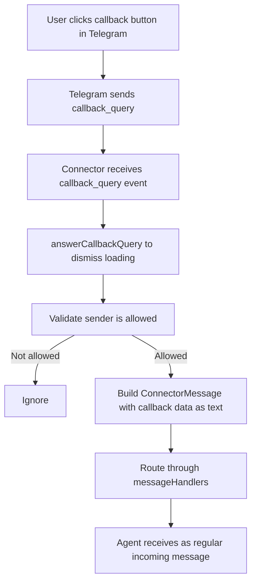
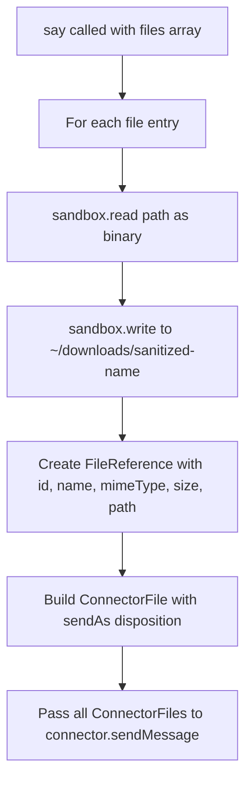

# Say Tool: Buttons & File Attachments

## Overview
Extend the `say` tool to support inline buttons and file attachments alongside text messages. Buttons work in Telegram (inline keyboard) and are silently dropped by connectors that don't support them. File attachments allow sending photos, videos, documents, and voice alongside text.

**End result:**
- Agent calls `say` with optional `buttons` array (URL or callback buttons) and optional `files` array (local file paths)
- Telegram renders URL buttons as inline keyboard links, callback buttons as clickable buttons that route the click as a new message to the agent
- Non-Telegram connectors silently ignore buttons
- Files are sent together with text (connector decides presentation — e.g. Telegram sends first file with caption)
- Callback query events are handled by Telegram connector: acknowledge click, route as incoming message

## Context
- **Say tool**: `sources/engine/modules/tools/sayTool.ts` — text-only, deferred execution support
- **Send file tool**: `sources/engine/modules/tools/send-file.ts` — file resolution from paths via sandbox
- **Connector types**: `sources/engine/modules/connectors/types.ts` — `ConnectorMessage` already has `buttons` and `files` fields
- **Button type**: `ConnectorMessageButton = { text: string; url: string }` — URL-only, needs callback variant
- **Telegram connector**: `sources/plugins/telegram/connector.ts` — `messageButtonsBuild()` renders buttons, no `callback_query` listener
- **Telegram sendMessage**: line 236 — already passes buttons via `reply_markup` for text-only messages

## Development Approach
- **Testing approach**: Regular (code first, then tests)
- Complete each task fully before moving to the next
- Make small, focused changes
- **CRITICAL: every task MUST include new/updated tests**
- **CRITICAL: all tests must pass before starting next task**
- **CRITICAL: update this plan file when scope changes during implementation**

## Progress Tracking
- Mark completed items with `[x]` immediately when done
- Add newly discovered tasks with ➕ prefix
- Document issues/blockers with ⚠️ prefix

## Implementation Steps

### Task 1: Extend `ConnectorMessageButton` to support callback buttons
- [x] Update `ConnectorMessageButton` in `sources/engine/modules/connectors/types.ts` to a discriminated union:
  ```typescript
  export type ConnectorMessageButton =
      | { type: "url"; text: string; url: string }
      | { type: "callback"; text: string; callback: string };
  ```
- [x] Update `messageButtonsBuild()` in `sources/plugins/telegram/connector.ts` to handle both types:
  - `type: "url"` → `{ text, url }`
  - `type: "callback"` → `{ text, callback_data: callback }`
- [x] Update existing button usages (search for `ConnectorMessageButton` and `buttons:` references) — currently used in `appServer.ts` for auth links
- [x] Write tests for `messageButtonsBuild` with URL buttons
- [x] Write tests for `messageButtonsBuild` with callback buttons
- [x] Write tests for `messageButtonsBuild` with mixed button types
- [x] Run tests — must pass before next task

### Task 2: Add `callback_query` handler to Telegram connector
- [x] Add `callback_query` event listener in Telegram connector constructor (after the `message` listener, line ~183)
- [x] On callback query:
  - Answer the callback query via `this.bot.answerCallbackQuery(callbackQuery.id)` to dismiss the loading state
  - Extract `callbackQuery.data` (the callback string) and `callbackQuery.message.chat.id` for routing
  - Build a `ConnectorMessage` with text like the callback data string
  - Route through existing `messageHandlers` as a regular incoming message
  - Build the agent path from callback query sender info (same pattern as message handler)
- [x] Validate sender is allowed (same `isAllowedUid` check as messages)
- [x] Write tests for callback query handling (message routed, unauthorized rejected)
- [x] Run tests — must pass before next task

### Task 3: Add `buttons` parameter to say tool schema
- [x] Extend say tool schema in `sayTool.ts` to accept optional `buttons` array:
  ```typescript
  buttons: Type.Optional(Type.Array(Type.Union([
      Type.Object({ type: Type.Literal("url"), text: Type.String(), url: Type.String() }),
      Type.Object({ type: Type.Literal("callback"), text: Type.String(), callback: Type.String() })
  ])))
  ```
- [x] Update `SayArgs` type accordingly
- [x] Update `SayDeferredPayload` to include `buttons`
- [x] Pass `buttons` through to `connector.sendMessage()` in both immediate and deferred execution paths
- [x] Update tool description to mention button support
- [x] Write tests for say with URL buttons
- [x] Write tests for say with callback buttons
- [x] Write tests for say deferred execution with buttons
- [x] Run tests — must pass before next task

### Task 4: Add `files` parameter to say tool schema
- [x] Extend say tool schema to accept optional `files` array:
  ```typescript
  files: Type.Optional(Type.Array(Type.Object({
      path: Type.String({ minLength: 1 }),
      mimeType: Type.String({ minLength: 1 }),
      name: Type.Optional(Type.String({ minLength: 1 })),
      sendAs: Type.Optional(Type.Union([
          Type.Literal("auto"),
          Type.Literal("document"),
          Type.Literal("photo"),
          Type.Literal("video"),
          Type.Literal("voice")
      ]))
  })))
  ```
- [x] Extract file resolution logic from `send-file.ts` into a shared helper `resolveFile()` in a new file `sources/engine/modules/tools/fileResolve.ts`
- [x] Update `send-file.ts` to import from the shared helper
- [x] In say tool execute: resolve each file path to a `ConnectorFile`, pass to `connector.sendMessage()` alongside text and buttons
- [x] Update `SayDeferredPayload` to include resolved files (files must be resolved before deferring since sandbox access is needed)
- [x] Update `executeDeferred` to pass files to `sendMessage()`
- [x] Update tool description to mention file attachment support
- [x] Write tests for say with single file attachment
- [x] Write tests for say with multiple files
- [x] Write tests for say with text + files + buttons combined
- [x] Write tests for say deferred execution with files
- [x] Run tests — must pass before next task

### Task 5: Add button usage guidance to Telegram system prompt
- [x] Update `TELEGRAM_MESSAGE_FORMAT_PROMPT` in `sources/plugins/telegram/connector.ts` to include guidance on using buttons with `say`:
  - URL buttons: attach a URL button when linking to external resources (opens in browser)
  - Callback buttons: attach a callback button when offering the user a quick action/choice (click routes back as a message)
  - Keep button text short and actionable
  - Buttons are optional — only use when they add value
- [x] Run tests — must pass before next task

### Task 6: Verify acceptance criteria
- [x] Verify buttons are silently dropped by connectors without button support (no crash)
- [x] Verify callback queries route as messages to the agent
- [x] Verify files are sent together with text
- [x] Verify deferred execution preserves buttons and files
- [x] Run full test suite (`yarn test`)
- [x] Run linter (`yarn lint`) — all issues must be fixed

### Task 7: Update documentation
- [x] Update Telegram plugin README if it exists
- [x] Add doc for say tool enhancements in `doc/`

## Technical Details

### Button type (discriminated union)
```typescript
export type ConnectorMessageButton =
    | { type: "url"; text: string; url: string }
    | { type: "callback"; text: string; callback: string };
```

### Updated say tool schema
```typescript
const schema = Type.Object({
    text: Type.String({ minLength: 1 }),
    now: Type.Optional(Type.Boolean()),
    buttons: Type.Optional(Type.Array(Type.Union([
        Type.Object({
            type: Type.Literal("url"),
            text: Type.String({ minLength: 1 }),
            url: Type.String({ minLength: 1 })
        }),
        Type.Object({
            type: Type.Literal("callback"),
            text: Type.String({ minLength: 1 }),
            callback: Type.String({ minLength: 1 })
        })
    ]))),
    files: Type.Optional(Type.Array(Type.Object({
        path: Type.String({ minLength: 1 }),
        mimeType: Type.String({ minLength: 1 }),
        name: Type.Optional(Type.String({ minLength: 1 })),
        sendAs: Type.Optional(Type.Union([
            Type.Literal("auto"),
            Type.Literal("document"),
            Type.Literal("photo"),
            Type.Literal("video"),
            Type.Literal("voice")
        ]))
    })))
}, { additionalProperties: false });
```

### Callback query flow


### File resolution flow


### Deferred payload (updated)
```typescript
type SayDeferredPayload = {
    connector: string;
    targetId: string;
    text: string;
    replyToMessageId?: string;
    buttons?: ConnectorMessageButton[];
    files?: ConnectorFile[];  // Already resolved before deferring
};
```

## Post-Completion

**Manual verification:**
- Test with a real Telegram bot: send message with URL buttons, verify inline keyboard renders
- Test callback button: click it, verify agent receives the callback as a message
- Test file attachments: send photo + text, verify Telegram shows photo with caption
- Test combined: text + buttons + photo in single say call
- Test non-Telegram connector: verify buttons are silently dropped
