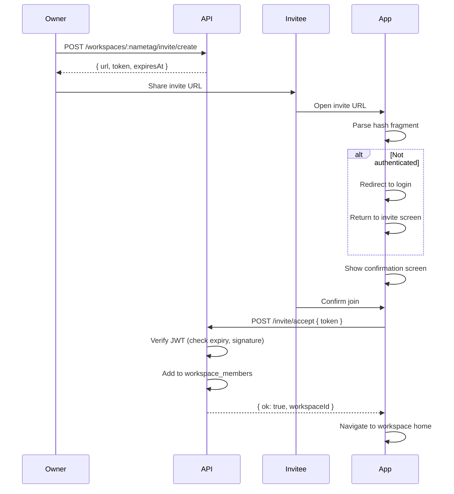
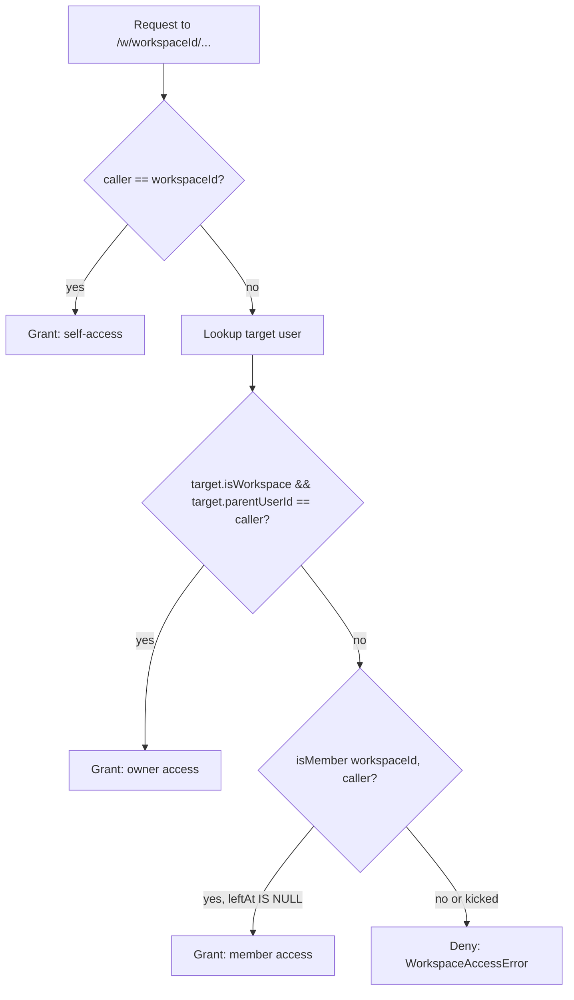

# Workspace Members and Invites

## Overview
- Add multi-member support to workspaces via a `workspace_members` table linking internal user IDs to workspaces
- Introduce invite links: JWT-based tokens in URL fragments (like existing auth links) that are reusable until their 10-minute expiration
- Only workspace owners can create invites and kick members
- Kicked members have `leftAt` + `reason` recorded and are blocked from rejoining
- Accepting an invite shows a confirmation screen; if the user has no account, they log in first, then confirm
- Includes a dedicated "Members" screen in the app showing current members with invite/remove capabilities

## Context (from discovery)
- Workspaces are user records with `isWorkspace=true` and `parentUserId` pointing to owner
- Access control lives in `appWorkspaceResolve.ts` — currently only allows self-access or parent (owner) access
- Auth uses JWT tokens signed via `jwtSign()` from `utils/jwt.ts`; auth links use `appAuthPayloadUrlBuild()` with base64url-encoded hash payloads
- App uses Expo Router with `[workspace]` param, Zustand stores, `ItemList`/`ItemGroup`/`PageHeader` components
- No membership table exists yet — membership is implicit via `parentUserId`

## Development Approach
- **Testing approach**: Regular (code first, then tests)
- Complete each task fully before moving to the next
- Make small, focused changes
- **CRITICAL: every task MUST include new/updated tests** for code changes in that task
- **CRITICAL: all tests must pass before starting next task**
- **CRITICAL: update this plan file when scope changes during implementation**
- Run tests after each change
- Maintain backward compatibility with existing owner-based workspace access

## Testing Strategy
- **Unit tests**: required for every task
- **E2E tests**: not applicable (no Playwright/Cypress setup)

## Progress Tracking
- Mark completed items with `[x]` immediately when done
- Add newly discovered tasks with + prefix
- Document issues/blockers with ! prefix
- Update plan if implementation deviates from original scope
- + Workspace list access expanded so joined workspaces appear for active members, not only owners
- + Invite acceptance required auth return handling; added persisted redirect restoration after login

## Implementation Steps

### Task 1: Create `workspace_members` table (migration + schema)
- [x] Create migration `YYYYMMDD_workspace_members.sql` adding `workspace_members` table with columns: `id` (serial PK), `workspace_id` (text, references workspace user ID), `user_id` (text, references member's internal user ID), `joined_at` (bigint, unix ms), `left_at` (bigint, nullable — set when kicked), `kick_reason` (text, nullable — why they were kicked), unique index on `(workspace_id, user_id)`
- [x] Add `workspaceMembersTable` to `schema.ts` with Drizzle definition matching the migration
- [x] Write tests verifying migration applies cleanly on PGlite `:memory:`
- [x] Run tests — must pass before next task

### Task 2: Create `workspaceMembersRepository`
- [x] Create `sources/storage/workspaceMembersRepository.ts` with methods: `add(workspaceId, userId)`, `kick(workspaceId, userId, reason)`, `findByWorkspace(workspaceId)` (active only, `leftAt IS NULL`), `findByUser(userId)` (active only), `isMember(workspaceId, userId)` (active only, `leftAt IS NULL`), `isKicked(workspaceId, userId)` (has record with `leftAt IS NOT NULL`)
- [x] `add()` should be idempotent (upsert / ON CONFLICT DO NOTHING) but must reject if user was kicked (`leftAt IS NOT NULL`)
- [x] `kick()` sets `leftAt` to now and `kickReason` to the provided reason
- [x] Wire repository into the storage layer (register in storage factory / context)
- [x] Write tests for all repository methods (success + edge cases: duplicate add, kick, add-after-kick rejected, kick non-existent)
- [x] Run tests — must pass before next task

### Task 3: Update workspace access resolution for members
- [x] Update `appWorkspaceResolve.ts` to accept `WorkspaceMembersRepository` as a dependency
- [x] After owner check fails, check `isMember(workspaceId, callerUserId)` (active only, `leftAt IS NULL`) — if true, grant access
- [x] Write tests for member access (member can access, non-member denied, owner still works)
- [x] Run tests — must pass before next task

### Task 4: Invite token generation and validation
- [x] Create `sources/engine/workspaces/workspaceInviteTokenCreate.ts` — generates a JWT with payload `{ workspaceId, kind: "workspace-invite" }`, signed with server secret, 10-minute expiry
- [x] Create `sources/engine/workspaces/workspaceInviteTokenVerify.ts` — verifies JWT, checks expiry, returns `{ workspaceId }` or throws
- [x] Create `sources/engine/workspaces/workspaceInviteUrlBuild.ts` — builds URL like `{appEndpoint}/invite#{base64url(payload)}` where payload includes `backendUrl`, `token`, `kind: "workspace-invite"`
- [x] Write tests for token create/verify (valid token, expired token, tampered token)
- [x] Write tests for URL building
- [x] Run tests — must pass before next task

### Task 5: Backend API — create invite link
- [x] Add `POST /workspaces/:nametag/invite/create` endpoint — owner-only, returns `{ ok: true, url, token, expiresAt }`
- [x] Resolve workspace by nametag, verify caller is owner
- [x] Use `workspaceInviteTokenCreate` + `workspaceInviteUrlBuild` to generate the link
- [x] Write tests for endpoint (owner can create, non-owner rejected)
- [x] Run tests — must pass before next task

### Task 6: Backend API — accept invite
- [x] Add `POST /invite/accept` endpoint (not workspace-scoped) — accepts `{ token }` in body
- [x] Verify token via `workspaceInviteTokenVerify`, extract `workspaceId`
- [x] Verify workspace exists and is valid
- [x] Check if caller was kicked (`isKicked`) — if so, reject with "You have been removed from this workspace"
- [x] If caller is already an active member or owner, return success (idempotent)
- [x] Otherwise call `workspaceMembersRepository.add(workspaceId, callerUserId)`
- [x] Return `{ ok: true, workspaceId }`
- [x] Write tests for accept (valid token joins, expired token rejected, already-member idempotent, invalid token rejected, kicked user rejected)
- [x] Run tests — must pass before next task

### Task 7: Backend API — list members and kick member
- [x] Add `GET /workspaces/:nametag/members` endpoint — returns `{ ok: true, members: [{ userId, nametag, firstName, lastName, joinedAt, isOwner }] }`, owner included in list with `isOwner: true`, only active members (`leftAt IS NULL`)
- [x] Add `POST /workspaces/:nametag/members/:userId/kick` endpoint — owner-only, accepts `{ reason }` in body, calls `repository.kick(workspaceId, userId, reason)`, returns `{ ok: true }`
- [x] Owner cannot kick themselves
- [x] Kicked user's `leftAt` is set and they are blocked from rejoining
- [x] Write tests for list (includes owner + active members) and kick (owner can kick, non-owner cannot, cannot kick self, kicked member disappears from list)
- [x] Run tests — must pass before next task

### Task 8: App — members store and API module
- [x] Create `packages/daycare-app/sources/modules/members/membersTypes.ts` with `MemberItem` type
- [x] Create `packages/daycare-app/sources/modules/members/membersFetch.ts` — `membersFetch()` calling `GET /workspaces/:nametag/members`
- [x] Create `packages/daycare-app/sources/modules/members/membersInviteCreate.ts` — `membersInviteCreate()` calling `POST /workspaces/:nametag/invite/create`
- [x] Create `packages/daycare-app/sources/modules/members/memberKick.ts` — `memberKick()` calling `POST /workspaces/:nametag/members/:userId/kick` with `{ reason }`
- [x] Create `packages/daycare-app/sources/modules/members/membersStoreCreate.ts` — Zustand store with `members`, `loading`, `error`, `fetch`, `applyKicked`
- [x] Create `packages/daycare-app/sources/modules/members/membersContext.ts` — export store instance

### Task 9: App — Members screen UI
- [x] Add `"members"` to `AppMode` in `appModes.ts`
- [x] Create route file `packages/daycare-app/sources/app/(app)/[workspace]/members.tsx`
- [x] Create `packages/daycare-app/sources/views/MembersView.tsx` with:
  - `PageHeader` with title "Members" and icon "people"
  - `ItemList` with `ItemGroup` listing current members (name, role badge for owner)
  - "Create Invite Link" button that calls `membersInviteCreate`, shows copyable link
  - Kick button on non-owner members (owner only) — prompts for reason before confirming
- [x] Add "Members" entry to sidebar navigation in `AppSidebar.tsx`

### Task 10: App — invite accept screen
- [x] Create route `packages/daycare-app/sources/app/invite.tsx` (outside `(app)` group so it works pre-auth too)
- [x] Parse hash fragment to extract `backendUrl`, `token`, `kind: "workspace-invite"`
- [x] If not authenticated, redirect to login with return URL
- [x] Show confirmation screen: "You've been invited to workspace [name]. Join?"
- [x] On confirm, call `POST /invite/accept` with token
- [x] On success, navigate to the workspace's home screen
- [x] Handle errors: expired link, invalid link, already a member, kicked from workspace (show appropriate messages)

### Task 11: Verify acceptance criteria
- [x] Verify owner can create invite link with 10-minute expiry
- [x] Verify invite link is reusable (multiple people can use same link before expiry)
- [x] Verify invite link stops working after 10 minutes
- [x] Verify members can access workspace after joining
- [x] Verify owner can kick members with reason
- [x] Verify kicked members cannot rejoin via invite link
- [x] Verify kicked members lose workspace access
- [x] Verify members list shows only active members + owner
- [x] Run full test suite (unit tests)
- [x] Run linter — all issues must be fixed

### Task 12: [Final] Update documentation
- [x] Update workspace-related docs in `doc/` if they reference access model
- [x] Add mermaid diagram for invite flow

## Technical Details

### Data Model

```
workspace_members
├── id: serial (PK)
├── workspace_id: text (FK → users.id where is_workspace=true)
├── user_id: text (FK → users.id, the member's internal user ID)
├── joined_at: bigint (unix ms)
├── left_at: bigint (nullable, unix ms — set when kicked)
├── kick_reason: text (nullable — why they were kicked)
└── UNIQUE(workspace_id, user_id)
```

Active members: `left_at IS NULL`. Kicked members retain their row with `left_at` set, preventing re-add.

### Invite Token JWT Payload
```json
{
  "workspaceId": "abc123",
  "kind": "workspace-invite"
}
```
- Signed with server secret via `jwtSign()`
- Service: `"daycare.workspace-invite"`
- Expiry: 600 seconds (10 minutes)

### Invite URL Format
```
{appEndpoint}/invite#{base64url({"backendUrl":"...","token":"...","kind":"workspace-invite"})}
```
Follows the same pattern as existing auth links (`/verify#payload`).

### Invite Flow



### Access Resolution (updated)



## Post-Completion

**Manual verification:**
- Test invite flow end-to-end: create link as owner, open in different browser/session, join workspace
- Verify invite link expires after 10 minutes
- Test multiple users joining via same link
- Verify kicked members lose access immediately and cannot rejoin

**Future considerations (out of scope):**
- Member roles/permissions (admin, editor, viewer)
- Invite history/audit log
- Workspace-scoped member permissions (read-only vs full access)
