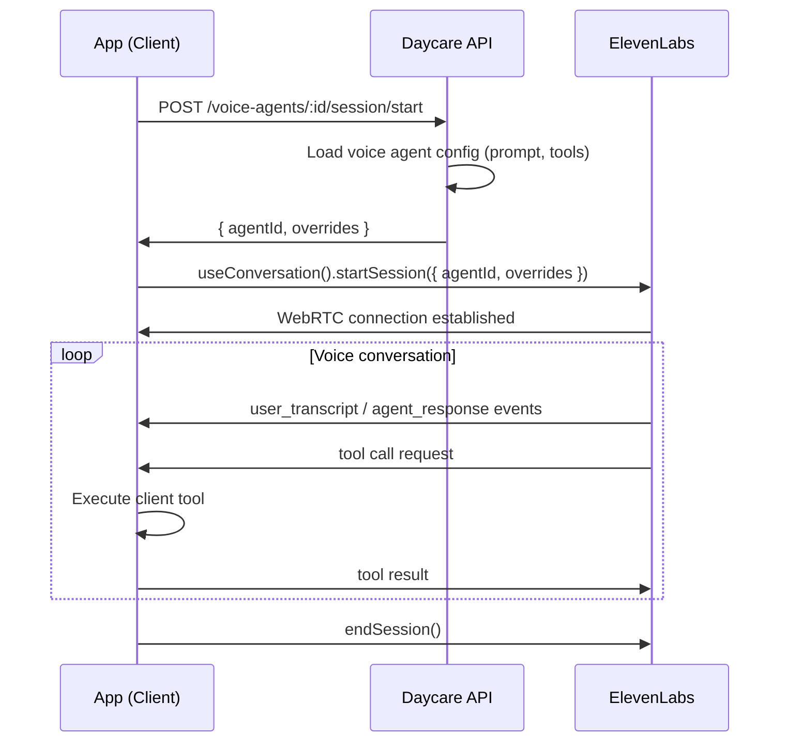

# Voice Agents (ElevenLabs Conversational AI)

## Overview

Add voice agents as a new entity type in Daycare. Voice agents are standalone entities (not tied to regular text agents) that use ElevenLabs Conversational AI for real-time voice interactions via WebRTC.

**Architecture:**
- Voice agents are stored in their own DB table with system prompt, tools config, and metadata
- ElevenLabs plugin registers as a **voice agent provider** (new provider type)
- A single shared ElevenLabs base agent ID (configured in plugin settings) is overridden per session with the voice agent's prompt and tools
- Tools are defined as part of the voice agent config and executed client-side via ElevenLabs SDK callbacks
- Server handles session start/stop and receives status updates
- App UI shows a list of voice agents; tapping one starts a WebRTC call with call controls

**Key outcomes:**
- New `voice_agents` DB table with CRUD operations
- Voice agent provider registry (like speech/inference providers)
- ElevenLabs plugin registers as a voice agent provider
- API endpoints for voice agent CRUD + session management
- App UI: voice agents list screen, WebRTC call screen with mute/hangup
- LLM tool for other agents to create voice agents

## Context

**Reference implementation:** `~/Developer/power-tool` — uses ElevenLabs `@elevenlabs/react-native` SDK with `useConversation()` hook, WebRTC connection, client-side tools, dynamic prompt/model overrides at session start.

**Existing code:**
- ElevenLabs plugin (`plugins/elevenlabs/`) — currently TTS + music/sound tools only
- Provider registry pattern: `SpeechGenerationRegistry`, `InferenceRegistry`, `ImageGenerationRegistry`
- Plugin registrar: `registerSpeechProvider()`, `registerInferenceProvider()`, etc.
- App navigation: sidebar with segments, Expo Router, agents list/detail views
- Agent DB: `agents` table with versioning, but voice agents get their own table

## Development Approach
- **Testing approach**: Regular (code first, then tests)
- Complete each task fully before moving to the next
- Make small, focused changes
- **CRITICAL: every task MUST include new/updated tests**
- **CRITICAL: all tests must pass before starting next task**
- **CRITICAL: update this plan file when scope changes during implementation**

## Scope Notes

- Implemented Drizzle schema changes in the existing centralized `packages/daycare/sources/schema.ts` file instead of a separate `sources/storage/schema/` directory, because that is how this repo currently defines tables.
- Added required LiveKit/WebRTC dependencies and Expo config plugins alongside `@elevenlabs/react-native`, since the ElevenLabs React Native SDK requires them for native builds.

## Testing Strategy
- **Unit tests**: required for every task
- **E2E tests**: app has no e2e test framework currently — skip

## Progress Tracking
- Mark completed items with `[x]` immediately when done
- Add newly discovered tasks with ➕ prefix
- Document issues/blockers with ⚠️ prefix
- ⚠️ Manual native device verification for WebRTC audio quality, permissions, and live tool latency is still pending.

## Implementation Steps

### Task 1: Voice agent provider types and registry

Define the voice agent provider interface and registry (mirrors speech/inference provider pattern).

- [x] Create `packages/daycare/sources/engine/modules/voice/types.ts` with `VoiceAgentProvider` type:
  ```typescript
  type VoiceAgentProvider = {
      id: string;
      label: string;
      startSession: (request: VoiceSessionStartRequest, context: VoiceSessionContext) => Promise<VoiceSessionStartResult>;
  };
  type VoiceSessionStartRequest = {
      voiceAgentId: string;
      systemPrompt: string;
      tools: VoiceAgentToolDefinition[];
      // additional overrides as needed
  };
  type VoiceSessionStartResult = {
      agentId: string;       // ElevenLabs agent ID to connect to
      overrides: Record<string, unknown>;  // session overrides for client SDK
  };
  ```
- [x] Create `packages/daycare/sources/engine/modules/voice/voiceAgentRegistry.ts` — registry class following `SpeechGenerationRegistry` pattern
- [x] Add `registerVoiceAgentProvider` / `unregisterVoiceAgentProvider` to `PluginRegistrar`
- [x] Re-export types from `@/types`
- [x] Write tests for registry (register, unregister, get, list)
- [x] Run tests — must pass before next task

### Task 2: Voice agents database table and repository

- [x] Create migration `sources/storage/migrations/YYYYMMDD_voice_agents.sql`:
  ```sql
  CREATE TABLE "voice_agents" (
      "id" text NOT NULL PRIMARY KEY,
      "name" text NOT NULL,
      "description" text,
      "system_prompt" text NOT NULL,
      "tools" jsonb NOT NULL DEFAULT '[]',
      "settings" jsonb NOT NULL DEFAULT '{}',
      "user_id" text NOT NULL,
      "created_at" bigint NOT NULL,
      "updated_at" bigint NOT NULL
  );
  ```
- [x] Add Drizzle schema definition in `sources/storage/schema/`
- [x] Create repository functions: `voiceAgentCreate`, `voiceAgentUpdate`, `voiceAgentDelete`, `voiceAgentGet`, `voiceAgentList`
- [x] Repositories use `ctx` (user-scoped context)
- [x] Write tests for all repository functions (PGlite in-memory)
- [x] Run tests — must pass before next task

### Task 3: Voice agent API routes

REST endpoints for voice agent CRUD following existing API conventions.

- [x] Create `sources/api/routes/voiceAgents/voiceAgentsRoutes.ts`:
  - `GET /voice-agents` — list voice agents
  - `GET /voice-agents/:id` — get voice agent
  - `POST /voice-agents/create` — create voice agent
  - `POST /voice-agents/:id/update` — update voice agent
  - `POST /voice-agents/:id/delete` — delete voice agent
  - `POST /voice-agents/:id/session/start` — start a voice session (returns agent ID + overrides for client)
- [x] Wire routes into the main API router
- [x] Write tests for route handlers
- [x] Run tests — must pass before next task

### Task 4: ElevenLabs plugin — register as voice agent provider

Extend the existing ElevenLabs plugin to register as a voice agent provider.

- [x] Add `baseAgentId` to plugin settings schema (the shared ElevenLabs agent ID)
- [x] Implement `VoiceAgentProvider` in the plugin — `startSession` returns the base agent ID + overrides (prompt, tools)
- [x] Register the provider via `api.registrar.registerVoiceAgentProvider(provider)` in plugin `load()`
- [x] Unregister in `unload()`
- [x] Update plugin README.md
- [x] Write tests for the provider implementation
- [x] Run tests — must pass before next task

### Task 5: App UI — voice agents list screen

Add a "Voice" navigation item and list screen in the app.

- [x] Add "Voice" segment to `AppSidebar.tsx` navigation
- [x] Create route `app/(app)/[workspace]/voice/index.tsx` — voice agents list page
- [x] Create `views/VoiceAgentsView.tsx` — fetches and renders voice agents using `ItemList` + `ItemGroup`
- [x] Create `modules/voice/voiceAgentsFetch.ts` — API fetch functions
- [x] Create `modules/voice/voiceAgentsContext.ts` — Zustand store for voice agents state
- [x] Verify list renders with name, description, and tap target
- [x] Run lint — must pass before next task

### Task 6: App UI — voice call screen with WebRTC

The core voice experience: tap a voice agent to start a WebRTC call via ElevenLabs SDK.

- [x] Add `@elevenlabs/react-native` dependency (check power-tool for version)
- [x] Create route `app/(app)/[workspace]/voice/[id].tsx` — voice call page
- [x] Create `views/voice/VoiceCallView.tsx`:
  - On mount: call `POST /voice-agents/:id/session/start` to get agent ID + overrides
  - Use `useConversation()` hook from ElevenLabs SDK to start WebRTC session
  - Call controls: mute toggle, hang up button
  - Status indicator: connecting, connected, disconnected
  - Agent mode display: speaking/listening
- [x] Create `modules/voice/voiceSession.ts` — session management helpers
- [x] Handle client-side tool execution via `clientTools` callback in `useConversation()`
- [x] Run lint — must pass before next task

### Task 7: LLM tool for creating voice agents

Allow other agents to create voice agents programmatically.

- [x] Create a tool `voice_agent_create` that can be registered by the voice agent provider or as a standalone tool
- [x] Tool parameters: name, description, system prompt, tools definitions
- [x] Tool creates voice agent via repository and returns the created agent info
- [x] Write tests for tool execution
- [x] Run tests — must pass before next task

### Task 8: Verify acceptance criteria

- [x] Verify voice agents can be created via API and listed in app
- [ ] Verify tapping a voice agent starts a WebRTC call with ElevenLabs
- [ ] Verify call controls (mute, hangup) work
- [ ] Verify client-side tools execute during voice calls
- [x] Verify other agents can create voice agents via LLM tool
- [ ] Run full test suite (unit tests)
- [x] Run linter — all issues must be fixed

### Task 9: [Final] Update documentation

- [x] Update ElevenLabs plugin README with voice agent provider docs
- [x] Create `doc/voice-agents.md` documenting the voice agent architecture
- [x] Add mermaid diagram showing voice agent session flow

## Technical Details

### Session Flow


### Voice Agent Tool Definition Format
```typescript
type VoiceAgentToolDefinition = {
    name: string;
    description: string;
    parameters: Record<string, {
        type: string;
        description: string;
        required?: boolean;
    }>;
    // Client-side execution handler is defined in the app
};
```

### ElevenLabs Session Override
```typescript
await conversation.startSession({
    agentId: baseAgentId,  // shared across all voice agents
    overrides: {
        agent: {
            prompt: { prompt: voiceAgent.systemPrompt },
            // tools injected via dynamic variables or overrides
        }
    }
});
```

## Post-Completion

**Manual verification:**
- Test WebRTC call quality on real device (iOS)
- Verify microphone permissions flow
- Test with different ElevenLabs voices
- Test tool execution latency during voice calls
