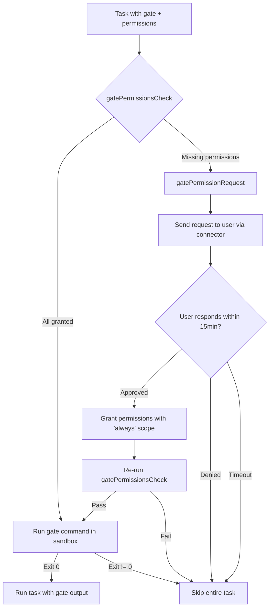

# Auto-request permissions for gate functions

## Overview
When a heartbeat or cron task has a gate with `permissions` tags (e.g., `@network`), and the target agent lacks those permissions, the system should **automatically request** the missing permissions from the user instead of silently skipping the gate.

**Current behavior:** Gate is skipped, task runs without the gate check, a warning system message is posted.

**New behavior:** The system sends a permission request to the user, blocks with a timeout (15 min), and:
- If approved: persists the permission ("always" scope), re-runs the gate check with updated permissions
- If denied or timed out: skips the entire task (not just the gate)

## Context (from discovery)
- Heartbeat scheduler: `sources/engine/heartbeat/ops/heartbeatScheduler.ts` (lines 186-193)
- Cron scheduler: `sources/engine/cron/ops/cronScheduler.ts` (lines 277-283)
- Heartbeat facade: `sources/engine/heartbeat/heartbeats.ts` (lines 72-86, `onGatePermissionSkip`)
- Cron facade: `sources/engine/cron/crons.ts` (lines 92-106, `onGatePermissionSkip`)
- Gate permission check: `sources/engine/scheduling/gatePermissionsCheck.ts`
- Permission request tool: `sources/engine/modules/tools/permissions.ts` (reference for request flow)
- Permission request registry: `sources/engine/modules/tools/permissionRequestRegistry.ts`
- Permission access apply: `sources/engine/permissions/permissionAccessApply.ts`
- Permission access parse: `sources/engine/permissions/permissionAccessParse.ts`

## Development Approach
- **Testing approach**: Regular (code first, then tests)
- Complete each task fully before moving to the next
- Make small, focused changes
- **CRITICAL: every task MUST include new/updated tests**
- **CRITICAL: all tests must pass before starting next task**
- **CRITICAL: update this plan file when scope changes during implementation**

## Implementation Steps

### Task 1: Create `gatePermissionRequest` function
Create a shared function that requests missing gate permissions from the user via the connector infrastructure.

- [x] Create `sources/engine/scheduling/gatePermissionRequest.ts`
- [x] Define input type: `{ missing: string[], taskLabel: string, agentSystem: AgentSystem, connectorRegistry: ConnectorRegistry, permissionRequestRegistry: PermissionRequestRegistry, agentId: string, timeoutMs?: number }`
- [x] Implement the function:
  - Find the foreground agent via `agentSystem.agentFor("most-recent-foreground")`
  - Resolve the foreground connector via `connectorRegistry`
  - Parse missing permission strings into `PermissionAccess` objects via `permissionAccessParse`
  - Build a `PermissionRequest` with a unique token, "always" scope
  - Send the request via `connector.requestPermission` or `connector.sendMessage`
  - Await the decision via `permissionRequestRegistry.register(token, timeoutMs)` (default 15 min)
  - If approved: grant each permission via `agentSystem.grantPermission` with "always" scope
  - Return `{ granted: boolean }` — true if approved, false if denied or timed out
- [x] Write tests for `gatePermissionRequest` (success: approved, denied, timeout cases)
- [x] Run tests — must pass before next task

### Task 2: Replace `onGatePermissionSkip` with `onGatePermissionRequest` in heartbeat scheduler
Change the heartbeat scheduler's permission-missing handler from fire-and-forget to async with a return value.

- [x] In `heartbeatTypes.ts`: replace `onGatePermissionSkip` callback type with `onGatePermissionRequest: (task, missing) => Promise<boolean>` (returns true if permissions were granted)
- [x] In `heartbeatScheduler.ts` `filterByGate()`: when `permissionCheck.allowed` is false:
  - Call `onGatePermissionRequest` and await the result
  - If `true`: re-clone permissions, re-run `gatePermissionsCheck` to confirm, then run the gate command
  - If `false`: skip the task entirely (do not push to `eligible`)
- [x] Update constructor to wire new callback
- [x] Write tests for heartbeat scheduler gate permission request flow (granted → gate runs, denied → task skipped)
- [x] Run tests — must pass before next task

### Task 3: Replace `onGatePermissionSkip` with `onGatePermissionRequest` in cron scheduler
Same change for the cron scheduler.

- [x] In `cronScheduler.ts` `CronSchedulerOptions`: replace `onGatePermissionSkip` with `onGatePermissionRequest: (task, missing) => Promise<boolean>`
- [x] In `cronScheduler.ts` `checkGate()`: when `permissionCheck.allowed` is false:
  - Call `onGatePermissionRequest` and await the result
  - If `true`: re-clone permissions, re-run `gatePermissionsCheck` to confirm, then run the gate command
  - If `false`: return `{ allowed: false }` (skip the entire task)
- [x] Update constructor to wire new callback
- [x] Write tests for cron scheduler gate permission request flow (granted → gate runs, denied → task skipped)
- [x] Run tests — must pass before next task

### Task 4: Wire `gatePermissionRequest` in facade classes
Connect the new shared function to the `Heartbeats` and `Crons` facades.

- [x] Update `Heartbeats` constructor options to accept `connectorRegistry` and `permissionRequestRegistry`
- [x] Replace `onGatePermissionSkip` callback in `heartbeats.ts` with `onGatePermissionRequest` that calls `gatePermissionRequest()`
- [x] Update `Crons` constructor options to accept `connectorRegistry` and `permissionRequestRegistry`
- [x] Replace `onGatePermissionSkip` callback in `crons.ts` with `onGatePermissionRequest` that calls `gatePermissionRequest()`
- [x] Update the engine wiring that constructs `Heartbeats` and `Crons` to pass the new dependencies
- [x] Write tests for facade wiring (verify `gatePermissionRequest` is called with correct args)
- [x] Run tests — must pass before next task

### Task 5: Verify acceptance criteria
- [x] Verify: missing gate permissions trigger a user-facing permission request
- [x] Verify: approved permissions are persisted with "always" scope
- [x] Verify: denied/timed-out requests skip the entire task
- [x] Verify: after approval, the gate command actually runs (not just skipped)
- [x] Run full test suite (`yarn test`)
- [x] Run typecheck (`yarn typecheck`)
- [x] Run linter — all issues must be fixed
  - Note: repository currently has no lint script in `package.json`.

### Task 6: Update documentation
- [x] Update `doc/` if gate permission behavior is documented
- [x] Add mermaid diagram showing the new gate permission request flow

## Technical Details

### New gate permission request flow


### Key types
```typescript
// gatePermissionRequest input
type GatePermissionRequestInput = {
  missing: string[];
  taskLabel: string;
  agentSystem: AgentSystem;
  connectorRegistry: ConnectorRegistry;
  permissionRequestRegistry: PermissionRequestRegistry;
  agentId: string;
  timeoutMs?: number; // default 15 * 60_000
};

// gatePermissionRequest output
type GatePermissionRequestResult = {
  granted: boolean;
};
```

### Scheduler callback change
```typescript
// Before
onGatePermissionSkip?: (task: T, missing: string[]) => void | Promise<void>;

// After
onGatePermissionRequest?: (task: T, missing: string[]) => Promise<boolean>;
```

## Post-Completion
**Manual verification:**
- Create a heartbeat with a gate requiring `@network` on an agent without network permission
- Verify the permission request appears in the user's chat
- Approve and verify the gate command runs on the next heartbeat tick
- Deny and verify the heartbeat task is skipped entirely
- Test timeout behavior (wait 15 min or use a short timeout for testing)
