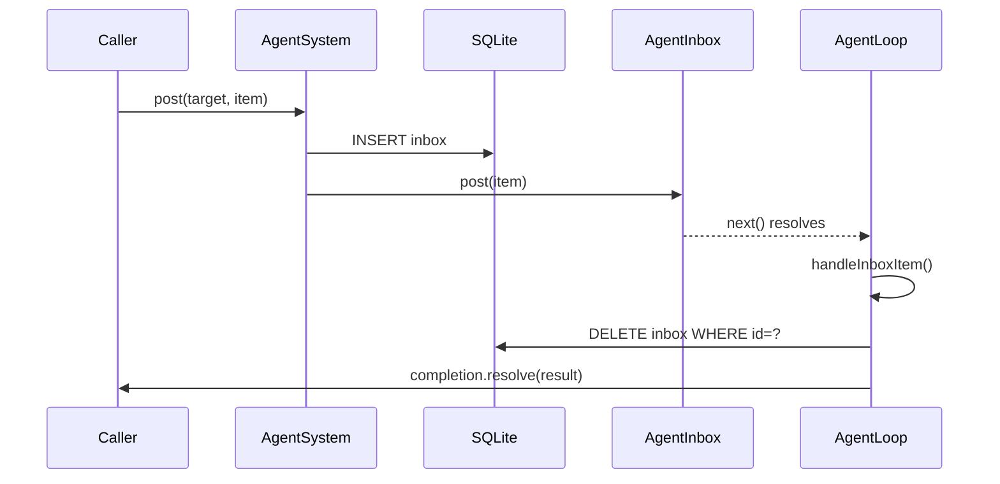

# Durable Inboxes

## Overview
Make agent inboxes survive process restarts by persisting queued items to SQLite. Currently, `AgentInbox` is a purely in-memory FIFO queue — if the process crashes while items are queued but not yet processed, those items are lost. This change adds write-ahead persistence: items are written to SQLite on `post()`, deleted after processing, and replayed on boot.

Delivers **at-least-once** semantics. Completions (promise callbacks) are not restored — callers don't survive restarts.

## Context
- `AgentInbox` (`sources/engine/agents/ops/agentInbox.ts`) — in-memory queue with message merging and steering
- `AgentSystem.enqueueEntry()` (`agentSystem.ts:590`) — chokepoint where all items enter the inbox
- `Agent.runLoop()` (`agent.ts:208`) — consumer loop that calls `inbox.next()` and processes items
- `AgentSystem.load()` (`agentSystem.ts:160`) — boot sequence that restores agents and posts synthetic `restore` items
- Storage layer uses SQLite via `node:sqlite` `DatabaseSync`, repository pattern, migration system

## Development Approach
- **Testing approach**: Regular (code first, then tests)
- Complete each task fully before moving to the next
- All inbox item types persisted: `message`, `system_message`, `signal`, `reset`, `compact`, `restore`
- Steering messages remain transient (interrupts, not queued work)
- **CRITICAL: every task MUST include new/updated tests**
- **CRITICAL: all tests must pass before starting next task**

## Progress Tracking
- Mark completed items with `[x]` immediately when done
- Add newly discovered tasks with ➕ prefix
- Document issues/blockers with ⚠️ prefix

## Implementation Steps

### Task 1: Add `inbox` migration
- [x] Create `sources/storage/migrations/20260221_add_inbox.ts` with schema:
  ```sql
  CREATE TABLE IF NOT EXISTS inbox (
    id TEXT PRIMARY KEY,
    agent_id TEXT NOT NULL,
    posted_at INTEGER NOT NULL,
    type TEXT NOT NULL,
    data TEXT NOT NULL
  );
  CREATE INDEX IF NOT EXISTS idx_inbox_agent_order
    ON inbox(agent_id, posted_at);
  ```
- [x] Register migration in `_migrations.ts`
- [x] Write migration spec that verifies table creation and index
- [x] Run tests — must pass before next task

### Task 2: Create `InboxRepository`
- [x] Create `sources/storage/inboxRepository.ts` with methods:
  - `insert(id: string, agentId: string, postedAt: number, type: string, data: string): void`
  - `findByAgentId(agentId: string): InboxDbRecord[]` (ordered by `posted_at`)
  - `delete(id: string): void`
  - `deleteByAgentId(agentId: string): void`
- [x] Add `DatabaseInboxRow` and `InboxDbRecord` types to `databaseTypes.ts`
- [x] Register `inbox` on `Storage` class
- [x] Write tests for insert, findByAgentId ordering, delete, deleteByAgentId
- [x] Run tests — must pass before next task

### Task 3: Add inbox item serialization helpers
- [x] Create `sources/engine/agents/ops/inboxItemSerialize.ts` — converts `AgentInboxItem` to JSON string
- [x] Create `sources/engine/agents/ops/inboxItemDeserialize.ts` — converts JSON string back to `AgentInboxItem`
- [x] Write tests for round-trip of each item type (message, system_message, signal, reset, compact, restore)
- [x] Run tests — must pass before next task

### Task 4: Persist on enqueue in `AgentSystem`
- [x] In `AgentSystem.enqueueEntry()`, write item to `storage.inbox.insert()` before `entry.inbox.post()`
- [x] Use entry id from `AgentInbox.post()` return value as the persistence key — adjust flow: generate id first, persist, then post
- [x] Skip persistence for items that don't need it (none skipped per requirements — all types persisted)
- [x] Write test: post an item, verify it appears in `storage.inbox.findByAgentId()`
- [x] Run tests — must pass before next task

### Task 5: Delete after processing in agent loop
- [x] Add a callback mechanism so the agent loop can notify when an item is fully processed
- [x] In `Agent.runLoop()`, after `entry.completion?.resolve(result)` or in the `catch` block after `entry.completion?.reject()`, call `storage.inbox.delete(entry.id)`
- [x] The agent needs access to `storage.inbox` — pass via `AgentSystem` reference (already available as `this.agentSystem`)
- [x] Add `deleteInboxItem(id: string)` to `AgentSystem` as a thin pass-through to `storage.inbox.delete()`
- [x] Write test: post item, process it, verify it's deleted from DB
- [x] Run tests — must pass before next task

### Task 6: Replay persisted items on boot
- [x] In `AgentSystem.load()`, after creating inbox and posting `restore`, load persisted items via `storage.inbox.findByAgentId()` and post them to the inbox in order
- [x] In `AgentSystem.restoreAgent()`, same — load and replay after `restore` item
- [x] For sleeping agents that get woken (`wakeEntryIfSleeping`), persisted items are loaded as part of the wake flow (they were persisted at enqueue time, replayed when agent loop processes them)
- [x] Write test: persist items for an agent, call `load()`, verify inbox contains them after the restore item
- [x] Run tests — must pass before next task

### Task 7: Clean up persisted items on agent death
- [x] In `markEntryDead()`, after `inbox.drainPending()`, call `storage.inbox.deleteByAgentId()` to clear persisted items
- [x] In `handlePoisonPill()` for unloaded agents, also clear persisted items
- [x] Write test: persist items, kill agent, verify items are deleted from DB
- [x] Run tests — must pass before next task

### Task 8: Verify acceptance criteria
- [x] Verify: items survive a simulated restart (persist, recreate storage, load, verify replay)
- [x] Verify: processed items are cleaned up (not replayed again)
- [x] Verify: dead agent items are cleaned up
- [x] Verify: message merging still works (merged items update the persisted record or the merged entry is one row)
- [x] Run full test suite
- [x] Run linter — all issues must be fixed

### Task 9: Update documentation
- [x] Add section to `doc/internals/engine-agent.md` describing inbox durability
- [x] Update `doc/STORAGE.md` if it documents tables
- [x] Add mermaid diagram showing persist → process → delete lifecycle

## Technical Details

### Schema
```sql
CREATE TABLE inbox (
  id TEXT PRIMARY KEY,       -- cuid2 from AgentInboxEntry
  agent_id TEXT NOT NULL,    -- owning agent
  posted_at INTEGER NOT NULL,-- unix ms timestamp
  type TEXT NOT NULL,        -- item type discriminator
  data TEXT NOT NULL          -- JSON-serialized AgentInboxItem
);
```

No FK to `agents` table — items may outlive the agent record during edge cases; cleanup is explicit.

### Serialization
`AgentInboxItem` serializes directly as JSON for durable storage and replay.

### Boot sequence
```
load() → for each active agent:
  1. Create AgentInbox
  2. Post synthetic { type: "restore" }
  3. Load persisted items from inbox table
  4. Post each persisted item to inbox (in posted_at order)
  5. Start agent loop
```

The restore item is always first, ensuring LLM context is rebuilt before processing queued work.

### Message merging interaction
When `AgentInbox.post()` merges two consecutive messages, the merged entry keeps the original entry's id. The second item's persisted row should be deleted since it was absorbed. Approach: after `post()`, if the returned entry id differs from the generated id (merge happened), delete the new row and update the existing row's data.

### Processing flow


## Post-Completion

**Manual verification:**
- Start the engine, send a message, kill the process mid-queue, restart, verify the message is replayed
- Verify sleeping agents wake correctly with persisted items
- Load test with rapid messages to verify merging + persistence interaction
