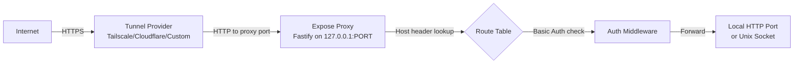

# Expose Module

## Overview
Add a new core engine module that lets the AI model expose local HTTP ports or Unix sockets to the internet (or local network) via tunnel providers. A single reverse-proxy server with Host-header routing sits between tunnel backends and local services, handling optional Basic Auth per endpoint. Tunnel backends (Tailscale, Cloudflare, custom bash scripts) are registered by plugins.

Key capabilities:
- Expose any local HTTP port or Unix socket through a public (or local-network) URL
- Per-endpoint authentication toggle: unauthenticated or Basic Auth (username `daycare`, random password)
- Password is generated fresh each time auth is enabled; only the bcrypt hash is persisted in endpoint files
- Dynamic updates: auth mode can change at runtime without recreating the tunnel
- Multiple tunnel providers coexist; model chooses which to use
- Each provider has its own wildcard domain (e.g. Tailscale's `*.ts.net`)
- Tailscale supports both public (Funnel) and local-network (Serve) modes

## Context
- **Engine module pattern**: follows `Crons`, `Heartbeats`, `Signals`, `Channels` facade pattern in `engine/`
- **Plugin registration pattern**: tunnel providers register via `PluginRegistrar` (new registry type needed, or via a shared `Exposes` reference)
- **Settings**: endpoint state stored in `configDir/expose/endpoints/*.json`
- **Proxy**: Fastify server on a single local port, Host-header-based virtual host routing
- **Tools**: registered as core tools in `engine.ts`
- **Topology**: expose endpoints added to `topologyToolBuild.ts`

## Development Approach
- **Testing approach**: Regular (code first, then tests)
- Complete each task fully before moving to the next
- Make small, focused changes
- **CRITICAL: every task MUST include new/updated tests**
- **CRITICAL: all tests must pass before starting next task**
- **CRITICAL: update this plan file when scope changes during implementation**

## Progress Tracking
- Mark completed items with `[x]` immediately when done
- Add newly discovered tasks with + prefix
- Document issues/blockers with warning prefix
- Update plan if implementation deviates from original scope

## Implementation Steps

### Task 1: Define expose types
- [x] Create `sources/engine/expose/exposeTypes.ts` with core types:
  - `ExposeEndpoint`: `{ id, target: { type: "port", port } | { type: "unix", path }, provider (instance id string), domain, mode ("public" | "local-network"), auth: { enabled, passwordHash } | null, createdAt, updatedAt }`
  - `ExposeTunnelProvider`: `{ instanceId, domain, capabilities: { public, localNetwork }, createTunnel(proxyPort, mode) => Promise<{ domain }>, destroyTunnel(domain) => Promise<void> }`
  - `ExposeCreateInput`: `{ target: { type: "port", port: number } | { type: "unix", path: string }, provider?: string, mode: "public" | "local-network", authenticated: boolean }`
  - `ExposeUpdateInput`: `{ authenticated: boolean }`
- [x] Export types from `sources/types.ts`
- [x] Write tests for type guards / validation helpers
- [x] Run tests - must pass before next task

### Task 2: Build the reverse-proxy server
- [x] Create `sources/engine/expose/exposeProxy.ts` with `ExposeProxy` class
- [x] Single Fastify server listening on `127.0.0.1:0` (random available port)
- [x] Host-header routing: lookup table maps `domain -> { target, passwordHash? }`
- [x] Basic Auth middleware: when `passwordHash` is set, require `Authorization: Basic` header, username must be `daycare`, verify password against bcrypt hash; return 401 with `WWW-Authenticate: Basic realm="daycare"` on failure
- [x] Reverse-proxy handler: forward request to local HTTP port or Unix socket, stream response back
- [x] Methods: `start() => Promise<{ port: number }>`, `stop()`, `addRoute(domain, target, passwordHash?)`, `removeRoute(domain)`, `updateRoute(domain, { passwordHash? })`
- [x] Write tests for proxy routing (mock local HTTP targets)
- [x] Write tests for Basic Auth (correct creds, wrong creds, no creds, auth disabled)
- [x] Run tests - must pass before next task

### Task 3: Build the Exposes facade
- [x] Create `sources/engine/expose/exposes.ts` with `Exposes` class
- [x] Constructor takes `{ config, eventBus }`, stores state in `configDir/expose/`
- [x] `ensureDir()` - create state directory
- [x] `start()` - start proxy server, load persisted endpoints, re-establish tunnel routes
- [x] `stop()` - tear down proxy, clean up
- [x] `registerProvider(provider: ExposeTunnelProvider)` / `unregisterProvider(instanceId)` - for plugins to register tunnel backends
- [x] `listProviders()` - return registered tunnel providers with capabilities
- [x] `create(input: ExposeCreateInput) => Promise<{ endpoint: ExposeEndpoint, password?: string }>` - create endpoint, generate password if authenticated, start tunnel, add proxy route, persist to disk
- [x] `remove(endpointId) => Promise<void>` - destroy tunnel, remove proxy route, remove from disk
- [x] `update(endpointId, input: ExposeUpdateInput) => Promise<{ endpoint: ExposeEndpoint, password?: string }>` - update auth mode, regenerate password if enabling auth, update proxy route
- [x] `list() => Promise<ExposeEndpoint[]>` - return all active endpoints
- [x] Persist endpoint state as JSON files in `configDir/expose/endpoints/`
- [x] Use `AsyncLock` for all state mutations
- [x] Write tests for create/remove/update/list lifecycle
- [x] Write tests for provider selection (when multiple providers exist)
- [x] Run tests - must pass before next task

### Task 4: Wire Exposes into the engine
- [x] Add `exposes: Exposes` field to `Engine` class in `engine.ts`
- [x] Instantiate in constructor (after config/eventBus init)
- [x] Call `exposes.ensureDir()` in `start()`
- [x] Call `exposes.start()` after plugin loading (so providers are registered)
- [x] Call `exposes.stop()` in `shutdown()`
- [x] Pass `exposes` reference to `PluginApi` so plugins can register tunnel providers
- [x] Update `PluginApi` type in `engine/plugins/types.ts` to include `exposes` reference (expose provider registration methods only)
- [x] Write tests verifying engine lifecycle includes expose start/stop
- [x] Run tests - must pass before next task

### Task 5: Build expose tools for the AI model
- [x] Create `sources/engine/modules/tools/exposeCreateToolBuild.ts` - `expose_create` tool
  - Parameters: `port` (number, optional), `unixSocket` (string, optional), `provider` (string, optional), `mode` ("public" | "local-network", default "public"), `authenticated` (boolean, default false)
  - Returns: endpoint info including domain and password (if authenticated)
- [x] Create `sources/engine/modules/tools/exposeRemoveToolBuild.ts` - `expose_remove` tool
  - Parameters: `endpointId` (string)
- [x] Create `sources/engine/modules/tools/exposeUpdateToolBuild.ts` - `expose_update` tool
  - Parameters: `endpointId` (string), `authenticated` (boolean)
  - Returns: endpoint info including new password if auth was enabled
- [x] Create `sources/engine/modules/tools/exposeListToolBuild.ts` - `expose_list` tool
  - No parameters, returns all endpoints with providers
- [x] Register all four tools as core tools in `engine.ts` `start()`
- [x] Write tests for each tool's parameter validation and execute logic
- [x] Run tests - must pass before next task

### Task 6: Add expose endpoints to topology
- [x] Update `topologyToolBuild.ts` to accept `Exposes` dependency
- [x] Add `## Expose Endpoints (N)` section to topology output
- [x] Show: id, domain, target, provider, mode, authenticated status
- [x] Update engine.ts to pass `exposes` to `topologyToolBuild()`
- [x] Write tests for topology output including expose section
- [x] Run tests - must pass before next task

### Task 7: Build Tailscale tunnel provider plugin
- [x] Create `sources/plugins/tailscale/` with `plugin.json`, `README.md`, `plugin.ts`
- [x] Settings schema: `{}` (empty - domain auto-resolved)
- [x] On load: run `tailscale status --json` to auto-resolve the machine's DNS name and tailnet domain
- [x] Register as expose tunnel provider with `{ public: true, localNetwork: true }` capabilities and the resolved domain
- [x] `createTunnel`: run `tailscale funnel` (public) or `tailscale serve` (local-network) pointing to the proxy's local port
- [x] `destroyTunnel`: run `tailscale funnel --remove` or `tailscale serve --remove`
- [x] On unload: unregister provider, tear down active tunnels
- [x] Add to plugin catalog
- [x] Write tests for domain auto-resolution parsing and tunnel create/destroy command generation
- [x] Run tests - must pass before next task

### Task 8: Build Cloudflare tunnel provider plugin
- [x] Create `sources/plugins/cloudflare-tunnel/` with `plugin.json`, `README.md`, `plugin.ts`
- [x] Settings schema: `{}` (empty - domain auto-resolved from existing tunnel config)
- [x] Onboarding: prompt for cloudflare tunnel token, store in auth
- [x] On load: run `cloudflared tunnel info` (or parse tunnel config) to auto-resolve the tunnel's domain
- [x] Register as expose tunnel provider with `{ public: true, localNetwork: false }` capabilities and the resolved domain
- [x] `createTunnel`: run `cloudflared tunnel route` commands to add ingress pointing to proxy
- [x] `destroyTunnel`: remove the tunnel ingress rule
- [x] On unload: unregister provider, tear down active tunnels
- [x] Add to plugin catalog
- [x] Write tests for domain auto-resolution and tunnel create/destroy command generation
- [x] Run tests - must pass before next task

### Task 9: Build custom (bash script) tunnel provider plugin
- [x] Create `sources/plugins/custom-tunnel/` with `plugin.json`, `README.md`, `plugin.ts`
- [x] Settings schema: `{ domain: string, exposeScript: string, unexposeScript: string }`
- [x] Onboarding: prompt for domain, expose script path, unexpose script path
- [x] On load: register as expose tunnel provider with `{ public: true, localNetwork: false }` capabilities
- [x] `createTunnel`: run expose script with `(localPort)` as arg, capture stdout as public URL
- [x] `destroyTunnel`: run unexpose script with `(publicUrl)` as arg
- [x] On unload: unregister provider, tear down active tunnels
- [x] Add to plugin catalog
- [x] Write tests for script execution and URL capture
- [x] Run tests - must pass before next task

### Task 10: Verify acceptance criteria
- [x] Verify: can expose a local port with auth, get password back
- [x] Verify: can expose without auth (naked)
- [x] Verify: can toggle auth dynamically, password regenerates
- [x] Verify: topology shows expose endpoints
- [x] Verify: multiple providers can coexist
- [x] Verify: endpoints persist across restarts (`configDir/expose/endpoints/*.json`)
- [x] Run full test suite (unit tests)
- [ ] Run linter - all issues must be fixed
- ⚠ No `lint` script exists in `packages/daycare/package.json`; executed `typecheck`, `build`, and full test suite instead.

### Task 11: [Final] Update documentation
- [x] Update `doc/internals/plugins.md` if new plugin registration pattern added
- [x] Create `doc/internals/expose.md` with architecture overview and mermaid diagrams
- [x] Add expose section to any relevant existing docs

## Technical Details

### Data Flow


### Endpoint File Schema (`configDir/expose/endpoints/*.json`)
```json
{
  "id": "clx1abc...",
  "target": { "type": "port", "port": 3000 },
  "provider": "tailscale",
  "domain": "myapp.machine.tail1234.ts.net",
  "mode": "public",
  "auth": {
    "enabled": true,
    "passwordHash": "$2b$10$..."
  },
  "createdAt": 1700000000000,
  "updatedAt": 1700000000000
}
```

### Proxy Route Table (in-memory)
```typescript
Map<string, {
  target: { type: "port"; port: number } | { type: "unix"; path: string };
  passwordHash: string | null;
}>
```

### Password Generation
- Generate 32-byte random password using `crypto.randomBytes(32).toString("base64url")`
- Hash with bcrypt (cost 10) before storing
- Plain password returned once in the tool response, never stored

### Provider Selection
When model calls `expose_create` without specifying `provider`:
- If only one provider registered: use it
- If multiple providers: return error asking model to specify `provider`
- If no providers: return error telling model no tunnel providers are configured

### Domain Auto-Resolution
- **Tailscale**: run `tailscale status --json`, parse `Self.DNSName` field to get `machine.tailnet.ts.net`
- **Cloudflare**: parse tunnel config or run `cloudflared tunnel info` to resolve the tunnel's hostname
- **Custom**: domain provided manually in settings (no auto-resolution)

### Auth Toggle Flow
1. Model calls `expose_update(endpointId, { authenticated: true })`
2. Facade generates new random password
3. Facade hashes password with bcrypt
4. Facade updates proxy route with new hash
5. Facade persists updated endpoint to disk
6. Returns new plain password to model (shown once)

## Post-Completion

**Manual verification:**
- Test with actual Tailscale installation (funnel + serve modes)
- Test with cloudflared CLI
- Test custom script flow end-to-end
- Verify proxy handles concurrent connections correctly
- Test with Unix socket targets
