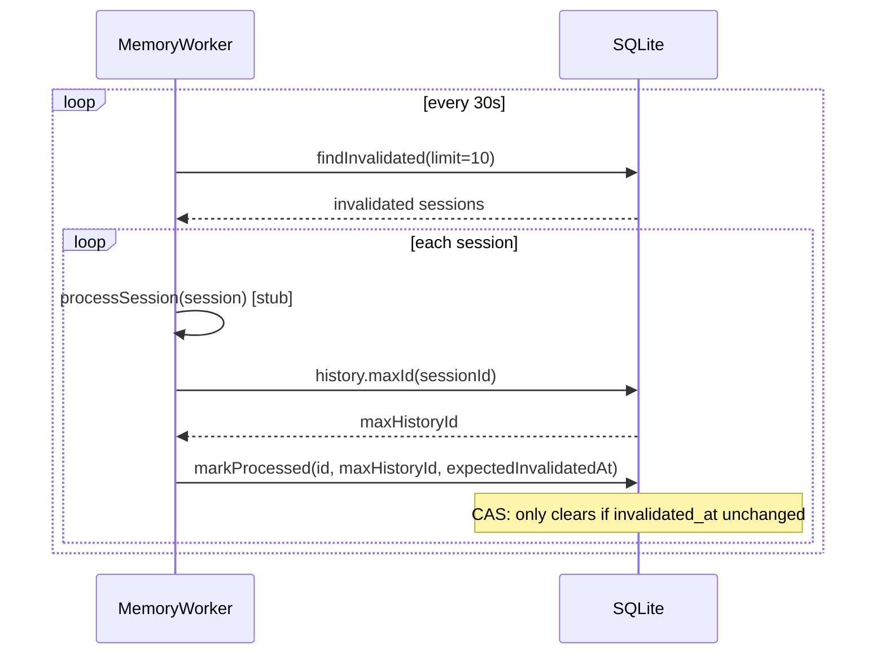

# Memory Collection Loop

## Overview
Build the durable scaffolding for memory collection from agent sessions. The system marks sessions for processing (invalidation), then a background worker picks them up, processes them (stub for now), and clears the mark. This is the first phase - collecting - to be followed by organizing and querying.

## Context
- Sessions live in SQLite `sessions` table with `session_history` recording all messages
- Agent lifecycle: active -> sleeping -> dead, with delayed signals for idle (60s) and poison-pill (1hr)
- `Storage` facade coordinates agents, sessions, and history in `storage/storage.ts`
- `AgentSystem.sleepIfIdle()` handles agent idle transition
- `Agent.applyCompactionSummary()` / `handleReset()` create new sessions (compaction/reset)
- `storage.appendHistory()` appends history records and resolves session ids
- Timer-based workers exist (CronScheduler pattern): `setTimeout` tick loop with start/stop
- No existing memory processing code

## Development Approach
- **Testing approach**: Regular (code first, then tests)
- Complete each task fully before moving to the next
- Make small, focused changes
- **CRITICAL: every task MUST include new/updated tests**
- **CRITICAL: all tests must pass before starting next task**
- Run tests after each change

## Progress Tracking
- Mark completed items with `[x]` immediately when done
- Add newly discovered tasks with + prefix
- Document issues/blockers with ! prefix

## Implementation Steps

### Task 1: Migration - add memory columns to sessions table
- [x] Create `storage/migrations/20260224_add_memory_columns.ts` migration that adds `invalidated_at INTEGER` (nullable) and `processed_until INTEGER` (nullable) columns to `sessions` table
- [x] Add index `idx_sessions_invalidated_at` on `sessions(invalidated_at)` for efficient worker queries
- [x] Register migration in `storage/migrations/_migrations.ts`
- [x] Update `DatabaseSessionRow` in `storage/databaseTypes.ts` to include `invalidated_at: number | null` and `processed_until: number | null`
- [x] Update `SessionDbRecord` in `storage/databaseTypes.ts` to include `invalidatedAt: number | null` and `processedUntil: number | null`
- [x] Write migration spec `20260224_add_memory_columns.spec.ts` verifying columns are added
- [x] Run tests - must pass before next task

### Task 2: SessionsRepository - invalidation query methods
- [x] Update `sessionParse()` in `sessionsRepository.ts` to map new columns
- [x] Update `create()` INSERT statement to include the new columns (defaulting to null)
- [x] Add `invalidate(sessionId: string, historyId: number): Promise<void>` - sets `invalidated_at = historyId` (only if current value is null or `historyId` is larger)
- [x] Add `findInvalidated(limit: number): Promise<SessionDbRecord[]>` - returns sessions where `invalidated_at IS NOT NULL`, ordered by `invalidated_at ASC`
- [x] Add `markProcessed(sessionId: string, processedUntil: number, expectedInvalidatedAt: number): Promise<boolean>` - CAS update: sets `invalidated_at = NULL` and `processed_until = processedUntil` only if `invalidated_at = expectedInvalidatedAt`, returns whether update affected a row
- [x] Write tests for `invalidate()` (basic set, idempotent, keeps larger value)
- [x] Write tests for `findInvalidated()` (returns only invalidated, respects limit, ordered by invalidated_at)
- [x] Write tests for `markProcessed()` (success CAS, fails when invalidated_at changed)
- [x] Run tests - must pass before next task

### Task 3: Turn count check in appendHistory
- [x] Add `countSinceId(sessionId: string, afterId: number): Promise<number>` to `HistoryRepository` - counts records with `id > afterId` for the given session
- [x] Add `maxId(sessionId: string): Promise<number | null>` to `HistoryRepository` - returns max history record id for a session
- [x] Modify `history.append()` to return the new record's auto-increment `id`
- [x] Modify `storage.appendHistory()` to check turn count after appending: query session's `processed_until`, count records since that id, if count > 5 call `sessions.invalidate(sessionId, newRecordId)`
- [x] Write test for `countSinceId()` (counts correctly, returns 0 when none)
- [x] Write test for `maxId()` (returns max, returns null for empty session)
- [x] Write test for `appendHistory()` invalidation trigger (invalidates after 6th record, does not invalidate at 5)
- [x] Run tests - must pass before next task

### Task 4: Agent lifecycle invalidation triggers
- [x] In `AgentSystem.sleepIfIdle()`, after setting agent state to sleeping, get `maxId` for the active session and call `storage.sessions.invalidate(activeSessionId, maxHistoryId)` to mark the session for memory processing
- [x] In `Agent.applyCompactionSummary()`, before creating the new session, get `maxId` for the old session and invalidate via `storage.sessions.invalidate(oldSessionId, maxHistoryId)`
- [x] In `Agent.handleReset()`, before creating the new session, get `maxId` for the old session and invalidate via `storage.sessions.invalidate(oldSessionId, maxHistoryId)` (only if old session exists)
- [x] Run tests - must pass before next task

### Task 5: Memory worker
- [x] Create `engine/memory/memoryWorker.ts` with `MemoryWorker` class following CronScheduler pattern:
  - Constructor takes `{ storage: Storage; intervalMs?: number }` (default 30s interval)
  - `start()` begins the timer loop
  - `stop()` clears the timer
  - Private `tick()` method: calls `storage.sessions.findInvalidated(10)`, for each calls `processSession()` (stub that logs), then calls `storage.sessions.markProcessed(id, maxHistoryId, invalidatedAt)`
  - Uses `getLogger("engine.memory")` for logging
- [x] `processSession()` stub: logs `"event: Processing session sessionId=... (stub)"` and returns immediately
- [x] Write test: worker calls `findInvalidated` on tick and marks sessions as processed
- [x] Write test: worker respects CAS - if `invalidated_at` changed during processing, session stays invalidated
- [x] Write test: worker start/stop lifecycle (no ticks after stop)
- [x] Run tests - must pass before next task

### Task 6: Engine integration
- [x] Add `memoryWorker` field to `Engine` class
- [x] Create `MemoryWorker` in `Engine` constructor, passing `storage`
- [x] Call `memoryWorker.start()` in `Engine.start()` after agent system starts
- [x] Call `memoryWorker.stop()` in `Engine.shutdown()` before storage close
- [x] Run tests - must pass before next task

### Task 7: Verify acceptance criteria
- [x] Verify: sessions get `invalidated_at` set on agent sleep
- [x] Verify: sessions get `invalidated_at` set after >5 unprocessed history records
- [x] Verify: sessions get `invalidated_at` set on compaction/reset
- [x] Verify: worker polls invalidated sessions and clears the mark
- [x] Verify: CAS prevents clearing when new messages arrived during processing
- [x] Run full test suite (unit tests)
- [x] Run linter - all issues must be fixed
- [x] Run typecheck

### Task 8: Documentation
- [x] Create `doc/concepts/memory-collection.md` documenting the invalidation/processing loop with mermaid diagram

## Technical Details

### DB Schema Changes
```sql
ALTER TABLE sessions ADD COLUMN invalidated_at INTEGER;
ALTER TABLE sessions ADD COLUMN processed_until INTEGER;
CREATE INDEX idx_sessions_invalidated_at ON sessions(invalidated_at);
```

- `invalidated_at`: `session_history.id` of the last history record at the moment of invalidation. NULL = not pending processing. Non-null = needs processing.
- `processed_until`: `session_history.id` of the last processed record. NULL = nothing processed yet.

### Invalidation Triggers
```
Agent IDLE (sleep)  ──> sessions.invalidate(activeSessionId, maxHistoryId)
Turn count > 5      ──> sessions.invalidate(sessionId, newRecordId)  [checked in appendHistory]
Compaction/Reset    ──> sessions.invalidate(oldSessionId, maxHistoryId)
```

### Worker Processing Flow


### CAS (Compare-And-Swap) for markProcessed
```sql
UPDATE sessions
SET invalidated_at = NULL, processed_until = ?
WHERE id = ? AND invalidated_at = ?
```
Returns `changes === 1` on success. If `invalidated_at` changed during processing (new messages arrived), the update affects 0 rows and the session stays invalidated for the next tick.

## Post-Completion
- Next phase: implement actual memory extraction in `processSession()` (LLM-based summarization)
- Next phase: memory organization (entity files, indexing)
- Next phase: memory querying (inject relevant memories into system prompt)
