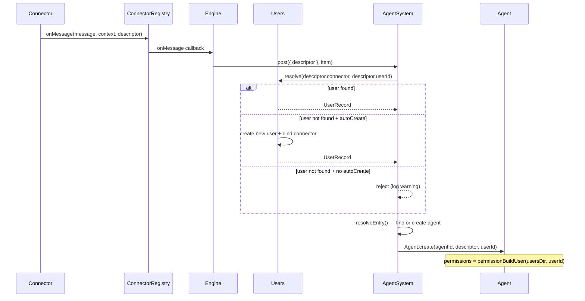

# Multiuser Home Directories

## Overview
Introduce per-user isolation to Daycare. Each user gets their own home directory with permission-zoned folders, memory files, skills, and workspace. A user registry maps connector identities (Telegram UID, WhatsApp phone) to internal user IDs (cuid2). Agents remain in the global `agents/` folder but reference their owning user.

**Problem**: Currently all users share one set of memory files, one workspace, and one skill folder. No user isolation exists.

**Key benefits**:
- Each user's data is sandboxed (skills, files, memory, workspace)
- Permission zones enforce what agents can access within a user's space
- Multiple connector identities map to a single user
- Foundation for secret engine (unix socket isolation) in future

## Context (from discovery)

### Files/components involved
- `sources/paths.ts` — default path constants (memory files, skills root)
- `sources/config/configResolve.ts` — derives `Config` snapshot with all paths
- `sources/config/configTypes.ts` — `Config` type definition
- `sources/settings.ts` — `SettingsConfig` schema and I/O
- `sources/engine/permissions.ts` — `SessionPermissions` type, `resolveWorkspaceDir`
- `sources/engine/permissions/permissionBuildDefault.ts` — builds default permissions
- `sources/engine/agents/agent.ts` — `Agent.create()` clones default permissions
- `sources/engine/agents/agentSystem.ts` — `resolveEntry()` maps descriptors to agents
- `sources/engine/agents/ops/agentDescriptorTypes.ts` — `AgentDescriptor` union
- `sources/engine/agents/ops/agentDescriptorCacheKey.ts` — cache key from descriptor
- `sources/engine/agents/ops/agentPromptPathsResolve.ts` — resolves memory file paths
- `sources/engine/agents/ops/agentPromptFilesEnsure.ts` — seeds default memory files
- `sources/engine/agents/ops/agentSystemPromptSectionMemory.ts` — injects memory into prompts
- `sources/engine/agents/ops/agentAppFolderPathResolve.ts` — app folder resolution
- `sources/engine/skills/skills.ts` — `Skills` facade (4-source aggregation)
- `sources/engine/skills/skillListUser.ts` — loads skills from `~/.agents/skills`
- `sources/engine/skills/skillListConfig.ts` — loads skills from config root
- `sources/files/store.ts` — `FileStore` with `config.filesDir`
- `sources/engine/modules/connectorRegistry.ts` — connector lifecycle management
- `sources/main.ts` — CLI commands
- `sources/types.ts` — central type re-exports

### Current path flow
```
configResolve() → Config {
  dataDir:    ~/.daycare
  agentsDir:  ~/.daycare/agents
  workspaceDir: ~/.daycare/workspace
  filesDir:   ~/.daycare/workspace/files
}

permissionBuildDefault(workspaceDir, configDir) → SessionPermissions {
  workingDir: ~/.daycare/workspace
  writeDirs:  [workspace, SOUL.md, USER.md, AGENTS.md, TOOLS.md, MEMORY.md, heartbeat/, skills/]
  readDirs:   [...writeDirs]
}

Agent.create() → permissions = clone(config.defaultPermissions)
```

### Key insight: user resolution gap
Connectors create `AgentDescriptor { type: "user", connector, userId, channelId }` but there is no mapping from connector identity to an internal user. The `AgentSystem.resolveEntry()` maps descriptors directly to agents via `agentDescriptorCacheKey()`. We need to insert a user resolution step between connector identity and agent creation.

## Target Folder Structure

```
.daycare/
  settings.json
  auth.json
  agents/                              # global, system-managed
    <agent-cuid2>/
      descriptor.json
      state.json
      history.jsonl
  plugins/
    <instanceId>/
  users/                               # NEW: per-user directories
    <user-cuid2>/
      user.json                        # user profile + connector bindings
      SOUL.md                          # personality (system-managed, agent r/w)
      USER.md                          # user facts
      AGENTS.md                        # workspace rules
      TOOLS.md                         # tool notes
      MEMORY.md                        # working memory
      home/                            # user's writable sandbox
        desktop/                       # default agent workingDir
        documents/
        downloads/                     # connector file attachments
        developer/
        tmp/                           # ephemeral scratch space
        .*/                            # dot folders allowed for tool configs
      skills/                          # user's skills (read-only for agents)
        <skill-name>/
          skill.md
          data/                        # skill's persistent writable storage
      apps/                            # isolated per-app sandboxes
        <app-id>/
      sockets/                         # future: unix socket mount points
```

### Permission Zones

| Zone | Agent access | Managed by |
|------|-------------|------------|
| `home/` | full read + write (including dot files) | user agent |
| Memory files (*.md) | explicit read + write grants | system (agent can edit) |
| `skills/` | read-only; `skills/<name>/data/` writable only by that skill | skill installer |
| `apps/<id>/` | only that app's process can access | app system |
| `sockets/` | fs-level protection, mounted for authorized agents | secret engine (future) |

### user.json Schema
```typescript
type UserRecord = {
  id: string;                          // cuid2
  name?: string;                       // display name
  connectors: UserConnectorBinding[];  // connector identity mappings
  createdAt: number;                   // unix timestamp
};

type UserConnectorBinding = {
  connector: string;                   // "telegram", "whatsapp", etc.
  userId: string;                      // platform-specific user ID
};
```

## Development Approach
- **Testing approach**: Regular (code first, then tests)
- Complete each task fully before moving to the next
- Make small, focused changes
- **CRITICAL: every task MUST include new/updated tests**
- **CRITICAL: all tests must pass before starting next task**
- **CRITICAL: update this plan file when scope changes during implementation**

## Testing Strategy
- **Unit tests**: required for every task
- Pure functions get dedicated `*.spec.ts` files
- Test both success and error scenarios

## Progress Tracking
- Mark completed items with `[x]` immediately when done
- Add newly discovered tasks with `➕` prefix
- Document issues/blockers with `⚠️` prefix

## Implementation Steps

### Task 1: Define user types and registry
Create the user data model and a `Users` facade for loading/saving/resolving users.

- [ ] Create `sources/engine/users/userTypes.ts` with `UserRecord`, `UserConnectorBinding` types
- [ ] Create `sources/engine/users/userCreate.ts` — generates cuid2 id, writes `user.json`, creates home directory structure (desktop, documents, downloads, developer, tmp), creates skills/ and apps/ dirs, seeds memory files via `agentPromptFilesEnsure`
- [ ] Create `sources/engine/users/userLoad.ts` — reads `user.json` from `<usersDir>/<userId>/user.json`
- [ ] Create `sources/engine/users/userSave.ts` — writes `user.json` atomically
- [ ] Create `sources/engine/users/userList.ts` — scans `users/` dir, returns all `UserRecord`s
- [ ] Create `sources/engine/users/userResolveByConnector.ts` — given `(connector, userId)`, scans loaded users to find matching binding; returns `UserRecord | null`
- [ ] Create `sources/engine/users/users.ts` — `Users` facade class: holds in-memory user cache, exposes `resolve(connector, userId)`, `create(name?, connectors?)`, `get(id)`, `list()`, `addConnector(userId, binding)`, `userDir(userId)`
- [ ] Write tests for `userCreate` (verify directory structure created)
- [ ] Write tests for `userResolveByConnector` (match, no match, multiple connectors)
- [ ] Write tests for `Users` facade (resolve, create, list)
- [ ] Run tests — must pass before next task

### Task 2: Define user home directory paths and constants
Establish path helpers for user directory structure.

- [ ] Create `sources/engine/users/userPaths.ts` with functions:
  - `userDir(usersDir, userId)` → `<usersDir>/<userId>`
  - `userHomePath(usersDir, userId)` → `<usersDir>/<userId>/home`
  - `userDesktopPath(usersDir, userId)` → `<usersDir>/<userId>/home/desktop`
  - `userDownloadsPath(usersDir, userId)` → `<usersDir>/<userId>/home/downloads`
  - `userSkillsPath(usersDir, userId)` → `<usersDir>/<userId>/skills`
  - `userAppsPath(usersDir, userId)` → `<usersDir>/<userId>/apps`
  - `userSocketsPath(usersDir, userId)` → `<usersDir>/<userId>/sockets`
  - `userMemoryPaths(usersDir, userId)` → `AgentPromptFilesPaths` (5 .md files)
- [ ] Add `usersDir` to `Config` type in `configTypes.ts` — value: `path.join(dataDir, "users")`
- [ ] Update `configResolve.ts` to compute `usersDir`
- [ ] Add `HOME_SUBDIRS` constant array: `["desktop", "documents", "downloads", "developer", "tmp"]`
- [ ] Write tests for all path functions
- [ ] Run tests — must pass before next task

### Task 3: Build per-user permission sets
Create a function that builds `SessionPermissions` scoped to a specific user's directory.

- [ ] Create `sources/engine/permissions/permissionBuildUser.ts`:
  - Takes `(usersDir, userId)` and builds `SessionPermissions` where:
    - `workspaceDir` = `<userDir>/home`
    - `workingDir` = `<userDir>/home/desktop`
    - `writeDirs` = `[home/*, memory files]` (home is the writable sandbox + the 5 .md files)
    - `readDirs` = `[...writeDirs, skills/]` (skills are readable but not writable)
  - Does NOT include `apps/`, `sockets/`, or other users' dirs
- [ ] Update `permissionBuildDefault.ts` to accept optional user context (backward compat: when no user, behaves as today)
- [ ] Write tests for `permissionBuildUser` — verify home writable, skills read-only, apps excluded, memory files writable
- [ ] Write tests for edge cases — userId validation, path traversal prevention
- [ ] Run tests — must pass before next task

### Task 4: Wire user resolution into agent creation
Insert user lookup between connector descriptor arrival and agent creation.

- [ ] Add `userId?: string` field to `AgentState` type (in `sources/engine/agents/agentStateTypes.ts` or similar)
- [ ] Modify `AgentSystem` constructor to accept `Users` facade
- [ ] Modify `AgentSystem.resolveEntry()`:
  - For `type: "user"` descriptors, call `users.resolve(descriptor.connector, descriptor.userId)`
  - If user found: store `userId` in agent state, use per-user permissions
  - If user not found and auto-create enabled: create new user, bind connector
  - If user not found and auto-create disabled: reject message (log warning)
- [ ] Modify `Agent.create()` to accept optional `userId` and use `permissionBuildUser()` when present instead of `config.defaultPermissions`
- [ ] Add `users.autoCreate` setting to `SettingsConfig` (default: `true`)
- [ ] Update `configSettingsParse.ts` Zod schema for new setting
- [ ] Write tests for agent creation with user context
- [ ] Write tests for auto-create on/off behavior
- [ ] Run tests — must pass before next task

### Task 5: Route memory files to user directory
Make the system prompt memory section read from user-specific paths.

- [ ] Modify `agentPromptPathsResolve.ts` to accept optional `userDir` parameter:
  - When `userDir` provided, resolve memory paths to `<userDir>/SOUL.md` etc.
  - Fallback chain: userDir → dataDir → defaults
- [ ] Modify `agentSystemPromptSectionMemory.ts` to pass user directory when available:
  - Get `userId` from agent state
  - Resolve user directory from `Users` facade or config
  - Pass to `agentPromptPathsResolve()`
- [ ] Modify `agentPromptFilesEnsure.ts` to accept user-specific paths
- [ ] Ensure memory files are seeded into user dir on user creation (Task 1 handles this)
- [ ] Write tests for path resolution with user dir
- [ ] Write tests for fallback chain (user → global → bundled)
- [ ] Run tests — must pass before next task

### Task 6: Route skills to user directory
Load user-specific skills from the user's `skills/` folder.

- [ ] Modify `Skills` facade to accept optional user skills path
- [ ] Create `skillListUserDir.ts` — loads skills from a specific user's `skills/` dir (reuses `skillListFromRoot`)
- [ ] Update `Skills.list()` to include user-specific skills when a userId is provided
- [ ] In agent context building, pass user's skill path to the Skills facade
- [ ] Write tests for loading skills from user dir
- [ ] Run tests — must pass before next task

### Task 7: Route file storage to user directory
Make `FileStore` write to user-specific `home/downloads/` folder.

- [ ] Add ability to create per-user `FileStore` instances (or parameterize with user's downloads path)
- [ ] Modify connector file handling to route to user's downloads dir when user is resolved
- [ ] Ensure `FileStore.saveBuffer/saveFromPath` uses the user-scoped path
- [ ] Write tests for user-scoped file storage
- [ ] Run tests — must pass before next task

### Task 8: Route apps to user directory
Update app folder resolution to use user-specific `apps/` directory.

- [ ] Modify `agentAppFolderPathResolve.ts` to use `<userDir>/apps/<appId>` when user context available
- [ ] Ensure app permissions only grant access to the specific app's folder within the user dir
- [ ] Write tests for user-scoped app folder resolution
- [ ] Run tests — must pass before next task

### Task 9: Add CLI commands for user management
Add `daycare user` subcommands.

- [ ] Create `sources/commands/userCreate.ts` — `daycare user create [--name <name>]` creates a new user
- [ ] Create `sources/commands/userList.ts` — `daycare user list` shows all users with IDs and bindings
- [ ] Create `sources/commands/userBind.ts` — `daycare user bind <userId> <connector> <connectorUserId>` adds a connector binding
- [ ] Create `sources/commands/userMigrate.ts` — `daycare user migrate` detects legacy `workspace/` folder and moves data into a newly created default user
- [ ] Register commands in `main.ts`
- [ ] Write tests for migrate logic (detect workspace, move files, create user record)
- [ ] Run tests — must pass before next task

### Task 10: Wire Users into Engine lifecycle
Connect the `Users` facade to the `Engine` startup.

- [ ] Instantiate `Users` in `Engine` constructor with `config.usersDir`
- [ ] Load all users at startup (`users.loadAll()`)
- [ ] Pass `Users` to `AgentSystem`
- [ ] Ensure workspace dir creation uses user's `home/desktop` for user agents
- [ ] Write integration-style test: connector message → user resolution → agent with user permissions
- [ ] Run tests — must pass before next task

### Task 11: Update types.ts re-exports
Add new types to central type index.

- [ ] Export `UserRecord`, `UserConnectorBinding` from `@/types`
- [ ] Export `Users` facade type if needed
- [ ] Verify no circular imports
- [ ] Run tests — must pass before next task

### Task 12: Verify acceptance criteria
- [ ] Verify: new user gets full directory structure (home/desktop, documents, downloads, developer, tmp, skills/, apps/, sockets/, 5 .md files)
- [ ] Verify: agent for user-type descriptor gets permissions scoped to user's home
- [ ] Verify: memory files are read from user directory
- [ ] Verify: skills are loaded from user directory
- [ ] Verify: files are stored in user's downloads
- [ ] Verify: apps are isolated per-user
- [ ] Verify: auto-create setting works (on: create user on first message; off: reject)
- [ ] Verify: `daycare user migrate` moves legacy data correctly
- [ ] Run full test suite (unit tests)
- [ ] Run linter — all issues must be fixed

### Task 13: [Final] Update documentation
- [ ] Create `sources/engine/users/README.md` documenting the user system
- [ ] Update `doc/PLUGINS.md` if plugin API changes affect user context
- [ ] Add mermaid diagram of user resolution flow to docs

## Technical Details

### User Resolution Flow


### Permission Construction
```typescript
// Per-user permissions (replaces global default for user agents)
function permissionBuildUser(usersDir: string, userId: string): SessionPermissions {
  const userDir = path.join(usersDir, userId);
  const homeDir = path.join(userDir, "home");
  const desktopDir = path.join(homeDir, "desktop");
  const skillsDir = path.join(userDir, "skills");

  return {
    workspaceDir: homeDir,
    workingDir: desktopDir,
    writeDirs: [
      homeDir,                          // full home access
      path.join(userDir, "SOUL.md"),    // memory files
      path.join(userDir, "USER.md"),
      path.join(userDir, "AGENTS.md"),
      path.join(userDir, "TOOLS.md"),
      path.join(userDir, "MEMORY.md"),
    ],
    readDirs: [
      homeDir,
      skillsDir,                        // skills readable but not writable
      // memory files inherit from writeDirs
    ],
    network: false,
    events: false,
  };
}
```

### Settings Addition
```json
{
  "users": {
    "autoCreate": true
  }
}
```

## Post-Completion

**Manual verification**:
- Test with Telegram connector: send message from new user, verify user directory created
- Test with WhatsApp connector: verify same user resolution with different connector
- Verify agent can read/write within home/ but not outside
- Verify skill data/ is writable only during skill execution
- Verify legacy migration moves all expected files

**Future work** (not in scope):
- Skill sharing between users
- Secret engine with unix socket proxying
- Per-skill ephemeral execution directories
- User deletion / data export
