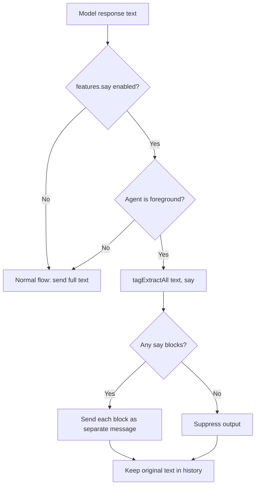

# Say Tag & Features Config

## Overview
- Add a `features` object to `settings.json` for boolean feature flags (`features: { say: true, rlm: true }`)
- Move the top-level `rlm` field into `features.rlm` (remove old field entirely)
- Add `<say>` tag feature: when `features.say` is enabled, only text inside `<say>...</say>` tags is forwarded to the user; all other text is suppressed. Applies to foreground agents only.
- Multiple `<say>` blocks in a single response are sent as separate messages
- If no `<say>` tags are present in a response, suppress entire output (opt-in speaking)
- Message history is kept unmodified (model sees its own reasoning + say blocks)
- Expose `features` object in Handlebars template context (`{{#if features.say}}`)

## Context
- **Config**: `settings.ts` (`SettingsConfig`), `configTypes.ts` (`Config`), `configResolve.ts`, `configSettingsParse.ts`
- **Tag extraction**: `util/tagExtract.ts` — currently only extracts single block (first open to last close). Need a `tagExtractAll` for multiple `<say>` blocks.
- **Message forwarding**: `engine/agents/ops/agentLoopRun.ts` lines 233-263 — extracts text, checks NO_MESSAGE, sends to connector
- **Templating**: `engine/agents/agent.ts` lines 1168-1226 — builds Handlebars template context
- **RLM usage**: `config.rlm` is read in `engine.ts:383`, `agent.ts:978`, `agentLoopRun.ts:133`, `toolListContextBuild.ts:30`, `appExecute.ts:62`, `appToolReview.ts`, `appReviewPromptBuild.ts`
- **System prompt**: `prompts/SYSTEM.md` — Handlebars templates with `{{#if isForeground}}` branches

## Development Approach
- **Testing approach**: Regular (code first, then tests)
- Complete each task fully before moving to the next
- Make small, focused changes
- **CRITICAL: every task MUST include new/updated tests**
- **CRITICAL: all tests must pass before starting next task**
- **CRITICAL: update this plan file when scope changes during implementation**

## Progress Tracking
- Mark completed items with `[x]` immediately when done
- Add newly discovered tasks with ➕ prefix
- Document issues/blockers with ⚠️ prefix

## Implementation Steps

### Task 1: Add `features` to settings types and config
- [ ] Add `FeaturesConfig` type to `settings.ts`: `{ say?: boolean; rlm?: boolean }`
- [ ] Add `features?: FeaturesConfig` field to `SettingsConfig` in `settings.ts`
- [ ] Remove top-level `rlm?: boolean` from `SettingsConfig`
- [ ] Add `ResolvedFeaturesConfig` with all fields required (defaults to `false`) to `settings.ts`
- [ ] Update `ResolvedSettingsConfig` to include `features: ResolvedFeaturesConfig` and exclude the old `rlm` field
- [ ] Update `resolveSettingsDefaults` in `configResolve.ts` to resolve `features` with defaults
- [ ] Replace `rlm: boolean` in `Config` (`configTypes.ts`) with `features: ResolvedFeaturesConfig`
- [ ] Update `configResolve()` to set `features` from resolved settings instead of `rlm`
- [ ] Update `configSettingsParse.ts` Zod schema: add `features` object, remove top-level `rlm`
- [ ] Write tests for config resolution with features (success + defaults)
- [ ] Write tests for settings parsing with features schema
- [ ] Run tests — must pass before next task

### Task 2: Migrate all `config.rlm` references to `config.features.rlm`
- [ ] Update `engine.ts:383` — `this.config.current.rlm` → `this.config.current.features.rlm`
- [ ] Update `engine.ts:464` — `rlm: this.config.current.rlm` → `rlm: this.config.current.features.rlm`
- [ ] Update `agent.ts:978` — `this.agentSystem.config.current.rlm` → `this.agentSystem.config.current.features.rlm`
- [ ] Update `agentLoopRun.ts:133` — `agentSystem.config.current.rlm` → `agentSystem.config.current.features.rlm`
- [ ] Update `appExecute.ts:62` — `config.rlm` → `config.features.rlm`
- [ ] Update `appToolReview.ts` and `appReviewPromptBuild.ts` RLM references
- [ ] Update `appToolExecutorBuild.ts` RLM references
- [ ] Update existing tests (`configResolve.spec.ts`, `agentLoopRun.spec.ts`, `toolListContextBuild.spec.ts`, `engine.spec.ts`, app test files) to use `features.rlm`
- [ ] Run tests — must pass before next task

### Task 3: Expose `features` in Handlebars template context
- [ ] Add `features` to `templateContext` in `agent.ts` (around line 1169) sourcing from `this.agentSystem.config.current.features`
- [ ] Verify the `features` object is available in templates via `{{#if features.say}}`
- [ ] Write a test verifying template context includes features
- [ ] Run tests — must pass before next task

### Task 4: Add `tagExtractAll` utility
- [ ] Add `tagExtractAll(text: string, tag: string): string[]` to `util/tagExtract.ts` — extracts content from all non-overlapping `<tag>...</tag>` pairs
- [ ] Write tests for `tagExtractAll`: no tags → empty array, one tag → single item, multiple tags → multiple items, nested tags, mixed content
- [ ] Run tests — must pass before next task

### Task 5: Implement `<say>` tag extraction in agent loop
- [ ] In `agentLoopRun.ts`, after extracting `responseText` (line 233), add `<say>` feature check:
  - Read `features.say` from `agentSystem.config.current.features`
  - Only apply to foreground agents (`agentKind === "foreground"`)
  - If enabled: use `tagExtractAll(responseText, "say")` to get say blocks
  - If say blocks found: send each as a separate message via `connector.sendMessage`
  - If no say blocks: suppress output (set `effectiveResponseText = null`)
  - Keep original message text in history unmodified
- [ ] Ensure NO_MESSAGE still works when `<say>` feature is disabled
- [ ] Write tests: say enabled + say tags → extracts and sends, say enabled + no tags → suppresses, say disabled → normal behavior, background agent → say ignored
- [ ] Run tests — must pass before next task

### Task 6: Add `<say>` instructions to system prompt
- [ ] In `prompts/SYSTEM.md`, add conditional block for `{{#if features.say}}` in the foreground messages section (near line 249) instructing the model:
  - Wrap text meant for the user in `<say>...</say>` tags
  - Text outside `<say>` tags is internal reasoning (not forwarded)
  - Multiple `<say>` blocks are sent as separate messages
- [ ] Verify prompt renders correctly with feature enabled/disabled
- [ ] Run tests — must pass before next task

### Task 7: Update recipe for RLM
- [ ] Update `recipe/_recipes.ts` and `recipe/recipeRlm.ts` to use `features.rlm` instead of top-level `rlm`
- [ ] Run tests — must pass before next task

### Task 8: Verify acceptance criteria
- [ ] Verify all `config.rlm` usages are migrated (grep for `\.rlm\b` excluding `features.rlm`)
- [ ] Verify `features` object is in template context
- [ ] Verify `<say>` tag extraction works for foreground agents
- [ ] Verify background agents are unaffected by `<say>`
- [ ] Run full test suite
- [ ] Run linter

### Task 9: Update documentation
- [ ] Update `doc/` if feature flags are documented
- [ ] Add mermaid diagram for `<say>` tag flow

## Technical Details

### Features config shape
```json
{
  "features": {
    "say": true,
    "rlm": true
  }
}
```

### `<say>` extraction flow (foreground agents only)


### Config resolution
```typescript
type FeaturesConfig = {
  say?: boolean;
  rlm?: boolean;
};

type ResolvedFeaturesConfig = Required<FeaturesConfig>;
// Defaults: { say: false, rlm: false }
```

## Post-Completion

**Manual verification:**
- Test with a real model to verify `<say>` tag behavior in conversation
- Verify prompt renders correctly for foreground/background agents with feature on/off
- Test RLM still works after migration to `features.rlm`
