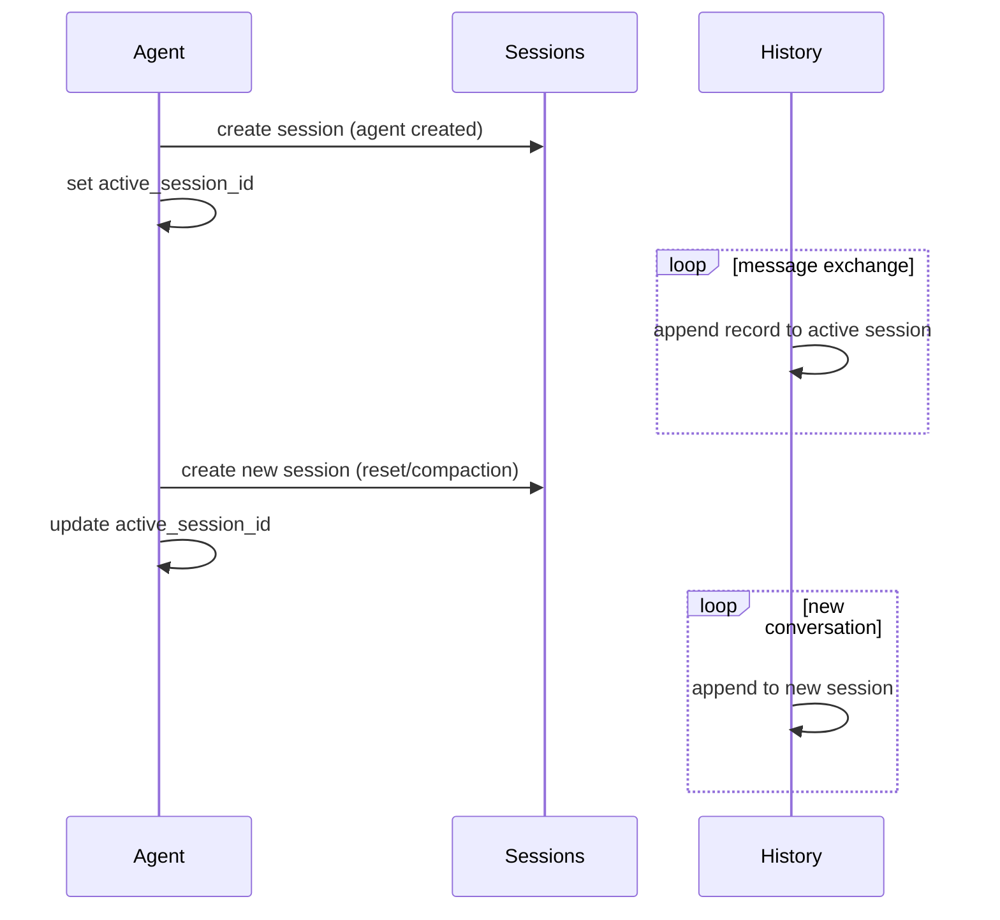

# SQLite Agent Storage Migration

## Overview
Migrate agent state, descriptors, and history from file-based storage (`descriptor.json`, `state.json`, `history.jsonl`) to a single SQLite database using Node 22+'s built-in `node:sqlite` module. Introduce **sessions** as a first-class concept — each agent has one active session, a reset creates a new session, and history records belong to a session. Remove persisted `context` entirely — LLM context is ephemeral, rebuilt from the active session's history on startup.

## Context (from discovery)

### Current file-based storage
```
~/.daycare/agents/<cuid2>/
  descriptor.json   — agent identity (type, connector, userId, etc.)
  state.json        — runtime state (context, permissions, tokens, stats, lifecycle)
  history.jsonl     — append-only event log with start/reset markers delimiting sessions
```

### Current session model (implicit)
Sessions are delimited by `start` and `reset` records in `history.jsonl`. `agentHistoryLoad()` scans the entire file to find the last `start`/`reset` marker, then returns records after it. There is no session id, no session metadata, and no way to query past sessions.

### Files affected
- `sources/engine/agents/ops/agentStateRead.ts` / `agentStateWrite.ts`
- `sources/engine/agents/ops/agentDescriptorRead.ts` / `agentDescriptorWrite.ts`
- `sources/engine/agents/ops/agentHistoryAppend.ts`
- `sources/engine/agents/ops/agentHistoryRecordsLoad.ts`
- `sources/engine/agents/ops/agentHistoryLoad.ts` / `agentHistoryLoadAll.ts`
- `sources/engine/agents/ops/agentHistoryContext.ts`
- `sources/engine/agents/ops/agentTypes.ts`
- `sources/engine/agents/agent.ts`
- `sources/engine/agents/agentSystem.ts`
- `sources/config/configTypes.ts`

## Key Decisions
- **No Drizzle** — `node:sqlite` has no official Drizzle support. Raw SQL with type-safe wrappers.
- **Sessions are first-class** — `sessions` table, each agent has `active_session_id`, history belongs to a session.
- **No context persistence** — context rebuilt from active session's history on every restore.
- **All to SQLite** — descriptors, state metadata, sessions, history in `~/.daycare/daycare.db`.
- **Timestamped migrations** — manual `daycare upgrade` command + auto-run on startup.
- **JSON blob columns** — descriptor, permissions, tokens, stats, history data stored as JSON text.
- **`start`/`reset` records removed** — session boundaries are structural (new session row), not inline markers.

## Schema Design

### `_migrations` table
```sql
CREATE TABLE _migrations (
  name TEXT PRIMARY KEY,
  applied_at INTEGER NOT NULL
);
```

### `agents` table
```sql
CREATE TABLE agents (
  id TEXT PRIMARY KEY,                      -- cuid2
  type TEXT NOT NULL,                       -- user|cron|system|subagent|app|permanent
  descriptor TEXT NOT NULL,                 -- full AgentDescriptor as JSON
  active_session_id TEXT,                   -- FK to sessions.id (null before first session)
  permissions TEXT NOT NULL,                -- SessionPermissions as JSON
  tokens TEXT,                              -- AgentTokenEntry as JSON (nullable)
  stats TEXT NOT NULL DEFAULT '{}',         -- AgentTokenStats as JSON
  lifecycle TEXT NOT NULL DEFAULT 'active', -- active|sleeping|dead
  created_at INTEGER NOT NULL,             -- unix ms
  updated_at INTEGER NOT NULL              -- unix ms
);
```

### `sessions` table
```sql
CREATE TABLE sessions (
  id TEXT PRIMARY KEY,                      -- cuid2
  agent_id TEXT NOT NULL,                   -- FK to agents.id
  inference_session_id TEXT,                -- cuid2 for inference provider (per-session)
  created_at INTEGER NOT NULL,             -- unix ms
  reset_message TEXT                        -- optional message from the reset that created this session
);

CREATE INDEX idx_sessions_agent_id ON sessions(agent_id);
```

### `session_history` table
```sql
CREATE TABLE session_history (
  id INTEGER PRIMARY KEY AUTOINCREMENT,
  session_id TEXT NOT NULL,                 -- FK to sessions.id
  type TEXT NOT NULL,                       -- user_message|assistant_message|tool_result|rlm_*|note|assistant_rewrite
  at INTEGER NOT NULL,                      -- unix ms
  data TEXT NOT NULL                        -- full record as JSON (without type/at which are columns)
);

CREATE INDEX idx_session_history_session ON session_history(session_id);
```

### Session lifecycle


1. **Agent created** → new session, `agents.active_session_id` set
2. **Messages exchanged** → history appended to active session
3. **Reset** → new session (with optional `reset_message`), `active_session_id` updated
4. **Compaction** → new session with compaction summary as `reset_message`
5. **Restore on startup** → load active session's history, rebuild context

## Development Approach
- **Testing approach**: Regular (code first, then tests)
- Complete each task fully before moving to the next
- **CRITICAL: every task MUST include new/updated tests**
- **CRITICAL: all tests must pass before starting next task**
- Run tests after each change

## Implementation Steps

### Task 1: Create storage module foundation
- [ ] create `sources/storage/databaseTypes.ts` — types for DB row shapes, migration definitions
- [ ] create `sources/storage/databaseOpen.ts` — opens/creates `DatabaseSync` at configured path, sets `journal_mode=WAL` and `foreign_keys=ON`
- [ ] add `dbPath` to `Config` type in `sources/config/configTypes.ts` (defaults to `~/.daycare/daycare.db`)
- [ ] wire `dbPath` in config resolution
- [ ] write tests for databaseOpen (creates DB file, WAL mode active)
- [ ] run tests — must pass before next task

### Task 2: Build migration system
- [ ] create `sources/storage/migrations/migrationTypes.ts` — `Migration` type: `{ name: string; up: (db: DatabaseSync) => void }`
- [ ] create `sources/storage/migrations/migrationRun.ts` — creates `_migrations` table if missing, runs pending migrations in order, records each
- [ ] create `sources/storage/migrations/migrationPending.ts` — returns list of unapplied migrations
- [ ] create `sources/storage/migrations/_migrations.ts` — ordered registry of all migration modules
- [ ] create `sources/storage/migrations/20260219_initial.ts` — creates `agents`, `sessions`, and `history` tables with indexes
- [ ] write tests for migrationRun (applies migrations, skips already-applied, idempotent)
- [ ] write tests for migrationPending (detects unapplied migrations)
- [ ] run tests — must pass before next task

### Task 3: Add `daycare upgrade` CLI command
- [ ] create `sources/storage/storageUpgrade.ts` — opens DB, runs pending migrations, logs results
- [ ] register `upgrade` command in CLI that calls `storageUpgrade`
- [ ] ensure upgrade runs automatically on startup (before agent loading), no-op if current
- [ ] write tests for storageUpgrade (fresh DB, already-current DB)
- [ ] run tests — must pass before next task

### Task 4: Implement agent DB operations
- [ ] create `sources/storage/agentDbWrite.ts` — upsert agent row (descriptor + state fields, no context)
- [ ] create `sources/storage/agentDbRead.ts` — read single agent by id, parse JSON columns, return typed result or null
- [ ] create `sources/storage/agentDbList.ts` — list all agents for startup loading
- [ ] write tests for write/read roundtrip (all fields preserved)
- [ ] write tests for list (multiple agents, different lifecycles)
- [ ] run tests — must pass before next task

### Task 5: Implement session DB operations
- [ ] create `sources/storage/sessionDbCreate.ts` — insert new session row, return session id
- [ ] create `sources/storage/sessionDbRead.ts` — read session by id
- [ ] create `sources/storage/sessionDbListForAgent.ts` — list all sessions for an agent (ordered by created_at)
- [ ] write tests for session create/read roundtrip
- [ ] write tests for listing sessions per agent
- [ ] run tests — must pass before next task

### Task 6: Implement session history DB operations
- [ ] create `sources/storage/sessionHistoryDbAppend.ts` — insert one history record (references session_id)
- [ ] create `sources/storage/sessionHistoryDbLoad.ts` — load all records for a session, ordered by id
- [ ] create `sources/storage/sessionHistoryDbLoadAll.ts` — load all records for an agent (joins through sessions)
- [ ] write tests for append + load roundtrip
- [ ] write tests for loadSession (only returns records from specified session)
- [ ] write tests for loadAll (returns records across sessions in order)
- [ ] run tests — must pass before next task

### Task 7: Remove context from AgentState, add session awareness
- [ ] update `AgentState` type — remove `context` from persisted shape, keep in-memory only
- [ ] add `activeSessionId` to `AgentState` (or alongside it)
- [ ] update `Agent.create()` — create agent row + first session in DB, set `active_session_id`
- [ ] update `Agent.restore()` — load from DB, load active session history, rebuild context via `agentHistoryContext()`
- [ ] update reset handling — create new session, update `active_session_id`, stop using `start`/`reset` history records
- [ ] update compaction — create new session with compaction summary as `reset_message`
- [ ] update history append calls — include `session_id`
- [ ] update `agentStateWrite` callers — replace with `agentDbWrite`
- [ ] write tests for create → restore roundtrip (context rebuilt from session history)
- [ ] write tests for reset → new session → history isolation
- [ ] run tests — must pass before next task

### Task 8: Rewire AgentSystem to use SQLite
- [ ] update `AgentSystem.load()` — replace directory scan with `agentDbList()`, restore each agent from DB + session history
- [ ] update `AgentSystem.resolveEntry()` — use `agentDbRead()` instead of file reads
- [ ] update `AgentSystem.restoreAgent()` — DB reads + session history context rebuild
- [ ] update all `agentDescriptorRead/Write` callers — route through DB ops
- [ ] update all `agentStateWrite` callers in `agentSystem.ts` — route through `agentDbWrite`
- [ ] pass DB handle through system (via config, constructor, or module)
- [ ] write tests for AgentSystem load from DB
- [ ] run tests — must pass before next task

### Task 9: Add file-to-SQLite data migration
- [ ] create `sources/storage/migrations/20260219_import_files.ts` — scans `~/.daycare/agents/*/`, imports each agent's files into DB
- [ ] split `history.jsonl` by `start`/`reset` markers into separate session rows
- [ ] assign the last session as `active_session_id`
- [ ] handle edge cases: missing files, corrupt JSON, no history
- [ ] log imported/skipped counts
- [ ] write tests for file import (temp file structure → DB, verify sessions split correctly)
- [ ] run tests — must pass before next task

### Task 10: Clean up old file-based code
- [ ] remove `agentStateRead.ts`, `agentStateWrite.ts`
- [ ] remove `agentDescriptorRead.ts`, `agentDescriptorWrite.ts`
- [ ] remove `agentHistoryAppend.ts`, `agentHistoryRecordsLoad.ts`, `agentHistoryLoad.ts`, `agentHistoryLoadAll.ts`
- [ ] remove `agentPath.ts` if no longer needed
- [ ] check if `atomicWrite.ts` has other callers; remove if not
- [ ] remove `start` and `reset` from `AgentHistoryRecord` union (session boundaries are structural now)
- [ ] update `agentHistoryContext.ts` — remove handling of `start`/`reset` record types
- [ ] update imports across codebase
- [ ] run full test suite — must pass before next task

### Task 11: Verify acceptance criteria
- [ ] verify agent CRUD flows end-to-end (create, restore, sleep, wake, dead)
- [ ] verify session lifecycle (create → messages → reset → new session → messages)
- [ ] verify history isolation between sessions
- [ ] verify context rebuilt correctly from active session history
- [ ] verify `daycare upgrade` works on fresh install and existing file-based install
- [ ] run full test suite
- [ ] run linter — all issues must be fixed

### Task 12: [Final] Update documentation
- [ ] update `doc/` with storage architecture, session model, mermaid diagrams
- [ ] document `daycare upgrade` command
- [ ] document migration system for future developers

## Technical Details

### Database initialization flow
```
startup → open/create daycare.db → run pending migrations → load agents from DB
```

### Agent restore flow
```
agentDbRead(id) → { descriptor, state (no context), activeSessionId }
sessionHistoryDbLoad(activeSessionId) → records for active session only
agentHistoryContext(records) → Context { messages }
Agent.restore(id, descriptor, stateWithRebuiltContext, ...)
```

### Reset flow
```
sessionDbCreate(agentId, resetMessage) → newSessionId
agentDbWrite(agentId, { activeSessionId: newSessionId, ... })
// all subsequent history records go to newSessionId
```

### File import: session splitting
```
history.jsonl records:
  start (at=100)        → session 1 begins
  user_message (at=101) → session 1
  assistant_message     → session 1
  reset (at=200, msg)   → session 2 begins (with reset_message)
  user_message (at=201) → session 2
  ...

Produces:
  sessions: [{id: s1, created_at: 100}, {id: s2, created_at: 200, reset_message: "..."}]
  history:  [{session_id: s1, ...}, ..., {session_id: s2, ...}, ...]
  agent.active_session_id = s2
```

### Migration file format
```typescript
// sources/storage/migrations/20260219_initial.ts
import type { DatabaseSync } from "node:sqlite";

export const migration = {
  name: "20260219_initial",
  up(db: DatabaseSync): void {
    db.exec(`
      CREATE TABLE agents (...);
      CREATE TABLE sessions (...);
      CREATE TABLE history (...);
      CREATE INDEX ...;
    `);
  }
};
```

### Type-safe query wrappers
```typescript
function queryAll<T>(db: DatabaseSync, sql: string, params?: unknown[]): T[] {
  const stmt = db.prepare(sql);
  return stmt.all(...(params ?? [])) as T[];
}

function queryOne<T>(db: DatabaseSync, sql: string, params?: unknown[]): T | null {
  const stmt = db.prepare(sql);
  const row = stmt.get(...(params ?? []));
  return (row as T) ?? null;
}

function execute(db: DatabaseSync, sql: string, params?: unknown[]): void {
  const stmt = db.prepare(sql);
  stmt.run(...(params ?? []));
}
```

## Post-Completion

**Manual verification:**
- Test with real agent data from `~/.daycare/agents/`
- Verify upgrade path: old file-based install → `daycare upgrade` → SQLite with sessions
- Verify session splitting during import matches original `start`/`reset` boundaries
- Performance: startup with many agents + large histories

**Future considerations:**
- Session metadata (token counts per session, duration)
- Session browsing/replay in dashboard
- History pruning per session (archive old sessions)
- Drizzle migration once `node:sqlite` support lands
