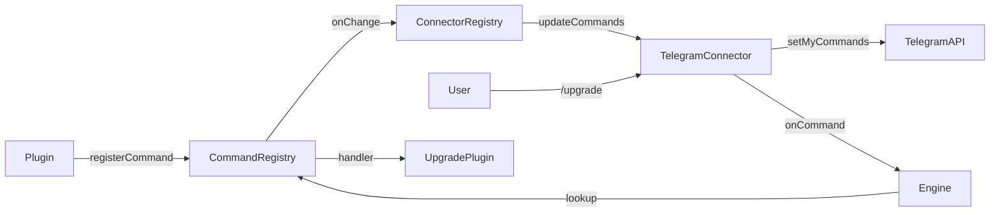

# Upgrade Plugin & Dynamic Slash Commands

## Overview
Add a plugin-level API for registering custom slash commands and build an upgrade plugin that uses it. Slash commands are user-facing only (not exposed to the model). The upgrade plugin registers `/upgrade` which runs `npm install -g daycare-cli` then restarts via a configurable strategy (pm2 initially). Telegram connector updates its bot menu dynamically when commands change. Also adds optional `preStart`/`postStart` lifecycle callbacks to the plugin API.

## Context
- **Slash commands today**: hardcoded in `engine.ts` (lines 145-184) — `/reset`, `/context`, `/stop`
- **Telegram static list**: `TELEGRAM_SLASH_COMMANDS` in `plugins/telegram/connector.ts` (line 51-64), registered via `bot.setMyCommands()` on init
- **Plugin registrar**: `PluginRegistrar` in `engine/plugins/registry.ts` — supports connectors, tools, inference, images, skills. No command registration.
- **Connector interface**: `engine/modules/connectors/types.ts` — has `onCommand?` but no way to push command definitions back to the connector
- **Command flow**: connector detects `/` prefix → dispatches to `commandHandlers` → `ConnectorRegistry` forwards to engine's `onCommand` → engine parses and handles hardcoded commands
- **Plugin lifecycle today**: `create()` → `load()` during `pluginManager.reload()`, no hooks for engine-level start/stop
- **Engine.start() order**: `pluginManager.reload()` → register core tools → `agentSystem.start()` → `crons.start()` → `heartbeats.start()` → `delayedSignals.start()`

## Architecture

### New command flow


### Key decisions
- `CommandRegistry` is a new module in `ModuleRegistry` alongside `ConnectorRegistry`, `InferenceRegistry`, etc.
- `PluginRegistrar` gets `registerCommand(def)` / `unregisterCommand(name)` methods
- `Connector` interface gets optional `updateCommands?: (commands: SlashCommandEntry[]) => void | Promise<void>`
- Engine's `onCommand` callback falls through to `CommandRegistry` when a command isn't hardcoded
- Telegram connector debounces `bot.setMyCommands()` calls (1s) to batch rapid changes
- Telegram connector defers initial `setMyCommands()` to `postStart` — so all plugin commands are registered first
- `PluginInstance` gets optional `preStart?` / `postStart?` callbacks called by `PluginManager` during engine startup

## Development Approach
- **Testing approach**: Regular (code first, then tests)
- Complete each task fully before moving to the next
- Make small, focused changes
- **CRITICAL: every task MUST include new/updated tests**
- **CRITICAL: all tests must pass before starting next task**

## Progress Tracking
- Mark completed items with `[x]` immediately when done
- Add newly discovered tasks with ➕ prefix
- Document issues/blockers with ⚠️ prefix

## Implementation Steps

### Task 1: Add SlashCommandEntry type and CommandRegistry
- [x] Create `SlashCommandEntry` type in `engine/modules/connectors/types.ts`: `{ command: string; description: string }`
- [x] Create `PluginCommandDefinition` type: `{ command: string; description: string; handler: CommandHandler }`
- [x] Create `engine/modules/commandRegistry.ts` with `CommandRegistry` class:
  - `register(pluginId: string, def: PluginCommandDefinition): void` — stores command, calls onChange
  - `unregister(name: string): void` — removes command, calls onChange
  - `unregisterByPlugin(pluginId: string): void` — removes all commands for a plugin
  - `get(name: string): PluginCommandDefinition | null` — lookup by command name
  - `list(): SlashCommandEntry[]` — returns all registered command entries
  - `onChange(listener): unsubscribe` — emits when command list changes
- [x] Export `SlashCommandEntry` from `@/types`
- [x] Write tests for `CommandRegistry` (register, unregister, list, onChange, plugin cleanup)
- [x] Run tests — must pass before next task

### Task 2: Wire CommandRegistry into ModuleRegistry and PluginRegistrar
- [x] Add `commands: CommandRegistry` field to `ModuleRegistry` in `engine/modules/moduleRegistry.ts`
- [x] Add `registerCommand(def)` / `unregisterCommand(name)` to `PluginRegistrar` in `engine/plugins/registry.ts`
- [x] Track command registrations in `PluginRegistrations.commands` set
- [x] Clean up commands in `unregisterAll()`
- [x] Pass `CommandRegistry` to `PluginRegistrar` constructor and `PluginRegistry.createRegistrar()`
- [x] Write tests for PluginRegistrar command registration/unregistration
- [x] Run tests — must pass before next task

### Task 3: Add preStart/postStart lifecycle callbacks to plugin API
- [x] Add optional `preStart?: () => Promise<void>` and `postStart?: () => Promise<void>` to `PluginInstance` in `engine/plugins/types.ts`
- [x] Add `preStartAll(): Promise<void>` and `postStartAll(): Promise<void>` methods to `PluginManager` in `engine/plugins/manager.ts`
  - Iterates loaded plugins and calls the hook if defined
  - Catches and logs errors per-plugin (one plugin failing doesn't block others)
- [x] Call `pluginManager.preStartAll()` in `Engine.start()` after `pluginManager.reload()` and core tool registration, but before `agentSystem.start()`
- [x] Call `pluginManager.postStartAll()` in `Engine.start()` after all systems are started (after `delayedSignals.start()`)
- [x] Write tests for `PluginManager.preStartAll` / `postStartAll` (called in order, errors isolated)
- [x] Run tests — must pass before next task

### Task 4: Engine dispatches plugin commands
- [x] In `engine.ts` `onCommand` callback, after the hardcoded command checks, look up command in `this.modules.commands.get(parsed.name)`
- [x] If found, call `handler(command, context, descriptor)` and return
- [x] Log plugin command dispatch at info level
- [x] Write test for engine command dispatch to plugin commands (mock CommandRegistry)
- [x] Run tests — must pass before next task

### Task 5: Add updateCommands to Connector interface and ConnectorRegistry
- [x] Add `updateCommands?: (commands: SlashCommandEntry[]) => void | Promise<void>` to `Connector` interface in `engine/modules/connectors/types.ts`
- [x] In `ConnectorRegistry`, subscribe to `CommandRegistry.onChange` and call `updateCommands` on all registered connectors that support it
- [x] Pass `CommandRegistry` to `ConnectorRegistry` constructor (update `ConnectorRegistryOptions`)
- [x] Also call `updateCommands` when a new connector registers (so it gets the current command list)
- [x] Build the full command list by merging core commands (`reset`, `context`, `stop`) with `CommandRegistry.list()`
- [x] Update `ModuleRegistry` constructor to wire `CommandRegistry` into `ConnectorRegistry`
- [x] Write tests for ConnectorRegistry calling updateCommands on change
- [x] Run tests — must pass before next task

### Task 6: Telegram connector implements updateCommands with debounce
- [x] Implement `updateCommands(commands: SlashCommandEntry[])` on `TelegramConnector`
- [x] Debounce `bot.setMyCommands()` calls by 1s using a timer
- [x] Remove the static `TELEGRAM_SLASH_COMMANDS` constant — all commands now come via `updateCommands`
- [x] Remove `registerSlashCommands()` call from `initialize()` — initial registration deferred to `postStart`
- [x] In Telegram plugin (`plugin.ts`), use the `postStart` hook to trigger the first `updateCommands` call (ensures all plugin commands are registered before syncing with Telegram API)
- [x] After `postStart`, subsequent `updateCommands` calls from `ConnectorRegistry.onChange` handle dynamic updates
- [x] Clear debounce timer in `shutdown()`
- [x] Write tests for updateCommands debouncing
- [x] Run tests — must pass before next task

### Task 7: Create upgrade plugin
- [x] Create `plugins/upgrade/plugin.json` with id `"upgrade"`, name `"Upgrade"`, description
- [x] Create `plugins/upgrade/plugin.ts`:
  - Settings schema: `{ strategy: z.literal("pm2"), processName: z.string() }` with `.passthrough()`
  - On create: register `/upgrade` slash command via `api.registrar.registerCommand()`
  - Handler: sends "Upgrading..." status, runs `npm install -g daycare-cli`, then runs restart strategy, sends result
- [x] Create `plugins/upgrade/upgradeRun.ts`:
  - `upgradeRun(options: { strategy: "pm2"; processName: string; sendStatus: (text: string) => Promise<void> }): Promise<void>`
  - Runs `npm install -g daycare-cli` via `child_process.execFile`
  - On success, runs `pm2 restart <processName>`
  - Sends status messages at each step
  - Captures and reports errors
- [x] Create `plugins/upgrade/README.md` documenting the plugin
- [x] Write tests for `upgradeRun` (mock execFile, test success/failure paths)
- [x] Run tests — must pass before next task

### Task 8: Verify acceptance criteria
- [ ] Verify: plugin registers `/upgrade` command visible in Telegram bot menu
- [ ] Verify: `/upgrade` triggers install + pm2 restart
- [x] Verify: command is user-only (not exposed to model)
- [ ] Verify: Telegram menu updates dynamically when plugin loads/unloads
- [ ] Verify: config-only upgradability (settings.json)
- [x] Verify: preStart/postStart hooks are called in correct order during Engine.start()
- [x] Run full test suite (`yarn test`)
- [x] Run typecheck (`yarn typecheck`)

⚠️ Manual Telegram + PM2 end-to-end verification remains pending in a live runtime.

### Task 9: Update documentation
- [x] Add `doc/internals/slash-commands.md` documenting the plugin command registration API
- [x] Update `doc/internals/telegram-slash-commands.md` with dynamic command info

## Technical Details

### SlashCommandEntry type
```typescript
type SlashCommandEntry = {
  command: string;      // e.g. "upgrade"
  description: string;  // e.g. "Upgrade daycare to latest version"
};
```

### PluginCommandDefinition type
```typescript
type PluginCommandDefinition = SlashCommandEntry & {
  handler: CommandHandler;
};
```

### PluginInstance with lifecycle hooks
```typescript
type PluginInstance = {
  load?: () => Promise<void>;
  unload?: () => Promise<void>;
  preStart?: () => Promise<void>;   // after all plugins loaded, before engine systems start
  postStart?: () => Promise<void>;  // after all engine systems are running
  systemPrompt?: (() => Promise<string | null> | string | null) | string | null;
};
```

### Engine.start() order with hooks
```
pluginManager.reload()          // load all plugins (create + load + registerCommand)
register core tools
pluginManager.preStartAll()     // ← NEW
agentSystem.start()
crons.start()
heartbeats.start()
delayedSignals.start()
pluginManager.postStartAll()    // ← NEW — Telegram calls setMyCommands() here
```

### Upgrade plugin config (settings.json)
```json
{
  "plugins": [
    {
      "instanceId": "upgrade",
      "pluginId": "upgrade",
      "enabled": true,
      "settings": {
        "strategy": "pm2",
        "processName": "daycare"
      }
    }
  ]
}
```

### Upgrade command flow
1. User sends `/upgrade` in Telegram
2. Telegram connector dispatches to command handlers
3. Engine looks up "upgrade" in CommandRegistry → finds plugin handler
4. Handler sends "Upgrading..." reply
5. Runs `npm install -g daycare-cli`
6. Runs `pm2 restart daycare`
7. (Process restarts — connection drops, pm2 brings it back)

### Core commands list (constant, not from CommandRegistry)
```typescript
const CORE_COMMANDS: SlashCommandEntry[] = [
  { command: "reset", description: "Reset the current conversation." },
  { command: "context", description: "Show latest context token usage." },
  { command: "stop", description: "Abort the current inference." }
];
```

These are defined in `ConnectorRegistry` and merged with plugin commands when pushing to connectors.

## Post-Completion

**Manual verification:**
- Enable upgrade plugin in settings.json with pm2 strategy
- Send `/upgrade` in Telegram and verify menu shows the command
- Verify install + restart sequence works end-to-end
- Disable plugin and verify command disappears from Telegram menu
