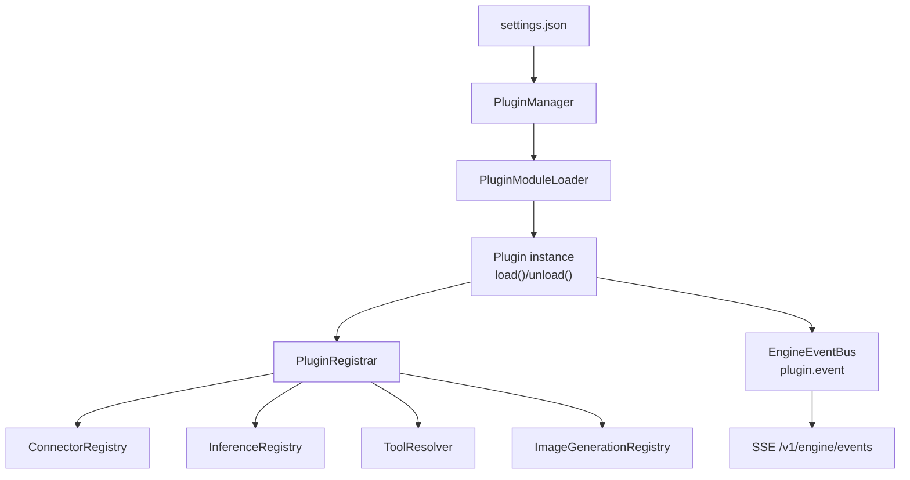
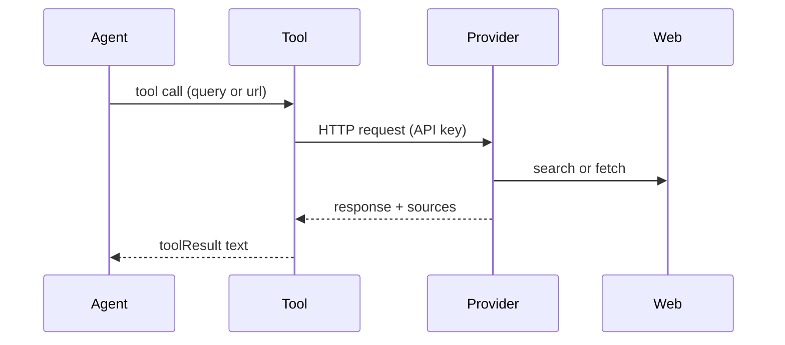
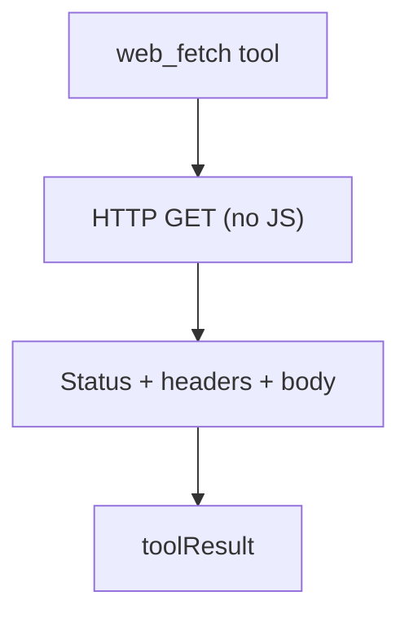
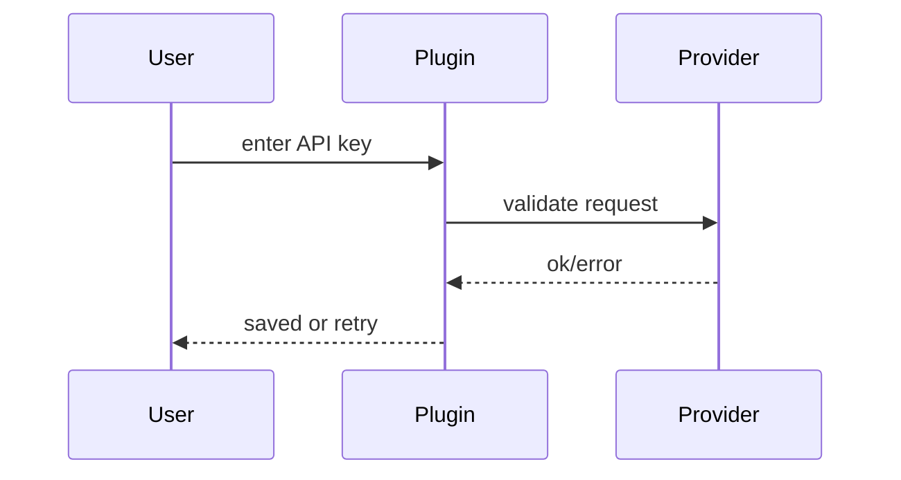

# Plugins

Plugins are first-class runtime modules that can register:
- Connectors
- Tools

## Execution model
Plugins execute in the same Node.js process as the engine. There is no VM
isolation, so module caches and globals are shared across plugin instances.
Treat plugins as trusted code.

## Plugin protocol
Each plugin type is described by a JSON descriptor (`plugin.json` in the
plugin folder) and a module that exports a
`plugin` object (or default export) with:
- `settingsSchema` (Zod) to validate instance settings
- `create(api)` returning `{ load?, unload? }`

The plugin API surface is intentionally narrow:
- `api.instance`: `{ instanceId, pluginId, enabled }`
- `api.settings`: validated settings for the instance
- `api.engineSettings`: full engine settings snapshot
- `api.registrar`: connector/inference/tool/image registration
- `api.auth`: auth store (providers use the provider/plugin id; other plugins typically use instance id)
- `api.fileStore`: shared file store
- `api.inference.complete({ systemPrompt, messages, providerId?, strategy? })`: run a single inference without tools
- `api.logger`: per-plugin logger
- `api.mode`: `"runtime"` or `"validate"` (used during `claybot add` validation)
- `api.engineEvents`: engine event bus (optional)
- `api.events.emit({ type, payload })`: emit plugin events to the engine event bus

Inference strategies:
- `default`: use the provider defaults from settings.
- `small`: prefer the newest small model; fall back to normal, then large.
- `normal`: prefer the newest normal model; fall back to large, then small.
- `large`: prefer the newest large model; fall back to normal, then small.

Load/unload is internal: the plugin manager reconciles enabled instances from
`.claybot/settings.json` and loads or unloads instances to match.

## Skills
Plugins can register skills by calling `api.registrar.registerSkill(path)`.
Provide the absolute path to a `SKILL.md` file so it can be surfaced in the
system prompt for on-demand loading. `SKILL.md` must follow the Agent Skills
specification (required frontmatter, name constraints, etc.).

### Descriptor format
```json
{
  "id": "telegram",
  "name": "Telegram",
  "description": "Telegram connector and incoming message adapter.",
  "entry": "./plugin.js",
  "exclusive": false
}
```

When `exclusive` is true, the engine will only allow that plugin to be enabled by itself.

### Settings format
```json
{
  "plugins": [
    {
      "instanceId": "telegram",
      "pluginId": "telegram",
      "enabled": true,
      "settings": { "polling": true }
    }
  ]
}
```

Legacy plugin entries are not supported; `settings.plugins` must use `instanceId` and `pluginId`.

### Event format
Plugin events are emitted immediately with metadata and forwarded to the engine
event bus (SSE `plugin.event`):
- `id` (generated)
- `pluginId`
- `instanceId`
- `type`
- `payload`
- `createdAt`

## Data & secrets
Each instance gets a dedicated data directory:
- `.claybot/plugins/<instanceId>`

Credentials are stored in `.claybot/auth.json` and keyed by the identifier the plugin uses.
Provider plugins store credentials under the provider id (same as `pluginId`), not the random instance id.



## Web search + fetch plugins
ClayBot ships optional plugins that register web search and fetch tools. All require `@web` permission:
- `openai-search` -> `openai_search`
- `gemini-search` -> `gemini_search`
- `anthropic-search` -> `anthropic_search`
- `anthropic-fetch` -> `anthropic_fetch`
- `perplexity-search` -> `perplexity_search`
- `exa-ai` -> `exa_search`
- `firecrawl` -> `firecrawl_fetch`
- `web-fetch` -> `web_fetch`



`web_fetch` performs a plain HTTP GET without JavaScript execution.



During onboarding, plugins validate existing credentials (instance or provider) with a lightweight request and prompt for a new key if validation fails.



## Built-in plugins
- `telegram` (connector)
- `brave-search` (tool)
- `memory` (tool + storage)
- `shell` (tools: read/write/edit/exec)

## Providers
Providers are built-in modules (not plugins). They register inference and/or image
generation capabilities and are configured in `.claybot/settings.json`.
