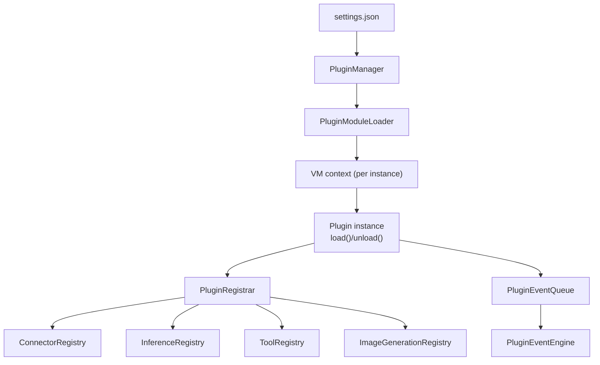

# Plugins

Plugins are first-class runtime modules that can register:
- Connectors
- Inference providers
- Tools
- Image generation providers

## Isolation model
Each plugin instance runs inside its own Node.js VM context. That means:
- global state is isolated per instance (no shared `globalThis`)
- module caches are isolated per instance
- instance lifetime is managed by the engine (load/unload is internal)

This is *not* an OS-level sandbox. Plugins still execute in the same process and
have access to Node.js built-ins and network primitives exposed in the sandbox
(e.g., `fetch`, `process`, `Buffer`). Use isolation for safety boundaries inside
Grambot, not for untrusted code.

## Plugin protocol
Each plugin type is described by a JSON descriptor and a module that exports a
`plugin` object (or default export) with:
- `settingsSchema` (Zod) to validate instance settings
- `create(api)` returning `{ load?, unload? }`

The plugin API surface is intentionally narrow:
- `api.instance`: `{ instanceId, pluginId, enabled }`
- `api.settings`: validated settings for the instance
- `api.engineSettings`: full engine settings snapshot
- `api.registrar`: connector/inference/tool/image registration
- `api.secrets`: secrets store (keyed by instance id)
- `api.events.emit({ type, payload })`: enqueue plugin events

Load/unload is internal: the plugin manager reconciles enabled instances from
`.scout/settings.json` and loads or unloads instances to match.

### Descriptor format
```json
{
  "id": "telegram",
  "name": "Telegram",
  "description": "Telegram connector and incoming message adapter.",
  "entry": "../telegram.js"
}
```

### Settings format
```json
{
  "plugins": [
    {
      "instanceId": "telegram",
      "pluginId": "telegram",
      "enabled": true,
      "settings": { "polling": true }
    }
  ]
}
```

### Event format
Plugin events are queued and processed sequentially. Each event is persisted in
memory with metadata for later routing:
- `id` (generated)
- `pluginId`
- `instanceId`
- `type`
- `payload`
- `createdAt`

## Data & secrets
Each instance gets a dedicated data directory:
- `.scout/plugins/<instanceId>`

Secrets are stored per instance id in `.scout/secrets.json`.



## Built-in plugins
- `telegram` (connector)
- `openai-codex` (inference)
- `anthropic` (inference)
- `brave-search` (tool)
- `gpt-image` (image)
- `nanobanana` (image)
