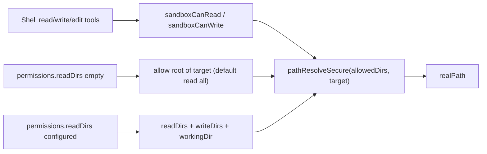

# Read/Write Permission Alignment

Read/write path resolution is now centralized in sandbox helpers:

- `sandboxCanRead(permissions, target)`
- `sandboxCanWrite(permissions, target)`

These functions receive `SessionPermissions` and return the resolved real path when allowed.

`sandboxCanRead` supports default read behavior: when `readDirs` is empty, any absolute path is allowed. When `readDirs` is configured, it also includes `writeDirs` so file-level write grants remain readable.

`sandboxCanWrite` only allows writes within explicitly granted `writeDirs` (it does not implicitly allow `workingDir`).

