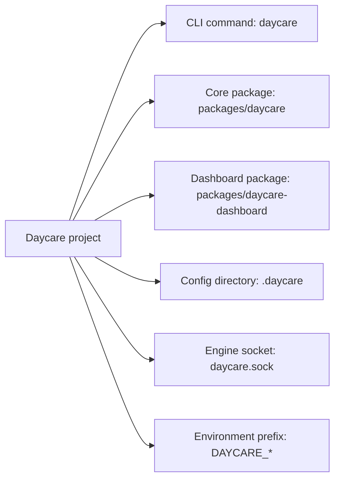
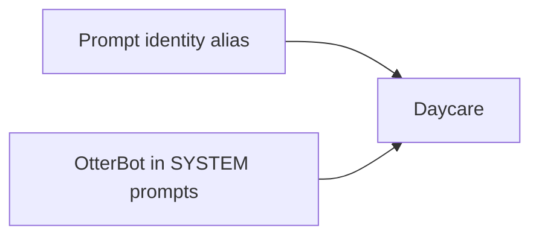

# Daycare Identity

This change aligns project naming, package naming, runtime paths, and environment variables to the Daycare identity.

## Notes

- Workspace scripts use `daycare` and `daycare-dashboard`.
- Runtime defaults use `.daycare` and `daycare.sock`.
- Logging defaults use the `daycare` service name.

## Prompt Alias Cleanup

- Prompt identity strings in `SYSTEM.md` and `SYSTEM_BACKGROUND.md` now use `Daycare`.
