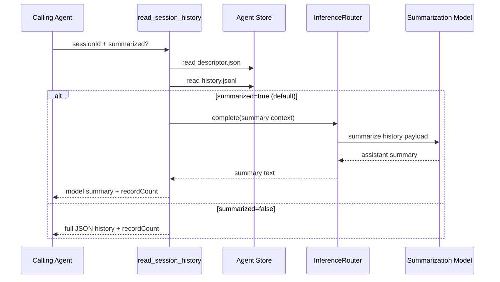

# Session History Tool

`read_session_history` lets an agent inspect another session's history by `sessionId`.

- `sessionId`: target session id to read (required)
- `summarized`: when omitted, defaults to `true`
  - `true`: runs a summarization model and returns model-generated summary text
  - `false`: return full JSON history payload
- summarized mode selects the normal-sized model when provider metadata is available

