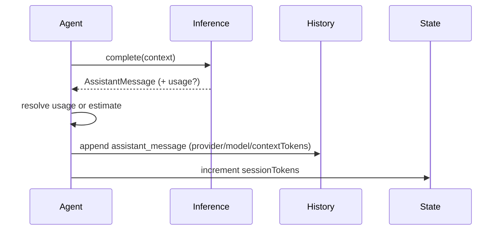

# Session Tokens Counter

ClayBot tracks per-session token counts for each agent. After every inference response, ClayBot records the provider id, model id, and context token sizes (input/output/total). When providers return usage data, those values are used directly. If usage is missing, ClayBot estimates tokens with a symbols-per-token heuristic across the request context and assistant response.

## State + History

- `state.json` includes `sessionTokens` with `input`, `output`, and `total` counts.
- `history.jsonl` stores token sizes inside each `assistant_message` record under `contextTokens`.
- Session counters reset to zero on session reset.

