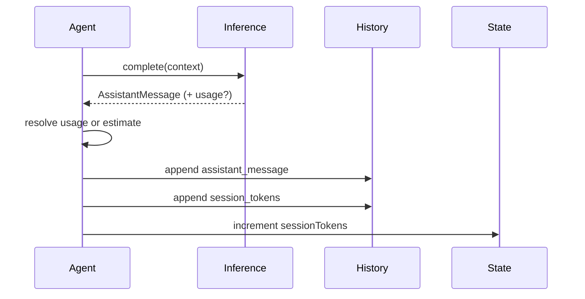

# Session Tokens Counter

ClayBot now tracks a per-session token counter for each agent. The counter updates after every inference response. When providers return usage data, those values are used directly. If usage is missing, ClayBot estimates tokens with a symbols-per-token heuristic across the request context and the assistant response.

## State + History

- `state.json` includes `sessionTokens` with `input`, `output`, and `total` counts.
- `history.jsonl` records a new `session_tokens` entry after each assistant message.
- Session counters reset to zero on session reset.

