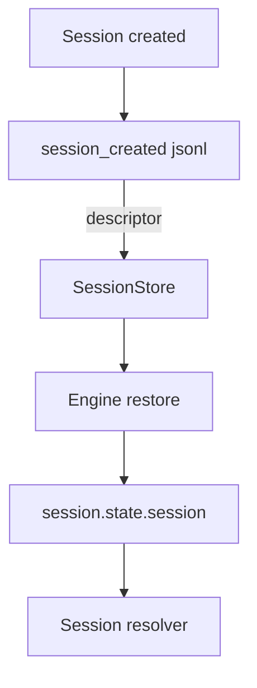
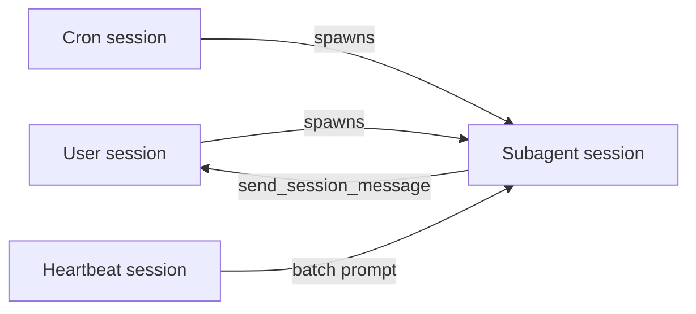
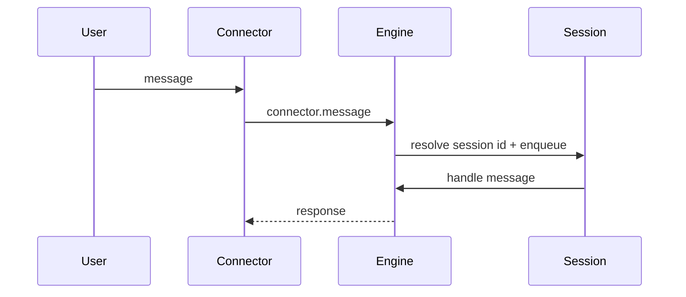
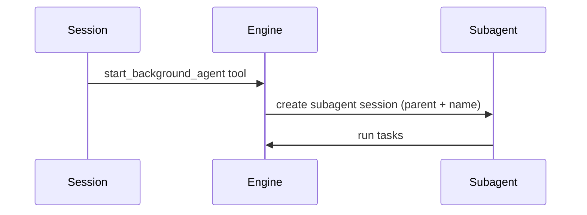
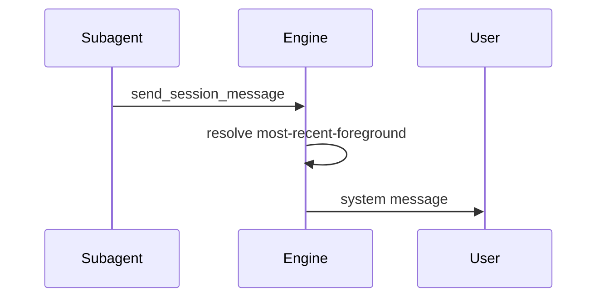
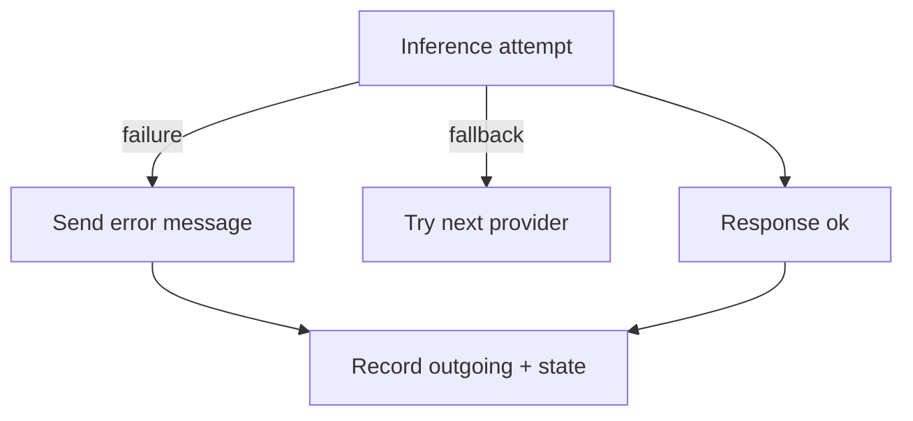

# Session types

Session types are persisted descriptors that capture what a session represents
and how it should be resolved later. They are written once when a session is
created and restored on boot to keep routing stable across restarts.



## Descriptor shape

Session descriptors live in `session.state.session` and are persisted in the
first `session_created` log entry.

```ts
type SessionDescriptor =
  | { type: "user"; connector: string; userId: string; channelId: string }
  | { type: "cron"; id: string }
  | { type: "heartbeat" }
  | { type: "subagent"; id: string; parentSessionId: string; name: string };
```

Notes:
- `user` is a foreground connector conversation.
- `cron` maps to a scheduled task id.
- `heartbeat` maps to the single heartbeat batch session.
- `subagent` is any background agent and always includes a parent + name.

## Persistence rules

1. On session creation, the engine builds a descriptor and writes it into the
   `session_created` JSONL record.
2. On restart, the session store restores the descriptor from that first record
   and the engine rehydrates it into `session.state.session`.
3. No backward-compatibility shims: descriptors are not re-derived from context
   if the persisted descriptor is missing.

## Fetch strategies

Only two fetch strategies are supported:

```ts
type SessionFetchStrategy = "most-recent-foreground" | "heartbeat";
```

Resolution behavior:
- `most-recent-foreground` selects the most recent session with a `user`
  descriptor.
- `heartbeat` selects the most recent session with a `heartbeat` descriptor.

## How session types operate together



Operational notes:
- User sessions are the only sessions treated as foreground.
- Subagents always have a parent (usually a user session, cron, or heartbeat).
- Heartbeat runs always map to a single `heartbeat` session that launches a
  subagent with a batch prompt.
- Cron sessions are scheduled inputs; they can spawn subagents but are not
  foreground targets.

## Message routing

### User message to session



Routing notes:
- Session id is resolved from the persisted `user` descriptor (connector + user + channel).
- The session queue preserves ordering; updates are persisted on each step.

### Session to subagent



Routing notes:
- Subagent sessions always carry `parentSessionId` and `name`.
- The subagent session descriptor is persisted on creation.

### Subagent back to user



Routing notes:
- The `most-recent-foreground` strategy selects the most recent `user` session.
- Subagents default to their `parentSessionId`; other sessions fall back to
  `most-recent-foreground` when no session id is provided.

## Restore behavior for pending sessions

On startup the engine restores sessions from JSONL and checks whether the last
recorded entry was an inbound message without a subsequent state update. If so,
it treats the session as "not fully processed."

```mermaid
flowchart TD
  Boot[Engine boot] --> Load[Load session log]
  Load --> Pending{last entry incoming?}
  Pending -->|yes| Notify[Send "Internal error."]
  Pending -->|no| Done[Restore session state]
```

Per session type:
- **User (foreground)**: If the last entry was `incoming` (no state update), the
  engine attempts to send `Internal error.` back through the connector to the
  same channel. The session state is restored but the message is not retried.
- **Cron**: Cron sessions have no connector routing. If a crash happened mid-run
  there is no outbound notification; the session is restored and the cron
  scheduler will run again on its next cadence.
- **Heartbeat**: Heartbeat sessions run internally (no connector). Pending
  entries are restored without a user-facing notification; the next heartbeat
  run will proceed on schedule.
- **Subagent**: Pending inbound work triggers a system message to the parent
  session indicating the subagent failed while offline.

## Inference and crash handling



Behavior summary:
- The inference router can fall back across providers; each fallback is logged.
- If inference throws or returns `stopReason=error/aborted`, the engine sends
  `Inference failed.` (or `No inference provider available.`) to connector
  sessions and records the outgoing entry.
- If the tool loop exceeds the max iterations and no response text is produced,
  the engine sends `Tool execution limit reached.` to connector sessions.
- Subagents/cron/heartbeat sessions do not have direct connector routing. Errors
-  are logged and state is recorded, but subagent failures always notify the
  parent session via `send_session_message`.
- Crashes mid-processing are handled on next boot via the restore rules above
  (pending inbound messages trigger `Internal error.` for user sessions).

## Implementation references

- Descriptor type + normalization: `packages/claybot/sources/engine/sessions/descriptor.ts`
- Persistence: `packages/claybot/sources/engine/sessions/store.ts`
- Resolver + usage: `packages/claybot/sources/engine/engine.ts`
