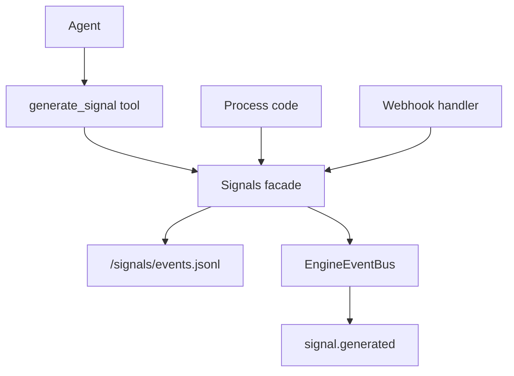
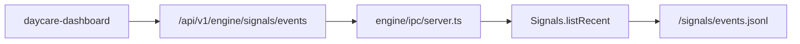
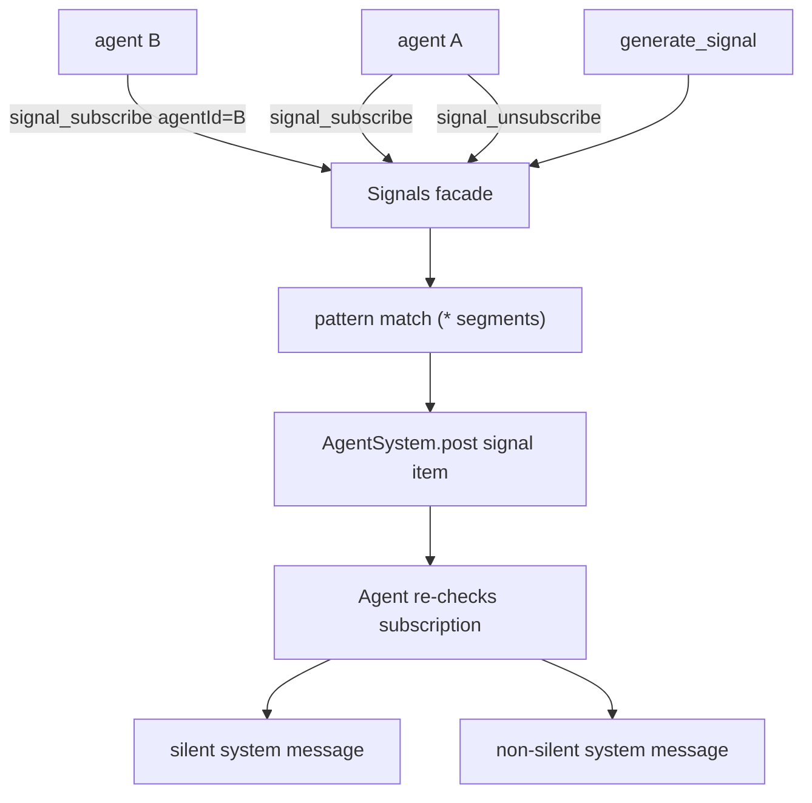

# Signals

Signals are lightweight runtime events with a distinct string `type`, an optional `data` payload, and a structured `source`.

Supported source variants:
- `{ type: "system" }`
- `{ type: "agent", id: string }`
- `{ type: "webhook", id?: string }`
- `{ type: "process", id?: string }`

## Runtime model

`Engine` owns a `Signals` facade (`sources/engine/signals/signals.ts`).
`Signals.generate()` creates a signal object, appends it to `<config>/signals/events.jsonl`, and emits `signal.generated` on the engine event bus.

Signal shape:
- `id` (cuid2)
- `type` (string id)
- `source` (discriminated object union)
- `data` (optional)
- `createdAt` (unix timestamp in milliseconds)

## Tool

The core tool `generate_signal` is registered for agent contexts.

Arguments:
- `type` (required string)
- `source` (optional object; defaults to `{ type: "agent", id: <current-agent-id> }` in tool usage)
- `data` (optional payload)

`signal_subscribe` is also registered for agent contexts.

Arguments:
- `pattern` (required string, `:` separated segments)
- `silent` (optional boolean, defaults to `true`)
- `agentId` (optional target agent id; defaults to current agent)

Wildcard matching supports only `*` as a segment placeholder.
Example:
- pattern `asdasd:*:asdasd`
- matches signal type `asdasd:anything:asdasd`

When a signal is generated, matching subscriptions are delivered immediately to agent inboxes:
- `silent=true` -> delivered as silent system messages
- `silent=false` -> delivered as regular system messages
- subscribing another agent requires that agent to exist; otherwise tool call fails
- delivery is handled as a dedicated `signal` inbox item and re-validated against current subscription state inside the agent loop (prevents unsubscribe races)

`signal_unsubscribe` is also registered for agent contexts.

Arguments:
- `pattern` (required string, must exactly match the saved subscription pattern)
- `agentId` (optional target agent id; defaults to current agent)

Behavior:
- removes the subscription for `(agentId, pattern)` when it exists
- returns `removed=false` when there is nothing to remove
- unsubscribing another agent requires that agent to exist; otherwise tool call fails

## Dashboard API

The engine exposes persisted signal events for the dashboard:
- `GET /v1/engine/signals/events?limit=<n>`
- Returns `{ ok: true, events: Signal[] }`
- Default `limit` is `200`, max is `1000`

Signal reads and writes share a lock in `Signals`, so JSONL appends and dashboard reads stay ordered.

