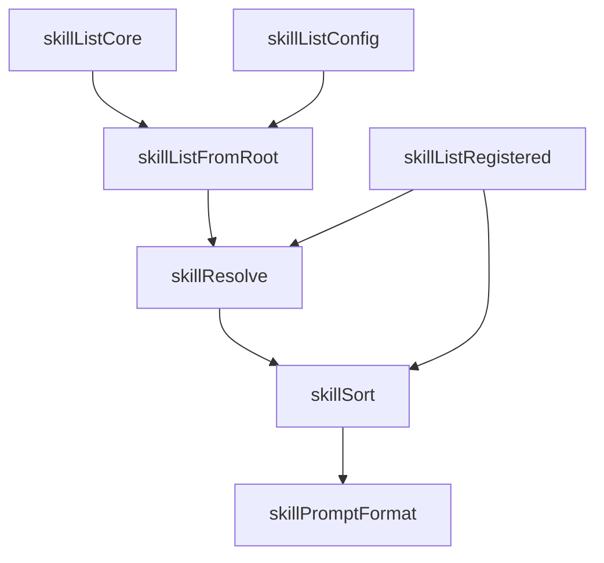
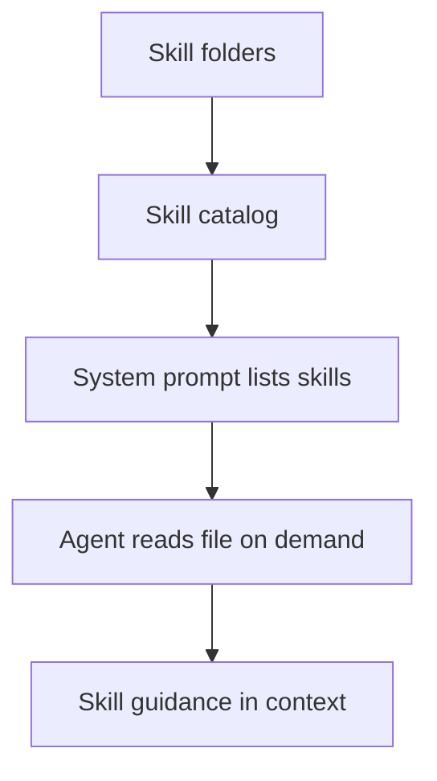

# Skills

Skills are opt-in prompts stored as files on disk. They are **not** loaded into
the system prompt automatically. The agent loads a skill on demand by reading
the file path listed in the system prompt.

## Where skills live

Daycare always includes core skills from:
- `packages/daycare/sources/skills/`

Plugins can register additional skills via `registerSkill(path)` with an absolute
path to a `SKILL.md` file.

Skills can also live in the config folder at `.daycare/skills/`. They are loaded
fresh each time the system prompt is built.

Each skill is a folder containing a `SKILL.md` file. The folder name becomes
the skill name shown to the agent. The system prompt includes the **absolute
path** to each skill so the agent can read it directly.

The system prompt lists skills in XML tags to make parsing explicit.

## Skills catalog flow (code)

Daycare's skills catalog is composed from small helpers that focus on one task
each, keeping listing and formatting composable.

## SKILL.md format (Agent Skills spec)

`SKILL.md` must start with YAML frontmatter followed by Markdown content.
Required frontmatter fields:
- `name`: 1-64 chars, lowercase letters/numbers/hyphens only, no leading/trailing
  hyphen, no consecutive hyphens, and it must match the parent folder name.
- `description`: 1-1024 chars describing what the skill does and when to use it.

Optional frontmatter fields include `license`, `compatibility`, `metadata`, and
`allowed-tools`. Follow the Agent Skills specification for full constraints.

## Loading and unloading

- **Load**: read the skill file from disk.
- **Reload**: read the file again if it has changed.
- **Unload**: explicitly ignore the skill's guidance moving forward.

