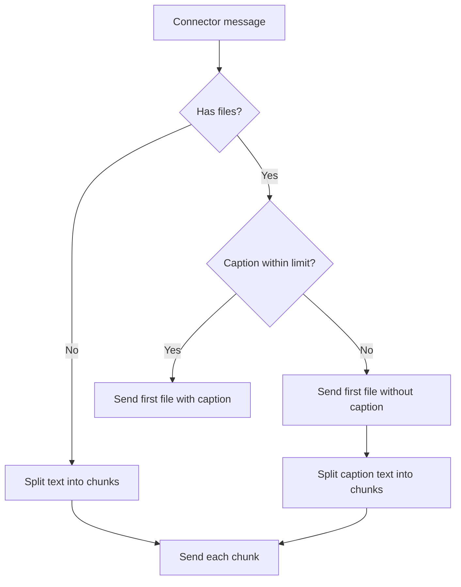

# Telegram message splitting

Large Telegram responses are split into multiple messages before sending. This avoids the 4096-character text limit and the 1024-character caption limit.

```mermaid
flowchart TD
  A[Connector message] --> B{Has files?}
  B -- No --> C[Split text into chunks]
  C --> D[Send each chunk]
  B -- Yes --> E{Caption within limit?}
  E -- Yes --> F[Send first file with caption]
  E -- No --> G[Send first file without caption]
  G --> H[Split caption text into chunks]
  H --> D
```
