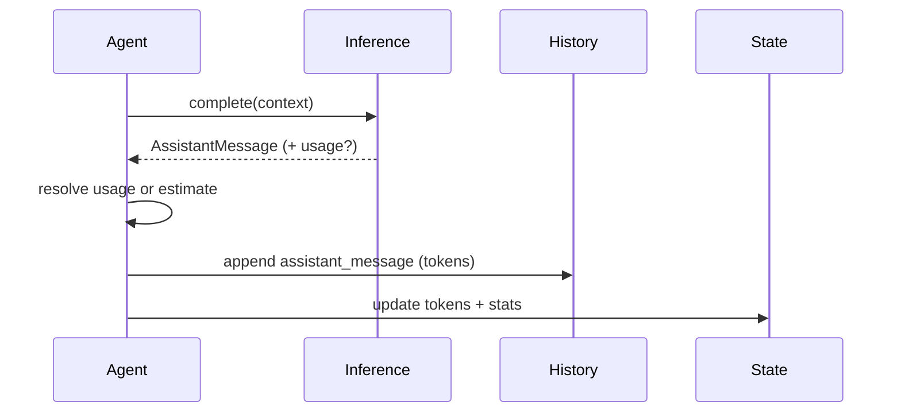
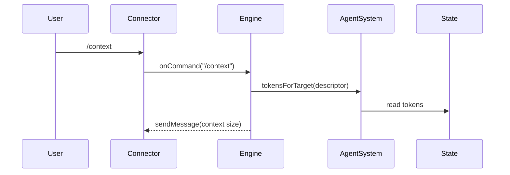

# Tokens Tracking

Daycare tracks current token sizes for each agent and aggregates real usage by provider/model. After every inference response, Daycare records the provider, model, and token sizes on the assistant history entry. If the provider does not return usage data, Daycare writes an estimated size to the history entry, but **does not** increment stats.

## State + History

- `state.json` includes `tokens` (nullable) with the latest provider/model/size (including `total`) for the current session.
- `state.json` includes `stats` as `{ [provider]: { [model]: { input, output, cacheRead, cacheWrite, total } } }` from real usage only.
- `history.jsonl` stores token sizes inside each `assistant_message` record under `tokens`.
- Session resets/compactions clear `tokens` but leave `stats` intact.

## /context Command

- `/context` replies with the latest token snapshot (`tokens`) for the active session.
- If the session has no usage yet, the response notes that context size is unavailable.

