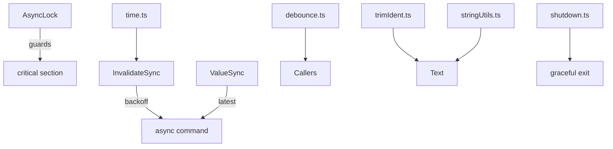

# Utility helpers

Grambot includes a small set of general-purpose helpers in `sources/util/`.

## Included helpers
- `lock.ts` - async mutual exclusion via `AsyncLock`.
- `sync.ts` - `InvalidateSync` and `ValueSync` for debounced async workflows.
- `time.ts` - delay + backoff helpers.
- `debounce.ts` - configurable debounce helpers.
- `trimIdent.ts` - trims shared indentation.
- `stringUtils.ts` - camelCase + safe filename helpers.
- `shutdown.ts` - coordinated shutdown hooks and signal handling.

